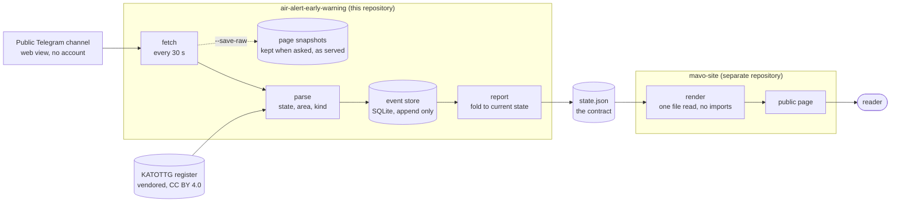

[](docs/assets/mavo-banner.gif)

# air-alert-early-warning

[](https://github.com/jerzy99jerzy/air-alert-early-warning/actions/workflows/ci.yml)
[](tests/)
[](Makefile)
[](tests/harness/CATALOGUE.md)
[](docs/METHODOLOGY.md)
[](pyproject.toml)
[](pyproject.toml)
[](LICENSE)
[](docs/MVP.md)

Only the first badge is live. **The rest are static, and static badges are
claims**, so every number in them is pinned in `STATUS.json` and
`tools/docs_audit.py` fails the gate when a badge and the pin disagree. A
coverage badge that flatters by a release is the defect class this repository
exists to attack, and it would be an embarrassing one to ship in the README.


**Codename MAVO.** Cross-border early warning built on Ukrainian air-alert feeds,
with a base-rate gate that a rule must pass before it is allowed to wake anyone up.

> Named after the codename of the secret project in Stanislaw Lem's *His Master's
> Voice* (1968): a team spends years deciding whether a signal from outside
> carries a message or is noise that happens to look like one. Lem's afterword
> notes that the codename already smuggles in the assumption it was meant to
> test, since calling something a *voice* presumes a speaker.

**Naming.** The distribution slug is descriptive because it is a search term. The
import namespace is `mavo` because it must be unique rather than descriptive. The
codename lives in documentation and conversation. Stated here rather than left
implicit, because that is where the inconsistency otherwise lives.

Status: pre-alpha, **three sprints from beta** (S9, S10, S11) on the plan in [`docs/MVP.md`](docs/MVP.md), which carries no dates on purpose: this is a weekend project and a schedule built on assumed availability is an unmeasured number of exactly the kind this repository removes from its own gate.

**Deployed and publicly reachable since 2026-08-12, at [mavo.org.pl/en](https://mavo.org.pl/en)** (Polish: [mavo.org.pl/pl](https://mavo.org.pl/pl)). The address is printed here because a README that says "publicly reachable" without saying where is asking to be trusted on the one claim a reader could check in a second.

That is the cheaper half of beta: the instrument is live. The other half has been done once and recorded nowhere: during the 2026-08-18 raid the operator read the page against the channel while eight western raions were under alert - the check this product exists for, performed on the population it exists for, living as testimony because the verdicts were never written down. **No recorded hand-checked correctness rate exists for western areas**, and the instrumented sample with a stated error rate waits on that population reaching sample size (T36). This repository counts as done what it can show.

**Latency is now measured end to end**, which it was not for the first thirty-two releases. Over a week of store and five thousand messages, half arrive within about twenty seconds of the timestamp the channel put on them - inside a single poll, so at the median most of the wait is ours to shorten. The tail is another matter: the slowest tenth takes on the order of two minutes, the slowest hundredth several, and for a warning instrument the tail is the part that counts. How much of that belongs to the source and how much to our own failed polls is not yet separated, so T40 stays open, with a measurement in it now rather than a blank; the exact figures live there, beside the caveats they need.

Running is not the same as measured, and this repository's defect log is largely a record of what happens when the two are read as one thing.

**Fourteen sprints have landed with their regression files**, which is what "shipped" means here and all it means. `sprint_test_files` in `STATUS.json` lists ten of them, S0 through S9; the four that are missing are missing deliberately, because adding them would read as an assertion that S10 through S13 met their exit criteria, which is a larger claim than a test file can carry. The field was renamed to what it counts after F93, and the gap it now leaves is visible rather than averaged away. **Sprints completed, in the sense of meeting the exit criterion in `docs/MVP.md`, run to S7.** S8 is half met and declared half met: the distance column is verified three ways, the hand-checked sample is twenty eastern messages from one afternoon. S9 is open on one remaining clause: its seventy-two-hour half closed on 2026-08-20 with zero restarts and every cycle accounted for, its latency distribution is taken, and `docs/CHANNEL.md` section 8a is deliberately still empty of it, because one term in the tail is unattributed and a row that assigned our own blindness to the source would be worse than no row. "Unattended" turned out to need a definition of its own - the store has three stretches of an hour or more with nothing recorded in it, and only one is provably an outage rather than a quiet channel. The two counts of "shipped" were read as one number until 0.22.0.0 (F93). The corpus is collected rather than awaited: **61,041 messages** over 118 nights, contiguous, digest recorded, held outside the tree.

Area resolution works against real channel content and the number that used to
sit here was wrong. **20 of 20 real messages resolve their area to a unique code
in the Ukrainian state register; 15 of those 20 are alerts and all 15 classify;
the other 5 are threat declarations, which belong to the kind stream rather than
the alert stream.** This README claimed **0 of 20** until 0.22.0.0. That figure
was measured on a code path the product does not run: `probe` built its source
without an area table, the `None` default selected the oblast-stem table
superseded in sprint 7, and the two tests written to announce F23's closure
called the same untabled path, so the tripwire stayed green and confirmed the
wrong thing for two sprints (F90). The table was right and the call was not.

What is still not recorded is the part that matters most: **no recorded
hand-checked correctness rate exists for western areas**, the areas this
product is for. The instrument for it exists and is stratified so that half of
a draw is western by construction; what does not exist is the population. The
west is 3.5% of what the channel carries, and a sample about the areas near the
border cannot be drawn from nights on which those areas were quiet. T36 is
therefore typed as blocked on something outside the project rather than as
work waiting to be done, and it moved to S12 for that reason. Until it is
scored, every correctness claim here is about mechanism rather than about
accuracy.

**One thing did change on 2026-08-18.** A real raid put eight western raions
under alert across four oblasts, the whole of Ternopil oblast among them; both
contract files were preserved from the public address while it was happening,
**and the operator read the page against the channel as it ran** - the first
time this instrument was watched, and checked, doing the job it exists for.
What that night did not leave behind is a record. Reading the preserved
payload back with a script compares the instrument against its own reference
tables, so the snapshot alone proves nothing, and the by-hand verdicts stayed
with the person who made them. `tools/western_worksheet.py` exists to turn
exactly such a night into rows a reader can audit; for 2026-08-18 it holds the
questions with none of the answers filled in.

---

## Read this first, whoever you are

This document serves two readers and says so rather than pretending one of them
away.

If you want to know **what this thing does and whether it is any use to you**,
read the next four sections. They contain no code, no jargon that is not
explained where it appears, and no numbers you are asked to take on trust. They
end at *Words used here*, and that is a fine place to stop.

If you are here to **read the source, run the gate or judge the method**, the
engineering document begins at [The thesis](#the-thesis) and runs to the end.
Nothing in the plain-language part contradicts it; the plain part is the same
claims with the machinery left out.

**Table of contents.** [In one minute](#in-one-minute) ·
[One alert, from a phone in Lviv to a line on a map](#one-alert-from-a-phone-in-lviv-to-a-line-on-a-map) ·
[What it will not do](#what-it-will-not-do-plainly) ·
[Words used here](#words-used-here) ·
[Questions people actually ask](#questions-people-actually-ask) ·
[The thesis](#the-thesis) and everything after it: the engineering document.

---

## In one minute

Ukraine publishes air-raid alerts. When a region's alert is switched on, that
fact reaches a public channel within seconds, along with thousands of other
posts a day about the whole country.

This program reads that channel, works out **which region** each alert belongs
to, and looks up **how far that region's nearest edge is from the Polish
border**. It then reports what is on right now, and how old its own information
is.

That is the whole of it. It is a **reporting instrument**: it tells you what has
been announced, in a form a person near the border can act on. It does not
predict, it does not decide, and it does not know where anything is flying.

The reason it exists is a filter. Roughly **96.5% of the alert activity in that
channel concerns the east and the front line**, hundreds of kilometres from
Poland and of no practical relevance to somebody in Przemyśl. The remaining
**3.5%** concerns the western regions, which is the part worth a person's
attention. Sorting one from the other by hand, at three in the morning, in a
language you may not read, is not a thing anybody does. That sorting is the
product.

Two rules run through every part of this, and they are worth stating before
anything else because they explain a lot of the odd-looking decisions further
down.

**Silence is never shown as calm.** If the program cannot see the channel, or
the information it has is old, it says so, loudly, and stops answering the
question. An empty screen means "nothing is known", never "nothing is
happening". Those two are different and the difference can matter.

**Nothing unknown is ever rounded to zero.** A region whose state cannot be
established is printed as *unknown*. It is not printed as quiet, not left blank,
and not quietly dropped from the list.

There is a public page that renders all of this on a map. It is a separate
program in a separate repository, and it reads one file this one writes. It
imports no code from here and needs no access to anything: if it were breached
tomorrow, it would have nothing to give away.

---

## One alert, from a phone in Lviv to a line on a map

The clearest way to explain the system is to follow a single alert through it.

**1. Something is announced.** An air-raid alert goes on in Lviv oblast.
Seconds later a post appears in the public channel, in Ukrainian, carrying a
hashtag that names the area and a line of prose saying an alert has begun.

**2. The program reads the page.** Once every thirty seconds it fetches the
channel's public web view. No account, no key, no private interface: exactly
what a browser would get. It stores the page as served, so any later argument
about what was said can be settled against the original rather than against a
memory of it.

**3. It works out which place is meant.** This is the part with the traps. Place
names in the region repeat, decline in six grammatical cases, and appear in both
Ukrainian and Russian spellings. So the program does not guess from prose: it
reads the hashtag and looks the area up in **KATOTTG**, Ukraine's official
register of administrative units, which gives every district a unique code. A
name is ambiguous. A code is not. When a message names an area the register does
not contain, that message is reported as unresolved rather than assigned to the
nearest plausible match.

**4. It measures the distance.** Every area in the register carries a
precomputed distance from its nearest edge to the Polish border. Nearest edge,
not centre: a region can be four hundred kilometres across, and the centre of a
large oblast would be a comforting number rather than a true one.

**5. It writes down what is true right now.** Two files. One is the current
picture: which areas are under alert, how far each is, and when the reading was
taken. The other is a rolling day of history: what started, what ended, what
became unknown, and at what time.

**6. The page draws it.** The public site reads those two files and nothing
else. It puts a marker in the middle of each area that has declared an alert,
draws a ring showing how large that area is, and prints the distance. The ring
is there to stop you reading the marker as an object: the icon is not a missile
and not a position, it is a district that made an announcement.

**7. And it keeps saying how old it is.** Every screen carries the age of the
reading. When that age passes the threshold, the page changes state and tells
you it has stopped knowing, rather than continuing to display a picture that
looks current and is not.

The same chain as a diagram. Every edge is a file or an HTTP request, and
nothing crosses between them that is not drawn here.



Two properties the diagram is meant to make obvious. **The store is append
only and the fold is one-way**: nothing downstream writes back, so a rendering
mistake cannot corrupt the record. And **the consumer reads a file, not this
program**: `state.json` is the entire interface, which is why the specification
for it is a document rather than an import.

What is *not* in this chain: any inference about direction, speed, target or
crossing. Nothing in the source data supports such an inference, so nothing in
the output makes one.

---

## The second purpose: a specification, written from use

Reading the Ukrainian feed is half of what this project is for. The other half
is what reading it taught, written down as a specification for the equivalent
Poland does not have - and, unchanged, for any state that wants one.

The distinction that matters is the vantage point.
[`docs/FEED-SPEC.md`](docs/FEED-SPEC.md) is not a survey of what such a feed
might contain. It is a list of properties that were **missed, and cost
something, while building against real data**: a cap without a flag saying
when it bound, a window whose left edge had to be guessed, a version bump that
needed both sides deployed inside one window, a category field mistaken twice
for a description of the threat, a classification ceiling that no parser can
raise because the source simply does not say, a null with two meanings and one
field, and a number whose denominator lived in prose. Each one is labelled
with how it was learned, and several are labelled `[measured]` against a
corpus of 61,041 messages over 118 days.

None of it is expensive. Ukraine's channel is a public web page with hashtags
carrying register codes, and the parser at the centre of this project took two
afternoons. That is the argument the specification rests on: what a convention
like this enables is cheap to build against, and the reason nobody has built
it here is that the convention does not exist yet, not that it is hard.

The document is written to be disagreed with, and section 7 says how.

---

## What it will not do, plainly

- **It will not warn you that something is coming towards Poland.** It reports
  announcements made inside Ukraine. Distance to the border is context, not a
  trajectory.
- **It is not an official warning service.** In Poland the authoritative
  channels are the sirens and the RCB alerts, and those stay authoritative. This
  is a private project run under a private company.
- **It is not faster than the source.** It reads a public channel on a cycle. If
  the channel is late, this is late.
- **It cannot see anything the channel does not publish.** No radar, no sensors,
  no intelligence. When the channel goes quiet, this project's honest answer is
  "I do not know", and that is the answer it gives.
- **It is not finished.** The status line above is not modesty: the accuracy of
  the western-area classification, which is the only part that matters for the
  audience this is built for, has not yet been scored by hand.

---

## Words used here

**Oblast.** A Ukrainian region, comparable to a Polish województwo. Lviv oblast
borders Poland; Kharkiv oblast is over seven hundred kilometres away.

**Raion.** A district inside an oblast. Alerts are often announced at this
finer level, which is why the distance figure is sometimes an interval rather
than a single number.

**KATOTTG.** Ukraine's official register of administrative units. Every entry
has a unique code. This project resolves places to codes and not to names,
because names repeat and codes do not.

**Base rate.** How often a thing happens anyway. If a rule fires on eighty
nights out of a hundred and something crosses the border on one, the rule is
mostly telling you it is night. Every candidate rule in this repository is
measured against this before it is allowed to wake anybody.

**Staleness.** The age of the information being shown. Treated here as a
first-class fact, printed on every screen, and past a threshold it replaces the
answer instead of decorating it.

**Provenance labels.** In this repository's documents, load-bearing statements
carry a tag: `[measured]` for something counted, `[reported]` for something a
source said, `[inference]` for a conclusion drawn, `[speculation]` for a
hypothesis. This is not decoration. It is so that a reader, including the author
six months later, can tell which sentences are evidence and which are argument.

**The gate.** A single command, `make verify`, that has to pass before anything
is released. It runs the tests, the type checks, the audits of the documents
against the code, and a mutation run that deliberately breaks the program in
registered ways to confirm the tests notice. If it fails, nothing ships.

---

## Questions people actually ask

**Will it tell me to go to a shelter?** No. It reports what has been announced
across the border. Decisions about your own safety come from the official
Polish channels.

**Is it live?** Yes, and the page is public:
[mavo.org.pl/en](https://mavo.org.pl/en). It is also early: read the status
line above before you rely on any number in it. If the link does not resolve,
the deployment has moved rather than the project having stopped; the
repository is the durable artefact and the deployment is not.

**Does it track me?** The public page keeps no logs of addresses, sets no
cookies, and makes no third-party requests. Visits are counted as two numbers a
day, from an address hashed with a key that is regenerated daily and never
written down. Your theme and map-layer choices stay in your own browser.

**Why Telegram?** Because that is where the source publishes, and it publishes
there publicly, without an account or a key. The project reads the public web
view rather than any private interface, and stores what it read.

**Why not just use an official API?** Two exist and are discussed in
`docs/FEED-SPEC.md`. Both draw from the same upstream, so using one instead of
the channel would swap a public source for a permissioned one without gaining
an independent observation. One of them is used as a *measuring* adapter, to
check this project against, and is structurally prevented from becoming a
source.

**Who is behind it?** One person, in Warsaw, under HBCC. The code is open, the
method is documented, and the defect log is public and unflattering on purpose.

**Can I use the data?** Yes. Two files are served as a stable contract, and
their schema and change policy are documented in `docs/FEED-SPEC.md`. If you
build on them, read the part about how the files behave when the source stops:
handling that case is the difference between a useful tool and one that lies
quietly.

---

## The thesis

**MAVO reports a threat picture in real time. It does not predict what will
cross into Poland.**

Whether a munition crosses depends on Ukrainian air defence, on where the debris
of an intercepted one lands, on a drone losing its way, and on an adversary's
decisions minutes earlier. None of that is in any feed this project can reach,
and no amount of history makes it so. What is observable at the moment it
happens is the picture on the Ukrainian side: which areas are under alert, how
intense the activity is right now, what means the channel names, and how far the
nearest alerted area is from the Polish border.

That distinction is the whole design. It is why the tool resolves rajons and
hromadas down to kilometres from the border rather than scoring a binary
prediction, and why the statistical gate applies only to an alarm class that
does not yet exist. The reporting tier is judged on correctness, latency and
completeness.

**What it is being built as, since 0.16.1.0.** An element of warning
infrastructure rather than a reporting instrument alone (D-015, revision 1).
The boundary above does not move: no prediction, and the 0 of 22 result stands.
What moves is the standard the output is held to. Infrastructure that goes
quiet tells its reader the sky is calm, so a heartbeat, staleness on the face
of the output and an explicit blind state are core requirements rather than
backlog items, and end-to-end latency is a measured property rather than a
claimed one. A public repository is not a public warning service: recipients
are gated by T6 and T11, both open.

The observation that started the project stands and is now background rather
than thesis: every violation of Polish airspace in the observed period
coincided with a night of massed strikes on western Ukraine, and those campaign
nights cover roughly **57% of days** in the same period. A rule firing on every
one of them has perfect recall, precision equal to the base rate, a lift of
1.0, and has told its reader nothing the calendar did not. Restated at
0.9.0.0; the earlier predictive framing is recorded in D-015 rather than
overwritten.

**Two different wests are being counted here, and only one of them is this
project's.** The 57% is `[reported]`: another source's figure, over a period
this repository did not observe, resting on whatever that source meant by
"western Ukraine" - possibly including Kyiv oblast, Vinnytsia, or everything
west of the Dnipro. This project means the 36 raions of the eight western
oblasts as the state register lists them, which is narrower and checkable.
Nobody has compared the two, so the 57% is context rather than evidence.

## Where the information comes from

Stated in full, because a warning tool whose inputs are vague is a tool nobody
can check. Every row is what it is, including the rows that are weaker than they
look.

| Source | What it gives | Access | Standing |
| --- | --- | --- | --- |
| **t.me/s/air_alert_ua**, the public web preview of the official Ukrainian air-alert channel | Every alert and all-clear, tagged with the area and its unit type, within seconds of publication | Public page, no token, no account, no agreement. It can be withdrawn at any time and nothing obliges anyone to keep it | **The only signal source in use.** ~20 messages per page, ~514 messages a day measured over the corpus |
| **alerts.in.ua** and **api.ukrainealarm.com** | The same alerts, through APIs | Tokens, one applied for and unanswered | **Not independent.** Both draw from the channel above (D-010). Two feeds, one dependency, and treating them as two would be the kind of false redundancy that reads as robustness right up until the day it matters |
| **KATOTTG**, the Ukrainian state register of administrative units | The code, oblast and hierarchy behind every area the channel names | A file, published as open data under Creative Commons Attribution | Used offline, versioned in the tree, never called at runtime (D-016). No API key in the warning path, no rate limit where latency is the product, and no third party learning which raions a Polish user asks about at three in the morning |
| **OpenSky Network** (ADS-B) | A second, physically different kind of observation: aircraft that broadcast their own position | Registered 2026-08-10, 4,000 credits a day, one credit per call over the western box [measured] | **Not a drone-tier source, and the premise that it was is recorded as false.** Transponders are carried by aircraft that choose to be seen; Shahed-type munitions and missiles carry none. What it can measure is **the operating intensity of the Rzeszow-Jasionka hub**, which has potential diagnostic value during a war and is reported rather than scored (D-019, T42) |
| A Polish-side feed | Would close the loop | Unresolved (T8) | **None found that is machine-readable and timely.** RSO and NOTAM are readable; RCB and the announced government application are not, as far as anyone here has established |

**What follows from that table.** Everything this tool says about Ukraine is
`reported`: it is what the channel claims, not what the sky contains, and no
amount of processing upgrades that label. There is exactly one signal source,
its loss would be total, and the correct response to losing it is to say so
loudly rather than to go quiet.

**On the ADS-B row specifically.** Counting transmitting military aircraft over
the Jasionka hub is a lower bound and never a measurement of activity: an
operator that wants silence switches the transponder off, and plausibly does so
in exactly the situations a reader would most want to know about. A high count
means something. A low count means nothing at all, and the field will carry
that framing in itself rather than in a footnote. It takes no part in any
score.

## How the source is actually structured

The finding the project turned on, measured on 48,540 real messages in the
design window of the corpus.

**99.34% of messages carry a hashtag naming the area and its unit type**, in the
form `#Харківський_район`, `#м_Харків_та_Харківська_територіальна_громада`,
`#Донецька_область`. The name is in the nominative, spaces are underscores, and
the unit word is explicit, so nothing has to be inferred. There are **127
distinct tags across 99 nights**, and **126 of them resolve to a unique code in
the Ukrainian state register** (`data/reference/tag_map.csv`).

This explains F23 rather than merely recording it. The table shipped in sprint 6
searched for oblast names in message text and scored 0 of 20; the channel emits an oblast
tag in 515 of 69,676 occurrences and names raions the rest of the time. The
table could not have scored above zero, and the problem was never an incomplete
vocabulary.

### Where the tags come from, and what the 3.5% is a share of

The channel does not write prose about places. It appends a hashtag naming the
administrative unit the message is about: `#Самбірський_район`, the register
name in the nominative with spaces as underscores. **48,222 of 48,540 messages
carry one, 99.34%.** There are 127 distinct tags across 99 nights, and 126 of
them resolve to exactly one code in the state register.

That is the whole geocoder. No stemming, no truncation parameter, no
disambiguation, no classifier trained on anything: the channel labels every
message itself and this project reads the label. For contrast, the approach
this replaced - matching truncated register names against message text - reached
6.06% of messages as a lower bound, so structure beats the heuristic by roughly
a factor of six and needs no tuning (F23).

Counted over those tags: **2,456 of 69,676 occurrences, 3.5%, name a western
oblast.** The other 96.5% name front-line raions in the east and south, which
for a reader on the Polish side are facts about places 900 kilometres away.
The filter this project needs therefore arrives for free.

### What 3.5% does and does not mean, because the two are easy to swap

It is a share of **message traffic**. Of every hundred times this channel names
a place, three and a half are places near Poland.

It is **not** the share of nights the west is under alert, and it is **not**
how often anything comes close to the border. Those are three different
quantities and only the first one has been measured here:

| Question | Unit | Status |
| --- | --- | --- |
| How much of the channel's traffic is about the west? | tag occurrences | **3.5%, measured** |
| On how many nights is a western raion under alert? | nights | **not measured by this project.** The 57% above is a different source's figure for a possibly different area |
| How often does anything actually approach the Polish border? | crossings | Roughly a dozen events in four years `[reported]`, and this feed cannot see it at all |

Where the tags come from, what produces them, and the four things nobody has
checked about them: `docs/CHANNEL.md` section 10.

The third row is the one that matters most and the one nothing here can
answer. **The channel reports declared alert states for administrative units.
It does not observe objects, tracks or positions**, so no count derived from it
is a count of things being close. An alert in Sambirskyi raion means an
authority declared an alert for that raion; whether anything was over it, and
where, is not in the data.

So the two figures do not contradict each other and they are not two views of
one thing. 57% of days carrying a campaign night is compatible with the west
generating 3.5% of traffic, because the front-line oblasts have far more raions
and their alerts run continuously while western ones are short. **The west is
quiet in message volume**, which is why a western-only report has a naturally
small volume with no artificial rate limit standing in for judgement. Quiet in
volume is not the same as rarely under alert, and this project has not measured
the second.

Full measurement, the join to the register, the two rules it needed and what it
corrects: `docs/CHANNEL.md`.

## What this will not tell you

The section a competent reader reads first. Each bullet is registered in
`tests/lint_limitations.py` so it cannot quietly stop being true.

- It will not tell you that anything will cross the border. It tells you that a
  named rule fired at a named time, and what that rule has historically been
  worth. There is no probability of impact, because nothing here can compute one.
  (lint: no_probability_claim)
- It will not read a silent feed as an all-clear, and will not read a partial
  all-clear as a whole one. An area whose status is unknown stays `UNKNOWN`; a
  message that announces an all-clear while saying the alert continues is
  `PARTIAL_CLEAR`. Neither contributes to an alarm in either direction, and the
  lint enumerates the enum, so a fifth state would be covered on the day it is
  added. (lint: unknown_not_clear)
- It will not fit a model to the positive events. There are roughly a dozen of
  them across four years; a model trained on that would reproduce the
  overfitting that invalidated this project's first analysis. Rules are explicit
  predicates with thresholds in configuration. (lint: no_ml_dependency)
- It will not reach the network from anywhere except one file. `mavo/transport.py`
  is the only module that imports a network client, so what this tool can talk to
  has a single answer in a single place, and every adapter is testable without a
  network. `mavo collect --stub` and every other command still run fully offline
  with no credentials. (lint: network_reach_is_one_file)
- It is not a substitute for sirens or for the state alerting system. It operates
  one step earlier in the chain than those can, and is correspondingly less
  certain. That is the entire trade.

## Quickstart

```
pip install -e ".[dev]"

# generate a synthetic history and store it
mavo fixture --out data/raw/fixture.sqlite --weeks 52

# score every candidate rule against the base rate
mavo gate --weeks 208

# score the regime-split decision policy
mavo policy --weeks 208
mavo policy --weeks 208 --allocation demand
```

No token, no network, no data of your own. What the second command prints is a
property of the generator, not of the world.

**On real data.** The channel is public, so this needs no token either. Nothing
here is a simulation: these three commands hit the live source.

```
# one live poll, parsed and reported, nothing written
mavo collect

# the same poll, keeping the page exactly as served for later re-parsing
mavo collect --save-raw data/raw

# five pages of channel history, verbatim, one request per second
mavo backfill --out data/raw/corpus --pages 5 --delay 1.0

# collect into a store, which is what an unattended host runs
mavo collect --store /var/lib/mavo/events

# write both contract files: the current picture and the day of history
mavo report --store /var/lib/mavo/events \
    --json state.json --feed feed.json

# the same, continuously, which is what the deployed unit runs
mavo report --store /var/lib/mavo/events \
    --json state.json --feed feed.json --watch --interval 120
```

Expect `mavo collect` to report roughly twenty messages and **parse most of
them**, the misses being threat declarations rather than alerts. Until 0.22.0.0
this paragraph told you to expect almost nothing to parse and blamed F23: the
area table keying on oblast names. That was the right symptom and the wrong
cause. The table had keyed on register codes since sprint 7; `probe` called it
without one (F90). The unparsed count is still the number to read, and its being
visible rather than absent is the design. `skipped=unknown` on a single poll is the same discipline: one
invocation has no previous poll to compare against, and unknown is never
printed as zero.

`mavo backfill` prints the id range, the time span it reached, and a contiguity
line. **The span is the line to read first**: how far back a page count reaches
is a property of channel volume rather than arithmetic. It writes raw HTML and
parses nothing beyond the post ids it needs to page, because a corpus filtered
through the parser it exists to fix would not be evidence. `data/raw/` is
git-ignored, which is a policy rather than a convenience (see Layout).

Full option tables and failure modes: `docs/MANUAL.md` sections 4.4 and 4.5.

## The gate

A rule may raise a critical alarm only if it clears three conditions. Failing any
one is decisive.

| Condition | Floor | Why it is there |
| --- | --- | --- |
| Recall | at least 0.90 | A warning system that misses the event has no purpose |
| Lift, lower bound | at least 1.50 | A rule must beat the base rate at the lower bound of its precision interval, not at the point estimate. With about a dozen positive events the point moves by a factor on one night, and a rule that cannot beat the calendar with confidence is a calendar |
| Association | Fisher one-sided p at most 0.05 | Distinguishes the rule from the calendar |

Alarm rate is a hard control rather than a quality metric. That is the design
decision this repository exists to enforce.

## Running unattended, and what a night of it measured

Since 2026-08-11 a collector has run on a host without supervision, feeding a
public page. Three numbers came out of the first night that no amount of
reading the code would have produced. **Two of them have since been corrected,
one of them twice** - the second correction corrected the first - and the
history is kept below the three, because a finding whose corrections are
deleted reads as more stable than it ever was.

**Roughly one poll in eight failed, before F98.** Eleven unreachable out of
ninety-five in a twelve-hour journal; nine of sixty in the window measured most
closely.
Consecutive failures happen: the longest run was two and the longest gap
between successful reads was seven minutes, against a ten-minute staleness
threshold. Three explanations were tested. The administrative tunnel is closed
and stays closed - the collector does not use it. Packet loss on the path was
closed on 2026-08-21 at the power the question needed: 600 ICMP packets, zero
lost. **And the rate-limiting closure was wrong**: it was ruled out on ten
requests in fifty seconds all returning 200, a probe with no power against a
limiter metering a longer window, and a 600-request probe at one per second
failed at 10.7% in the same minutes the collector, at one per 33 s, failed
not at all. What meters by rate and by protocol is a limiter; whose it is
remains unknown, and T39 carries the question with its own reversal recorded.

**The margin is smaller than an independence assumption suggests.** Failures
cluster, so the interval between successful reads is not the poll interval
divided by the success rate. Three minutes of margin against the staleness
threshold, not eight.

**A refusal that does not say how long it waited answers no question.**
`[UNREACHABLE]` carries no elapsed time, so a stall at the ten-second ceiling
and a rejection that bounced in twenty milliseconds are indistinguishable in
the journal. Eleven refusals were logged before anyone noticed. That is F44 in
the diagnostics rather than in the schedule, and it is T55.

**The paragraph that stood here until 0.37.0.0 said the post-F98 failure rate
was 0.076% and that the pinned figure stands. Both halves were wrong**, and
the sentence this one replaces was itself a correction - made at 0.33.0.2,
against the older "one poll in eight", by an audit that reconciled documents
with documents and never asked the machine. The measured rate is **9.7% to
10.9%** across three journal windows and four live probe series (F109). F98
bounded the **cost** of a failure at ten seconds and did not touch its
frequency; the withdrawn pin read the bound as the frequency, dividing a
numerator from one window by a denominator from another. The repair - a two-
second connect budget and one retry, made only when the connection was never
established - reached the host as 0.36.0.1 on 2026-08-21, after its first
version spent fourteen hours crashing on the failures instead of refusing
them (F110). **The retry has not yet been observed doing its job**, and T69
holds the measurement that would show it. A reader who takes one thing from
this section should take the shape of the error rather than the number:
internal consistency is not accuracy, and a repository whose gate enforces
the first arrived at a wrong figure by agreeing with itself.

The consumer's own release notes carry the other half of this: what a page has
to do when the instrument feeding it can go blind without saying so.

## Current finding

Sprint 2 measured a recall of 0.47 for the missile conjunction and recorded it as
a failure. Sprint 3 probed what the average hid: **7 of 7 on missile nights, 0 of
8 on drone nights.** The rule was not mediocre. It was perfect at one job and
blind to another, and one global threshold cannot express that.

Splitting the decision into two regimes produces two shippable configurations:

| Configuration | Recall (served scope) | Alarms/week | Coverage gap |
| --- | --- | --- | --- |
| Missile + drone | 1.00 | 1.96 | none |
| Missile only | 1.00 | 0.63 | 8 drone crossings served by no regime |

Through 0.7.x the choice between them was decided by an attention budget, and
the two-regime configuration was the one that barely fit it. With the budget
removed (D-014) the alarms-per-week column is a measurement rather than a
verdict, and the trade that remains is the one that was always the real one: the
drone rule buys its recall from a signal that does not distinguish a drone night
ending in a crossing from one that does not.

The shippable shape is therefore missile in the alarm tier, drone demoted to the
observation tier, and the gap declared rather than hidden. Closing it needs a
signal that oblast-level alert state does not contain, which is what the ADS-B
channel is for. That moves the ADS-B work from optional enrichment to a
prerequisite for any drone-tier alarm.

## Layout

```
mavo/
  schema.py        normalized event, provenance labels, the ThreatSource boundary
  store.py         append-only log; any past moment is reconstructible
  baserate.py      the null model; top-level because it is the point
  rules.py         candidate rules as explicit predicates
  policy.py        regime split, one rule per timing regime
  evaluate.py      scoring against ground truth; shared with the future shadow mode
  errors.py        the refusal taxonomy; there is no warning type in this codebase
  transport.py     the only file that reaches the network
  backfill.py      retrieves channel history backwards, verbatim, resumable
  sources/
    fixture.py     synthetic scenarios, shipped as a CLI command
    telegram.py    the public channel adapter; its pattern table is under redesign
  cli.py           fixture / gate / policy / backfill / collect
tests/
  test_<domain>.py behaviour
  test_sprint<N>.py regression, one file per sprint, verified red before it is fixed
  lint_*.py        executable claims about the repository itself
  harness/         one scripted attack per threat-model row, plus its catalogue
tools/
  docs_audit.py    fails when a pin in STATUS.json disagrees with the tree
  manual_audit.py  fails when the manual describes a command the CLI does not have
  harness_mutation.py  disables each control and fails if its attack stays green
docs/
  BRIEF.md         the project for a reader who does not write code
  BRIEF-PL.md      the same, in Polish, and the original
  MANUAL.md        operator's manual; every section declares BUILT or NOT BUILT
  FOUNDATIONS.md   the observations and assumptions, each with its falsifier
  ARCHITECTURE.md  infrastructure: components, boundaries, dependency rules
  DATA-FLOW.md     data: one message from byte to verdict, and where it is lost
  MECHANISMS.md    how each mechanism works
  METHODOLOGY.md   what may be claimed, plus the defect log
  THREAT-MODEL.md  adversaries against this tool
  MVP.md           release criteria per audience
  DECISIONS.md     what was rejected, and what would reopen it
  COMPUTATION.md   the statistical machinery, with its stated weaknesses
  MOBILE.md        the notification channel: technology choice and its phases
  WEBAPP.md        the web tier: the contract, the three states, and the mockups
  reviews/         one review per major release, findings dispositioned
data/
  raw/             tier 1, never committed, git-ignored
  aggregates/      tier 2, counts only, committed
```

## The repository in numbers

Recounted from the tree by `tools/docs_audit.py` on every run and pinned in
`STATUS.json`. Until 0.6.2.0 that sentence described the intent and not the
mechanism: nothing checked these four rows, and all four were stale while
reading as authoritative. They are now a gate failure rather than a typo.

| | Files | Lines |
| --- | --- | --- |
| Package `mavo/` | 20 | 6,554 |
| Tests | 52 | 9,404 |
| Tools | 24 | 6,668 |
| Documentation | 58 | 23,058 |

**Documentation outweighs the package by nearly three to one**, and that ratio is
deliberate rather than accidental. The product of this project is a measurement,
and a measurement whose method is not written down is an opinion with a
confidence interval attached.

| | |
| --- | --- |
| Runtime dependencies | **0** |
| Development dependencies | 4 (pytest, pytest-cov, ruff, mypy) |
| Tests | 516, of which 13 are scripted attacks |
| Coverage | 96.43% against a floor of 95, a ratchet that is never lowered |
| Mutation-verified controls | 12 of 13 attacks; the one without a mutation is printed as unverified on every run |
| Threat-model rows | 14, each with a control or a named acceptance |
| Defects logged with their class | 99, the count pinned against the log itself |
| Decisions recorded with reopen conditions | 34, counted from the log itself |
| Releases | 41 in the changelog; tags are fewer and some are cumulative (A11) |
| Corpus | 61,041 posts, contiguous, digest recorded, held outside the tree |

## Documentation

| Document | Contents |
| --- | --- |
| [**`docs/BRIEF.md`**](docs/BRIEF.md) | **Start here if you do not write code.** What the project is, why three violations a year make prediction indefensible, what it refuses to say, and the questions that would expose a weak answer |
| [`docs/BRIEF-PL.md`](docs/BRIEF-PL.md) | The same document in Polish, and the original: the readers it is written for are Polish |
| [**`docs/MANUAL.md`**](docs/MANUAL.md) | **Start here to use it.** Install, every command, how to read the output, operational limits, glossary. Each section declares BUILT, PARTIAL, NOT BUILT or NARRATIVE |
| [**`docs/FOUNDATIONS.md`**](docs/FOUNDATIONS.md) | **Start here to contribute.** The observations and assumptions everything rests on, each with its provenance label and what would falsify it |
| [`docs/DATA-FLOW.md`](docs/DATA-FLOW.md) | The data architecture: one message from byte to verdict, every transformation, and a table of exactly where information can be lost |
| [`docs/METHODOLOGY.md`](docs/METHODOLOGY.md) | What may be claimed, the defect log, and the probes that were run rather than read |
| [`docs/THREAT-MODEL.md`](docs/THREAT-MODEL.md) | MT1 to MT14, each with a control or a named acceptance and the test that measures it |
| [`docs/MECHANISMS.md`](docs/MECHANISMS.md) | Every mechanism with its rejected alternative |
| [`docs/COMPUTATION.md`](docs/COMPUTATION.md) | The statistical machinery the thesis stands on, with its stated weaknesses |
| [`docs/MOBILE.md`](docs/MOBILE.md) | The notification channel: technology choice, phases, and what gates distribution |
| [`docs/WEBAPP.md`](docs/WEBAPP.md) | The web tier: the `state.json` contract and who owns it, three feed states that must read differently, the palette and the theme-inversion failure behind it, and mockups of every state |
| [`docs/FEED-SPEC.md`](docs/FEED-SPEC.md) | What a machine-readable Polish alerting feed would have to be, written from consuming the Ukrainian one |
| [`docs/CHANNEL.md`](docs/CHANNEL.md) | What the source actually emits, measured, and the join to the state register |
| [`docs/OBSERVABILITY.md`](docs/OBSERVABILITY.md) | The durable run log and how a cycle is watched. Plan, not built |
| [`docs/DEPLOYMENT.md`](docs/DEPLOYMENT.md) | Egress inventory, endpoint identity, containers, and where the daemon lives. Plan and open decisions |
| [`docs/ARCHITECTURE.md`](docs/ARCHITECTURE.md) | The infrastructure architecture: components, boundaries, dependency rules, process shape |
| [`docs/DECISIONS.md`](docs/DECISIONS.md) | What was rejected, and what would reopen it |
| [`docs/MVP.md`](docs/MVP.md) | Release criteria per audience, and five dated sprints to beta |
| [`docs/reviews/`](docs/reviews/) | One review per major release, every finding dispositioned. Twelve early majors have none and are named in `docs/reviews/README.md` rather than left to be counted |
| [`tests/harness/CATALOGUE.md`](tests/harness/CATALOGUE.md) | The attack catalogue, one row per threat |
| [`STATUS.json`](STATUS.json) | Machine-readable pins, enforced by `tools/docs_audit.py` |

## Verification

```
make verify
```

That is the only gate. CI calls it rather than restating its steps. It runs the
test suite with a coverage floor, ruff, mypy strict, four repository lints, two
audits that fail when documentation drifts from the code, and a mutation run that
disables each guarded control in a scratch tree and fails if the attack guarding
it stays green. The mutation run costs roughly seven seconds of the gate's
eleven, which is stated because a check nobody can afford is a check that gets
moved out of the gate and then stops running.

## Measured claims

A number appears in this documentation only when the code produced it.

- `make verify` green: **471 tests passing, of which 13 are harness attacks.
  Coverage 96.84%** against a floor of 95. These three numbers read 170, 12 and
  96.90% until 0.33.0.2, while the badges at the head of this file and the
  table in *The repository in numbers* carried the current ones. `docs_audit`
  checks the badges and the table and **still does not check this list**, so
  the correction at 0.33.0.2 and the update at 0.34.0.0 were both done by hand
  and the next one can be missed the same way. The floor stays a
  ratchet under T9:
  the rise is below the five-point threshold that moves it. The old caveat
  stands in kind:
  `transport.py` carries the one genuinely network-bound function, and it drags
  the total toward the floor. Whether to exclude it from the measurement is an
  open decision recorded in the 0.3.2.0 review, not something to resolve by
  quietly moving either number.
- On the adversarial synthetic history one candidate rule passes the gate,
  `R1-border-active`, with a lift lower bound of 1.69 against a floor of 1.50.
  The margin is thin, one night either way moves it, and synthetic history says
  nothing about the world.
- Area resolution on real channel content is **20 of 20**, and alert
  classification **15 of 20**, the five remainders being declarations. Pinned as
  assertions. The **0 of 20** this bullet carried until 0.22.0.0 measured a call
  shape the product does not use, and the assertion built to flip when F23 was
  fixed called that same shape, so it never flipped (F90 in
  `docs/METHODOLOGY.md`). Pinning a number is not the same as pinning the number
  the product produces.
- The harness is mutation-verified as of 0.4.0.0, after slipping twice.
  Controls are disabled one at a time and the guarding attack must go red.
  **The first run killed 7 of 10**, and the three survivors were defects in the
  attacks themselves (F38 to F40), one of them written the same afternoon. The
  current run kills **12 of 12**. One attack of **thirteen** carries no
  mutation and is printed as unverified on every run rather than assumed.
- Every number above except the classifier hit rate was produced against a
  synthetic history. None of them is a claim about the world.

### Where to start

| If you are | Read |
| --- | --- |
| Running it | [`docs/MANUAL.md`](docs/MANUAL.md) |
| Deciding whether to believe it | [`docs/FOUNDATIONS.md`](docs/FOUNDATIONS.md), then [`docs/METHODOLOGY.md`](docs/METHODOLOGY.md) |
| Changing how something works | [`docs/MECHANISMS.md`](docs/MECHANISMS.md) |
| Adding a component | [`docs/ARCHITECTURE.md`](docs/ARCHITECTURE.md) |
| Following the data | [`docs/DATA-FLOW.md`](docs/DATA-FLOW.md) |
| Attacking it | [`docs/THREAT-MODEL.md`](docs/THREAT-MODEL.md) and [`tests/harness/CATALOGUE.md`](tests/harness/CATALOGUE.md) |

## Author

**Jerzy Siwecki**, Warsaw. Senior cybersecurity engineer; this is a weekend
project rather than anything's product, and no employer's.

The licence is open and the attribution requirement is real: Apache-2.0 keeps
the copyright notice and the NOTICE file with any redistribution, including
modified versions. Stated here rather than left to the licence text because
the two things people most often assume about a permissive licence are that it
waives attribution and that it waives the disclaimer, and it waives neither.

**What the disclaimer means in this particular case**, since this is warning
software: the licence's "AS IS, WITHOUT WARRANTIES OR CONDITIONS OF ANY KIND"
is not boilerplate to skim past. This tool is pre-alpha, it has never delivered
a warning to anyone, **no recorded hand-checked correctness rate exists for the
western areas it is built for**, and its threat-kind tables cover roughly one alert in
ten (F71). Anyone deploying
it for someone else's safety is taking a decision the author has not taken and
would want to be asked about first.

Corrections, defects and disagreements are welcome, and the useful form is in
[`CONTRIBUTING.md`](CONTRIBUTING.md). A finding against this project's own
interests is worth more here than a feature, and the defect log exists to prove
that is not just a sentence.

## License

Apache-2.0. See `LICENSE` and `NOTICE`.
