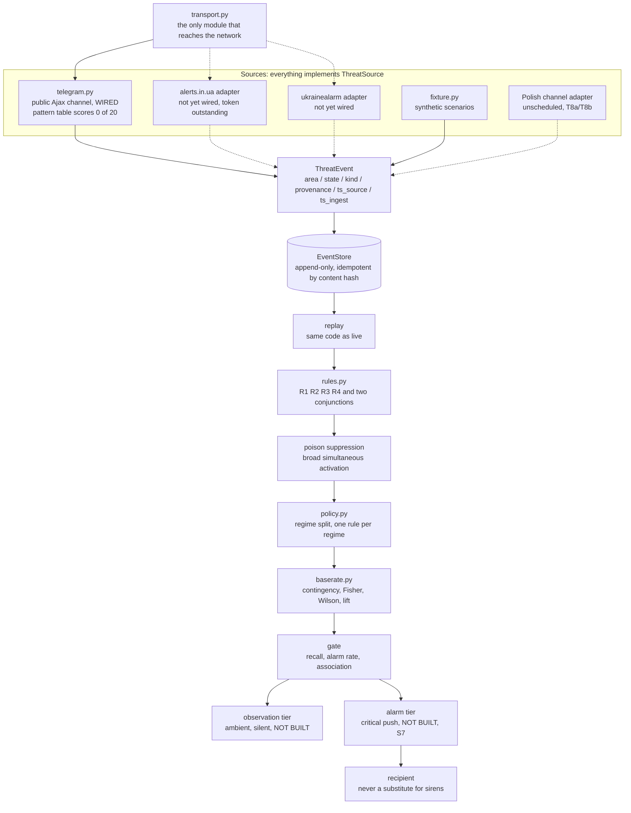

# ARCHITECTURE

The infrastructure architecture: what components exist, what may talk to what,
where the process boundaries are, and which dependency rules a change must not
break. `DATA-FLOW.md` is the companion and answers the other question, what
happens to a message as it travels.

```
Document:  docs/ARCHITECTURE.md, version 2.2
Audience:  a contributor about to add a module, a dependency, or a process
Companion: DATA-FLOW (what happens to the data), MECHANISMS (why each mechanism
           is built the way it is), METHODOLOGY (what may be claimed)
Note:      the block index is maintained as a table so that a rename leaves a
           visibly stale row. It gained no row between sprint 2 and sprint 6 and
           was two releases out of date when audited (F43)
```

## Contents

1. [The component map](#the-component-map)
2. [Block index](#block-index)
3. [Module reference](#module-reference)
4. [Dependency rules](#dependency-rules)
5. [The four boundaries](#the-four-boundaries)
6. [Process and deployment shape](#process-and-deployment-shape)
7. [Extension points](#extension-points)
8. [Repository layout beyond the package](#repository-layout-beyond-the-package)
9. [What is not here](#what-is-not-here)

## The component map



The dashed edges are adapters that do not exist. They are drawn because the
boundary is the point: everything downstream of `ThreatEvent` is blind to which
feed produced it, so adding one is an implementation rather than a rewrite. The
three network-facing sources all draw on the same upstream and are one dependency,
not three (MT9, D-010).


## Block index

One row per block. A block with no row is a block nobody agreed to.

Maintained as a table so that a rename leaves a visibly stale row.

| Block | Where it lives | What it does |
| --- | --- | --- |
| `ThreatSource` implementations | `mavo/schema.py`, `mavo/sources/` | The adapter boundary. Everything above is blind to which feed produced an event, which makes a new feed an implementation rather than a rewrite |
| `ThreatEvent` | `mavo/schema.py` | Normalized transition. Stores both source and ingest time because the difference is the feed latency that eats the warning budget |
| `AlertState` | `mavo/schema.py` | Four states. UNKNOWN is silence, PARTIAL_CLEAR is contradiction, and neither resolves to CLEAR |
| transport | `mavo/transport.py` | The only module that imports a network client. One answer, in one place, to what this tool can talk to |
| Telegram adapter | `mavo/sources/telegram.py` | The one wired live source. Parses the public channel page; its pattern table is measured at 0 of 20 and is under redesign, and it reports the skipped message window rather than assuming continuity |
| `EventStore` | `mavo/store.py` | Append-only log of transitions, never snapshots. Idempotent by content hash so a re-poll costs nothing |
| replay | `mavo/store.py` | Reconstructs any past moment. The backtest and the live correlator run this same path |
| rules | `mavo/rules.py` | Explicit predicates returning the moment they fire, which is what makes lead time measurable. R1 to R4 plus the missile and drone conjunctions |
| poison suppression | `mavo/rules.py` | Hard control against a source claiming implausibly broad simultaneous activation |
| decision policy | `mavo/policy.py` | Binds one rule per timing regime. The shared attention budget it used to allocate was removed at 0.8.0.0 (D-014) |
| evaluation | `mavo/evaluate.py` | Scores rules and policies against ground truth, and counts the crossing kinds no regime serves |
| base rate | `mavo/baserate.py` | The null model. Contingency table, one-sided Fisher, Wilson interval, lift against the unconditional rate |
| gate | `mavo/baserate.py` | Three conditions, any failure decisive. Alarm rate is a control, not a metric |
| refusal taxonomy | `mavo/errors.py` | Every failure is a refusal with a type. There is no warning type in this codebase |
| CLI | `mavo/cli.py` | `fixture`, `gate`, `policy`, `collect` |
| attack harness | `tests/harness/` | One scripted attack per threat-model row, mutation-verified by `tools/harness_mutation.py` |
| observation tier | not built | Ambient, silent, high volume |
| alarm tier | not built, S7 | Critical push, only for a rule that cleared the gate |

## Module reference

One entry per module: what it owns, what it exports, what it may import, and the
invariant a change must not break. Line counts are measured and regenerated at
each release.

### `mavo/schema.py` (147 lines)

**Owns** the vocabulary. Everything else in the package speaks in these types.

| Export | Kind | Notes |
| --- | --- | --- |
| `AlertState` | enum, 4 members | ACTIVE, CLEAR, UNKNOWN, PARTIAL_CLEAR |
| `ThreatKind` | enum | MISSILE, DRONE, UNKNOWN |
| `Provenance` | enum | measured, reported, inference, speculation |
| `ThreatEvent` | frozen dataclass | area, state, kind, ts_source, ts_ingest, source_id, provenance |
| `ThreatSource` | runtime-checkable Protocol | `source_id: str`, `poll() -> Sequence[ThreatEvent]` |
| `is_clear`, `is_actionable` | predicates | Affirmative, never negations |
| `BORDER_OBLASTS` | frozenset | The areas a crossing could originate from |

**Imports:** standard library only. **Invariant:** no module here imports from
`sources/`. The vocabulary cannot depend on who speaks it.

### `mavo/errors.py` (50 lines)

**Owns** the refusal taxonomy. `SourceUnavailable`, `NaiveTimestamp`,
`UnknownScenario`. The two budget refusals left with the budget (D-014). **There is no warning type**, and adding one is a change this
repository rejects rather than reviews.

**Invariant:** `SourceUnavailable` is raised for reachability only. A content
failure that raises it makes an outage and an unparseable page indistinguishable
to every caller.

### `mavo/transport.py` (81 lines)

**Owns** the only import of a network client in the package.

| Export | Purpose |
| --- | --- |
| `Transport` | Protocol: `fetch(url) -> str` |
| `UrllibTransport` | The real one. Standard library, bounded in time and size |
| `StubTransport` | Returns a fixed body, counts calls |
| `FailingTransport` | Always raises. Models an unreachable source |

**Invariant, checked by lint:** exactly one module imports a network client. The
three transports exist so that every adapter test injects one and no test needs a
network.

### `mavo/store.py` (105 lines)

**Owns** durability. Append-only SQLite log of transitions, idempotent by content
hash, replayable to any past moment.

**Invariant:** append is idempotent and appending nothing is not an error. The
content hash excludes `ts_ingest`; a change that includes it grows the log
without bound and breaks every backtest silently (MT8).

### `mavo/baserate.py` (254 lines)

**Owns** the null model and the gate. Contingency table, one-sided Fisher via
`math.comb`, Wilson interval, lift, and `gate()` with its three conditions.

**Invariant:** it stays top-level, checked by `lint_domain`. It is the point of
the project and stays visible in a directory listing.

### `mavo/rules.py` (148 lines)

**Owns** the candidate rules as explicit predicates and the poison suppression
that every one of them calls first.

**Invariant:** a rule returns the moment it fires or `None`, never a boolean.
That signature is what makes lead time measurable.

### `mavo/policy.py` (107 lines)

**Owns** the regime split. `Regime`, `RegimeRule`,
`DecisionPolicy`, `equal_split`.

**Invariant:** `DecisionPolicy` refuses construction when allocated shares exceed
the total. An over-allocated policy that can be built is one that will be run.

### `mavo/evaluate.py` (218 lines)

**Owns** scoring against ground truth: `run_rule`, `run_policy`, `plan_policy`,
and the coverage-gap accounting.

**Invariant:** unserved crossing kinds are counted and printed, never removed
from a denominator.

### `mavo/backfill.py` (337 lines)

**Owns** corpus acquisition. Backwards paging, verbatim snapshots named by id
range, contiguity from filenames, the advisory directory lock, six named stop
conditions.

**Invariant:** it parses nothing beyond post ids. A corpus filtered through the
pattern table it exists to fix is not evidence.

### `mavo/sources/fixture.py` (214 lines)

**Owns** the synthetic history: scenarios, `Night`, `generate_history`.

**This is not a simulation of Ukraine.** It is a device for exercising the
decision path, and every number derived from it is a property of the device.
Stated here because it is the claim most likely to be quietly dropped when the
numbers look good.

### `mavo/sources/telegram.py` (261 lines)

**Owns** the only wired live adapter. Two independent regexes, three
classification layers, the window-gap computation.

**Measured state:** state layer 15 of 20, means layer 4 of 20, area layer **0 of
20**, so the classifier scores 0 of 20 overall (F23). The failure is pinned as
assertions and the redesign waits for the corpus.

### `mavo/cli.py` (254 lines)

**Owns** the operator surface: `fixture`, `gate`, `policy`, `backfill`,
`collect`, and the exit codes that carry refusals to a shell.

**Invariant:** every subcommand has a section in the manual, checked by
`tools/manual_audit.py`.

## The four boundaries

A boundary is a place where one side may be replaced without the other noticing.
There are four, and knowing which one a change crosses is most of a review.

| Boundary | Between | Crossed by | What it buys |
| --- | --- | --- | --- |
| **Source** | `ThreatSource` implementations and everything above `ThreatEvent` | Adding a feed | A new feed is an implementation, not a rewrite. Nothing downstream knows which feed produced an event |
| **Transport** | Adapters and the network | Injecting a transport | Every adapter is testable offline, and "what can this talk to" has one answer in one file |
| **Store** | Ingestion and evaluation | `replay` | The backtest and a future live correlator run the same path, so a rule cannot behave differently in test than in production |
| **Rule** | Predicates and scoring | The `Rule` signature | Rules know nothing about recall, budgets or lead time. Scoring knows nothing about oblasts |

**A change that blurs one of these is a change to argue about, not to merge.**
The most likely blur is the decision layer importing an adapter, which inverts
the source boundary and makes the adapter unreplaceable.


## Dependency rules

Four rules. Each is enforced by something in `make verify`, or it is not a rule.

| Rule | Enforced by | Why |
| --- | --- | --- |
| One top-level package, `mavo` | `tests/lint_domain.py` | A second namespace is where a parallel implementation starts |
| The network is reachable from exactly one module | `tests/lint_limitations.py`, claim `network_reach_is_one_file` | "What can this thing talk to" must have one answer in one place, and every adapter must be testable without a network |
| Runtime dependencies stay empty | `pyproject.toml` is the single source of truth; a new one requires a changelog entry justifying it | The product is a measurement, and a measurement with an unaudited dependency tree is weaker than one without |
| `baserate.py` stays top-level | `tests/lint_domain.py` | It is the point of the project and stays visible in a directory listing |

**The direction of dependency is one-way.** Sources import from `schema` and
`transport`. Nothing in `schema`, `store`, `rules`, `policy`, `baserate` or
`evaluate` imports from `sources`, except the fixture's `Night` type, which is a
seam that will move when live nights exist. A change that makes the decision
layer import an adapter has inverted the boundary that makes the adapter
replaceable.

## Process and deployment shape

Today there is exactly one process shape: a command runs, does one thing, and
exits.

| Command | Reaches the network | Writes | Runs for |
| --- | --- | --- | --- |
| `mavo fixture` | No | The event store | Seconds |
| `mavo gate` | No | Nothing | Seconds |
| `mavo policy` | No | Nothing | Seconds |
| `mavo backfill` | Yes | `data/raw/` snapshots | Minutes to hours |
| `mavo collect` | Yes | Optionally one snapshot | One request |

**Nothing is resident, and that is why `skipped` is usually `unknown`.** Window
gap detection compares a poll against the previous poll on the same source
object, and a command that exits has no previous poll. The count becomes a
measurement only under a resident collector, which is `mavo watch` and does not
exist.

**There is no configuration file and no daemon.** Both are deliberate. Every
threshold that exists for a decision reason is a constant in code, published in
the README, and moving one is a scope change that moves the README table in the
same commit.

**State on disk is a directory of files and one SQLite database.** No service, no
schema migration story yet, and the store's format is append-only transitions
rather than a mutable current-state table, so a migration is a replay rather than
an ALTER.

## Extension points

Where a contributor is expected to add things, and what landing one requires.

### Adding a threat source

Implement `ThreatSource`: a `source_id` and `poll() -> Sequence[ThreatEvent]`.
Take a `Transport` in the constructor rather than reaching for the network.

**Landing it requires,** in the same release: a hostile-input suite feeding
malformed, truncated, oversized and hostile payloads, asserting nothing raises
and that unparseable records are counted rather than dropped (T4); and a row in
`docs/MANUAL.md` if it gains a command.

### Adding a rule

A function `Night -> datetime | None` in `mavo/rules.py`, registered in
`CANDIDATE_RULES`. Call `is_poisoned` first.

**Landing it requires** a stated reason it is not a threshold in disguise: for a
conjunct, name the failure of the existing conjuncts that it closes.

### Adding a threat-model row

A row in `docs/THREAT-MODEL.md` with a control or a **named acceptance**, the
test that measures it, and a scripted attack in `tests/harness/`.

**Landing it requires** an entry in `MUTATIONS` in `tools/harness_mutation.py`
that disables the control, with the attack going red under it, or an entry in
`UNVERIFIED` with the reason. `STATUS.json` pins the row and attack counts and
`tools/docs_audit.py` fails on a mismatch or a numbering gap.

### Adding a claim about the repository

A bullet in the README's limitations section **and** a check in
`tests/lint_limitations.py`, in the same commit. This is the one principle in
`CONTRIBUTING.md`, and it exists because the portfolio's founding defect was a
README describing a protection the tree did not implement.

### Adding a dependency

`pyproject.toml` is the single source of truth. A runtime dependency requires a
changelog entry justifying it. The current count is zero and the burden of
argument sits with the addition.

## Repository layout beyond the package

| Path | Contents | Enforced by |
| --- | --- | --- |
| `tests/test_<domain>.py` | Behaviour of one module | |
| `tests/test_sprint<N>.py` | One regression file per sprint, verified red against the previous release before it is fixed | `docs_audit`: every shipped sprint has a file |
| `tests/lint_*.py` | Executable claims about the repository itself | Run by `make verify` |
| `tests/harness/` | One scripted attack per threat-model row, plus `CATALOGUE.md` | `docs_audit`: catalogued attack numbers have tests |
| `tools/docs_audit.py` | Version pins, sprint files, row counts, cited test names | In `make verify` |
| `tools/manual_audit.py` | Every command documented, every section marked, thresholds match the code | In `make verify` |
| `tools/harness_mutation.py` | Disables each control, fails if its attack stays green | In `make verify` |
| `docs/<NAME>.md` | Design documents, uppercase because they are authored rather than generated | `lint_domain`: a lowercase name in `docs/` fails |
| `docs/reviews/<version>.md` | One review per major release, every finding dispositioned (D-021). Releases without one are named in `docs/reviews/README.md` | |
| `data/raw/` | Tier 1. Never committed | `.gitignore` |
| `data/aggregates/` | Tier 2. Committed | |
| `data/reference/` | Tier 2. Committed. Derived lookup tables with their provenance and licence, never raw messages. Currently `tag_map.csv` (`docs/CHANNEL.md`) | |
| `STATUS.json` | Machine-readable pins and measurements, including the repository size block | `docs_audit`: recounted from the tree at every run |
| `MANIFEST.sha256` | Every tracked file with its digest. Detects an incomplete transfer, an archive that disagrees with the tree it claims to be, a file added without an entry, and an edit that reached the tree without reaching the release chain. **Not tamper evidence**: the manifest sits in the repository beside the files it lists, so whoever can change a file can change its line | `manifest`, in `verify`. Regenerated only by `make manifest-write` as a release step |


## What is not here

Named so that their absence is a decision rather than an oversight:

- **No output channel.** Its threats are not modelled here; they land with the
  channel, in the same version, or the channel does not land. The plan for it,
  including the technology decision and the phases that gate it, is
  `docs/MOBILE.md`, which is a plan and says so on its first line.
- **No observation tier.** The drone regime is demoted to it (D-009) and it does
  not exist yet, which means the drone regime currently goes nowhere.
- **No API adapters.** alerts.in.ua and ukrainealarm are drawn as dashed edges
  because the boundary is real and the implementations are not.
- **No scheduler.** Continuous collection is a cron entry the operator writes,
  until `mavo watch` exists. That daemon is phase M0 of the notification plan,
  and it is a prerequisite for the skipped-message counter to be a measurement
  rather than `unknown`, because a one-shot poll has no previous poll.
