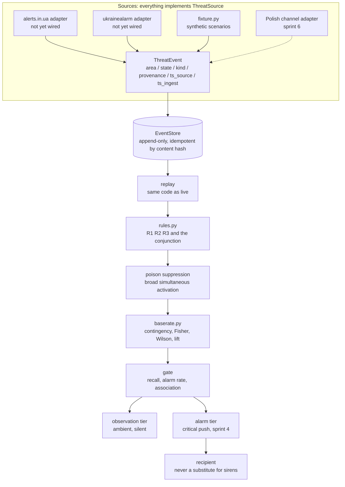

# ARCHITECTURE

What talks to what. Mechanisms and their reasoning live in `MECHANISMS.md`; what
may be claimed lives in `METHODOLOGY.md`.

## Block index

Maintained as a table so that a rename leaves a visibly stale row.

| Block | Where it lives | What it does |
| --- | --- | --- |
| `ThreatSource` implementations | `mavo/schema.py`, `mavo/sources/` | The adapter boundary. Everything above is blind to which feed produced an event, which is what makes the sprint 6 switch a new implementation rather than a rewrite |
| `ThreatEvent` | `mavo/schema.py` | Normalized transition. Stores both source and ingest time because the difference is the feed latency that eats the warning budget |
| `EventStore` | `mavo/store.py` | Append-only log of transitions, never snapshots. Idempotent by content hash so a re-poll costs nothing |
| replay | `mavo/store.py` | Reconstructs any past moment. The backtest and the live correlator run this same path |
| rules | `mavo/rules.py` | Explicit predicates returning the moment they fire, which is what makes lead time measurable |
| poison suppression | `mavo/rules.py` | Hard control against a source claiming implausibly broad simultaneous activation |
| base rate | `mavo/baserate.py` | The null model. Contingency table, one-sided Fisher, Wilson interval, lift against the unconditional rate |
| gate | `mavo/baserate.py` | Three conditions, any failure decisive. Alarm rate is a control, not a metric |
| observation tier | not yet built | Ambient, silent, high volume |
| alarm tier | sprint 4 | Critical push, only for a rule that cleared the gate |
