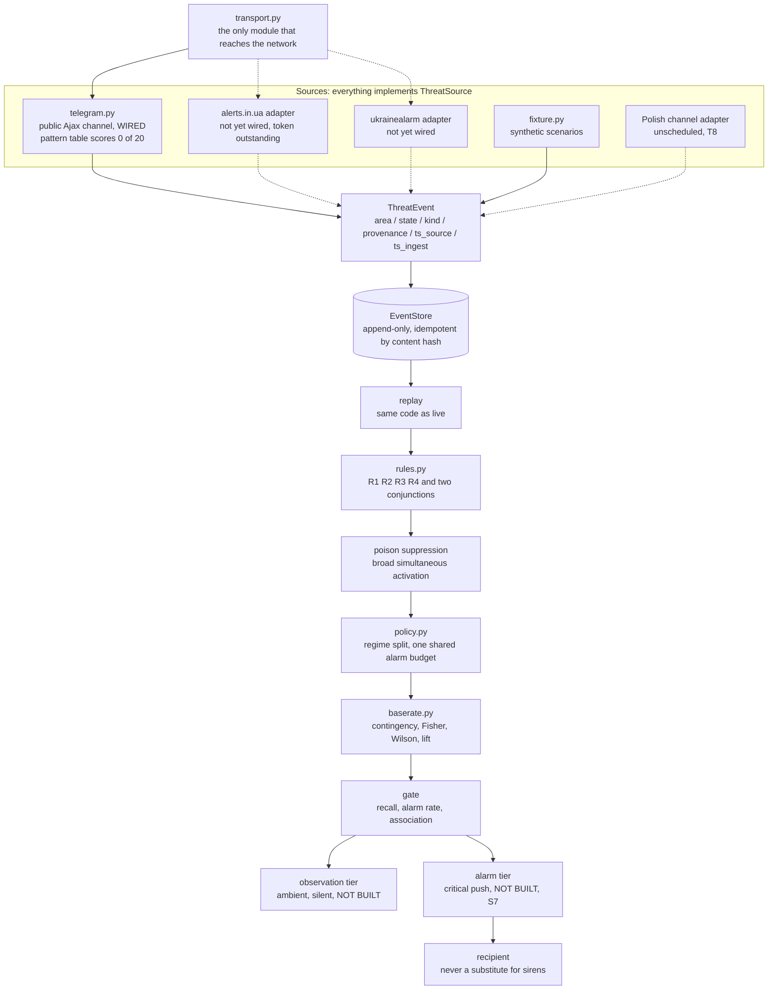

# ARCHITECTURE

What talks to what. Mechanisms and their reasoning live in `MECHANISMS.md`; what
may be claimed lives in `METHODOLOGY.md`.

The dashed edges are adapters that do not exist. They are drawn because the
boundary is the point: everything downstream of `ThreatEvent` is blind to which
feed produced it, so adding one is an implementation rather than a rewrite. The
three network-facing sources all draw on the same upstream and are one dependency,
not three (MT9, D-010).

## Block index

Maintained as a table so that a rename leaves a visibly stale row.

| Block | Where it lives | What it does |
| --- | --- | --- |
| `ThreatSource` implementations | `mavo/schema.py`, `mavo/sources/` | The adapter boundary. Everything above is blind to which feed produced an event, which makes a new feed an implementation rather than a rewrite |
| `ThreatEvent` | `mavo/schema.py` | Normalized transition. Stores both source and ingest time because the difference is the feed latency that eats the warning budget |
| `AlertState` | `mavo/schema.py` | Four states. UNKNOWN is silence, PARTIAL_CLEAR is contradiction, and neither resolves to CLEAR |
| transport | `mavo/transport.py` | The only module that imports a network client. One answer, in one place, to what this tool can talk to |
| Telegram adapter | `mavo/sources/telegram.py` | The one wired live source. Parses the public channel page; its pattern table is measured at 0 of 20 and is under redesign, and it reports the skipped message window rather than assuming continuity |
| `EventStore` | `mavo/store.py` | Append-only log of transitions, never snapshots. Idempotent by content hash so a re-poll costs nothing |
| replay | `mavo/store.py` | Reconstructs any past moment. The backtest and the live correlator run this same path |
| rules | `mavo/rules.py` | Explicit predicates returning the moment they fire, which is what makes lead time measurable. R1 to R4 plus the missile and drone conjunctions |
| poison suppression | `mavo/rules.py` | Hard control against a source claiming implausibly broad simultaneous activation |
| decision policy | `mavo/policy.py` | Binds one rule per timing regime to a share of one shared alarm budget, and refuses rather than trimming when demand exceeds it |
| evaluation | `mavo/evaluate.py` | Scores rules and policies against ground truth, and counts the crossing kinds no regime serves |
| base rate | `mavo/baserate.py` | The null model. Contingency table, one-sided Fisher, Wilson interval, lift against the unconditional rate |
| gate | `mavo/baserate.py` | Three conditions, any failure decisive. Alarm rate is a control, not a metric |
| refusal taxonomy | `mavo/errors.py` | Every failure is a refusal with a type. There is no warning type in this codebase |
| CLI | `mavo/cli.py` | `fixture`, `gate`, `policy`, `collect` |
| attack harness | `tests/harness/` | One scripted attack per threat-model row, mutation-verified by `tools/harness_mutation.py` |
| observation tier | not built | Ambient, silent, high volume |
| alarm tier | not built, S7 | Critical push, only for a rule that cleared the gate |
