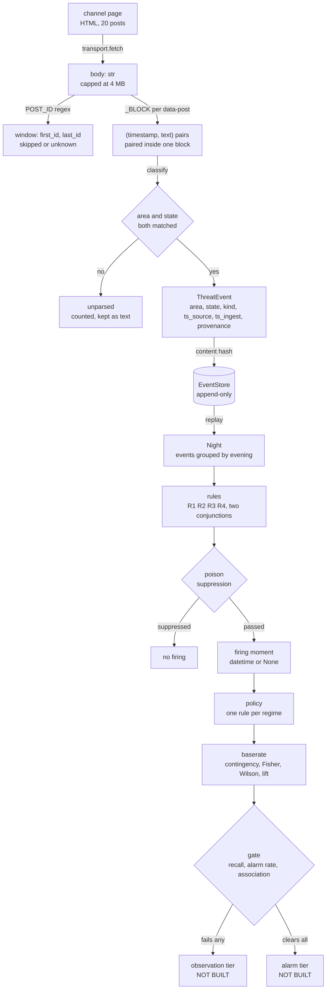
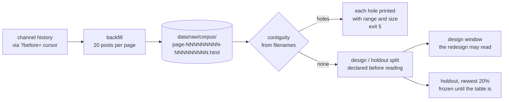

# DATA-FLOW

The data architecture: what happens to one message, from the byte the channel
served to the decision it does or does not contribute to. `ARCHITECTURE.md` is
the companion document and answers the other question, which components exist
and what may talk to what.

```
Document:  docs/DATA-FLOW.md, version 1.0
Audience:  a contributor about to change a transformation, a schema field, or
           anything that decides what is kept and what is dropped
Companion: ARCHITECTURE (components and boundaries), MECHANISMS (why each
           mechanism works the way it does), FOUNDATIONS (what any of it rests
           on)
Note:      every stage below names what it can lose. A stage that cannot lose
           anything is either trivial or mis-described, and in this pipeline
           there are no trivial stages
```

## Contents

1. [The whole path in one diagram](#1-the-whole-path-in-one-diagram)
2. [Stage 1: bytes to pages](#2-stage-1-bytes-to-pages)
3. [Stage 2: pages to messages](#3-stage-2-pages-to-messages)
4. [Stage 3: messages to events](#4-stage-3-messages-to-events)
5. [Stage 4: events to the store](#5-stage-4-events-to-the-store)
6. [Stage 5: store to nights](#6-stage-5-store-to-nights)
7. [Stage 6: nights to rule firings](#7-stage-6-nights-to-rule-firings)
8. [Stage 7: firings to a verdict](#8-stage-7-firings-to-a-verdict)
9. [The parallel path: the corpus](#9-the-parallel-path-the-corpus)
10. [Data tiers and what may be committed](#10-data-tiers-and-what-may-be-committed)
11. [Where information is lost, in one table](#11-where-information-is-lost-in-one-table)

---

## 1. The whole path in one diagram



Two things about this diagram are load-bearing. The `unparsed` branch is a
destination, not an error path: unparsed messages are counted and kept, because
a silent drop turns a stale pattern table into an apparently quiet channel. And
the `skipped or unknown` box exists because a message that was never fetched and
a message that was never sent are indistinguishable without post ids.

---

## 2. Stage 1: bytes to pages

**Where:** `mavo/transport.py`, the only module in the package that imports a
network client.

**In:** a URL. **Out:** `str`, or `SourceUnavailable`.

The transport does exactly one thing and refuses in exactly one way. It caps the
response at 4 MB and the request at 10 seconds, and it converts every
library-specific failure into `SourceUnavailable` so no caller has to know which
HTTP library is underneath.

**What can be lost here:** everything, at once, and visibly. An outage raises
rather than returning an empty string, which is MT11. The distinction between
"unreachable" and "reachable and quiet" is created here and every downstream
stage depends on it having been made correctly.

**Decoding:** UTF-8 with `errors="replace"`. A malformed byte becomes a
replacement character rather than an exception, because a parser that raises on
hostile content turns a hostile string into an outage (MT7).

---

## 3. Stage 2: pages to messages

**Where:** `mavo/sources/telegram.py`.

**In:** the page body. **Out:** `(timestamp, text)` pairs, plus a window report.

The body is cut into per-message blocks first, and only then read (0.6.0.0,
F50). Three regexes with deliberately separated jobs:

| Regex | Extracts | If it fails |
| --- | --- | --- |
| `_BLOCK` | One block per `data-post` anchor, spanning to the next anchor or the page end | Zero messages. The page looks empty |
| `_TEXT`, `_TIME` | The text div and the `<time datetime>` **within one block**, in either internal order | That block joins the unparsed count; its neighbours are untouched |
| `POST_ID` | `data-post="channel/NNNN"` | No ids. The window gap becomes `unknown`, never `0` |

**The parse target is the hashtag, not the prose** (0.10.0.0). Measured on the
design window, 99.34% of messages carry `#Name_unit` with the unit type
explicit, the name in the nominative and spaces as underscores. 127 distinct
tags, 126 resolving to a unique register code. Free-text matching against
register names, the approach this replaces, reached 6.06% as a lower bound and
needed a stemming parameter that made names collide across oblasts. Full
measurement in `docs/CHANNEL.md`.

The block boundary is the load-bearing part. Until 0.6.0.0 a single page-wide
regex required the timestamp to precede the text; on the live page the
timestamp sits in the message *footer*, so every event carried its neighbour's
time - a one-message shift invisible to a suite whose fixture was written in
the regex's order (F50, harness A12). Pairing inside a block cannot cross a
message boundary by construction, in either internal order.

Because window extraction stays separate from message parsing, a page
restructuring that breaks one does not silently take the other with it. A page
with ids and no parseable messages reports `messages=0` with a known window,
which is a different and more informative failure than a page with neither.

**The window computation.** The lowest id on this page is compared against the
highest id from the previous poll on the same source object. The difference,
minus one, is how many posts passed unseen.

Three cases, and the third is the one that matters:

| Case | `skipped` | Why |
| --- | --- | --- |
| Previous poll exists, ids present | a count | Measured |
| First poll of this source | `None` | No baseline exists. Zero would be a claim |
| No ids on the page | `None` | The observable is gone. Losing the ability to measure must not look like measuring calm |

**What can be lost here:** messages beyond the twenty-post window, permanently,
if polling is slower than the channel emits. This is the reason `--save-raw` and
`backfill` exist, and the reason the count is surfaced rather than inferred.

---

## 4. Stage 3: messages to events

**Where:** `classify` and `classify_state` in `mavo/sources/telegram.py`.

**In:** one message's text. **Out:** `ThreatEvent`, or nothing.

Three independent layers, and the current state of each is a measurement, not an
estimate. Against 20 real messages on 2026-08-08:

| Layer | Function | Hit rate | Why |
| --- | --- | --- | --- |
| State | `classify_state` | 15 of 20 | Works. Split into its own function in sprint 5 so it could be tested without the layer that does not |
| Means | `KIND_MARKERS` | 4 of 20 | The channel carries means on separate messages from the alerts they qualify (F25) |
| Area | `AREAS` | **0 of 20** | The table holds oblast names; the channel emits raion names (F24) |

`classify` requires area **and** state. Since area matches nothing, the whole
classifier scores 0 of 20 (F23) and that failure is pinned as assertions so it
cannot be fixed quietly.

**The state layer is four-valued and the fourth value is the interesting one:**

| State | Set when | Never |
| --- | --- | --- |
| `ACTIVE` | An alert-start marker matched | |
| `CLEAR` | An all-clear marker matched and no continuation marker did | |
| `PARTIAL_CLEAR` | All-clear **and** continuation markers both matched | resolves to CLEAR, is actionable |
| `UNKNOWN` | The source told us nothing about this area | resolves to CLEAR, is actionable |

The partial check runs first and is decisive. A message carrying both markers is
a contradiction, and the weaker reading has to win.

**What can be lost here:** everything the pattern table does not recognise. It
is counted, not dropped: `ParseReport.unparsed` keeps the text. That is what made
the 0-of-20 measurement possible in the first place.

---

## 5. Stage 4: events to the store

**Where:** `mavo/store.py`.

**In:** `ThreatEvent`. **Out:** rows in an append-only SQLite log.

**Identity is a content hash** over area, state, source timestamp and source
identity. It **excludes** ingest time, and that exclusion is the whole mechanism:
a feed polled every thirty seconds repeats an unchanged transition constantly,
and without this the log grows without bound until replay stops reconstructing
the past. Every backtest built on that log would then be quietly wrong (MT8).

**Transitions, not snapshots.** The store never holds "the current state of
Ukraine". It holds the moments at which something changed, and any past moment is
reconstructed by replaying transitions up to it. This is what lets the backtest
and a future live correlator run the same code path.

**Two timestamps, always both.** `ts_source` is when the source says it happened;
`ts_ingest` is when we learned it. The difference is feed latency, and feed
latency consumes the warning budget directly: in the missile regime the whole
budget is about six minutes, so a feed publishing three minutes late halves the
product.

**What can be lost here:** nothing, by construction. Appending the same event
twice is a no-op rather than a duplicate, and appending nothing is not an error.

---

## 6. Stage 5: store to nights

**Where:** `replay` in `mavo/store.py`, `Night` in `mavo/sources/fixture.py`.

**In:** the event log. **Out:** events grouped into evenings, with ground truth
attached where it is known.

A `Night` is the unit the rules and the gate both operate on, because the
outcome being predicted, a crossing, is a per-night event. Grouping happens here
rather than at ingestion so that the same log can be regrouped if the unit turns
out to be wrong.

**What can be lost here:** boundary events. A campaign that starts before
midnight and crosses after is one night or two depending on where the boundary
falls, and nothing currently measures how often that matters.

---

## 7. Stage 6: nights to rule firings

**Where:** `mavo/rules.py`.

**In:** a `Night`. **Out:** the `datetime` at which a rule would have fired, or
`None`.

**Returning the moment rather than a boolean is what makes lead time
measurable.** A rule that answers "yes" tells you nothing about whether the
warning would have arrived in time to matter.

**Suppression runs first, in every rule.** Eight or more distinct areas
activating inside 120 seconds suppresses everything. Not a scoring penalty, a
hard control: an adversary who can induce alarms exhausts attention for free
(MT1).

The rules, in increasing strictness:

| Rule | Fires when |
| --- | --- |
| `r1_border_active` | Any border oblast reports active |
| `r2_westward_escalation` | Three or more areas activate within 90 minutes, trending west |
| `r3_border_missile` | A border oblast is active and classified missile |
| `r4_border_drone` | A border oblast is active and classified drone |
| `conjunction` | R3 **and** R2. The only shape permitted to raise an alarm |
| `drone_conjunction` | R4 **and** R2. Exists to be measured, not because it is expected to work |

Each conjunct closes a specific failure of the others: R1 alone fires on most
nights, R3 alone cannot tell a routine alert from an inbound raid, R2 alone fires
on campaigns that stop at the border.

---

## 8. Stage 7: firings to a verdict

**Where:** `mavo/evaluate.py`, `mavo/policy.py`, `mavo/baserate.py`.

**In:** firings across many nights, plus ground truth. **Out:** a gate verdict.

The chain is: firings and outcomes become a **contingency table** (fired and
crossed, fired and not, missed, correctly quiet); the table becomes a
**`RuleAssessment`** carrying recall, precision, alarm rate, a Wilson interval,
lift and a one-sided Fisher p-value; the assessment meets the **gate**.

| Condition | Floor | Character |
| --- | --- | --- |
| Recall | at least 0.90 | A warning system that misses the event has no purpose |
| Lift, lower bound | at least 1.50 | A control. Replaced the alarm-rate condition at 0.8.0.0 (D-014) |
| Association | Fisher one-sided p at most 0.05 | Distinguishes the rule from the calendar |

**The budget is allocated, not summed.** Two rules each cleared at two alarms
per week produce four, which is the number that destroys the channel. So
`DecisionPolicy` refuses construction when the shares exceed the total, and the
demand-based allocator refuses rather than trimming.

**Coverage gaps are counted, never absorbed.** A policy serving only the missile
regime has a recall of 1.00 on the scope it serves and leaves eight drone
crossings unwarned. Those crossings are reported as a gap rather than removed
from the denominator, because a policy with a hole and a policy with good numbers
must not print the same way.

---

## 9. The parallel path: the corpus

The corpus is a second pipeline that deliberately stops early, and its stopping
point is the design.



**It writes raw HTML and parses nothing beyond post ids.** The corpus exists
because the pattern table is wrong; a corpus filtered through that table would be
evidence about the table rather than about the channel.

**Snapshots are named by id range**, not by fetch time, so the same evidence
fetched twice is one file. This is the same idempotence principle as the event
store, applied to a different medium.

**Contiguity is computed from filenames**, so a hole is visible without opening
anything. Holes are printed with range and size and carry exit code 5, because a
census with holes it cannot see is a sample that believes otherwise.

**The split is declared before any content is read** (D-012). The holdout is the
newest 20% of posts by id. Newest rather than oldest because the redesign must
survive the channel as it writes today.

---

## 10. Data tiers and what may be committed

Three tiers, with a different rule for each. The `.gitignore` enforces the
boundary and `lint_hygiene` checks the tree for what should never be there.

| Tier | Contents | Committed | Why |
| --- | --- | --- | --- |
| 1, raw | `data/raw/`: channel snapshots, the event store | **Never** | Per-subject records and bulk third-party content. Also large: the corpus is tens of thousands of files |
| 2, aggregates | `data/aggregates/`: derived counts and distributions | Yes | Small, non-identifying, and the thing a reader needs to check a claim |
| 3, reporting | `docs/`: everything a reader sees | Yes | The product of the analysis |

The tier boundary is not privacy theatre in this project, since the channel is
public. It is about reproducibility and size: tier 2 is what makes a claim
checkable without redistributing tier 1.

---

## 11. Where information is lost, in one table

Every stage that can lose something, what it loses, and whether the loss is
visible. **Visible loss is the design; invisible loss is the defect class this
project exists to attack.**

| Stage | Can lose | Visible as | If it were invisible |
| --- | --- | --- | --- |
| Transport | Everything, during an outage | `SourceUnavailable`, exit 3 | An outage would read as an empty sky (MT11) |
| Transport | Content past 4 MB | `SourceUnavailable` | A truncated page would parse as a short one |
| Page window | Messages beyond 20 between polls | `skipped=N`, or `unknown` | A skip would read as a quiet channel (MT12) |
| Message regex | A page whose structure changed | `messages=0` | A restructured page would read as no news |
| Classification | Every area but the first, in a message naming several | **Nothing. This loss is currently invisible** | 13.3% of comparable messages name two to eight areas, and only the first reaches an event (T37) |
| Classification | The continuation list of an all-clear: areas where the alert is still running | **Nothing. This loss is currently invisible** | 5.2% of comparable messages carry one, naming 4,064 areas in the design window. The message says *still dangerous there* and nothing records it. For a report whose product is completeness this is the sharpest loss in this table (T37) |
| Classifier | Any wording the table lacks | `unparsed` count, kept as text | A stale table would read as a quiet channel (F23) |
| State layer | The difference between silence and contradiction | `UNKNOWN` against `PARTIAL_CLEAR` | An ambiguous all-clear would read as an all-clear (F26) |
| Store | Nothing | | |
| Night grouping | Events across a midnight boundary | **Not currently measured** | This one is a known blind spot, stated rather than closed |
| Policy | Crossing kinds no regime serves | `COVERAGE GAP`, printed | An unserved kind would leave the denominator (MT6) |
| Gate | Nothing. It reports, it does not filter | | |

The last row of the table is the one to argue with in review. If a change makes
a stage lose something new, it has to make that loss visible in the same commit,
or it is not a change this repository accepts.
