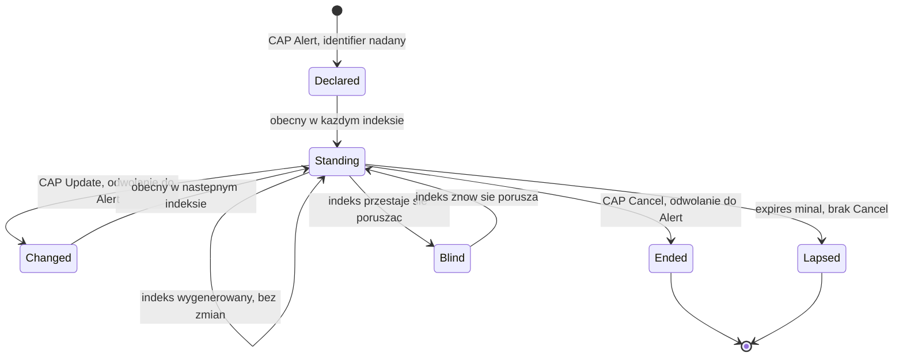

# Czym musiałby być polski feed alarmowy czytelny maszynowo

Version: 3.0 / 2026-09-09
Specyfikacja napisana z pozycji kogoś, kto próbował budować na takim feedzie,
najpierw nie znalazł niczego, potem znalazł jego część za tokenem, a potem
usłyszał od operatora tej części, co ona publikuje i co jest do niej
dokładane. Ukraiński odpowiednik został skonsumowany i zmierzony na korpusie
118 dni; zbudowanie na nim czegoś to projekt na weekend, a parser w jego
środku zajął dwa popołudnia. Oba fakty są tu po to, że argument poniżej
opiera się na drugim z nich: to, co konwencja umożliwia, jest tanie w
wykorzystaniu, i o to właśnie chodzi. Dokument towarzyszący:
[`docs/CHANNEL.md`](CHANNEL.md), czyli pomiar, na którym to wszystko stoi,
oraz T8a w [`../TODO.md`](../TODO.md), gdzie luka została po raz pierwszy
zapisana. T8a to przegląd, z którego ten dokument argumentuje. Jego pierwszy
werdykt na poziomie źródła, dla strumienia RSO, pochodzi z odczytu strumienia
z 2026-08-22 i jest wpleciony w sekcje 2 i 4a poniżej. Drugi pochodzi od
operatora tego strumienia, na piśmie, z 2026-09-02, i jest wpleciony w sekcje
2, 3, 6 i 8. Pozostałych polskich źródeł z sekcji 2 ten projekt nie czytał;
są opisane z tego, co ich operatorzy o nich publikują, i każde zdanie mówi,
którym z tych dwóch jest.

```
Uwaga: ten dokument opisuje feed, który jeszcze nie istnieje w postaci, o
       którą prosi. Najbliższy polski odpowiednik, strumień RSO, został
       odczytany i zmierzony 2026-08-22; 2026-09-02 jego operator stwierdził
       na piśmie, co publikuje, na jakich zasadach dostępu i co jest do
       niego dokładane. Sekcja 2 zapisuje jedno i drugie, sekcja 8 zapisuje
       korektę, a ostatnie wpisy sekcji 4a zapisują, czego nauczyło
       konsumowanie strumienia. Korekty są oznaczone, nie ciche. Nic z tego
       nie jest twierdzeniem o czyichkolwiek kompetencjach i ten dokument
       takich twierdzeń nie stawia
```

**Jak to czytać i dla kogo to jest.** Dokument ma dwie części i dwóch
czytelników. Część I (sekcje 1 do 9) to argument: co istnieje, czego brakuje,
ile kosztowało dowiedzenie się tego, i dziewiętnaście właściwości nauczonych
przez budowanie konsumenta na feedach, które ich nie miały. Jest napisana dla
osoby, która decyduje, czy feed tego rodzaju ma istnieć. Część II (sekcje 10
do 16) to instrukcja: jak feed wygląda element po elemencie, jak jeden alarm
przechodzi przez niego od pierwszej wiadomości do ostatniej, i lista
kontrolna, którą wydawca może przepuścić przez kandydata, zanim przeczyta go
ktokolwiek spoza budynku. Jest napisana dla inżyniera, któremu kazano to
zbudować, i zakłada, że ten inżynier już publikuje CAP, bo operator RSO
publikuje. Inżynier w pośpiechu może zacząć od sekcji 10 i wrócić do części I,
kiedy jakaś reguła z części II będzie potrzebowała swojego powodu; każda
reguła tam nazywa właściwość, na której stoi. Wydanie angielskie,
`FEED-SPEC.md`, stoi obok tego pliku, `FEED-SPEC-PL.md`, i jest z nim trzymane
sekcja w sekcję, liczba w liczbę, przez sprawdzenie w buildzie tego
repozytorium, więc oba nie mogą się rozjechać bez tego, żeby build o tym
powiedział.

## Spis treści

**Część I. Argument**

1. [Różnica to hasztag](#1-różnica-to-hasztag)
2. [Co jest dziś dostępne po polskiej stronie](#2-co-jest-dziś-dostępne-po-polskiej-stronie)
3. [Specyfikacja, która w większości nie jest moja](#3-specyfikacja-która-w-większości-nie-jest-moja)
4. [Cisza nie może znaczyć bezpieczeństwa](#4-cisza-nie-może-znaczyć-bezpieczeństwa)
5. [Zarzut i odpowiedź](#5-zarzut-i-odpowiedź)
6. [O co ten dokument nie prosi](#6-o-co-ten-dokument-nie-prosi)
7. [Jak się z tym dokumentem nie zgodzić](#7-jak-się-z-tym-dokumentem-nie-zgodzić)
8. [Rejestr korekt](#8-rejestr-korekt)
9. [Źródła](#9-źródła)

**Część II. Instrukcja**

10. [Feed na jednej stronie](#10-feed-na-jednej-stronie)
11. [Życie jednego alarmu na łączu](#11-życie-jednego-alarmu-na-łączu)
12. [Trzy zegary, jeden format](#12-trzy-zegary-jeden-format)
13. [Co sprawia, że jeden alarm jest jednym alarmem](#13-co-sprawia-że-jeden-alarm-jest-jednym-alarmem)
14. [Gdzie: obszar jako kod](#14-gdzie-obszar-jako-kod)
15. [Serwowanie i późniejsze zmiany](#15-serwowanie-i-późniejsze-zmiany)
16. [Lista kontrolna zgodności](#16-lista-kontrolna-zgodności)

---

## 1. Różnica to hasztag

Zmierzone na 48 540 prawdziwych wiadomościach z publicznego ukraińskiego
kanału alarmów lotniczych, przez 99 nocy ([`docs/CHANNEL.md`](CHANNEL.md)):

| Wielkość | Wartość |
| --- | --- |
| Wiadomości oznaczone dotkniętym obszarem i typem jego jednostki | **99,34%** |
| Różnych etykiet obszarów w całym okresie | 127 |
| Etykiet rozwiązujących się do unikalnego kodu w państwowym rejestrze | 126 automatycznie, 127 z jedną decyzją kontekstową |
| Zgodność etykiety z prozą samej wiadomości | **99,997%** na 38 521 porównywalnych wiadomościach |

Etykieta to hasztag: `#Харківський_район`, `#Львівський_район`,
`#м_Харків_та_Харківська_територіальна_громада`. Mianownik, podkreślenia
zamiast spacji, typ jednostki wypisany.

**Ile ta konwencja kosztowała wydawcę: nic.** To reguła formatowania w
wiadomości, którą człowiek i tak pisze. **Co umożliwiła po stronie
odbierającej:** jedna osoba, przez dwa popołudnia, zbudowała parser, który
rozwiązuje każdy obszar do kodu rejestru krajowego ze zmierzonym błędem zero
na oknie projektowym. Bez API, bez tokena, bez umowy, bez zamówienia, bez
finansowania.

Konwencja jest w użyciu w publicznych wiadomościach alarmowych kraju
codziennie atakowanego na własnym terytorium i nie dokłada nic do wiadomości,
którą ktoś i tak pisze. To jest cała opisywana tu luka techniczna.

## 2. Co jest dziś dostępne po polskiej stronie

Bez oceny, bo chodzi o interfejs, a nie o instytucję.

| Kanał | Dociera do | Czytelny maszynowo |
| --- | --- | --- |
| Syreny | Ludzi w zasięgu słuchu | Nie, i nie może być |
| Alert RCB (SMS) | Telefonów w całym kraju | Nie. Wolny tekst na telefon |
| Strumień RSO (XML i JSON) | Każdego, kto znajdzie adres | Tak. Odczytany 2026-08-22, z lukami zapisanymi w sekcji 4a |
| Interfejs CAP RSO, od czerwca 2026 | Posiadaczy tokena, związanego z jednym stałym IP | Co do formatu, tak. Dostęp na wniosek do administratora systemu |
| Kategoria zagrożenia uderzeniem z powietrza w RSO | Do nikogo jeszcze: 2026-09-02 nie w produkcji | W środowisku testowym; produkcja planowana na koniec września 2026 |
| Dedykowana aplikacja ostrzegania przed uderzeniami z powietrza | Nie zbudowana | W analizie, osobno od kategorii powyżej |

Tylko pierwszy wiersz RSO pochodzi z odczytu źródła. Trzy wiersze RSO pod nim
pochodzą z pisma samego operatora, cytowanego w sekcji 9. Syreny i SMS są
opisane z tego, co ich operatorzy o nich publikują. Żadne twierdzenie poniżej
nie opiera się na odczycie, którego ten projekt nie wykonał, ani na
oświadczeniu, którego jego źródło nie podpisało.

**Korekta wcześniejszych wydań, zmierzona 2026-08-22.** Ten dokument opisywał
kiedyś strumień RSO jako zamknięty. Nie jest. Usługa stojąca za aplikacją RSO
publikuje swoje strony list jako XML i JSON, publicznie, bez tokena i bez
rejestracji, a jej strona integracyjna mówi to wprost. Ten projekt odczytał
strumień w jeden wieczór, co jest najmocniejszą postacią, jaką taka korekta
może przyjąć.

Ten sam wieczór pokazał, dlaczego strumień w postaci publikowanej dziś nie
jest jeszcze feedem, który ten dokument opisuje. Żadna wiadomość nie mówi,
czym jest: pięć kategorii istnieje, ale tylko w adresie żądania, nigdy w
rekordzie. Żadna wiadomość nie mówi, kto ją wydał, choć do tego samego
strumienia publikują dwa różne rodzaje organów. Zakres nazwany „wszystkie" po
cichu zwraca ułamek danych. A historia chudnie do garści rekordów na tydzień
w skali całego kraju, więc tydzień, w który ten projekt najbardziej
potrzebował spojrzeć wstecz, już w większości przepadł. Każde z tych czterech
jest zmierzone i każde ma własny wpis na końcu sekcji 4a.

**Zmierzone, a nie założone, 2026-08-09.** Pełny katalog metadanych portalu
danych otwartych został pobrany i przeszukany: 1 510 768 zasobów,
przefiltrowanych po alarmie, ostrzeżeniu, syrenie, RCB, ochronie ludności,
zarządzaniu kryzysowym i ewakuacji. Dwadzieścia dziewięć zbiorów pasowało i
żaden nie jest strumieniem. Rządowe Centrum Bezpieczeństwa jest w katalogu
obecne i publikuje dwa zbiory, oba dokumenty, żaden nieoznaczony jako dane
dynamiczne. IMGW publikuje ostrzeżenia meteorologiczne, więc ta kategoria
ostrzeżeń do danych otwartych dotarła. Feedy dynamiczne na portalu istnieją i
portal je obsługuje: jakość powietrza jest publikowana z API i oznaczona jako
dynamiczna. Brakuje nie możliwości i nie wydawcy; brakuje tej jednej
kategorii danych.

**Jak wyglądają wpisy samego wydawcy, zmierzone.** Rządowe Centrum
Bezpieczeństwa publikuje cztery zasoby w tych dwóch zbiorach: XML i HTML,
wszystkie na **poziomie otwartości 3**, wszystkie z częstotliwością
aktualizacji *nie dotyczy*. Czytane na tle standardu, to nie jest błąd
formatu. XML jest dozwolony na poziomie 3, a HTML jest odradzany dopiero
powyżej, więc wpisy są poprawne. Czym są, to **dokumenty statyczne**,
poprawnie jako takie zadeklarowane.

Czytane na poziomie treści 2026-08-22, cztery zasoby to: Krajowy Plan
Zarządzania Kryzysowego, Narodowy Program Ochrony Infrastruktury Krytycznej z
załącznikiem standardów oraz katalog centrów zarządzania kryzysowego z ich
danymi kontaktowymi. Plany i kontakty. Ani jednego datowanego zdarzenia, ani
jednego alarmu.

Poziom 3 to zarazem dokładnie ten poziom, na którym standard mówi, że
udostępnianie przez API jest zalecane, właśnie po to, żeby dane dało się
przetwarzać maszynowo. Wydawca stoi więc już na progu, który standard opisuje,
i publikuje pliki.

Wniosek, na który to wskazuje, jest węższy i trudniejszy do odpowiedzi niż
ten, po który ten dokument pierwotnie sięgał. **Luką nie są kompetencje,
format ani platforma. Luką jest to, że wiadomości alarmowe w ogóle nie są
traktowane jako dane.** Kategoria istnieje na portalu dla jakości powietrza,
z dynamicznym API włącznie. Dla alarmowania nie istnieje, a wydawca, który by
ją posiadał, już jest obecny, już jest zgodny ze standardem i już publikuje
coś innego.

Konsekwencję trzeba wypowiedzieć ostrożniej, niż robiły to wcześniejsze
wydania tego dokumentu, bo ten projekt od tamtej pory zbudował coś na jedynym
strumieniu, który istnieje. Nie jest tak, że nie da się nic zbudować. Jest
tak, że **alarmowanie jest nieobecne w miejscu, w którym państwo publikuje
dane jako dane.** Strumień żyje poza katalogiem, jako zaplecze aplikacji: bez
wpisu, bez wersji, bez zadeklarowanego schematu, bez zadeklarowanej retencji,
wolny do zmiany kształtu bez ostrzeżenia. Zbiór badawczy, narzędzie
dostępności dla osób niesłyszących, wyświetlacz w szkole, sprawdzenie, jak
szybki naprawdę jest system - każde z nich da się na nim spróbować i każde
dziedziczy wszystkie luki z sekcji 4a bez żadnego kontraktu pod spodem.

Ten projekt uderzył w tę ścianę bezpośrednio. Ukraińska strona granicy jest
zmierzona do poziomu rejonu, 118 dni, 61 041 wiadomości. Polska strona ma
jeden wieczór i nie da się jej zbudować wstecz: własna retencja strumienia
trzyma chudy plik, a tydzień lipcowego uderzenia pocisku manewrującego
przetrwał w nim jako garść wierszy dla całego kraju. Asymetria nie dotyczy
ilości danych; dotyczy tego, czy dane są traktowane jako warte zachowania.

Przeszukanie katalogu jest odtwarzalne: pobrać metadane katalogu samego
portalu, rozpakować, przefiltrować pola opisu. Polecenie jest w historii tego
repozytorium, a liczby wyżej pochodzą z jego uruchomienia, nie z przeglądania
strony.

**Druga korekta, od operatora, 2026-09-02.** Departament Ochrony Ludności i
Zarządzania Kryzysowego Ministerstwa Spraw Wewnętrznych i Administracji,
który prowadzi RSO, odpowiedział na korespondencję, z którą ten dokument
podróżował; pismo jest cytowane w sekcji 9. Wynikają z niego cztery
stwierdzenia faktu. Każde jest `[raportowane]`, a nie `[zmierzone]`, i każde
jest twierdzeniem o świecie, które odczyt mógłby potwierdzić albo obalić.

- **Instrument ustawowy istnieje.** Art. 71 ust. 2 pkt 6 ustawy z 5 grudnia
  2024 o ochronie ludności i obronie cywilnej wymienia ostrzeżenia publiczne
  przesyłane szybką transmisją cyfrową wśród dopuszczonych systemów
  ostrzegania. Wcześniejsze wydania tego dokumentu go nie cytowały, a
  powinny. Nic poniżej nie wymaga nowej ustawy.
- **Operator jest nazwany i analizuje cztery tory naraz:** rozszerzenie RSO,
  dedykowaną aplikację do ostrzegania przed uderzeniami z powietrza, cell
  broadcast oraz modernizację centrum SMS stojącego za Alertem RCB.
- **RSO publikuje w Common Alerting Protocol od czerwca 2026.** Odczyt z
  2026-08-22 znalazł interfejs CAP i nie znał jego wieku.
- **Kategoria, dla której ten dokument istnieje, jest budowana.** W dniu pisma
  zestaw kategorii RSO nie obejmował zagrożenia uderzeniem z powietrza. Prace
  nad jej dodaniem trwają w środowisku testowym, z zadeklarowaną nadzieją
  dotarcia do systemu produkcyjnego do końca września 2026. Ten dokument nie
  jest zatem prośbą o rozpoczęcie czegokolwiek. Jest zestawem właściwości, o
  które można sprawdzić wynik, i sekcja 3 jest napisana jako ta lista
  kontrolna.

**Jak przyznawany jest dostęp do CAP, z tego samego źródła.** Wnioskodawca
podaje stały adres IP, z którego będzie łączył się z API CAP, oraz adres
kontaktowy do korespondencji w sprawie tokena. Dostęp jest związany z jedną
lokalizacją sieciową, nie tylko z jednym poświadczeniem, co jest surowsze,
niż zakładała właściwość pierwsza z sekcji 3, i jest tam zapisane.

**Co pismo zostawia otwarte**, a na co operator może odpowiedzieć jednym
zdaniem: czy ładunek CAP niesie dotknięty obszar jako kod TERYT w `geocode`,
czy tylko jako nazwę albo wielokąt; czy koniec zagrożenia jest publikowany
jako wiadomość `Cancel` lub `Update`, czy wynika z upływu `expires`; oraz czy
cokolwiek jest publikowane, kiedy nic się nie dzieje, co jest tematem sekcji
4. Te trzy rzeczy rozstrzygnąłby odczyt pod tokenem i T8a w backlogu jest tym
odczytem.

## 3. Specyfikacja, która w większości nie jest moja

**Cztery z pięciu właściwości poniżej są już wymagane lub zalecane przez
własny standard techniczny polskiego państwa dla danych publicznych**
(*Standard techniczny*, Ministerstwo Cyfryzacji, określający minimalne
wymagania techniczne dla danych publicznych publikowanych w Centralnym
Repozytorium Informacji Publicznej). Ta sekcja nie jest więc propozycją. Jest
notatką, że istniejący standard nie został zastosowany do jednej kategorii
danych.

Piąta właściwość naprawdę w standardzie nie występuje i to ona ma dla
alarmowania największe znaczenie. Jest oznaczona jako luka, nie jako prośba.

| Właściwość | Status w standardzie |
| --- | --- |
| Publiczny, bez procedury wnioskowej | Portal stwierdza, że dane mogą być ponownie wykorzystywane bez składania wniosku |
| Obszar przez kod rejestru, nie prozą | Standard wskazuje TERYT jako rejestr autorytatywny i definiuje *adres uniwersalny*, mówiąc wprost, że nie jest on do czytania przez człowieka, lecz dla systemu |
| Przejścia stanów ze znacznikiem czasu | Wymagane ISO 8601, `yyyy-mm-ddThh:mm` |
| Wersjonowany schemat, serwowany przez API | Poziom otwartości 3 i wyżej: API zalecane, JSON wg RFC 8259 ze standardem JSON API; poziom 4 wymaga JSON-LD z pełnym kontekstem semantycznym. Istnieje osobny Standard API |
| **Bicie serca** | **Brak.** Patrz sekcja 4 |

Cztery wiersze powyżej nie potrzebują ode mnie argumentu. Dalej jest
uzasadnienie każdego z nich w konkretnym przypadku alarmowania, a potem luka.

**Odczytane na tle RSO, w 2.4.** Te same pięć właściwości, ze statusem
każdej wobec jedynego istniejącego polskiego strumienia. `[zmierzone]` to
odczyt tego projektu z 2026-08-22; `[raportowane]` to pismo operatora z
2026-09-02; *nieustalone* to to, czego nie rozstrzyga żadne z nich, a sekcja
2 wymienia, co by rozstrzygnęło.

| Właściwość | Status wobec RSO |
| --- | --- |
| Publiczny, bez procedury wnioskowej | Spełniona przez strony list XML i JSON `[zmierzone]`. Niespełniona przez zasób CAP: token, związany z jednym stałym IP `[raportowane]`. To jest pozostała luka |
| Obszar przez kod rejestru, nie prozą | Strony list niosą województwo jako slug i nazwę, bez kodu rejestru `[zmierzone]`. Nieustalone dla CAP, którego `geocode` może go nieść |
| Przejścia stanów ze znacznikiem czasu | Nieustalone dla obu zasobów; nie zmierzone 2026-08-22. CAP ma na to `Cancel` i `Update` |
| Wersjonowany schemat, serwowany przez API | W dużej mierze spełniona przez sam CAP, opublikowany wersjonowany standard; profil RSO, czyli które elementy opcjonalne są wypełniane, jest nieopublikowany |
| **Bicie serca** | Nieustalone dla RSO. Nie zdefiniowane przez CAP, więc nie uzyskane przez jego przyjęcie. Sekcja 4 |

**Pierwsza. Publiczny, bez uwierzytelniania, bez procedury wnioskowej.** Feed
za formularzem wniosku nie jest infrastrukturą publiczną; jest reżimem
zezwoleń z ikoną RSS. Ukraiński kanał nie potrzebuje tokena i dlatego każdy
może zweryfikować pomiary w tym repozytorium zamiast brać je na wiarę.

*Wobec RSO, w 2.4.* Zasób CAP jest za tokenem, a token jest wydawany na jeden
stały adres IP podany przez wnioskodawcę `[raportowane]`. To wiąże konsumpcję
z jedną lokalizacją sieciową, nie tylko z jednym poświadczeniem: klient
mobilny nie może go trzymać, przeglądarka nie może go trzymać, a konsument,
który zmienia host, wnioskuje ponownie. Strony list XML i JSON nie mają
żadnej bramki, więc reżim spada na ten jeden zasób, który niesie postać
ustrukturyzowaną. To nie jest pytanie o schemat, więc żadne pole go nie
zamyka, i to jest właściwość, która oddziela system, na którym gmina może
budować, od takiego, o który musi prosić.

**Druga. Obszary identyfikowane kodem rejestru, nie prozą.** Standard
formułuje to lepiej niż ja: wprowadza adres uniwersalny właśnie po to, żeby
lokalizację rozwiązywał system, a nie człowiek, i wskazuje TERYT jako
rejestr, który trzyma kody. Wiadomość mówiąca `powiat biłgorajski` w zdaniu
zmusza każdego konsumenta do napisania dopasowywacza nazw i pomylenia się w
nim w subtelny sposób. Ten projekt wydał jeden pomiar na odkrycie dokładnie
tego: dopasowywanie nazw do rejestru osiągnęło 6,06% tam, gdzie własne
ustrukturyzowane etykiety źródła osiągnęły 99,34%.

**Trzecia. Przejścia stanów, ze znacznikiem czasu, w obie strony.** Początek
alarmu i koniec alarmu to dwa zdarzenia i oba mają znaczenie. Feed publikujący
tylko początek zostawia każdemu konsumentowi zgadywanie, kiedy jest po
wszystkim, a zgadywanie produkuje awarię, której ten projekt odmawia
wszędzie: stan nieznany rozwiązujący się do wyglądającego bezpiecznie.

**Czwarta. Wersjonowany schemat, serwowany przez API.** Standard już zaleca
udostępnianie przez API od poziomu otwartości 3 i ostrzega, własnymi słowami,
że dane poziomu 3 nadal wymagają człowieka, żeby ustalić, co znaczy każde
pole. Dane alarmowe to dokładnie to miejsce, gdzie ta niejednoznaczność jest
droga, i to jest argument za pójściem na poziom 4 zamiast zatrzymania się na
opublikowanym pliku.

**Piąta. Bicie serca.** Nie ma go w standardzie i standard nie myli się,
pomijając je w ogólności: opisuje, jak *zbiór danych* jest sformatowany i
opisany, co jest innym problemem niż to, jak *strumień* sygnalizuje, że żyje.
DCAT-AP niesie `accrualPeriodicity`, ale to zadeklarowana częstotliwość
aktualizacji w metadanych, nie sygnał w danych. Dla alarmowania ta różnica to
wszystko i to jest sekcja 4.

## 4. Cisza nie może znaczyć bezpieczeństwa

Jedyna najważniejsza właściwość i ta, która jest niewidoczna aż do dnia, w
którym ma znaczenie.

Jeśli feed publikuje tylko wtedy, gdy coś się dzieje, to **martwy feed i
spokojne niebo wyglądają identycznie**. Każdy konsument, który renderuje
ciszę jako „nic się nie dzieje", jest o jedną awarię od powiedzenia ludziom,
że są bezpieczni, w chwili, gdy nie są. To nie jest hipoteza: to założycielski
niezmiennik tego repozytorium, że nieznane nigdy nie rozwiązuje się do
odwołania, a kilka wpisów w jego rejestrze defektów to przypadki pomylenia
tego wewnętrznie.

Naprawa jest trywialna i musi być zaprojektowana od początku: okresowe bicie
serca niosące „na ten znacznik czasu stan to X", publikowane niezależnie od
tego, czy stan się zmienił. Konsument, który nie widział bicia serca w
zadeklarowanym interwale, wie, że jest ślepy, i może to powiedzieć, zamiast
wyświetlać spokój.

Feed alarmowy bez bicia serca to system, który z założenia zawodzi po cichu.

**Zmierzone, i jest gorzej, niż zakładał argument powyżej.** Ten projekt
uruchomił własny kolektor na ukraińskim kanale bez nadzoru na jedną noc i
policzył: **jedenaście z dziewięćdziesięciu pięciu odpytań nie powiodło się**
w dwunastogodzinnym dzienniku, a dziewięć z sześćdziesięciu w dwugodzinnym
oknie zmierzonym najdokładniej. Kolejne niepowodzenia się zdarzają; najdłuższa
seria to dwa, a najdłuższa przerwa między udanymi odczytami to siedem minut,
przy dziesięciominutowym progu nieaktualności.

Ten wskaźnik z pierwszej nocy jest bliski tego, na którym liczba ostatecznie
osiadła, ale dotarcie tam wymagało korekty. Późniejsze wydanie odczytało dużo
niższy wskaźnik z innego okna i przypięło go; uzgodnienie okien między sobą
sprowadziło wskaźnik z powrotem do mniej więcej jednego odpytania na dziewięć
i wycofało niższy pin jako błędny o dwa rzędy wielkości (F109 w rejestrze
defektów, z bieżącymi liczbami w README tego repozytorium i w
`docs/DEPLOYMENT.md`). Warto to powiedzieć wprost, bo akapit poniżej
argumentuje z tego, że wskaźnik niepowodzeń konsumenta w ogóle da się poznać.

Liczbą, która ma znaczenie, nie jest wskaźnik niepowodzeń. Jest nią to, że
**konsument mógł to stwierdzić**, przy każdej z tych jedenastu okazji, bo
kanał publikuje na tyle ciągle, że nieobecność jest czytelna. Feed publikujący
tylko przejścia uczyniłby wszystkie jedenaście nieodróżnialnymi od spokojnego
nieba, a własne oprzyrządowanie konsumenta nie odzyskałoby tej różnicy z
zewnątrz za żadną cenę.

Bicie serca nie jest zatem uprzejmością wobec konsumentów, którzy chcą
sygnału żywotności. Jest jedyną rzeczą, która sprawia, że wskaźnik błędów
konsumenta w ogóle da się zmierzyć.

**Zmierzone ponownie, tym razem u źródła.** Ten blok został dodany w 2.3, gdy
tryb awarii tej sekcji przestał być argumentem i stał się datą. 2026-08-29 o
04:55 UTC sam ukraiński kanał przestał publikować - nie nieudane odpytanie po
stronie konsumenta, lecz wydawca - i milczał przez falę ataków, którą
niezależne relacje zmierzyły na ponad dobę. Wynikły z tego trzy rzeczy i każda
jest właściwością tej sekcji, a nie tego kanału.

Po pierwsze, **cisza była czytelna**, dokładnie z powodu argumentowanego
wyżej: źródło publikujące dostatecznie ciągle czyni nieobecność sygnałem, a
strona tego projektu spędziła te godziny, mówiąc, że jej obraz jest stary i
jak bardzo, zamiast rysować spokój. Feed samych przejść uczyniłby te same
trzydzieści cztery godziny nieodróżnialnymi od spokojnego nieba, po stronie
konsumenta, za żadną cenę.

Po drugie, **zastępstwo było problemem przejść w odwrotną stronę.** Oficjalne
API, na które ten projekt się przełączył, publikuje migawkę pełnego stanu i
nic nie mówi o tym, co się skończyło, więc każde odwołanie musi być
zsyntetyzowane z różnicy dwóch obserwacji - a to jest bezpieczne tylko wtedy,
gdy poprzednia obserwacja dowodnie miała miejsce. Konsument buduje w końcu
bicie serca, którego feed nie niesie: utrwaloną obserwację z sufitem wieku,
powyżej którego luka nie upoważnia do niczego. Feed zaprojektowany z biciem
serca w środku nie każe tego robić żadnemu konsumentowi, a każdy konsument
feedu bez niego musi, niezależnie, albo zawieść po cichu.

Po trzecie, **reżim dostępu był częścią dostępności.** Przełączenie zajęło
mniej niż dobę tylko dlatego, że o klucz do alternatywy wystąpiono tygodnie
wcześniej i przyznano go, zanim był potrzebny. Gdyby procedura wnioskowa
zaczęła się rano w dniu śmierci kanału, jej czas trwania byłby przerwą w
dostawie. Nic z tego nie łagodzi właściwości pierwszej: publiczność dotyczy
tego, kto może weryfikować, bicie serca tego, kto może stwierdzić, że feed
żyje, a 2026-08-29 jest pomiarem, że to różne właściwości - to źródło bez
tokena umarło, a jego śmierć była jedyną rzeczą, którą konsument mógł o nim
odczytać.

**Zmierzone po raz trzeci, a instrumentem był własny dziennik prób
konsumenta.** Dodane w 2.5. Kanał wrócił ze swojej ciszy z 2026-08-29 - w
dniu, którego ten projekt nie zapisał, co jest ustaleniem o tym projekcie - i
zatrzymał się ponownie 2026-09-07 o 06:09 UTC `[zmierzone]`. Tym razem
konsument mógł powiedzieć, która strona milczy, i mógł to powiedzieć z
magazynu, a nie z nieba: dziennik prób (właściwość dziewiąta) zapisał 43 nowe
identyfikatory wpisów w 69 minut przed zatrzymaniem, a potem ten sam
identyfikator na 4 463 kolejnych udanych odczytach aż do wieczora 2026-09-08,
wobec 592 identyfikatorów w kontrolnej dobie wcześniej. Ani jednej odmowy w
oknie. Zdrowa rura czytająca milczącego wydawcę, jako para liczb.

Wynikają z tego dwie rzeczy. Po pierwsze, plik stanu, który ten projekt
publikuje, nazywa teraz swoje źródła jedno po drugim i mówi, per źródło, czy
rura dostarcza i kiedy ostatnio przyjęła zdarzenie, więc czytelnikowi można
powiedzieć „główne dostarcza, strażnik milczy" zamiast podawać wiek bez
atrybucji. Po drugie, instrumentem, który rozstrzyga powrót wydawcy, jest
własny identyfikator strony feedu w dzienniku prób, a nie pierwsze
sklasyfikowane zdarzenie: wydawca, który wraca z treścią, której klasyfikator
nie czyta, nie produkuje żadnego wiersza zdarzenia i mimo to jest z powrotem.
Ten projekt wpisał zły instrument do dwóch własnych dokumentów w dniu pomiaru
i poprawił go dzień później; korekta jest tu zapisana, bo pomyłka ma dokładnie
ten kształt, przed którym ta sekcja ostrzega wydawców - szukanie życia w
niewłaściwym miejscu i czytanie jego nieobecności jako ciszy.

**Dlaczego standard tego nie obejmuje i dlaczego to nie jest wobec niego
zarzut.** Standard techniczny opisuje, jak zbiór danych jest sformatowany,
opisany i licencjonowany. Zbiór danych to rzecz, która stoi w miejscu;
strumień to rzecz, którą trzeba obserwować, żeby wiedzieć, że działa. Te dwie
rzeczy potrzebują różnych gwarancji i tylko pierwsza jest w zakresie.
`accrualPeriodicity` z DCAT-AP deklaruje zamierzoną częstotliwość aktualizacji
w metadanych, co mówi konsumentowi, czego się spodziewać, i nic o tym, co
dzieje się teraz. Dla większości danych publicznych ta luka nic nie kosztuje.
Dla alarmowania to różnica między spokojną nocą a martwym systemem, a
konsument nie odróżni ich z zewnątrz.

## 4a. Właściwości nauczone przez wdrażanie, nie przez specyfikowanie

Sekcje 1 do 4 zostały napisane, zanim ten projekt miał konsumenta w produkcji.
Ma go od 2026-08-11 i wyłoniło się pięć wymagań, których pierwotna piątka nie
obejmowała. Są numerowane osobno, bo są słabszymi twierdzeniami: każde stoi na
jednym wdrożeniu, a nie na korpusie. Dziewiąta i dziesiąta zostały dodane w
1.5, z konsumowania dwóch kolejnych interfejsów: jednego osiągniętego na mocy
odwoływalnej umowy, jednego limitowanego. Jedenasta została dodana w 1.6, gdy
pole kategorii pomylono z opisem zagrożenia - ten projekt, na piśmie,
dwukrotnie. Dwunasta została dodana w 1.7, po zmierzeniu, jak często źródło w
ogóle nazywa środek ataku: odpowiedź ogranicza to, co którykolwiek konsument
takiego feedu może wyświetlić, i nie jest to liczba, którą parser może
poprawić. Trzynasta i czternasta zostały dodane w 1.8, z dwóch defektów
znalezionych we własnym kontrakcie tego projektu jednego dnia, obu tego samego
kształtu: fakt, który wydawca miał, a konsument nie mógł użyć. Piętnasta i
siedemnasta zostały dodane w 1.9, jako pierwsze wpisy wzięte z **czytania
polskiego źródła, a nie ukraińskiego**; ich dowodem jest jeden wieczór wobec
jednego punktu końcowego, co czyni je węższymi niż reszta, i jest to
powiedziane tutaj, a nie zakopane. Szesnasta została dodana w 1.9 i wycofana w
2.0. Kikut poniżej mówi dlaczego, bo jawnie zapisane wycofanie jest częścią
tej samej dyscypliny, o którą te właściwości proszą wydawcę. Osiemnasta i
dziewiętnasta zostały dodane w 2.5, obie z tego, że ukraińskie źródło zmieniło
się pod kolektorem tego projektu 2026-09-06: jedna z tego, co zmiana zepsuła,
druga z tego, co opublikowała.

**Szósta. Limit, opublikowany, i flaga mówiąca, kiedy zadziałał.** Nauczona w
produkcji.

Producent tutaj ogranicza swoje okno zdarzeń do 5 000 i publikuje flagę
`truncated`. Budowanie konsumenta pokazało, dlaczego obie połowy są
konieczne. Bez limitu okno, które rośnie z jakiegokolwiek powodu - przesunięcie
zegara, uzupełnienie wstecz, zmiana schematu - to nieograniczona praca dla
każdego czytelnika naraz; zmierzone na stronie, nieograniczone okno wyrenderowało
stronę 5,6 MiB z 20 000 zdarzeń. Bez flagi ograniczona lista i spokojne okno
wyglądają identycznie, co jest awarią z sekcji 4 w innym kapeluszu.

**Konsument musi też ograniczyć je niezależnie**, i to jest ta część, o którą
łatwo się potknąć. Własna strona tego projektu oddelegowała ograniczenie do
producenta i go nie sprawdzała, a oboje są wdrażani osobno, ręcznie. Limit,
który żyje tylko po stronie publikującej, to limit, który trzyma do dnia, w
którym obie wersje się rozejdą.

**Siódma. Lewa krawędź okna, opublikowana, a nie wyprowadzona.** Nauczona w
produkcji.

Feed niosący „oto przejścia z ostatnich dwudziestu minut" nie wystarcza.
Konsument potrzebuje znacznika czasu, od którego okno się zaczyna, bo
urządzenie, które spało dwadzieścia pięć minut, nie odróżni inaczej luki od
spokojnego odcinka, i osoba je trzymająca też nie. Wyprowadzanie krawędzi z
czasu publikacji działa tylko wtedy, gdy zegar konsumenta i producenta się
zgadzają, a przypadek, który ma znaczenie, to dokładnie ten, w którym
konsumenta nie było.

Koszt dla producenta: jedno pole. Wartość dla konsumenta: różnica między „nic
się nie stało" a „nie widziałeś, co się stało", czyli niezmiennik sekcji 4
zastosowany do czytelnika, a nie do systemu.

**Ósma. Polityka wersji, która mówi, co dzieje się podczas przełączenia.**
Nauczona w produkcji, i kosztowała okno wdrożeniowe.

Czwarta właściwość prosi o wersjonowany schemat. To konieczne i
niewystarczające. Kiedy ten projekt przeniósł własny kontrakt z v2 na v3,
ładunek był ścisłym nadzbiorem - każde pole wymagane przez konsumenta v2 nadal
w nim było - a konsument i tak go odrzucił, poprawnie, bo odrzuca wersje,
których nie rozpoznaje. Oboje musieli zostać wdrożeni w jednym oknie, z
producentem o minuty wcześniej, a strona była w międzyczasie ślepa.

Numer wersji bez zadeklarowanego okresu nakładania się spycha tę koordynację
na każdego konsumenta, a publiczny feed ma konsumentów, których nigdy nie
spotkał. Co polityka musi stwierdzać: jak długo poprzednia wersja jest nadal
serwowana, co kończy ten okres, i czy konsument może traktować nieznaną
wersję minor jako czytelną. Ten projekt jeszcze własnej polityki nie
napisał, co jest zapisane w jego backlogu jako niedokończona połowa zadania,
które wprowadziło v3. Pominięcie da się tu przeżyć, bo jest jeden konsument i
ten sam autor go kontroluje. To jest dokładnie okoliczność, której publiczny
feed nie ma.

**Dziewiąta. Jeśli nie ma bicia serca, konsument winien je sam sobie.**
Nauczona w produkcji, a naprawa została zbudowana, zanim to zapisano.

Piąta właściwość należy do wydawcy. Konsument stojący przed feedem, który jej
nie ma, nie jest zwolniony z niezmiennika sekcji 4, a odpowiednikiem po
stronie konsumenta jest **dziennik prób**: trwały zapis każdego wykonanego
odpytania, udanego lub nie, trzymany obok zapisu tego, co te odpytania
zwróciły.

Bez niego godzina, w której nic nie zgłoszono, i godzina, w której własny
proces konsumenta był martwy, to ten sam pusty zbiór w magazynie. Żadna
staranność przy renderowaniu nie odzyska tej różnicy, bo informacja nigdy nie
została zapisana. Z nim rozróżnialne są trzy stany zamiast dwóch:

| Dziennik prób | Zapis obserwacji | Co konsument może powiedzieć |
| --- | --- | --- |
| Odpytania obecne | Obserwacje obecne | Co zaobserwowano |
| Odpytania obecne | Brak | Nic nie zgłoszono, a konsument patrzył |
| Brak odpytań | Brak | Konsument nie patrzył. Nieznane |

**Nieudane odpytanie jest zapisywane jako próba bez wyniku, a nie jako próba,
która zwróciła zero.** Schemat musi uczynić te dwie rzeczy reprezentowalnymi
osobno, inaczej rozróżnienie zapada się z powrotem przy pierwszym timeoucie:
w próbniku ADS-B tego projektu liczba wyników jest null dla niepowodzenia i
zero dla pustej odpowiedzi, i istnieje test regresji, którego dane potrafią je
odróżnić. Ten próbnik jest miejscem, gdzie tej właściwości się nauczono, i
dlatego przychodzi w 1.5, a nie wcześniej.

Ta jedna generalizuje się najdalej z dziesięciu. Kosztuje jedną tabelę i jest
winna od każdego konsumenta każdego feedu bez bicia serca, włącznie z własnym
tego projektu.

**Dziesiąta. Zadeklarowany budżet dostępu, jeśli istnieje, i oświadczenie,
jeśli nie.** Nauczona w produkcji.

Feed, który limituje dostęp, czyni **pokrycie** konsumenta funkcją jego
przydziału. Konsument odpytujący według harmonogramu wobec dziennego limitu
albo wie, ile z niego zostało, i wtedy może uczciwie powiedzieć, jaka była
jego gęstość próbkowania i gdzie ustała, albo nie wie, i wtedy jego własna
kompletność jest mu nieznana, a każda luka w zapisie jest nieprzypisywalna:
wydawca, sieć albo limit, który wyczerpał się o czwartej po południu, to trzy
różne ustalenia i wyglądają identycznie.

Opublikowanie limitu i zwracanie pozostałego przydziału w nagłówku odpowiedzi
kosztuje jeden nagłówek i zamienia lukę nieprzypisywalną w diagnozowalną.

Właściwość jest równie dobrze spełniona przez brak limitu i powiedzenie tego.
„Bez limitu, bez dławienia, odpytuj tak często, jak uważasz za użyteczne" to
odpowiedź kompletna i to jest to, co ukraiński kanał daje przez brak
jakiejkolwiek bramki. Właściwość łamie limit, który istnieje i nie jest
zadeklarowany, bo konsument odkrywa go przez odcięcie.

**Uwaga do właściwości pierwszej, z tego samego doświadczenia.** Sekcja 3
argumentuje, że procedura wnioskowa to reżim zezwoleń z ikoną RSS. Ten projekt
skonsumował od tamtej pory ten drugi rodzaj na warunkach odwoływalnych bez
podania przyczyny, a koszt jest ostrzejszy, niż sugerowało pierwotne
sformułowanie: **odtwarzalność staje się właściwością interfejsu, a nie
staranności konsumenta.** Drugi czytelnik nie może powtórzyć pomiaru, który
stoi na umowie, której nie był stroną i której może nie dostać. Pomiary
ukraińskiego kanału w sekcji 1 są sprawdzalne dla każdego. Te, które stoją na
interfejsie z kluczem, są sprawdzalne dla tego, kto klucz trzyma.

**Jedenasta. Kategoria musi mówić, czego nie rozróżnia.** Nauczona w
produkcji, przez pomyłkę.

Feed, który etykietuje alarm kategorią, zaprasza każdego konsumenta do
traktowania kategorii jako opisu zagrożenia. Zwykle nim nie jest, a luka jest
niewidoczna z samego pola.

Konkretny przypadek. Zaplecze ukraińskich aplikacji alarmowych publikuje pięć
kategorii: alarm lotniczy, artyleria, walki uliczne, chemiczne, radiologiczne.
Konsument czytający `AIR` dowiaduje się, że ogłoszono coś powietrznego. **Nie**
dowiaduje się, czy to coś to dron, bomba szybująca, pocisk manewrujący, pocisk
balistyczny, start MiG-31K czy zagrożenie od strony morza. Wszystko to jest
`AIR`. Najczęściej zadawane pytanie o alarm - co leci - to dokładnie to
pytanie, na które kategoria nie odpowiada, i nic w polu, jego nazwie ani
dokumentacji tego nie mówi.

Ten projekt dwukrotnie wydał wysiłek na założenie, że odpowiada: raz planując
wypełnić lukę we własnej klasyfikacji z tego pola, i raz w pisemnej
rekomendacji, zanim ktokolwiek przeczytał, co znaczą wartości. Za każdym razem
pole wyglądało jak odpowiedź, bo kategoria i rodzaj mają ten sam kształt -
krótkie wyliczenie na alarmie - i nic ich nie odróżniało.

**To, co wydawca jest tu winien, to jedno zdanie na kategorię, nie
taksonomia.** „Alarm lotniczy: każde zagrożenie z powietrza, włącznie ze
środkami, których ten feed nie rozróżnia." To zdanie nic nie kosztuje i usuwa
klasę błędów konsumenta, której żadna staranność po stronie konsumenta nie
zapobiegnie, bo konsument nie widzi, co kategoria zlewa.

**A co jest winien konsument, i to jest trudniejsza połowa.** Kategoria nigdy
nie może być renderowana jako zamknięty zbiór rodzajów, które może zawierać.
Pokusa jest silna i wygląda jak hojność: ten projekt był bliski narysowania
trzech ikon - dron, bomba szybująca, pocisk - obok alarmu, którego rodzaju
nigdy nie ogłoszono, żeby czytelnik widział, co to może być. Trzy ikony
twierdzą **„jedno z tych trzech"**. Źródło nic takiego nie powiedziało, a
`AIR` tego nie znaczy. Narysowanie ich byłoby przewidywaniem w postaci
ikonografii, czyli tą samą awarią co strzałka pokazująca kierunek, którego
feed nigdy nie opublikował.

Tekst potrafi unieść zbiór otwarty, bo ma słowa „albo coś innego". Rząd
symboli nie potrafi i żaden układ symboli ich nie dostarcza. Tam, gdzie
konsument chce jednak wizualizacji dla nieogłoszonego rodzaju, uczciwa forma
to **jeden symbol, który czyta się jako klucz, a nie jako wyliczenie**, z
otwartym końcem wypowiedzianym słowami obok. To jest to, co ten projekt
wysłał, a rozumowanie jest w rejestrze defektów jego konsumenta, nie tutaj,
bo decyzja należy do konsumenta; do specyfikacji należy właściwość, która
uczyniła ją konieczną.

**Dwunasta. Sufit klasyfikacji należy do specyfikacji, bo jest właściwością
źródła, a nie czytelnika.** Nauczona w produkcji.

Na 61 041 wiadomościach przez 118 dni ten kanał niósł stan alarmowy w 52 589 z
nich i znacznik środka ataku w 7 428. Osiem rdzeni rozwiązuje 98,3%
oznaczonych wiadomości; reszta to 122 wiadomości, 0,2% korpusu, a ich odczyt
pokazuje, że wszystkie są odwołaniami niosącymi listy kontynuacji, które nie
nazywają żadnego środka, bo nie ma czego nazwać. Pokrycie złączenia w całym
korpusie wynosi **0,187** i nie porusza się z oknem złączenia: 1 godzina i 24
godziny dają po 0,187, więc parametr, o którym zakładano, że tym rządzi, nie
rządzi niczym.

Liczbą, która ma znaczenie, jest to, co ona ogranicza. **Mniej więcej cztery
alarmy na pięć nie będą niosły ogłoszonego rodzaju i żaden parser tego nie
zmieni**, bo źródło nie mówi. Ten projekt doszedł do tego wniosku drogą
kosztowną: zaproponowano listę prawdopodobnego dodatkowego słownictwa z
ogólnej wiedzy o wojnie - konkretne oznaczenia pocisków, samoloty nosiciele,
sformułowania o odpaleniu, kierunek i liczba - i zmierzono ją na korpusie.
Każda pozycja wystąpiła zero razy. Dwie z dwudziestu pięciu kandydatek
wystąpiły w ogóle, łącznie osiem razy. Lista nie była częściowo trafna; była
opisem tego, jak o tej wojnie pisze się gdzie indziej, wziętym za to, jak
pisze ten kanał.

Dwie konsekwencje dla specyfikacji.

**Dla wydawcy.** Jeśli feed potrafi wyrazić rodzaj, powinien opublikować, jak
często faktycznie to robi, jako zmierzony udział, a nie jako obietnicę. Pole
wypełniane raz na pięć to nie jest zepsute pole, ale konsument, który odkrywa
to z własnego ruchu, już zbudował interfejs wokół błędnego oczekiwania.
Opublikowanie udziału kosztuje jedną linię i jest różnicą między polem
dopuszczającym null a polem, które zwykle jest null.

**Dla konsumenta.** Przypadek nieogłoszony jest przypadkiem *normalnym* i musi
być zaprojektowany jako taki, a nie obsługiwany jako wyjątek. To znaczy, że
słowa „źródło nie powiedziało" to nośny tekst interfejsu, widziany częściej
niż jakakolwiek nazwa rodzaju, a nie zapasowa formułka. To znaczy też, że
chęć bogatszego szczegółu jest pytaniem o **źródła**, nie o parsowanie: kiedy
sufit wyznacza to, co kanał pisze, jedyną drogą przez niego jest inny kanał, z
tym, co to kosztuje w zależnościach, warunkach i postawie prywatności. Lepsze
parsowanie tego samego feedu nie kupi tego, czego feed nie zawiera.


**Trzynasta. Jeden null, jedno znaczenie - a tam, gdzie nieobecność jest
drugim faktem, potrzebuje drugiego pola.** Nauczona w produkcji.

Feed tego projektu niesie `last_alert_ended_at` per obwód wewnątrz okna
kroczącego. Null oznacza tam, że *żaden epizod nie zamknął się wewnątrz
okna*, co nie jest tym samym, co *ten obwód w ogóle nie został policzony*, a
tych dwóch rzeczy nie da się odróżnić z samego pola. Konsument potrzebuje obu
faktów, żeby napisać uczciwe zdanie: renderuje „żaden alarm nie zamknął się w
tym oknie" dla pierwszego i milczy dla drugiego, a odróżnia je tylko przez
odczyt pola licznika obok. To działa, i działa przez przypadek: schemat nigdy
tego nie powiedział, a konsument rozumujący z samego znacznika czasu
wydrukowałby złe zdanie bez sposobu, żeby to zauważyć.

Określ znaczenie null per pole, słowami, a tam, gdzie nieobecność pola koduje
inny fakt niż jego null, powiedz, które inne pole go niesie. Alternatywą jest
to, co stało się tutaj: poprawna implementacja, która równie dobrze mogła być
niepoprawna, bez niczego w kontrakcie, co by rozstrzygało.

**Wniosek uboczny wart własnej linii: pole, którego nikt nie czyta, to
nieprzetestowana powierzchnia kontraktu.** `last_alert_ended_at` był wysyłany
w każdym ładunku od dnia, w którym powstały liczniki kroczące, i żadna linia
konsumenta nigdy go nie czytała - nie błąd po żadnej ze stron, tylko
zdolność leżąca na dysku, podczas gdy interfejs, dla którego była
przeznaczona, nic nie mówił. Sprawdzenie kontraktu weryfikowało, że pola,
których konsument *potrzebuje*, są obecne, co nic nie mówi o polach, które
wydawca wysyła, a których nikt nie konsumuje. Oba kierunki warto sprawdzać, a
drugi kosztuje skrypt: przejść ładunek i wymagać, żeby każdy klucz był albo
czytany, albo jawnie wymieniony jako tolerowany z podaniem powodu.

**Czternasta. Liczba publikuje swój mianownik jako pole, obok siebie.**
Nauczona w produkcji.

Ten sam feed publikuje liczbę alarmów w oknie kroczącym i długość okna jako
`window_days`. To jest słuszne, a powód widać w tym, co się stało, gdy
konsument potrzebował obu: przez dwa wydania liczba istniała na stronie tylko
wewnątrz zdania prozy, więc pierwszy interfejs, który chciałby tej liczby,
musiałby sparsować zdanie, żeby ją dostać - a zdanie zawiera też długość okna,
więc oczywiste parsowanie zwraca złą liczbę.

Reguła generalizuje się poza ten feed. Każdy agregat - liczba, wskaźnik,
maksimum - jest bez znaczenia bez interwału, na którym go wzięto, a interwał
należy do danych jako pole, a nie do etykiety. Proza jest dla czytelników;
konsument, który musi czytać prozę, żeby odzyskać liczbę, to konsument, który
kiedyś odzyska złą.


**Piętnasta. Kategoria jest właściwością rekordu albo nie istnieje.**
Nauczona przez odczyt strumienia RSO 2026-08-22.

Polski feed RSO publikuje pięć kategorii. Są prawdziwe: dzielą dane, pojawiają
się w adresie, a własna dokumentacja wydawcy wymienia ich slugi pod
dedykowanym punktem końcowym. **Żadna z nich nie pojawia się w komunikacie.**
Zmierzone na 156 wiadomościach, które zwraca zakres „wszystkie": ani jedna nie
niosła pola kategorii: `type` jest obecne i puste we wszystkich 156,
`rso_icon` tak samo. Jedyny sposób, w jaki konsument wie, czym jest wiersz,
to pamiętać, który URL go zwrócił.

To samo dotyczy autora. Od kwietnia 2024 Rządowe Centrum Bezpieczeństwa
publikuje do tego feedu, a właściciel systemu wskazuje je, wraz z
ministerstwem, jako odpowiedzialne za wiadomości ogólnokrajowe, podczas gdy
wojewódzkie centra zarządzania kryzysowego publikują resztę. Ten podział to
własny opis systemu przez jego właściciela, a nie coś, co ten projekt
zmierzył. **Żadne pole ich nie odróżnia.** Konsument, który chce oznaczyć
ostrzeżenie tym, kto je wydał, nie może, a konsument, który oznacza cały blok
nazwą jednego wydawcy, myli się co do większości.

To nie jest prośba o bogatą taksonomię. To obserwacja, że wydawca, który już
klasyfikuje, już kieruje ruch według tej klasyfikacji i już publikuje
słownik jako dokument, pomija go w jednym miejscu, w którym nic by nie
kosztował: w rekordzie. Jedno pole na wiadomość, wzięte z listy, która już
istnieje.

**Ile konsumenta kosztuje obejście, dokładnie.** Pięć żądań zamiast jednego,
plus księgowość, żeby pamiętać, które żądanie dało który wiersz, plus pewność,
że każdy konsument, który nie wie, że ma to robić, po cichu źle oznaczył
wszystko. Obejście istnieje. To, że istnieje, nie jest argumentem przeciw
polu; jest miarą tego, ile brakujące pole kosztuje, pomnożoną przez każdego
konsumenta.

**Szesnasta. Wycofana w 2.0.**

W postaci wysłanej w 1.9 ten wpis prosił wydawców o zadeklarowanie, na jakich
rodzinach adresów odpowiadają ich punkty końcowe. Pomiar za nim był prawdziwy:
polskie źródła państwowe czytane tego wieczoru nie publikują adresów IPv6,
podczas gdy każde źródło konsumowane przez ten projekt publikuje oba. Ale
awarią, która wywołała wpis, była własna sieć tego projektu, skonfigurowana
pod źródła, do których miał sięgać, i pod nic więcej. Specyfikacja skierowana
do wydawców nie jest miejscem na zapisanie lekcji o konfiguracji konsumenta,
a dokument o takiej ekspozycji jak ten nie powinien nieść najsłabszego
twierdzenia w tej samej randze co najmocniejsze.

To, co z niego przetrwało, jest po stronie konsumenta i żyje w rejestrze
defektów tego repozytorium, a nie tutaj: rozwiązanie nazwy to nie to samo, co
odpowiedź hosta, a w logu wyglądają tak samo.

**Siedemnasta. Parametr, którego serwer nie honoruje, musi być odrzucony, nie
przyjęty.** Nauczona przez odczyt strumienia RSO 2026-08-22, i są to trzy
ustalenia w jednym kształcie.

Trzy sposoby, w jakie ten feed zwrócił częściową odpowiedź nieodróżnialną od
kompletnej, w jeden wieczór jego czytania:

- **Zakres nazwany „wszystkie", który nie jest wszystkim.** Pięć kategorii
  trzyma 461 różnych komunikatów i nie dzieli żadnego. Zakres `wszystkie`
  zwraca 156. Pominiętych 305 to jedna kategoria i nic w ładunku, bloku
  paginacji ani na stronie integracyjnej nie wspomina o pominięciu. Kolektor
  czytający oczywisty adres czyta trzecią część feedu i nie ma żadnego sygnału,
  że tak jest. Wykluczenie może być celowe - własna nawigacja serwisu traktuje
  stany wód jako osobną zakładkę - a celowe-i-niezadeklarowane to dokładnie
  problem: zakres nadal nazywa się *wszystkie*, w ścieżce, w której wykluczona
  kategoria jest legalną wartością tego samego parametru, i nic, co konsument
  może przeczytać, nie mówi inaczej.
- **Licznik nazwany od sumy, który liczy stronę.** Atrybut paginacji to
  `totalItems`. Na stronie 1 czyta się 20; na stronie 2 czyta się 20; na
  żądaniu bez stronicowania na tych samych danych czyta się 156. Konsument
  wyprowadzający liczbę stron dzieli 20 przez 20 i zatrzymuje się po jednej
  stronie z ośmiu. Warunek stopu, który działa, to pusta strona, którą punkt
  końcowy zwraca ze statusem 200.
- **Parametry dat, które są przyjmowane i ignorowane.** Strona integracyjna
  wydawcy dokumentuje `from` i `to` dla swojego interfejsu wyszukiwania.
  Przekazane do punktu końcowego XML, który przyjmuje je bez sprzeciwu, z
  siedmiodniowym oknem, dały odpowiedź 200 zawierającą 150 rekordów
  rozpiętych na siedem miesięcy, z których dziesięć mieściło się w oknie.
  Konsument liczący wiersze widzi wiarygodną liczbę i wnioskuje, że filtr
  działa.

Trzecie jest najgorsze, bo najtańsze do zapobieżenia. **Nierozpoznany
parametr powinien dać 400, nie 200.** Ciche zignorowanie go zamienia pomyłkę
konsumenta w fałszywe przekonanie konsumenta, a fałszywe przekonanie
przeżywa każde sprawdzenie, jakie konsument umie uruchomić: żądanie się
powiodło, dane się sparsowały, liczba była rozsądna.

Właściwość ogólna: **tam, gdzie żądanie może być zrealizowane częściowo,
odpowiedź musi to powiedzieć w odpowiedzi.** Flaga, status, echo faktycznie
zastosowanych parametrów. Każde z nich kosztuje jedno pole. Bez niego każdy
konsument każdego takiego punktu końcowego jest o jedną wiarygodną liczbę od
błędnego wniosku, którego nie może wykryć, a poprawnie wyglądający wynik jest
z konstrukcji nieodróżnialny od poprawnego.

To jest niezmiennik sekcji 4 przeniesiony z treści feedu na protokół feedu.
Tam cisza nie może znaczyć bezpieczeństwa. Tu **częściowa odpowiedź nie może
wyglądać na kompletną.**

**Osiemnasta. Pole, które zmienia znaczenie, zmienia nazwę, a konsument liczy
klucze, których nie umie czytać.** Nauczona 2026-09-08 na ukraińskim API, dwa
dni po tym, jak zmieniło się pod kolektorem tego projektu `[zmierzone]`.

2026-09-06 API dołączyło do każdego alarmu listę rekordów poziomu -
dwustopniowy schemat wprowadzony uchwałą rządu Ukrainy nr 1092 z 2026-09-04 -
i zaczęło podbijać istniejący stempel `lastUpdate` alarmu przy każdej zmianie
poziomu. Od przełączenia adapter czytał `lastUpdate` jako początek alarmu,
poprawnie: do tego dnia nic nie aktualizowało alarmu w miejscu. Zmierzone
2026-09-08: miasto poszło na żółto o 17:22:35 i na czerwono o 18:01:01, a jego
`lastUpdate` czytało się 18:01:00. Siedem alarmów w jednym ładunku było
datowanych od eskalacji, a nie od początku, i ani jedno sprawdzenie nie
zawiodło, bo każde sprawdzenie czytało tylko klucze, które znało.

Dwie połowy. Wydawcy: pole, którego znaczenie się zmienia, jest nowym polem
albo podbiciem wersji rekordu, albo jednym i drugim. Reguła zmiany nazwy,
którą ten projekt stosuje do siebie - każde miejsce odczytu trzyma stary
czytnik przez dwie wersje minor - ma to jako swoją drugą stronę, a kosztem
jest nazwa. Konsumenta: kanarek. Każdy klucz na rekordzie, dla którego parser
nie ma odczytu, jest liczony per odpytanie, drukowany w podsumowaniu i
utrwalany z wierszem próby, żeby następny niezapowiedziany klucz był widoczny
w dniu, w którym ląduje, a nie w dniu, w którym ktoś otworzy ładunek ręcznie.
Obie połowy są tanie; dwa dni między zmianą a jej odkryciem nie były.

**Dziewiętnasta. Poziom zagrożenia jest słowem wydawcy, niesie własny
znacznik czasu, siedzi obok stanu i nigdy wewnątrz tożsamości.** Nauczona na
tej samej zmianie, czytanej dla tego, co publikuje, a nie dla tego, co
zepsuła `[zmierzone: jeden przechwycony ładunek czterdziestu alarmów i wiersze
zapisane od tamtej pory]`.

Rekordy poziomu to lista per alarm; kolejność listy nie koduje czasu; każdy
rekord niesie poziom, wolnotekstowy powód, który mniej więcej tak samo często
powtarza poziom w nawiasie, jak mówi cokolwiek, i moment utworzenia rekordu.
Poziom zmienia się wewnątrz alarmu bez zdarzenia końca i bez nowego alarmu.
Sześć z czterdziestu alarmów niosło `Red` datowane między 2022 a sierpniem
2026 bez żadnego innego znaku wieku.

Co to rozstrzyga o polu poziomu zagrożenia, w czterech zdaniach, które wydawca
może przyjąć:

- **Słowo jest publikowane dosłownie, a słownik jest otwarty.** Konsument
  odzwierciedla łańcuch wydawcy i traktuje ten, którego nie rozpoznaje, jako
  nieznany, nigdy jako najbliższy kolor, który zna: reguła właściwości
  jedenastej, zastosowana do drugiego pola.
- **Każdy rekord poziomu niesie moment, w którym go ogłoszono.** Poziom bez
  znacznika czasu to kolor o nieznanym wieku, a sześć starych rekordów `Red`
  to jest to, jak to wygląda: konsument, który je maluje, rysuje zagrożenie
  ogłoszone w pierwszym roku wojny tak, jakby było dzisiejsze.
- **Powód zostaje osobnym polem.** Tekst wyjaśniający poziom nie jest
  poziomem, a konsument, który parsuje jedno po drugie, znajdzie oba.
- **Eskalacja nie jest nowym alarmem.** Tożsamością epizodu jest alarm.
  Konsument, który kluczuje swoje wiersze także na poziomie, otwiera wiersz
  widmo przy każdej eskalacji - siedem w ładunku powyżej. Poziom jest
  właściwością wiersza i jest czytany na nowo; wiersz jest alarmem, który się
  nie zmienił, gdy zmienił się jego kolor.

I połowa konsumenta, której ten projekt trzyma się sam: **poziom zagrożenia
jest przechwytywany, zanim jest pokazywany.** Reguła tego, co widzi czytelnik,
jest pisana na zapisanych wierszach, a nie na jednym przechwyconym ładunku, bo
reguła napisana z założonego kształtu to klasa defektu, którą zapisuje
poprzednia właściwość. Do tego czasu strona mówi, że poziom nadchodzi, i
mówi, czyj to będzie poziom.


## 5. Zarzut i odpowiedź

**„Publiczny feed alarmowy pomaga przeciwnikowi mierzyć naszą reakcję."**

Zarzut zasługuje na odpowiedź, a nie na zbycie, i odpowiedź istnieje.

Ukraina publikuje znacznie mniej, niż prosi sekcja 3 - publiczny kanał z
konwencją nazewniczą, bez kodów rejestru, bez schematu, bez bicia serca - i
robi to przez całą wojnę, pod przeciwnikiem atakującym codziennie. Tam ten
zarzut ma największą siłę i tam odpowiedź na niego jest testowana w praktyce,
a nie argumentowana.

Bliżej domu: stan alarmowy jest już obserwowalny dla każdego, kto ma uszy,
okno albo telefon. Syreny słychać, ustawowy SMS dociera do telefonów w całym
kraju i oba są publiczne w chwili wydania. To, co jest obecnie
nieopublikowane, to nie informacja. To **format**.

Nieczytelny format nie chroni celu przeciwnika przed obserwacją. Wyklucza
obywateli, badaczy, gminy i narzędzia dostępności z używania informacji, która
już została opublikowana, podczas gdy przeciwnik z odbiornikiem, telefonem
albo kimś stojącym na zewnątrz nie jest nim dotknięty.

Jeśli jakieś konkretne pole naprawdę niesie ryzyko, odpowiedzią jest
wyspecyfikowanie tego pola poza feed i powiedzenie tego, bo do tego jest
specyfikacja. Nie jest to argument przeciw publikowaniu reszty.

## 6. O co ten dokument nie prosi

- **Nie o nowy system.** RSO istnieje, jest prowadzone i emituje CAP od czerwca
  2026. Prośba dotyczy tego, które kategorie niesie i kto może czytać postać
  ustrukturyzowaną.
- **Nie o nową ustawę.** Art. 71 ust. 2 pkt 6 ustawy z 5 grudnia 2024 już
  przewiduje tę klasę systemu.
- **Nie o zmianę tego, kto decyduje.** Państwo decyduje, czym jest alarm i
  kiedy go ogłosić. To dotyczy formatu, w jakim już podjęta decyzja jest
  publikowana.
- **Nie o nowy system wykrywania, czujnik ani pozycję w budżecie.** Informacja
  istnieje w chwili, gdy odzywa się syrena.
- **Nie o obowiązek konsumowania go przez kogokolwiek.** Feed, którego nikt nie
  czyta, nic nie kosztuje; feed, który nie istnieje, kosztuje każdego
  potencjalnego czytelnika.
- **Nie o zastąpienie czegokolwiek.** Syreny pozostaną najszybszym kanałem do
  śpiącego człowieka i nic tutaj tego nie zmienia.

## 7. Jak się z tym dokumentem nie zgodzić

Napisany jako specyfikacja, a nie opinia, żeby niezgoda mogła być konkretna.
Użyteczne formy:

- Właściwość w sekcji 3, która jest błędna, albo taka, której brakuje i która
  okazuje się mieć znaczenie w praktyce. Uwaga: cztery z pięciu to cytaty z
  własnego standardu technicznego państwa, więc niezgoda tam jest niezgodą z
  tamtym dokumentem, a nie ze mną.
- Konkretny powód, dla którego kody TERYT w ładunku są trudniejsze, niż
  wyglądają.
- Wskazanie polskiego źródła, które już spełnia część tego i którego autor nie
  znalazł. **To była najbardziej użyteczna odpowiedź ze wszystkich** i
  nadeszła: sekcja 8 ją zapisuje. T8a w backlogu trzyma teraz odczyt, który ta
  odpowiedź umożliwia.
- Odpowiedź na którekolwiek z trzech pytań zostawionych otwartymi na końcu
  sekcji 2.
- Dowód, że zarzut bezpieczeństwa z sekcji 5 ma mocniejszą postać niż ta, na
  którą tu odpowiedziano.

Korekty tego dokumentu są zapisywane jak każde inne ustalenie w tym
repozytorium: co było błędne, kto to znalazł i co się zmieniło.

## 8. Rejestr korekt

Sekcja 7 obiecała, że wskazanie istniejącego polskiego źródła będzie
najbardziej użyteczną odpowiedzią, jaką ten dokument może otrzymać, i że
korekta zostanie zapisana jak każde inne ustalenie: co było błędne, kto to
znalazł, co się zmieniło.

| Pole | Wpis |
| --- | --- |
| Wydania skorygowane | 1.0 / 2026-08-09 do 2.3 / 2026-08-31 |
| Korekta wydana | 2.4 / 2026-09-04 |
| Znalazł | Robert Klonowski, zastępca dyrektora, DOLiZK |
| Instytucja | Ministerstwo Spraw Wewnętrznych i Administracji |
| Źródło | Pismo sygn. DOLiZK-ZK.052.49.2026(2), Warszawa, 2 września 2026 |
| W odpowiedzi na | Korespondencję z 28 sierpnia 2026 |

**Co było błędne.** Każde wydanie do 2.3 zaczynało się od stwierdzenia, że
nie ma na czym budować, a od 1.9 to zdanie stało nad sekcją, która już
znalazła i zmierzyła strumień RSO (F142). Żadne wydanie nie cytowało podstawy
ustawowej, która dla tej klasy systemu istnieje. Żadne wydanie nie wiedziało,
że RSO niesie CAP od czerwca 2026 ani że kategoria, za którą ten dokument
argumentuje, jest już w testach.

**Co się zmieniło.** Nagłówek i uwaga. Sekcja 2: trzy wiersze, blok czterech
raportowanych faktów, procedura dostępu i trzy pytania, które pismo zostawia
otwarte. Sekcja 3: tabela statusu wobec RSO i właściwość pierwsza rozszerzona
o związanie z IP. Sekcja 6: dwie pozycje. Sekcja 7: dotrzymana obietnica.
Sekcje 1, 4, 4a i 5 bez zmian co do treści.

**Co się nie zmieniło.** Pięć właściwości. Prośba stała się mniejsza, niż
sugerowało 2.3, a nie większa: kategoria jest budowana, cztery z pięciu
właściwości da się spełnić wewnątrz CAP bez projektowania czegokolwiek, a to,
co zostaje, to dostęp i bicie serca.

**Uwaga do wydania 3.0.** Nie korekta. Dodano część II i wydanie polskie
obok. Nic w sekcjach 1 do 9 nie zmieniło się co do treści; zmieniły się
nagłówek i spis treści. Powodem dodania jest adresat, którego nazwało pismo w
tej sekcji: departament, który już prowadzi interfejs CAP i dokłada
kategorię, za którą ten dokument argumentuje. Dla takiego czytelnika argument
jest mniej użyteczny niż instrukcja, a instrukcja po angielsku mniej
użyteczna niż po polsku.

## 9. Źródła

- Pismo sygn. DOLiZK-ZK.052.49.2026(2) z 2 września 2026, Departament Ochrony
  Ludności i Zarządzania Kryzysowego, Ministerstwo Spraw Wewnętrznych i
  Administracji, podpisane przez zastępcę dyrektora Roberta Klonowskiego
  kwalifikowanym podpisem elektronicznym. Cytowane dla: podstawy ustawowej,
  operatora RSO, dostępności CAP od czerwca 2026, wymogu tokena i czterech
  torów prac w analizie.
- Korespondencja z tego samego departamentu z 2 września 2026, pod tą samą
  sygnaturą. Cytowana dla: braku kategorii uderzeń z powietrza w RSO w tym
  dniu, prac nad nią w środowisku testowym i zadeklarowanego celu
  produkcyjnego oraz procedury uzyskania dostępu do CAP.
- Dokumentacja integracyjna RSO, <https://komunikaty.tvp.pl/Info/Integration>,
  czytana 2026-08-22 i 2026-09-02. Cytowana dla: publicznej dostępności
  zasobów XML i JSON oraz tokena na zasobie CAP.
- Common Alerting Protocol, OASIS, wersja bieżąca. Cytowany dla elementów
  nazwanych w sekcji 3.
- Ustawa z 5 grudnia 2024 o ochronie ludności i obronie cywilnej, art. 71 ust.
  2 pkt 6, cytowana tak, jak zacytowano ją w powyższym piśmie. Opublikowane
  brzmienie nie zostało jeszcze odczytane na tle cytatu, a zdanie w sekcji 2
  stoi na piśmie, dopóki nie zostanie.
- [`docs/CHANNEL.md`](CHANNEL.md), dla każdego pomiaru w sekcji 1.

---

# Część II. Instrukcja

Wszystko w tej części jest konsekwencją czegoś z części I i każda reguła
mówi, czego. Tam, gdzie część I pilnuje, żeby oznaczyć, co zmierzono, a co
zaraportowano, część II jest celowo nakazowa: mówi *zrób tak*, a powód jest o
jedno kliknięcie dalej. Przykłady są napisane na CAP, bo wydawca, do którego
to jest adresowane, już go emituje, i bo specyfikacja, która prosiłaby o nowy
format, prosiłaby o nowy system, a sekcja 6 mówi, że nie prosi. Nic poniżej
nie wymaga opuszczenia CAP. Dwie rzeczy poniżej wymagają dodania do niego i
obie są powiedziane otwarcie.

## 10. Feed na jednej stronie

Feed tego rodzaju to trzy rzeczy, a drugiej z nich CAP nie daje.

**Wiadomości.** Jeden dokument CAP na zdarzenie alarmowe: alarm ogłoszony,
alarm zmieniony, alarm zakończony. Te już istnieją w RSO; to, co część II
dokłada, to profil - które z opcjonalnych elementów CAP są zawsze wypełniane i
czym, żeby konsument nie musiał zgadywać. Profil to sekcja 10.1.

**Indeks.** Jeden mały dokument, generowany na nowo w stałym rytmie
niezależnie od tego, czy coś się wydarzyło, wymieniający każdy alarm obecnie
obowiązujący i moment, w którym lista powstała. To bicie serca z sekcji 4 i
migawka pełnego stanu, o którą prosi właściwość siódma, w jednym pliku. CAP go
nie definiuje i nie musi; siedzi obok wiadomości, nie w nich. To sekcja 10.2 i
to jest ten jeden dodatek, przy którym ten dokument się upiera.

**Historia.** Wiadomości, zachowane, dostatecznie długo, żeby czytelnik mógł
zapytać, co działo się w zeszłym tygodniu. Sekcja 2 zmierzyła, co dzieje się
bez tego: najgorszy tydzień kraju przetrwał jako garść wierszy. Retencja to
liczba, którą wydawca deklaruje, a nie zachowanie, które konsument odkrywa.
Sekcja 15.

### 10.1 Profil wiadomości

CAP 1.2 ma trzydzieści kilka elementów i większość jest opcjonalna. Profil
mówi, które z nich ten feed zawsze wypełnia i co w nich jest. Tabela poniżej
to całość; akapity po niej to powody, każdy wskazujący właściwość z części I.

| Element | Zawsze | Wypełniany | Stoi na |
| --- | --- | --- | --- |
| `identifier` | tak | jeden łańcuch, unikalny przez całe życie feedu, nigdy nieużywany ponownie | sekcja 13 |
| `sender`, `senderName` | tak | organ wydający, jako adres i jako nazwa; dwa organy, dwie wartości | właściwość piętnasta |
| `sent` | tak | moment wydania tej wiadomości, ISO 8601 z przesunięciem UTC, nigdy czas lokalny bez niego | sekcja 12 |
| `status` | tak | `Actual` dla prawdziwego alarmu; `Test` i `Exercise` to legalne wartości, które konsument musi umieć odrzucić | sekcja 16 |
| `msgType` | tak | `Alert`, gdy się zaczyna, `Update`, gdy się zmienia, `Cancel`, gdy się kończy | sekcja 11 |
| `references` | przy `Update` i `Cancel` | `identifier`, `sender` i `sent` wiadomości, którą ta zmienia albo kończy | sekcja 13 |
| `category` | tak | `Safety` dla zagrożenia uderzeniem z powietrza; jedna kategoria na wiadomość | właściwość piętnasta |
| `event` | tak | stały łańcuch z opublikowanej listy, jeden na rodzaj alarmu; słownik jest dokumentem, nie zwyczajem | właściwość jedenasta |
| `urgency`, `severity`, `certainty` | tak | własne słowa CAP, dosłownie; `Unknown` jest wartością legalną i jest używana, gdy jest prawdziwa | sekcja 13, właściwość dziewiętnasta |
| `effective`, `expires` | tak | kiedy alarm wszedł w życie i kiedy wygaśnie, jeśli nic więcej nie zostanie powiedziane; `expires` to sufit, nie zdarzenie końca | sekcja 11 |
| `area/geocode` | tak, co najmniej jeden | `valueName` = `TERYT`, `value` = kod rejestru dotkniętej jednostki, jeden element `area` na jednostkę | sekcja 14 |
| `area/areaDesc` | tak | nazwa jednostki, dla ludzi; nigdy jako jedyny sposób podania obszaru | sekcja 14 |
| `polygon`, `circle` | opcjonalnie | kształt, jeśli decyzję podjęto na kształcie; nigdy zamiast kodu | sekcja 14 |
| `headline`, `description`, `instruction` | tak | tekst, który czyta człowiek; wolny, po polsku, z ustawionym `language` | sekcja 11 |

**Dlaczego `identifier` nigdy nie wraca.** Konsument trzyma to, co widział,
po tym łańcuchu. Ponownie użyty identyfikator to dwa alarmy pod jedną nazwą i
każdy konsument, który deduplikuje - czyli każdy, który działał dłużej niż
dobę - upuści ten drugi na podłogę. Sekcja 13 ma pomiar.

**Dlaczego `Update` odwołuje się do oryginału, a go nie zastępuje.** Alarm,
który zmienia poziom, to ten sam alarm. Sekcja 11 go przeprowadza. Element
`references` to sposób, w jaki CAP to mówi, a konsument, który kluczuje wiersze
na `(identifier, severity)` zamiast na `identifier`, otwiera widmo przy każdej
eskalacji; właściwość dziewiętnasta naliczyła siedem w jednym ładunku.

**Dlaczego `event` to lista, którą publikujesz, a nie słowo, które wybierasz.**
Właściwość jedenasta: kategoria mówi konsumentowi, że coś ogłoszono, a nie co,
i nic w polu tego nie mówi. Lekarstwem jest jedno zdanie na wartość `event` w
dokumencie, który konsument może przeczytać, w rodzaju „zagrożenie uderzeniem
z powietrza: każdy środek z powietrza, włącznie ze środkami, których ten feed
nie rozróżnia". Lista jest krótka. Napisanie jej to jedno popołudnie.
Nienapisanie to każdy konsument zgadujący, w różnych kierunkach.

**Dlaczego `Unknown` jest używane, kiedy jest prawdziwe.** CAP pozwala, żeby
`severity`, `urgency` i `certainty` mówiły `Unknown`. Feed, który zawsze
pisze `Severe`, bo schemat chce wartości, publikuje kolor, którego nie ma;
właściwość dziewiętnasta pokazuje, jak kolor o nieznanym wieku wygląda z
drugiej strony. Nieznane to legalny odczyt i uczciwy, gdy organ nie
zdecydował.

### 10.2 Indeks

```json
{
  "schema": "pl-air-alert-index/1",
  "generated_at": "2026-09-09T11:21:48+02:00",
  "valid_for_s": 120,
  "publisher": "RSO",
  "active": [
    {
      "identifier": "RSO-2026-09-09-000123",
      "teryt": "0602",
      "sent": "2026-09-09T11:21:48+02:00",
      "severity": "Severe",
      "severity_at": "2026-09-09T11:21:48+02:00"
    }
  ],
  "window": {
    "from": "2026-09-09T11:01:48+02:00",
    "to": "2026-09-09T11:21:48+02:00",
    "truncated": false
  },
  "counts": {
    "active": 1,
    "ended_in_window": 0,
    "unresolved": 0
  }
}
```

Czytaj pole po polu, bo każde jest właściwością z części I z przypiętą nazwą.

- `generated_at` to bicie serca. Porusza się przy każdym wygenerowaniu, w
  rytmie, który wydawca deklaruje, niezależnie od tego, czy lista jest pusta.
  Konsument, który widzi, że przestało się poruszać, wie, że feed jest ślepy,
  i może to powiedzieć. Pusta lista `active` ze świeżym `generated_at` to
  spokojne niebo. Ta sama lista z nieaktualnym to nic w ogóle. Sekcja 4, w
  jednym polu.
- `valid_for_s` to sufit, który wydawca nakłada na własną ciszę: liczba sekund
  po `generated_at`, po której konsument musi przestać traktować obraz jako
  bieżący. Jest publikowany, a nie wnioskowany, bo konsument, który zgaduje
  rytm, zgaduje źle w dniu, w którym rytm się zmienia.
- `active` to pełny stan. Wszystko, co obowiązuje, za każdym razem. Konsument,
  który spał godzinę, czyta jeden dokument i jest na bieżąco; nie rekonstruuje
  teraźniejszości z wiadomości, które przegapił. Właściwość siódma i
  odwrotność awarii, którą sekcja 4 zmierzyła na ukraińskim API, gdzie
  migawka istniała, a końce trzeba było z niej syntetyzować.
- `severity_at` to moment ogłoszenia poziomu, który nie jest momentem
  początku alarmu ani momentem powstania indeksu. Właściwość dziewiętnasta.
  Poziom bez własnego stempla to kolor o nieznanym wieku.
- `window` to interwał, który ten dokument obejmuje, a `truncated` mówi, czy
  został obcięty. Obie połowy właściwości szóstej i lewa krawędź właściwości
  siódmej, opublikowane, a nie wyprowadzone.
- `counts` to liczby, które konsument inaczej by wyliczył, opublikowane po to,
  żeby arytmetykę konsumenta dało się sprawdzić z arytmetyką wydawcy. Zero tu
  to zero zmierzone: wydawca policzył i nie znalazł. Jeśli wydawca nie
  policzył, pola nie ma, a właściwość trzynasta mówi, dlaczego nieobecność i
  zero nie mogą dzielić jednej pisowni.

**Czym indeks nie jest.** Nie jest zamiennikiem wiadomości, a konsument,
który czyta tylko indeks, traci tekst, instrukcję i historię. Nie jest duży:
w skali stanu alarmowego kraju to kilka kilobajtów w złą noc. Nie jest
sprytny. To plik, który ten projekt publikuje jako `state.json`, ze zmienionymi
nazwami, i utrzymał on mapę uczciwą przez dwie przerwy u wydawcy, które feed z
samymi wiadomościami zamieniłby w spokój.

### 10.3 Co CAP daje, a czego nie, w jednej tabeli

| Właściwość z części I | CAP już to ma | Profil musi dodać |
| --- | --- | --- |
| Pierwsza: publiczny | brak zdania; dostęp należy do operatora | decyzję z sekcji 15 |
| Druga: obszar kodem | `geocode` istnieje | `TERYT` jako `valueName`, zawsze wypełnione |
| Trzecia: przejścia w obie strony | `Alert`, `Update`, `Cancel` | `Cancel` faktycznie wysyłany, nie `expires` zostawiony do wygaśnięcia |
| Czwarta: wersjonowany schemat | CAP jest wersjonowany | sam profil, opublikowany, z wersją |
| Piąta: bicie serca | nic | indeks, sekcja 10.2 |
| Szósta: limit i flaga | nic | `window.truncated` w indeksie |
| Siódma: lewa krawędź okna | nic | `window.from` w indeksie |
| Ósma: polityka przełączenia | nic | sekcja 15 |
| Jedenasta: czego kategoria nie mówi | nic | jedno zdanie na wartość `event` |
| Trzynasta: jeden null, jedno znaczenie | nic | zdanie na element opcjonalny, sekcja 16 |
| Piętnasta: kategoria i autor w rekordzie | `category`, `sender` | oba zawsze wypełnione |
| Siedemnasta: częściowe odpowiedzi mówią o tym | nic | sekcja 15, o protokole |
| Osiemnasta: zmienione znaczenie to nowa nazwa | nic | sekcja 15 |
| Dziewiętnasta: poziom z własnym stemplem | `severity`; bez stempla | `severity_at` w indeksie, `sent` na `Update` |

Pięć wierszy mówi *nic*. To nie jest defekt CAP. CAP opisuje wiadomość; ten
dokument opisuje strumień, a sekcja 4 mówi, dlaczego te dwie rzeczy
potrzebują różnych gwarancji. Dodatki to jeden dokument i garść reguł
wypełniania elementów, które CAP już ma.

## 11. Życie jednego alarmu na łączu

Jeden alarm, od chwili, gdy organ decyduje, do chwili, gdy czytelnik może
przestać się martwić, w postaci, w jakiej widzi go konsument. Każda strzałka
to wiadomość albo jej brak, a braki są tam, gdzie feedy się mylą.



**Ogłoszony.** Organ wydaje CAP `Alert`. `identifier` powstaje tutaj i żyje
tak długo jak feed. `sent` to teraz. `effective` to moment, w którym alarm
nabiera mocy, zwykle ten sam. `expires` to sufit: moment, po którym, jeśli
nic więcej nie zostanie powiedziane, alarm nie powinien być traktowany jako
bieżący. Nie jest przewidywaniem, kiedy zagrożenie się skończy, i nie jest
zdarzeniem końca.

**Trwający.** O samym alarmie nic nie jest publikowane. Indeks niesie go w
`active`, generowany na nowo w rytmie, i tak konsument wie, że alarm nadal
obowiązuje. To najczęstszy stan i ten z najmniejszym ruchem, i dokładnie
dlatego indeks istnieje: konsument, który dołączył w trakcie długiego alarmu,
musi móc się o nim dowiedzieć bez wiadomości, która go zaczęła. Właściwość
siódma.

**Zmieniony.** Organ podnosi albo obniża poziom, rozszerza obszar albo
przesuwa `expires`. Wychodzi CAP `Update`, z `references` wskazującym na
`Alert`, z własnym `sent` i z wypełnionymi zmienionymi elementami.
Identyfikator się nie zmienia. To jest przejście, na którym nauczono się
właściwości dziewiętnastej: po ukraińskiej stronie poziom zmienił się wewnątrz
alarmu bez żadnej wiadomości, a konsument dowiedział się dwa dni później,
czytając ładunek. Tutaj zmiana jest wiadomością, jest datowana i nazywa, co
zmienia.

**Zakończony.** CAP `Cancel`, odwołujący się do `Alert`, z własnym `sent`.
Potem identyfikator opuszcza `active`. Dzieje się jedno i drugie; żadne
samo nie wystarcza. `Cancel` to zdarzenie końca, które konsument zapisuje i
pokazuje („alarm zakończył się o 12:04"); indeks to sposób, w jaki konsument,
który przegapił `Cancel`, i tak dowiaduje się, że alarm minął. Właściwość
trzecia, w obie strony.

**Wygasły.** `expires` minął i `Cancel` nie przyszedł. Wydawca usuwa
identyfikator z `active` i mówi to w następnym indeksie, w polu, które
konsument może przeczytać (`ended_in_window` go liczy; `lapsed: true` per
alarm jest lepsze). Czego wydawca nie może zrobić, to nic: alarm, który po
cichu spada z listy, to koniec, którego nikt nie może datować, a konsument,
który go trzyma, bo nigdy nie widział `Cancel`, ma rację. Wygasanie powinno
być rzadkie w feedzie, którego organ wysyła `Cancel`; jeśli jest częste,
`expires` jest używany jako zdarzenie końca, a właściwość trzecia nie jest
spełniona.

**Ślepy.** `generated_at` przestaje się poruszać. Nic w alarmie się nie
zmieniło; zmienił się feed. Konsument, który ma indeks starszy niż
`valid_for_s`, musi powiedzieć, że jego obraz jest stary i jak bardzo, i nie
może odwołać niczego na podstawie ciszy. To jest stan, o którym jest sekcja 4,
i jest narysowany na diagramie, bo cykl życia, który go pomija, opisuje feed,
który nigdy nie zawodzi, a takiego feedu nie ma: źródło strażnicze tego
projektu zamilkło dwa razy w dziesięć dni, na trzydzieści cztery godziny, a
potem na ponad czterdzieści.

**Co konsument robi przy każdej strzałce.** Ogłoszony: zapisz wiadomość, dodaj
wiersz, pokaż alarm z `sent` jako początkiem. Trwający: odśwież wiek z
`generated_at`, nic więcej. Zmieniony: zapisz `Update`, przeczytaj wiersz na
nowo, pokaż nowy poziom z `sent` tego `Update` jako stemplem; nie otwieraj
drugiego wiersza. Zakończony: zapisz `Cancel`, zamknij wiersz, pokaż koniec z
`sent` tego `Cancel`. Wygasły: zamknij wiersz, pokaż koniec jako *wygasł o*,
a nie *zakończył się o*, bo to różne fakty. Ślepy: zatrzymaj zegar na
wszystkim, powiedz, że obraz jest stary, trzymaj każdy wiersz otwarty. Wiersze
to pamięć konsumenta; indeks to pamięć wydawcy; kiedy się nie zgadzają,
indeks jest nowszy i wygrywa, chyba że indeks sam jest starszy niż jego sufit,
i wtedy nie wygrywa nic, a strona to mówi.

## 12. Trzy zegary, jeden format

Każdy alarm ma trzy momenty, a feed, który je zlewa, produkuje defekt, który
ten projekt zapisał jako właściwość osiemnastą: datę, która po cichu przestała
znaczyć to, co znaczyła.

**Ogłoszenie.** Kiedy organ podjął decyzję. Na wiadomości to `sent`. Na
poziomie to `sent` tego `Update`, który go przyniósł, a w indeksie to
`severity_at`. To jest zegar, na którym czytelnikowi zależy: alarm ogłoszony o
03:12 jest alarmem ogłoszonym o 03:12 niezależnie od tego, jak późno konsument
go przeczytał.

**Publikacja.** Kiedy powstał dokument, który konsument czyta. `sent` na
wiadomości; `generated_at` na indeksie. Dla wiadomości te dwa zegary zwykle
zgadzają się co do sekundy; dla indeksu nigdy, bo indeks jest przerabiany co
dwie minuty, a alarmy w nim ogłoszono wtedy, kiedy je ogłoszono. Zmierzone
2026-09-09 we własnym magazynie tego projektu: wiersz indeksu zapisany o 11:21
niósł ogłoszenie sprzed dwóch dni. Oba stemple są prawdziwe. Czytelnik, któremu
pokazano niewłaściwy, widzi dwudniowe zagrożenie jako świeże.

**Obserwacja.** Kiedy konsument to przeczytał. Nigdy na łączu; konsument
zapisuje ją we własnym magazynie obok tego, co przeczytał. Tak konsument
odróżnia „wydawca milczał" od „nie słuchałem", o czym jest właściwość
dziewiąta, i to jest stempel, który czyni własne przerwy konsumenta widocznymi
w jego własnym zapisie.

**Jeden format.** ISO 8601, z wypisanym przesunięciem UTC, zawsze:
`2026-09-09T11:21:48+02:00`. Nie `2026-09-09 11:21`, które nie ma strefy i
staje się dwoma różnymi momentami w dniu zmiany czasu. Nie liczba uniksowa,
której człowiek nie przeczyta w logu. Nie data bez godziny. Własny standard
techniczny państwa już wymaga ISO 8601 dla danych publicznych; przesunięcie
to część, której nie wypisuje, i część, która się psuje.

**Wiek jest liczony, nigdy publikowany.** „Ogłoszony 14 minut temu" to zegar
czytelnika minus `sent`, policzone na urządzeniu czytelnika, tykające. Feed,
który publikuje wiek, publikuje liczbę błędną w chwili zapisania i bardziej
błędną z każdą sekundą. Publikuj moment; niech czytelnik odejmuje.

**Sufit to liczba w feedzie.** `valid_for_s` na indeksie i `expires` na
wiadomości to dwa miejsca, w których wydawca mówi, jak długo można ufać jego
własnej ciszy. Żadne z nich nie jest obietnicą o świecie; oba są obietnicami
o feedzie. Konsument trzyma się ich dosłownie, a wydawca, który zmienia rytm,
zmienia liczbę w tym samym wydaniu, bo konsument nie widzi rytmu, tylko
stempel.

## 13. Co sprawia, że jeden alarm jest jednym alarmem

Tożsamość alarmu to rzecz, na której kluczuje każdy konsument, i musi ją
ustalić wydawca, raz, na piśmie, bo każdy konsument, który ustala ją sam,
ustala ją inaczej.

**Tożsamością jest identyfikator.** Jeden łańcuch, nadany przy `Alert`,
niesiony przez każdy `Update` i `Cancel` w `references`, nigdy nieużywany
ponownie. To własny projekt CAP i jest słuszny. Wszystko inne w alarmie jest
jego właściwością i może się zmieniać: poziom, obszar, wygaśnięcie, tekst.
Konsument kluczuje wiersze na identyfikatorze i czyta właściwości na nowo.

**Co nie jest tożsamością i dlaczego to ma znaczenie.** Po ukraińskiej stronie
tożsamość, jaką konsument może zbudować, to `(area_id, kind)`, bo źródło nie
publikuje identyfikatora; a w dniu, w którym źródło dołączyło poziom do
każdego alarmu, konsument, który wstawiłby poziom do klucza, otworzyłby nowy
wiersz przy każdej eskalacji i nie zamknąłby żadnego. Właściwość
dziewiętnasta naliczyła siedem widm w jednym ładunku. Czas obserwacji też nie
jest tożsamością: ten sam alarm czytany czterysta razy dziennie to jeden
alarm, a magazyn, który nie odróżni czterechsetnego odczytu od pierwszego,
zapełnia się tym samym faktem. Zmierzone 2026-09-09, w pierwszym cyklu po tym,
jak ten projekt zaczął zapisywać poziomy: trzydzieści otwartych alarmów oddało
swoją bieżącą deklarację, magazyn zachował po jednym wierszu dla każdego; w
następnym cyklu trzydzieści oddano ponownie, a magazyn zachował dwa, te dwa,
które się zmieniły. Tak działa poprawna tożsamość. Wszystko, co nie jest
tożsamością, haszuje się do wiersza, który już istnieje.

**Idempotencja to dowód konsumenta, że tożsamość jest właściwa.** Odtworzenie
dnia wiadomości do magazynu musi zostawić magazyn bez zmian. Jeśli rośnie, coś,
co nie jest tożsamością, przeciekło do klucza. Ten projekt uruchamia ten test
w swoim buildzie, na każdym strumieniu, który zapisuje, a jeden z trzynastu
ataków w jego uprzęży jest dokładnie tym: odtwórz feed, sprawdź, że dziennik
nie urósł.

**Hasz po tożsamości, opublikowany, to prezent.** CAP go nie wymaga, a wydawca,
który go dodaje - stabilny skrót elementów, które czynią wiadomość tą
wiadomością - pozwala każdemu konsumentowi deduplikować bez uzgadniania, które
to elementy. To jedno pole. Jego brak kosztuje każdego konsumenta to samo
popołudnie decydowania, a decydują różnie.

## 14. Gdzie: obszar jako kod

**Obszar to kod TERYT, jeden element `geocode` na jednostkę, z `valueName`
ustawionym na `TERYT`.** Nazwa idzie do `areaDesc` dla ludzi. Wielokąt może
iść obok kodu, jeśli decyzję podjęto na wielokącie. Czego nie może być, to
sama nazwa albo sam wielokąt, bo oba zmuszają każdego konsumenta do zbudowania
resolvera, a każdy resolver jest subtelnie błędny: ten projekt zmierzył
dopasowywanie nazw do rejestru na mniej więcej sześciu na sto tam, gdzie
własne ustrukturyzowane etykiety źródła osiągnęły ponad dziewięćdziesiąt
dziewięć, i to przy etykietach w spójnej konwencji. Właściwość druga ma
dokładne liczby.

**Pole złączenia to kod, nigdy nazwa wyświetlana.** Własny konsument tego
projektu wysłał wydanie, w którym mapa nie rysowała nic, a lista obok
rysowała wszystko, bo pole, po którym mapa łączyła, niosło nazwę przeznaczoną
do czytania, a geometria była kluczowana slugiem. Oba były poprawne; były
poprawne co do różnych rzeczy. Kod to ten sam łańcuch w geometrii, w
rejestrze i w wiadomości, a nazwa nie.

**Publikuj na poziomie, na którym podjęto decyzję, i pozwól konsumentowi
agregować w górę.** Jeśli organ ostrzega powiat, wiadomość nazywa kod
powiatu. Jeśli ostrzega trzy gminy, trzy elementy `area`, trzy kody. Czego
wydawca nie może robić, to rozwijać: ostrzeżenie dla województwa zapisane jako
jego dwadzieścia cztery powiaty to feed, który mierzy, jak drobno region jest
podzielony, i nazywa to liczbą ostrzeżeń. Ten projekt zapisał dokładnie ten
defekt na własnym liczniku (F76, w swoim rejestrze defektów): jeden epizod nad
jednym obwodem dał liczbę siedem, po jednym na rejon na mapie, a konsument
cieniujący według tej liczby namalowałby podział jako intensywność. Kod na
poziomie samej decyzji niesie decyzję; konsument, który chce gmin, może je
sobie wyszukać.

**Rejestr to ten, który utrzymuje państwo, w wersji, którą państwo publikuje,
a feed mówi w której.** TERYT się zmienia: jednostki się łączą, dzielą,
zmieniają nazwy. Kod w wiadomości czyta się na tle rejestru w stanie, w jakim
był, gdy wiadomość wysłano, a feed, który nie mówi, które wydanie rejestru ma
na myśli, zostawia konsumentowi zgadywanie w dniu, w którym kod zostanie
wycofany. Jedna linia w profilu, aktualizowana wtedy, gdy rejestr.

## 15. Serwowanie i późniejsze zmiany

**Serwuj pliki.** Indeks i wiadomości to dokumenty; połóż je za HTTPS pod
stałymi adresami i pozwól serwerowi WWW je serwować. Bez sesji, bez ciasteczka,
bez parametru w adresie, który zmienia to, co zwracane, w sposób, którego
odpowiedź nie deklaruje. Indeks pod jednym adresem, zawsze bieżący; każda
wiadomość pod adresem wyprowadzonym z jej identyfikatora; lista ostatnich
wiadomości pod trzecim. To jest to, co standard techniczny państwa ma na myśli
przez API na poziomie otwartości 3, i to jest zarazem najtańsza rzecz, jaką
wydawca może prowadzić: statyczny plik za pamięcią podręczną przeżyje
obciążenie, które położyłoby bazę danych.

**Mów, jak świeże to jest, w nagłówkach i w treści.** `Last-Modified` i
`ETag` na każdej odpowiedzi, żeby konsument mógł zapytać „czy to się
zmieniło" za cenę nagłówka i usłyszeć „nie". `Cache-Control: max-age` nie
dłuższe niż rytm, żeby pośrednik nigdy nie serwował nieaktualnego indeksu jako
bieżącego. I `generated_at` w treści niezależnie od tego, bo nagłówki obcina
więcej pośredników, niż ktokolwiek się spodziewa, a treść to to, co konsument
zapisuje.

**Zadeklaruj rytm i budżet.** Indeks jest generowany na nowo co N sekund; N
jest opublikowane, a `valid_for_s` w indeksie nie jest od niego mniejsze.
Jeśli jest limit żądań, jest opublikowany, a odpowiedź niesie pozostały
przydział w nagłówku. Jeśli go nie ma, dokumentacja mówi „brak". Właściwość
dziesiąta: łamie ją limit, który istnieje i nie jest zadeklarowany, bo
konsument znajduje go przez odcięcie, a luka, którą zostawia, jest
nieprzypisywalna.

**Odrzucaj to, czego nie honorujesz.** Żądanie niosące parametr, którego
serwer nie implementuje, dostaje `400`, a nie `200` z parametrem
zignorowanym. Zakres nazwany *wszystkie* zwraca wszystko albo nie nazywa się
*wszystkie*. Licznik nazwany od sumy liczy sumę. Właściwość siedemnasta
zmierzyła wszystkie trzy awarie na jednym polskim punkcie końcowym w jeden
wieczór, a trzecia jest najtańsza do zapobieżenia i najgorsza do zniesienia,
bo pomyłka konsumenta staje się fałszywym przekonaniem konsumenta i przeżywa
każde sprawdzenie, jakie konsument umie uruchomić.

**Zadeklaruj retencję.** Wiadomości są przechowywane przez okres, który
profil nazywa, a lista mówi, jak daleko wstecz sięga. Sekcja 2 zmierzyła
alternatywę: strumień, którego historia chudnie do garści wierszy na tydzień,
w skali całego kraju, tak że tygodnia, który miał największe znaczenie, nie
dało się odczytać wstecz. Liczba w profilu - dziewięćdziesiąt dni, rok, na
zawsze - jest warta więcej niż najlepsze intencje, bo konsument może planować
wokół liczby, a nie może planować wokół intencji.

**Zmieniaj przez dodawanie.** Nowy element jest dodawany; nic nie jest
usuwane i nic nie zmienia znaczenia. Konsument, który czyta tylko elementy,
które zna, dalej działa. Kiedy coś musi zostać usunięte albo zmienić
znaczenie, to jest nowa wersja profilu: wersja jest łańcuchem w indeksie
(`schema`) i w dokumencie profilu, a stara wersja jest nadal serwowana przez
zadeklarowany okres po pojawieniu się nowej. Właściwość ósma: ten projekt
przesunął własny kontrakt o jedną wersję z ładunkiem będącym ścisłym
nadzbiorem i mimo to był ślepy przez minuty między dwoma wdrożeniami, bo
konsument odrzuca wersje, których nie zna, poprawnie, a nic nie powiedziało mu
o nakładaniu się. Dwie wersje minor nakładania się, zadeklarowane, to reguła,
której ten projekt trzyma się sam. Publiczny feed ma konsumentów, których
nigdy nie spotkał; nakładanie się jest dla nich.

**Pole, które zmienia znaczenie, zmienia nazwę.** Właściwość osiemnasta, i to
jest reguła, której polityka dodawania powyżej nie obejmuje, bo znaczenie może
się zmienić bez dodania ani usunięcia żadnego elementu. Ukraińskie API zaczęło
podbijać istniejący stempel przy nowym zdarzeniu i każdy konsument, który
czytał ten stempel jako „kiedy się zaczęło", był po cichu w błędzie. Jeśli
`sent` kiedykolwiek ma znaczyć coś nowego, to jest nowy element z nową nazwą,
a `sent` znaczy dalej to, co znaczyło. Po stronie konsumenta odpowiadająca
reguła to kanarek: każdy element, dla którego parser nie ma odczytu, jest
liczony i drukowany w dniu, w którym przychodzi, żeby następna
niezapowiedziana zmiana była widziana w logu, a nie znajdowana w ładunku dwa
dni później.

## 16. Lista kontrolna zgodności

Napisana tak, żeby każda linia mogła być testem. Własny build wydawcy powinien
przepuścić je przez kandydata na feed, zanim przeczyta go ktokolwiek spoza
budynku, a ten projekt uruchomiłby te same linie, z zewnątrz, tak jak opisuje
to odczyt T8a w jego backlogu. Każda linia nazywa, na czym stoi. *Indeks*
oznacza dokument z sekcji 10.2; *wiadomość* oznacza dokument CAP według
profilu z sekcji 10.1.

**Żywotność**

1. Indeks jest generowany na nowo w zadeklarowanym rytmie, gdy nic się nie
   dzieje, a jego `generated_at` się porusza. Sekcja 4, właściwość piąta.
2. `valid_for_s` jest obecne, nie jest mniejsze niż rytm, a konsument
   trzymający indeks starszy niż ono może to powiedzieć z samego indeksu.
   Sekcja 12.
3. Pusta lista `active` i nieobecny indeks są dla konsumenta rozróżnialne:
   pierwsze to spokojne niebo, drugie to nic. Sekcja 4.

**Stan i przejścia**

4. Każdy obowiązujący alarm pojawia się w `active`; konsument, który czyta
   tylko bieżący indeks, jest na bieżąco. Właściwość siódma.
5. Alarm zaczyna się od `msgType` `Alert` i świeżego `identifier`. Sekcja
   11.
6. Alarm kończy się `msgType` `Cancel` odwołującym się do `Alert` i opuszcza
   `active` w następnym indeksie. Właściwość trzecia.
7. Alarm, który wygasa na `expires` bez `Cancel`, jest w indeksie oznaczony
   jako wygasły, a nie po cichu usunięty. Sekcja 11.
8. Zmiana alarmu to `Update` odwołujący się do `Alert`, z własnym `sent`, a
   identyfikator się nie zmienia. Sekcja 11, właściwość dziewiętnasta.

**Tożsamość**

9. `identifier` nigdy nie jest używany ponownie przez całe życie feedu.
   Sekcja 13.
10. Odtworzenie jednego dnia wiadomości do magazynu konsumenta zostawia
    magazyn bez zmian. Sekcja 13.
11. Zmiana poziomu nie tworzy nowego alarmu po stronie konsumenta, a `sent`
    tego `Update` jest stemplem poziomu. Właściwość dziewiętnasta.

**Czas**

12. Każdy znacznik czasu to ISO 8601 z przesunięciem UTC, w wiadomościach i w
    indeksie. Sekcja 12.
13. Żaden wiek nie jest publikowany; każdy wiek, który widzi czytelnik, jest
    liczony po stronie czytelnika. Sekcja 12.
14. `severity_at` w indeksie równa się `sent` tego `Update`, który ustawił
    poziom, albo `sent` tego `Alert`, jeśli nigdy się nie zmienił. Sekcja 12.

**Obszar**

15. Każda wiadomość niesie co najmniej jeden `geocode` z `valueName` `TERYT`
    i kodem, który istnieje w wydaniu rejestru nazwanym przez profil.
    Sekcja 14.
16. Kod jest na poziomie, na którym podjęto decyzję; ostrzeżenie dla jednej
    jednostki to jeden element `area`. Sekcja 14.
17. `areaDesc` jest obecne i nigdy nie jest jedynym sposobem podania obszaru.
    Sekcja 14.

**Słownik**

18. Każda wartość `event` jest na opublikowanej liście, a każda pozycja listy
    ma jedno zdanie mówiące, czego nie rozróżnia. Właściwość jedenasta.
19. `category` i `sender` są wypełnione na każdej wiadomości. Właściwość
    piętnasta.
20. `Unknown` jest używane dla `severity`, `urgency` albo `certainty`, gdy
    organ nie zdecydował, i nigdy nie jest zastępowane wartością domyślną.
    Sekcja 10.1.
21. Każdy element opcjonalny, na który profil pozwala, ma jedno zdanie
    mówiące, co znaczy jego nieobecność, a tam, gdzie nieobecność i null
    znaczyłyby różne rzeczy, są to dwa elementy. Właściwość trzynasta.

**Protokół**

22. Żądanie z parametrem, którego serwer nie implementuje, zwraca `400`.
    Właściwość siedemnasta.
23. Każdy zakres, licznik albo filtr, który zwraca częściową odpowiedź, mówi
    o tym w odpowiedzi. Właściwość siedemnasta.
24. Rytm, limit żądań albo jego brak oraz retencja są zadeklarowane w
    dokumencie profilu, a odpowiedź niesie pozostały przydział, jeśli
    istnieje. Właściwość dziesiąta, sekcja 15.
25. `Last-Modified`, `ETag` i `Cache-Control` są ustawione, a `max-age` nie
    przekracza rytmu. Sekcja 15.

**Zmiana**

26. Profil ma wersję, indeks niesie ją w `schema`, a dokument mówi, jak długo
    poprzednia wersja jest serwowana po pojawieniu się nowej. Właściwość
    ósma.
27. Żaden element nie zmienił znaczenia od poprzedniej wersji bez zmiany
    nazwy. Właściwość osiemnasta.
28. Wiadomości ze `status` `Test` i `Exercise` są publikowane tak, żeby
    konsument mógł je odrzucić bez czytania tekstu. Sekcja 10.1.

Dwadzieścia osiem linii. Feed, który je przechodzi, to feed, który ten projekt
mógłby czytać w dniu jego pojawienia się, kodem, który już uruchamia, i każdy
inny też. Feed, który nie przechodzi jakiejś linii, nie jest złym feedem; jest
feedem ze znaną luką, czyli jedynym rodzajem, na którym konsument może
uczciwie budować, a linia mówi, czym ta luka jest.
