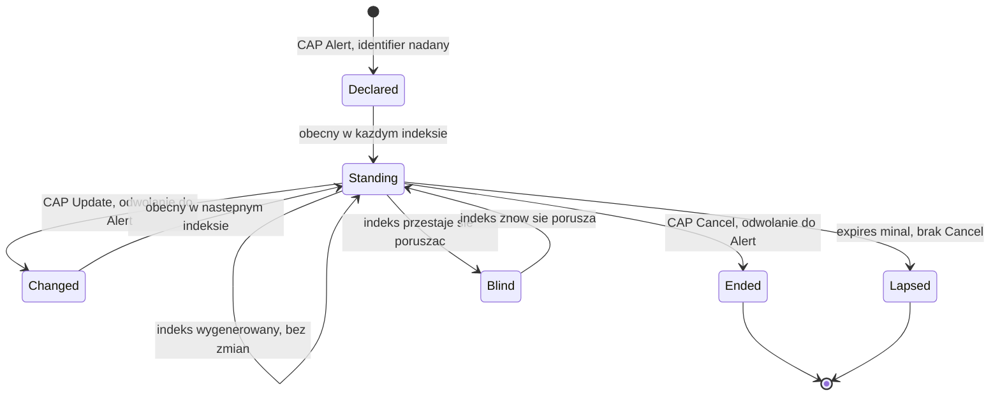

# Jaki powinien być polski kanał komunikatów alarmowych czytelny maszynowo

Version: 3.4 / 2026-09-19
Tę specyfikację piszę jako ktoś, kto próbował zbudować system korzystający z
polskich komunikatów alarmowych. Najpierw nie znalazłem żadnego kanału danych,
a później tylko jego część, dostępną po uzyskaniu tokena. Ukraiński odpowiednik
odbierałem i mierzyłem przez 118 dni. Zbudowanie na nim działającej aplikacji
zajmuje weekend, a parser, który jest jej sercem, powstał w dwa popołudnia.
Przytaczam oba fakty, bo na drugim z nich opiera się dalszy wywód: z
ukraińskiego rozwiązania można korzystać niewielkim kosztem i na tym polega
jego wartość. Dokument uzupełniają [`docs/CHANNEL.md`](CHANNEL.md), gdzie
opisano pomiar będący jego podstawą, oraz zadanie T8a w
[`../TODO.md`](../TODO.md), w którym lukę odnotowano po raz pierwszy. T8a to
przegląd, z którego wyrasta cała argumentacja. Pierwsza ocena konkretnego
źródła, czyli danych RSO, pochodzi z ich odczytu z 22 sierpnia 2026 r. i
została włączona do sekcji 2 oraz 4a. Pozostałych polskich kanałów z sekcji 2
projekt nie badał bezpośrednio. Opisano je na podstawie informacji
publikowanych przez operatorów, a każde zdanie wskazuje, skąd pochodzi zawarta
w nim informacja.

```
Uwaga: ten dokument opisuje kanał danych, który w proponowanej postaci
       jeszcze nie istnieje. Najbliższy polski odpowiednik, dane RSO,
       odczytano i zmierzono 22 sierpnia 2026 r. Sekcja 2 opisuje ten odczyt,
       sekcja 8 zbiera poprawki, które trzeba było wprowadzić do dokumentu,
       a ostatnie punkty sekcji 4a pokazują, czego nauczyło korzystanie
       z tych danych. Każda poprawka jest jawnie oznaczona. Nic z tego nie
       jest oceną niczyich kompetencji i dokument takich ocen nie formułuje.
```

**Jak czytać ten dokument i do kogo jest skierowany.** Składa się z dwóch
części i ma dwóch adresatów. Część I (sekcje 1–9) zawiera argumentację: co
istnieje, czego brakuje, ile kosztowało ustalenie tego oraz dwadzieścia
właściwości, które wyłoniły się podczas budowy systemu odbierającego dane z
kanałów, którym ich brakowało. Jest przeznaczona dla osoby decydującej o tym,
czy taki kanał powinien powstać. Część II (sekcje 10–16) to instrukcja: jak
wygląda on element po elemencie, jak jeden alarm przechodzi przez niego od
pierwszego do ostatniego komunikatu, oraz lista kontrolna, według której
nadawca może sprawdzić projekt, zanim zobaczy go ktokolwiek spoza instytucji.
Tę część napisałem dla inżyniera, któremu powierzono budowę kanału, i zakładam,
że zna on już format CAP, bo operator RSO go stosuje. Komuś, komu się spieszy,
wystarczy zacząć od sekcji 10 i wracać do części I wtedy, gdy potrzebne jest
uzasadnienie którejś reguły z części II; każda z tych reguł wskazuje
właściwość, z której wynika. Obok polskiego wydania, `FEED-SPEC-PL.md`,
istnieje angielskie, `FEED-SPEC.md`. Automatyczna kontrola w tym repozytorium
pilnuje, żeby oba były zgodne sekcja po sekcji i liczba po liczbie, więc nie
mogą rozejść się niezauważenie.


## Spis treści

**Część I. Argumentacja**

1. [Różnica sprowadza się do hasztagu](#1-różnica-sprowadza-się-do-hasztagu)
2. [Co jest dziś dostępne po polskiej stronie](#2-co-jest-dziś-dostępne-po-polskiej-stronie)
3. [Specyfikacja, która w większości nie jest moja](#3-specyfikacja-która-w-większości-nie-jest-moja)
4. [Cisza nie może oznaczać bezpieczeństwa](#4-cisza-nie-może-oznaczać-bezpieczeństwa)
5. [Zarzut i odpowiedź](#5-zarzut-i-odpowiedź)
6. [Czego ten dokument nie postuluje](#6-czego-ten-dokument-nie-postuluje)
7. [Jak z tym dokumentem polemizować](#7-jak-z-tym-dokumentem-polemizować)
8. [Rejestr korekt](#8-rejestr-korekt)
9. [Źródła](#9-źródła)

**Część II. Instrukcja**

10. [Cały feed na jednej stronie](#10-cały-feed-na-jednej-stronie)
11. [Jak jeden alarm przechodzi przez feed](#11-jak-jeden-alarm-przechodzi-przez-feed)
12. [Trzy zegary, jeden format](#12-trzy-zegary-jeden-format)
13. [Kiedy dwa odczyty to ten sam alarm](#13-kiedy-dwa-odczyty-to-ten-sam-alarm)
14. [Gdzie: obszar jako kod rejestru](#14-gdzie-obszar-jako-kod-rejestru)
15. [Udostępnianie i późniejsze zmiany](#15-udostępnianie-i-późniejsze-zmiany)
16. [Lista kontrolna zgodności](#16-lista-kontrolna-zgodności)

---

## 1. Różnica sprowadza się do hasztagu

Poniższe wartości zmierzono na 48 540 wiadomościach z publicznego ukraińskiego
kanału alarmów lotniczych, zebranych przez 99 nocy
([`docs/CHANNEL.md`](CHANNEL.md)):

| Wielkość | Wartość |
| --- | --- |
| Wiadomości, w których podano obszar i rodzaj jednostki | **99,34%** |
| Różne etykiety obszarów w całym okresie | 127 |
| Etykiety, które da się jednoznacznie przypisać do kodu w rejestrze państwowym | 126 automatycznie, 127 po jednej decyzji na podstawie kontekstu |
| Zgodność etykiety z treścią wiadomości | **99,997%** na 38 521 wiadomościach, które dało się porównać |

Etykieta z tabeli to hasztag, na przykład `#Харківський_район`,
`#Львівський_район` albo `#м_Харків_та_Харківська_територіальна_громада`.
Wskazuje on obszar, którego dotyczy wiadomość, i zapisuje się go według stałej
reguły: nazwa w mianowniku, podkreślenia zamiast spacji i pełne określenie
rodzaju jednostki.

**Po stronie ukraińskiej konwencja nie wymagała żadnych nakładów.** Hasztag
jest po prostu częścią treści komunikatu. Dla odbiorców korzyść jest wyraźna:
jedna osoba w dwa popołudnia zbudowała parser, który przypisuje każdemu
obszarowi kod z krajowego rejestru, a w danych, na których go projektowano, nie
popełnił ani jednego błędu. Wystarczyły do tego publiczne wiadomości, bez
osobnego interfejsu, formalności i finansowania.

Tak zapisuje swoje publiczne komunikaty alarmowe państwo, które jest codziennie
atakowane na własnym terytorium. Cała luka techniczna, której dotyczy ten
dokument, sprowadza się właśnie do tego.

## 2. Co jest dziś dostępne po polskiej stronie

Zestawienie nie zawiera ocen, bo dotyczy sposobu udostępniania komunikatów, a
nie instytucji.

| Kanał | Kto go odbiera | Czytelny maszynowo |
| --- | --- | --- |
| Syreny | Osoby w zasięgu słuchu | Nie i z natury rzeczy nie może być |
| Alert RCB (SMS) | Telefony w całym kraju | Nie. To zwykły tekst wysyłany na telefon |
| Dane RSO (XML i JSON) | Każdy, kto znajdzie adres | Tak. Pierwszy odczyt 22 sierpnia 2026 r., od września ten projekt pobiera je cyklicznie; luki opisuje sekcja 4a |
| Zasób CAP w RSO | Posiadacze tokena | Pod względem formatu tak. Token opisuje strona integracyjna operatora; ten projekt nie odczytywał tego zasobu |

Wiersze o RSO wynikają z odczytu danych i z informacji na stronie
integracyjnej, a opis syren i SMS opiera się na materiałach publikowanych przez
ich operatorów. Każde dalsze twierdzenie ma za sobą albo odczyt wykonany przez
ten projekt, albo dokument opublikowany przez odpowiedzialną instytucję.

**Sprostowanie do wcześniejszych wydań, na podstawie pomiaru z 22 sierpnia 2026
r.** Dokument opisywał dotąd dane RSO jako zamknięte. To nieprawda. Usługa, na
której działa aplikacja RSO, publikuje listy komunikatów w XML i JSON
publicznie, bez tokena i bez rejestracji, a jej strona integracyjna mówi o tym
wprost. Ten projekt odczytał te dane w jeden wieczór, a trudno o mocniejszą
podstawę takiej poprawki.

Ten sam wieczór pokazał, dlaczego dane RSO w obecnej postaci nie są jeszcze
kanałem, który opisuje ten dokument. Żaden komunikat nie podaje, czego dotyczy:
istnieje pięć kategorii, ale pojawiają się one wyłącznie w adresie zapytania,
nigdy w samym rekordzie. Nie wiadomo też, kto go wydał, choć do tego samego
źródła trafiają komunikaty dwóch różnych rodzajów organów. Zakres nazwany
„wszystkie” zwraca tylko część rekordów i niczym tego nie sygnalizuje. Historia
szybko się przerzedza, do kilku wpisów tygodniowo w skali całego kraju, więc
tydzień, do którego ten projekt najbardziej potrzebował wrócić, w większości
już zniknął. Każdą z tych obserwacji zmierzono i każda ma osobny punkt na końcu
sekcji 4a.

**Pomiar zamiast założeń, 9 sierpnia 2026 r.** Pobrano i przeszukano pełny
katalog metadanych portalu otwartych danych: 1 510 768 zasobów,
przefiltrowanych według słów alarm, ostrzeżenie, syrena, RCB, ochrona ludności,
zarządzanie kryzysowe i ewakuacja. Kryteria spełniło dwadzieścia dziewięć
zbiorów danych, ale żaden z nich nie jest kanałem aktualizowanym na bieżąco.
Rządowe Centrum Bezpieczeństwa jest obecne w katalogu i publikuje dwa zbiory;
oba zawierają dokumenty i żaden nie jest oznaczony jako dane dynamiczne. IMGW
publikuje ostrzeżenia meteorologiczne, więc ta kategoria trafiła do otwartych
danych. Portal obsługuje dane dynamiczne i rzeczywiście je publikuje:
informacje o jakości powietrza są dostępne przez API i mają takie oznaczenie.
Nie brakuje więc możliwości technicznych ani instytucji, która mogłaby
publikować, tylko tej jednej kategorii danych.

**Jak wyglądają wpisy RCB – według pomiaru.** W tych dwóch zbiorach Rządowe
Centrum Bezpieczeństwa udostępnia cztery zasoby w formatach XML i HTML,
wszystkie na **poziomie otwartości 3**, każdy z częstotliwością aktualizacji
*nie dotyczy*. W świetle standardu nie jest to błąd formatu: XML jest
dopuszczalny na poziomie 3, a HTML odradza się dopiero powyżej niego, więc
wpisy są poprawne. Są to po prostu **dokumenty statyczne**, prawidłowo tak
oznaczone.

Przegląd ich treści z 22 sierpnia 2026 r. pokazuje, że chodzi o Krajowy Plan
Zarządzania Kryzysowego, Narodowy Program Ochrony Infrastruktury Krytycznej
wraz z załącznikiem ze standardami oraz wykaz centrów zarządzania kryzysowego z
danymi kontaktowymi. Są to plany i kontakty, a nie zdarzenia z datą czy alarmy.

Standard zaleca udostępnianie przez API właśnie od poziomu 3, żeby dane dało
się przetwarzać maszynowo. RCB jest więc już na tym progu i na razie publikuje
pliki.

Wniosek jest węższy i trudniejszy do podważenia niż ten, do którego zmierzały
pierwsze wydania. **Luka nie dotyczy kompetencji, formatu ani platformy. Polega
na tym, że komunikatów alarmowych w ogóle nie traktuje się jak danych.** Na
portalu istnieje taka kategoria dla jakości powietrza, razem z dynamicznym API.
Dla alarmów jej nie ma, choć instytucja, która mogłaby za nią odpowiadać, jest
już tam obecna, spełnia standard i publikuje inne zasoby.

Skutki trzeba opisać ostrożniej niż dawniej, bo ten projekt zbudował już system
korzystający z jedynego istniejącego źródła. Nie chodzi o to, że nic nie da się
zbudować, lecz o to, że **komunikatów alarmowych nie ma tam, gdzie państwo
publikuje dane jako dane.** RSO działa poza katalogiem, jako zaplecze
aplikacji: nie ma wpisu, wersji, opisanego schematu ani określonego okresu
przechowywania, a jego struktura może się zmienić bez zapowiedzi. Można na nim
oprzeć badania naukowe, narzędzie dla osób głuchych, ekran informacyjny w
szkole albo pomiar rzeczywistej szybkości systemu, ale każde z tych rozwiązań
odziedziczy wszystkie luki z sekcji 4a i nie będzie miało żadnych gwarancji.

Ten projekt odczuł to bezpośrednio. Ukraińską stronę granicy zmierzono z
dokładnością do rejonu: 118 dni i 61 041 wiadomości. Polska strona ma za sobą
jeden wieczór pomiarów i nie da się jej odtworzyć wstecz. RSO przechowuje
niewiele, a z tygodnia lipcowego uderzenia pocisku manewrującego zostało w nim
kilka rekordów dla całego kraju. Różnica nie wynika z ilości danych, lecz z
tego, czy się je archiwizuje.

Wyszukiwanie w katalogu można powtórzyć: wystarczy pobrać metadane udostępniane
przez portal, rozpakować je i przefiltrować pola opisu. Odpowiednie polecenie
jest w historii repozytorium, a liczby podane wyżej pochodzą z jego wyniku, nie
z przeglądania strony.

**Trzy pytania, na które ten dokument nie umiał odpowiedzieć**; na jedno z nich
jest już połowa odpowiedzi. Czy treść komunikatu CAP zawiera obszar jako kod
TERYT w polu `geocode`, czy tylko jako nazwę albo wielokąt? Czy koniec
zagrożenia jest publikowany jako komunikat `Cancel` lub `Update`, czy wynika
wyłącznie z upływu terminu w polu `expires`? Czy cokolwiek jest publikowane
wtedy, gdy nic się nie dzieje (tego dotyczy sekcja 4)? Dla stron XML drugie
pytanie rozstrzygnęła para komunikatów odczytana 16 września 2026 r.: ani
jedno, ani drugie. Koniec ogłasza osobny komunikat opisowy, który nie wskazuje
żadnego alarmu, a pole `valid_to` samego alarmu obowiązuje do końca dnia
(właściwość dwudziesta). Dla zasobu CAP wszystkie trzy kwestie pozostają
otwarte i wyjaśniłby je dopiero odczyt z użyciem tokena. Taki odczyt przewiduje
zadanie T8a, ale dotąd go nie wykonano.

## 3. Specyfikacja, która w większości nie jest moja

**Cztery z pięciu opisanych niżej właściwości polski standard techniczny dla
danych publicznych już wymaga albo zaleca** (*Standard techniczny* Ministerstwa
Cyfryzacji, określający minimalne wymagania techniczne dla danych publicznych
udostępnianych w Centralnym Repozytorium Informacji Publicznej). Ta sekcja nie
jest więc propozycją, tylko uwagą, że istniejącego standardu nie zastosowano do
jednej kategorii danych.

Piątej właściwości w standardzie rzeczywiście nie ma, a w przypadku komunikatów
alarmowych jest ona najważniejsza. Oznaczam ją jako lukę, a nie jako prośbę.

| Właściwość | Status w standardzie |
| --- | --- |
| Publiczny dostęp bez wniosków | Portal stwierdza, że dane można wykorzystywać ponownie bez składania wniosku |
| Obszar jako kod rejestru, a nie opis | Standard wskazuje TERYT jako rejestr referencyjny i definiuje *adres uniwersalny*, zaznaczając wprost, że ma go odczytywać system, a nie człowiek |
| Zmiany stanu z datą i godziną | Wymagany zapis ISO 8601, `yyyy-mm-ddThh:mm` |
| Wersjonowany schemat udostępniany przez API | Od poziomu otwartości 3 zalecane API i JSON zgodny z RFC 8259 oraz standardem JSON API; poziom 4 wymaga JSON-LD z pełnym kontekstem semantycznym. Istnieje też odrębny Standard API |
| **Sygnał życia** | **Brak.** Zob. sekcja 4 |

Czterech pierwszych wierszy nie muszę uzasadniać. Poniżej wyjaśniam, dlaczego
każda z tych właściwości ma znaczenie dla komunikatów alarmowych, a potem
opisuję lukę.

**Porównanie z RSO z wydania 2.4, z jednym wierszem poprawionym w wydaniu
3.3.** Tabela zestawia tych samych pięć właściwości z jedynym istniejącym
polskim źródłem. `[zmierzone]` oznacza odczyt tego projektu z 22 sierpnia 2026
r., a w trzecim wierszu odczyt z 16 września 2026 r. Słowo *nieustalone*
oznacza kwestie, których te odczyty nie rozstrzygają; sekcja 2 wymienia, co by
je rozstrzygnęło.

| Właściwość | Status w RSO |
| --- | --- |
| Publiczny dostęp bez wniosków | Spełniona przez listy komunikatów w XML i JSON `[zmierzone]`. Niespełniona przez zasób CAP, który według strony integracyjnej operatora wymaga tokena. Tu pozostaje luka |
| Obszar jako kod rejestru, a nie opis | Listy podają województwo jako identyfikator tekstowy i nazwę, bez kodu rejestru `[zmierzone]`. Nieustalone dla CAP, którego pole `geocode` może taki kod zawierać |
| Zmiany stanu z datą i godziną | Częściowo spełniona przez listy: publikowane są oba kierunki, ale koniec ogłasza osobny komunikat opisowy, który nie wskazuje alarmu, pole `valid_to` samego alarmu obowiązuje do końca dnia, a żaden znacznik czasu nie zawiera przesunięcia względem UTC `[zmierzone]`, właściwość dwudziesta. Nieustalone dla CAP, który ma do tego komunikaty `Cancel` i `Update` |
| Wersjonowany schemat udostępniany przez API | W dużej mierze spełniona przez sam CAP, opublikowany i wersjonowany standard; profil RSO, czyli informacja, które elementy opcjonalne są wypełniane, nie został opublikowany |
| **Sygnał życia** | Nieustalone dla RSO. CAP go nie definiuje, więc samo przyjęcie CAP go nie zapewni. Sekcja 4 |

**Pierwsza. Dostęp publiczny, bez uwierzytelniania i bez wniosków.** Kanał
dostępny dopiero po złożeniu wniosku nie jest infrastrukturą publiczną, tylko
usługą udostępnianą za zgodą. Ukraińskie źródło nie wymaga tokena i dlatego
każdy może sam sprawdzić pomiary z tego repozytorium, zamiast przyjmować je na
wiarę.

*W odniesieniu do RSO, wydanie 2.4.* Zasób CAP wymaga tokena, co opisuje strona
integracyjna operatora. Listy w XML i JSON nie mają żadnych ograniczeń dostępu,
więc wymóg zgody obejmuje właśnie ten zasób, który ma ustrukturyzowaną postać.
Nie jest to kwestia schematu i żadne pole tego nie zmieni. Od tej właściwości
zależy, czy gmina może po prostu zbudować własne rozwiązanie, czy musi najpierw
prosić o dostęp.

**Druga. Obszar wskazany kodem rejestru, a nie opisem.** Standard ujmuje to
lepiej, niż ja bym potrafił: wprowadza adres uniwersalny właśnie po to, żeby
miejsce mógł ustalić system, a nie człowiek, i wskazuje TERYT jako rejestr, w
którym znajdują się kody. Jeśli komunikat podaje `powiat biłgorajski` w zwykłym
zdaniu, każdy odbiorca musi napisać własne dopasowywanie nazw, a przy tym łatwo
o subtelne błędy. Ten projekt przekonał się o tym, mierząc: dopasowanie nazw do
rejestru osiągnęło 6,06%, a ustrukturyzowane etykiety samego źródła – 99,34%.

**Trzecia. Zmiany stanu w obu kierunkach, z datą i godziną.** Początek i koniec
alarmu to dwa odrębne zdarzenia i oba mają znaczenie. Jeśli kanał publikuje
tylko początek, każdy odbiorca musi zgadywać, kiedy zagrożenie minęło, a
zgadywanie prowadzi do błędu, którego ten projekt unika wszędzie: stan nieznany
zaczyna wyglądać na bezpieczny.

**Czwarta. Wersjonowany schemat udostępniany przez API.** Standard już teraz
zaleca udostępnianie przez API od poziomu otwartości 3 i sam przestrzega, że
przy danych z poziomu 3 człowiek wciąż musi ustalać, co znaczy każde pole. W
komunikatach alarmowych taka niejednoznaczność kosztuje najwięcej, dlatego
warto dojść do poziomu 4, zamiast poprzestać na opublikowanym pliku.

**Piąta. Sygnał życia.** Standard go nie przewiduje i co do zasady słusznie:
określa, jak sformatować i opisać *zbiór danych*, a to inny problem niż sposób,
w jaki *kanał* sygnalizuje, że działa. DCAT-AP ma pole `accrualPeriodicity`,
ale to deklarowana w metadanych częstotliwość aktualizacji, a nie sygnał w
samych danych. Przy komunikatach alarmowych ta różnica decyduje o wszystkim i
jej właśnie dotyczy sekcja 4.


## 4. Cisza nie może oznaczać bezpieczeństwa

To najważniejsza z opisanych tu właściwości. Jej brak widać dopiero wtedy, gdy
jest najbardziej potrzebna.

Jeśli nadawca publikuje wyłącznie wtedy, gdy coś się dzieje, **niedziałający
kanał i spokojne niebo wyglądają dla odbiorcy tak samo**. Kto przedstawia ciszę
jako brak zdarzeń, przy pierwszej awarii zapewni ludzi, że nic im nie grozi,
akurat w chwili zagrożenia. Nie jest to rozważanie teoretyczne. Na tej zasadzie
opiera się całe to repozytorium: stan nieznany nigdy nie jest pokazywany jako
bezpieczny. Kilka wpisów w rejestrze błędów dotyczy sytuacji, w których sam
projekt tę zasadę naruszył.

Rozwiązanie jest proste, ale trzeba je przewidzieć od początku. Chodzi o
okresowy sygnał życia: wiadomość „stan na godzinę X jest taki”, nadawaną bez
względu na to, czy coś się zmieniło. Jeśli w zadeklarowanym odstępie nic nie
nadejdzie, odbiorca wie, że działa na ślepo, i może to powiedzieć wprost,
zamiast pokazywać spokój.

Kanał alarmowy bez sygnału życia jest więc systemem, którego awarie z założenia
pozostają niezauważone.

**Pomiar pokazał, że jest gorzej, niż zakładało powyższe rozumowanie.** Projekt
uruchomił własny program zbierający dane z ukraińskiego kanału i zostawił go na
noc bez nadzoru. W dwunastogodzinnym zapisie **nie powiodło się jedenaście z
dziewięćdziesięciu pięciu zapytań**, a w dwugodzinnym oknie, zbadanym
najdokładniej, dziewięć z sześćdziesięciu. Zdarzały się też niepowodzenia
następujące po sobie, najwyżej dwa z rzędu. Najdłuższa przerwa między udanymi
odczytami trwała siedem minut, przy progu nieaktualności ustawionym na dziesięć
minut.

Wynik z pierwszej nocy jest bliski ostatecznie ustalonej wartości, ale dojście
do niej wymagało korekty. W jednej z późniejszych wersji oprogramowania
odczytano z innego przedziału czasu znacznie niższy odsetek i przyjęto go jako
obowiązujący. Dopiero porównanie obu pomiarów dało z powrotem mniej więcej jedno
nieudane zapytanie na dziewięć, a tamtą liczbę wycofano jako zaniżoną o dwa
rzędy wielkości (F109 w rejestrze błędów; aktualne dane podają README
repozytorium i `docs/DEPLOYMENT.md`). Trzeba to powiedzieć otwarcie, bo następny
akapit wychodzi z założenia, że częstość niepowodzeń po stronie odbiorcy w ogóle
da się poznać.

Najważniejszy jest jednak nie sam odsetek niepowodzeń, lecz to, że **za każdym z
tych jedenastu razy odbiorca wiedział o problemie**. Kanał publikuje na tyle
regularnie, że brak nowych wiadomości sam jest informacją. Gdyby nadawał
wyłącznie zmiany stanu, wszystkie te przypadki wyglądałyby jak spokojne niebo.
Żadne pomiary po stronie odbiorcy nie pozwoliłyby tego odróżnić z zewnątrz, bez
względu na włożony wysiłek.

Sygnał życia nie jest zatem uprzejmością wobec tych, którzy chcą wiedzieć, czy
kanał działa. Tylko dzięki niemu odbiorca może w ogóle zmierzyć częstość
własnych błędów.

**Drugi pomiar, tym razem u źródła.** Ten fragment dodano w wydaniu 2.3, gdy
opisana tu awaria przestała być hipotezą i zdarzyła się naprawdę. Ukraiński
kanał przestał publikować 29 sierpnia 2026 r. o 4:55 UTC. Nie zawiodło zapytanie
odbiorcy, lecz sam nadawca, który milczał przez całą falę ataków; według
niezależnych relacji trwała ona ponad dobę. Wynikły z tego trzy wnioski. Każdy z
nich dotyczy właściwości opisanej w tej sekcji, a nie tego jednego źródła.

Po pierwsze, **milczenie dało się odczytać**, właśnie z powodu opisanego wyżej.
Jeśli źródło publikuje dostatecznie regularnie, sama przerwa staje się sygnałem.
Przez te godziny strona projektu informowała, że jej obraz sytuacji jest
nieaktualny, i podawała, od kiedy, zamiast sugerować, że nic się nie dzieje.
Przy kanale nadającym wyłącznie zmiany stanu te same trzydzieści cztery godziny
wyglądałyby po stronie odbiorcy jak spokojne niebo i żaden wysiłek nie
pozwoliłby tego rozróżnić.

Po drugie, **nowe źródło ma odwrotną wadę.** Oficjalne API, na które projekt się
przełączył, podaje pełny stan w danej chwili, ale nie mówi, co się skończyło.
Każde odwołanie alarmu trzeba więc wyprowadzić z różnicy między dwoma kolejnymi
odczytami. Jest to bezpieczne tylko wtedy, gdy wiadomo na pewno, że wcześniejszy
z nich rzeczywiście się odbył. W efekcie odbiorca sam buduje sygnał życia,
którego nadawca nie zapewnia: zapisuje każdą obserwację i określa, jak długo
wolno na niej polegać. Po tym czasie przerwa w danych nie upoważnia do żadnych
wniosków. Kanał zaprojektowany z takim sygnałem zwalnia z tej pracy wszystkich,
którzy z niego korzystają. Jeśli go nie ma, każdy musi ją wykonać osobno albo
pogodzić się z tym, że jego awarie przejdą niezauważone.

Po trzecie, **procedura przyznawania dostępu przesądziła o ciągłości pracy.**
Przełączenie zajęło niecałą dobę tylko dlatego, że o klucz do źródła zastępczego
wystąpiono z kilkutygodniowym wyprzedzeniem i otrzymano go, zanim okazał się
potrzebny. Gdyby wniosek złożono dopiero rano w dniu, w którym kanał ucichł,
przez cały czas jego rozpatrywania strona nie miałaby danych. Nie osłabia to
właściwości pierwszej. Jawność decyduje o tym, kto może weryfikować, a sygnał
życia o tym, czy da się stwierdzić, że kanał nadaje. Dzień 29 sierpnia 2026 r.
pokazał, że to dwie różne właściwości: przestało działać właśnie źródło
niewymagające tokena, a jego milczenie było jedyną informacją, jaką odbiorca
mógł wtedy o nim uzyskać.

**Trzeci pomiar, tym razem z zapisów samego odbiorcy.** Fragment dodano w
wydaniu 2.5. Po przerwie, która zaczęła się 29 sierpnia, ukraińskie źródło
wznowiło publikację, ale projekt nie odnotował, kiedy to nastąpiło. To również
jest ustalenie, tyle że o samym projekcie. Kanał ponownie zamilkł 7 września
2026 r. o 6:09 UTC `[zmierzone]`. Tym razem odbiorca potrafił wskazać, która
strona milczy, i opierał się na tym, co sam zarejestrował, a nie na obserwacji
nieba. Rejestr zapytań (właściwość dziewiąta) wykazał 43 nowe numery wpisów w
ciągu 69 minut przed przerwą. Potem, aż do wieczora 8 września 2026 r., w 4463
kolejnych udanych odczytach powtarzał się ten sam numer, a w kontrolnej dobie
wcześniej pojawiły się 592 różne. W tym czasie nie było ani jednej odmowy. Obie
liczby razem opisują sytuację, w której połączenie działa, a nadawca milczy.

Wynikają z tego dwie rzeczy. Po pierwsze, plik stanu publikowany przez projekt
wymienia teraz każde źródło osobno i dla każdego podaje, czy dane napływają i
kiedy przyjęto z niego ostatnie zdarzenie. Czytelnik może się więc dowiedzieć,
że „główne źródło działa, a pomocnicze milczy”, zamiast widzieć sam wiek danych
bez wskazania, skąd pochodzą. Po drugie, o powrocie nadawcy rozstrzyga
identyfikator najnowszego wpisu na stronie kanału, zapisywany w rejestrze
zapytań, a nie pierwsze sklasyfikowane zdarzenie. Kanał, który wraca z treścią
nierozpoznawaną przez klasyfikator, nie wytworzy żadnego nowego wiersza, a
przecież wrócił. W dniu pomiaru projekt wpisał do dwóch własnych dokumentów
błędną metodę sprawdzania, a następnego dnia ją poprawił. Korektę odnotowano
tutaj, ponieważ pomyłka miała dokładnie taką postać, przed jaką ta sekcja
przestrzega nadawców: szukano oznak życia w niewłaściwym miejscu, a ich brak
uznano za ciszę.

**Dlaczego standard tego nie obejmuje i dlaczego nie jest to zarzut wobec
niego.** Określa on, jak formatować, opisywać i licencjonować zbiory danych.
Taki zbiór jest statyczny, strumień zaś trzeba obserwować, żeby wiedzieć, czy
działa. Każdy z nich wymaga innych gwarancji i tylko pierwszy mieści się w jego
zakresie. Pole `accrualPeriodicity` z DCAT-AP deklaruje w metadanych planowaną
częstotliwość aktualizacji. Informuje więc odbiorcę, czego się spodziewać, ale
nic nie mówi o tym, co dzieje się teraz. Dla większości danych publicznych ta
luka nie ma znaczenia. W komunikatach alarmowych oznacza różnicę między spokojną
nocą a systemem, który przestał działać, a z zewnątrz nie da się ich odróżnić.

## 4a. Właściwości wyniesione z praktyki, a nie z założeń

Sekcje 1–4 powstały, zanim w projekcie uruchomiono pierwszego odbiorcę danych.
Działa on od 11 sierpnia 2026 r. i od tego czasu ujawniło się pięć wymagań,
których nie obejmowało pierwotne pięć właściwości. Mają one osobną numerację,
ponieważ są słabiej udokumentowane: każde opiera się na jednym wdrożeniu, a nie
na dużym zbiorze danych.

Kolejne właściwości dochodziły w następnych wydaniach dokumentu. W wydaniu 1.5
pojawiły się dziewiąta i dziesiąta, oparte na doświadczeniach z dwoma dalszymi
interfejsami: jednym udostępnianym na warunkach, które można cofnąć, i drugim z
limitem zapytań. W 1.6 doszła jedenasta, po tym, jak projekt dwukrotnie, i to na
piśmie, wziął pole kategorii za opis zagrożenia. Dwunastą dodano w 1.7, po
zmierzeniu, jak często źródło w ogóle podaje środek ataku. Wynik ogranicza to,
co może pokazać każdy odbiorca takiego kanału, a lepszy parser tego nie zmieni.
Trzynasta i czternasta weszły do wydania 1.8 i wynikają z dwóch usterek
wykrytych jednego dnia we własnym kontrakcie danych. Obie miały ten sam
charakter: nadawca dysponował faktem, z którego odbiorca nie mógł skorzystać.

Piętnasta i siedemnasta, dodane w wydaniu 1.9, jako pierwsze wynikają z
**lektury polskiego, a nie ukraińskiego źródła**. Opierają się na jednym
wieczorze odczytów pojedynczego adresu, więc mają węższy zasięg niż pozostałe,
co zaznaczono tu otwarcie. Szesnasta również pochodzi z 1.9, ale wycofano ją w
wydaniu 2.0. Krótka notatka w jej miejscu wyjaśnia powody, ponieważ jawne
odnotowanie wycofania należy do tej samej rzetelności, jakiej te właściwości
oczekują od nadawcy. Osiemnasta i dziewiętnasta weszły do wydania 2.5. Obie są
skutkiem zmiany, którą 6 września 2026 r. ukraińskie źródło wprowadziło w
trakcie pracy programu zbierającego dane: pierwsza tego, co ta zmiana zepsuła,
druga tego, co dzięki niej zaczęto publikować. Dwudziesta, z wydania 3.3, opiera
się na jednej parze polskich komunikatów odczytanej 16 września 2026 r. Innej
podstawy nie ma.

**Szósta. Jawny limit i znacznik informujący, że zadziałał.** Ta właściwość
wynika z eksploatacji systemu.

Nadawca w tym projekcie ogranicza okno zdarzeń do 5000 pozycji i publikuje
znacznik `truncated`. Budowa odbiorcy pokazała, że potrzebne są oba te elementy.
Bez limitu okno może się rozrosnąć z dowolnego powodu, na przykład przez
rozbieżność zegarów, uzupełnianie danych wstecz albo zmianę schematu, a wtedy
wszyscy czytający dostają naraz nieograniczoną pracę. Pomiar na witrynie
projektu wykazał, że 20 000 zdarzeń wczytanych bez ograniczeń dało stronę o
rozmiarze 5,6 MiB. Bez znacznika skrócona lista i spokojny okres wyglądają tak
samo. To ta sama awaria, którą opisuje sekcja 4, tylko w innej postaci.

**Odbiorca musi też sam ograniczać rozmiar danych** i właśnie tę część łatwo
przeoczyć. Witryna projektu zdała się w tej kwestii na nadawcę i niczego nie
sprawdzała, choć obie aplikacje wdraża się osobno i ręcznie. Limit egzekwowany
wyłącznie po stronie publikującej działa do dnia, w którym ich wersje się
rozejdą.

**Siódma. Początek okna podawany jawnie, a nie wyliczany.** Ta właściwość wynika
z eksploatacji systemu.

Nie wystarczy, że kanał poda „zmiany z ostatnich dwudziestu minut”. Potrzebny
jest znacznik czasu, od którego zaczyna się okno. Bez niego urządzenie uśpione
przez dwadzieścia pięć minut nie odróżni luki w danych od spokojnego okresu,
podobnie jak jego właściciel. Wyliczanie tego momentu z chwili publikacji działa
tylko wtedy, gdy zegar urządzenia zgadza się z czasem nadawcy. A najważniejszy
jest właśnie przypadek, w którym odbiorca przez pewien czas był odłączony.

Nadawcę kosztuje to jedno pole. Odbiorca zyskuje rozróżnienie między „nic się
nie działo” a „coś ci umknęło”. Jest to zasada z sekcji 4, zastosowana tym razem
do czytelnika, a nie do systemu.

**Ósma. Zasady wersjonowania, które mówią, co się dzieje w okresie
przejściowym.** Ta właściwość wynika z eksploatacji systemu, a jej poznanie
kosztowało przerwę podczas wdrożenia.

Czwarta właściwość wymaga wersjonowanego schematu. To warunek konieczny, ale
niewystarczający. Gdy projekt przenosił własny kontrakt danych z v2 na v3, nowa
postać zawierała wszystko, co poprzednia: każde pole wymagane przez odbiorcę
działającego według v2 nadal było obecne. Mimo to odbiorca jej nie przyjął, i
słusznie, bo nie akceptuje wersji, których nie rozpoznaje. Obie części trzeba
było wdrożyć w jednym oknie wdrożeniowym, nadawcę kilka minut wcześniej, a w tym
czasie strona działała na ślepo.

Numer wersji bez określonego okresu przejściowego przerzuca tę koordynację na
każdego użytkownika, a z danych publicznych korzystają także ci, których nadawca
nigdy nie poznał. Reguły powinny więc określać, jak długo pozostaje dostępny
poprzedni schemat, co kończy ten okres i czy odbiorca może uznać za czytelną
nieznaną podwersję. Projekt nie spisał jeszcze własnych zasad; na liście zadań
figuruje to jako niedokończona połowa pracy, która wprowadziła v3. W tym
przypadku brak ten da się przetrwać, bo odbiorca jest tylko jeden i kontroluje
go ten sam autor. Kanał publiczny takiego komfortu nie ma.

**Dziewiąta. Jeśli kanał nie ma sygnału życia, odbiorca musi zapewnić go sobie
sam.** Ta właściwość wynika z eksploatacji systemu, a rozwiązanie wdrożono,
zanim ją opisano.

Piąta właściwość to obowiązek nadawcy. Jeśli kanał jej nie spełnia, odbiorcy nie
zwalnia to z zasady opisanej w sekcji 4. Po jego stronie odpowiednikiem jest
**rejestr zapytań**: trwały zapis każdego zapytania, udanego lub nie,
przechowywany obok otrzymanych wyników.

Jeśli takiego rejestru nie ma, godzina bez żadnych zgłoszeń i taka, w której
proces odbiorcy nie działał, wyglądają w zapisanych danych identycznie, jako
pusty zbiór. Żadna staranność przy wyświetlaniu nie przywróci tej różnicy, bo
nikt nigdy jej nie utrwalił. Z rejestrem da się odróżnić nie dwa, lecz trzy
stany:

| Rejestr zapytań | Zapis obserwacji | Co odbiorca może stwierdzić |
| --- | --- | --- |
| Są zapytania | Są obserwacje | To, co zaobserwowano |
| Są zapytania | Brak | Nic nie zgłoszono, a odbiorca obserwował źródło |
| Brak zapytań | Brak | Odbiorca nie obserwował źródła. Stan nieznany |

**Nieudane zapytanie zapisuje się jako próbę bez wyniku, a nie jako taką, która
zwróciła zero.** Schemat musi przewidywać dla obu przypadków odmienną
reprezentację, inaczej rozróżnienie zniknie przy pierwszym przekroczeniu czasu
oczekiwania. W module projektu, który zbiera dane ADS-B, liczba wyników przy
niepowodzeniu ma wartość null, a przy pustej odpowiedzi wynosi zero. Test
regresyjny korzysta z danych, na których te przypadki się różnią. Właśnie przy
pracy z tym modułem projekt poznał tę właściwość i dlatego pojawia się ona
dopiero w wydaniu 1.5.

Spośród dziesięciu właściwości ta ma najszersze zastosowanie. Wymaga jednej
tabeli i powinien ją mieć każdy, kto korzysta z kanału bez sygnału życia,
łącznie z tym projektem.

**Dziesiąta. Jawny limit dostępu, a jeśli go nie ma, wyraźna informacja o tym.**
Ta właściwość wynika z eksploatacji systemu.

Jeśli kanał ogranicza dostęp, **kompletność** zebranych danych zależy od
przydziału. Odbiorca, który odpytuje źródło według harmonogramu w ramach
dziennej puli zapytań, albo wie, ile mu jeszcze zostało, albo nie. W pierwszym
przypadku może rzetelnie podać, jak gęsto próbkował i od kiedy przestał. W
drugim sam nie ma pewności, czy niczego mu nie brakuje, a żadnej luki w zapisie
nie da się przypisać konkretnej przyczynie. Awaria po stronie nadawcy, kłopot z
siecią i limit, który skończył się o czwartej po południu, to trzy różne
ustalenia, a wyglądają identycznie.

Opublikowanie limitu i podawanie pozostałej puli w nagłówku odpowiedzi kosztuje
niewiele, a pozwala ustalić przyczynę każdej luki.

Warunek jest spełniony również wtedy, gdy żadnego ograniczenia nie ma i nadawca
to zaznacza. Zdanie „bez limitów i spowalniania, pobieraj dane tak często, jak
to przydatne” jest odpowiedzią wyczerpującą. Ukraiński kanał daje ją w praktyce,
bo nie stosuje żadnych barier. Nie spełnia go natomiast limit, który istnieje,
ale nie został ogłoszony, bo odbiorca dowiaduje się o nim dopiero wtedy, gdy
zostaje odcięty.

**Uwaga do właściwości pierwszej, wynikająca z tych samych doświadczeń.** Sekcja
3 wskazuje, że kanał dostępny dopiero po złożeniu wniosku jest usługą
udostępnianą za zgodą, a nie infrastrukturą publiczną. Projekt korzystał od tego
czasu z usługi tego drugiego rodzaju, na warunkach, które można cofnąć bez
podania przyczyny. Okazało się to bardziej kosztowne, niż sugerowało pierwotne
sformułowanie: **powtarzalność pomiaru zależy wtedy od interfejsu, a nie od
staranności odbiorcy.** Osoba trzecia nie odtworzy ustalenia opartego na umowie,
której nie jest stroną i której może nie uzyskać. Wyniki dotyczące ukraińskiego
kanału z sekcji 1 może sprawdzić każdy. Te, które wymagają interfejsu z kluczem,
zweryfikuje tylko jego posiadacz.

**Jedenasta. Kategoria musi mówić, czego nie rozróżnia.** Ta właściwość wynika z
eksploatacji systemu, a dokładniej z własnego błędu projektu.

Gdy kanał przypisuje alarmowi kategorię, każdy odbiorca ma pokusę, by
potraktować ją jak opis zagrożenia. Zwykle nim nie jest, a z samego pola nie da
się tego wyczytać.

Oto konkretny przykład. Źródło, z którego korzystają ukraińskie aplikacje
alarmowe, publikuje pięć kategorii: alarm lotniczy, ostrzał artyleryjski, walki
uliczne, zagrożenie chemiczne i radiacyjne. Odczytując `AIR`, odbiorca dowiaduje
się, że ogłoszono alarm z powodu czegoś w powietrzu. **Nie** wie jednak, czy to
dron, bomba szybująca, pocisk manewrujący lub balistyczny, start samolotu
MiG-31K, czy atak od strony morza. Wszystkie te przypadki mają oznaczenie `AIR`.
Na pytanie zadawane najczęściej, czyli co nadlatuje, to pole właśnie nie
odpowiada, a ani ono, ani jego nazwa, ani dokumentacja tego nie sygnalizują.

Projekt dwa razy włożył pracę w założenie, że kategoria rozstrzyga tę kwestię.
Najpierw planował uzupełnić lukę we własnej klasyfikacji danymi z tego pola,
potem powtórzył je w pisemnej rekomendacji, zanim ktokolwiek sprawdził, co
oznaczają poszczególne wartości. W obu przypadkach pole wyglądało na odpowiedź,
bo kategoria i rodzaj zagrożenia mają tę samą postać: krótką listę wartości
przypisaną do alarmu. Nic ich od siebie nie odróżniało.

**Od nadawcy wystarczy tu jedno zdanie na kategorię, a nie cała taksonomia.** Na
przykład: „Alarm lotniczy: każde zagrożenie z powietrza, także ze strony
środków, których ten kanał nie rozróżnia”. Jego napisanie nic nie kosztuje, a
eliminuje całą klasę błędów, przed którymi odbiorca nie ustrzeże się żadną
starannością, bo nie widzi, co to oznaczenie w sobie łączy.

**Obowiązek odbiorcy jest trudniejszy.** Kategorii nigdy nie wolno przedstawiać
jako zamkniętego zbioru rodzajów, które może obejmować. Pokusa jest silna i
wygląda na życzliwość: projekt był bliski narysowania trzech ikon, drona, bomby
szybującej i pocisku, obok alarmu, którego rodzaju nigdy nie podano, żeby było
widać, czym może on być. Taki zestaw mówi jednak: **„jedno z tych trzech”**.
Źródło niczego takiego nie stwierdziło, a `AIR` tego nie oznacza. Narysowane
ikony byłyby przewidywaniem w formie grafiki, czyli tym samym błędem co strzałka
pokazująca kierunek, którego kanał nigdy nie opublikował.

Tekst może wyrazić zbiór otwarty, bo ma do dyspozycji słowa „albo coś innego”.
Rząd symboli nie ma takiej możliwości i żaden układ jej nie da. Jeśli odbiorca
chce pokazać graficznie alarm bez podanego rodzaju, uczciwą formą jest **jeden
symbol, który czyta się jak ogólne oznaczenie, a nie wyliczenie**, z dopiskiem
obok, który słowami zaznacza, że możliwości jest więcej. Tak zrobił ten projekt.
Uzasadnienie znajduje się w rejestrze błędów jego strony, a nie tutaj, bo to
decyzja odbiorcy; do specyfikacji należy właściwość, która ją wymusiła.

**Dwunasta. Górna granica klasyfikacji należy do specyfikacji, bo jest cechą
źródła, a nie sposobu odczytu.** Ta właściwość wynika z eksploatacji systemu.

Spośród 61 041 wiadomości z 118 dni stan alarmu zawierało 52 589, a informację o
środku ataku – 7428. Osiem rdzeni wyrazowych wystarcza do rozpoznania 98,3% tych
drugich. Pozostają 122 wpisy, czyli 0,2% korpusu, a ich lektura pokazuje, że są
to odwołania z listą obszarów, gdzie zagrożenie trwa nadal. Nie wymieniają
środka ataku, bo w tej sytuacji żaden nie występuje. Odsetek alarmów, do których
udaje się dopasować taką informację, wynosi w całym korpusie **0,187** i nie
zależy od szerokości okna łączenia: zarówno przy 1 godzinie, jak i przy 24
godzinach wynik jest ten sam, 0,187. Parametr, który miał o tym decydować, nie
ma więc żadnego wpływu.

Ważne jest to, co z tej liczby wynika. **Mniej więcej cztery alarmy na pięć nie
będą miały podanego rodzaju i żaden parser tego nie zmieni**, bo źródło o tym
milczy. Projekt doszedł do tego wniosku kosztowną drogą. Na podstawie ogólnej
wiedzy o wojnie przygotowano listę dodatkowych określeń, które mogłyby się
pojawiać: oznaczenia konkretnych pocisków, samoloty nosiciele, sformułowania o
starcie, kierunek i liczbę. Następnie sprawdzono ją na korpusie. Żadne z nich
nie wystąpiło. Spośród dwudziestu pięciu kandydatów pojawiły się tylko dwa, w
sumie ośmiokrotnie. Lista nie była nawet częściowo trafna. Opisywała, jak
relacjonuje się tę wojnę gdzie indziej, i została wzięta za opis języka tego
kanału.

Dla specyfikacji wynikają z tego dwa wnioski.

**Dla nadawcy.** Jeśli kanał może podawać rodzaj zagrożenia, powinien też
publikować, jak często rzeczywiście to robi, w postaci zmierzonego odsetka, a
nie zapewnienia. Pole wypełniane raz na pięć przypadków nie jest wadliwe.
Odbiorca, który odkryje to dopiero na podstawie własnego ruchu, zdąży jednak
zbudować interfejs wokół błędnego oczekiwania. Opublikowanie tej liczby wymaga
jednej linijki, a odróżnia pole, które może być puste, od takiego, które
zazwyczaj nic nie zawiera.

**Dla odbiorcy.** Alarm bez podanego rodzaju to przypadek *typowy* i tak trzeba
go projektować, a nie obsługiwać jako wyjątek. Sformułowanie „źródło tego nie
podało” nie jest więc wariantem awaryjnym, tylko kluczowym tekstem interfejsu,
który czytelnik zobaczy częściej niż nazwę jakiegokolwiek środka ataku. Wynika z
tego również, że chęć pokazania większej liczby szczegółów to kwestia
**źródeł**, a nie parsowania: skoro granicę wyznacza to, co publikuje kanał,
przekroczyć ją można tylko dzięki innemu kanałowi, ze wszystkimi kosztami w
postaci zależności, warunków korzystania i ochrony prywatności. Lepsza analiza
tych samych danych nie wydobędzie z nich tego, czego nie zawierają.

**Trzynasta. Pusta wartość ma jedno znaczenie, a jeśli brak danych oznacza coś
jeszcze, potrzebne jest drugie pole.** Ta właściwość wynika z eksploatacji
systemu.

Kanał tego projektu podaje dla każdego obwodu pole `last_alert_ended_at`,
liczone w oknie obejmującym ostatnie dni. Pusta wartość oznacza tam, że *w tym
oknie nie zakończył się żaden alarm*. Co innego znaczy sytuacja, w której
*obwodu w ogóle nie policzono*, a samo to pole nie pozwala ich rozróżnić.
Tymczasem odbiorca musi znać oba fakty, żeby napisać zgodne z prawdą zdanie. W
pierwszym przypadku informuje, że w tym okresie żaden alarm się nie zakończył, w
drugim milczy, a odróżnia je wyłącznie dzięki sąsiedniej wartości, czyli
licznikowi. To działa, ale przypadkiem. Schemat nigdzie tego nie określał, a
odbiorca kierujący się samym znacznikiem czasu napisałby nieprawdę i nie miałby
jak tego zauważyć.

Znaczenie pustej wartości trzeba więc opisać słownie, osobno dla każdego pola.
Jeśli jego nieobecność znaczy co innego niż wartość null, należy wskazać, gdzie
zapisano tę drugą informację. W przeciwnym razie dzieje się to, co tutaj:
implementacja okazała się poprawna, ale równie dobrze mogła być błędna, a
kontrakt w żaden sposób tego nie rozstrzygał.

**Wynika z tego jeszcze jedno: pole, którego nikt nie czyta, to nieprzetestowana
część kontraktu.** Tak było z `last_alert_ended_at`. Trafiało ono do każdej
odpowiedzi od dnia, w którym kanał zaczął podawać liczby alarmów z ostatnich
dni, a mimo to kod odbiorcy ani razu z niego nie skorzystał. Nie był to błąd
żadnej ze stron. Dane były gotowe, tylko witryna, dla której je przygotowano,
nigdy ich nie pokazała. Dotychczasowy test sprawdzał obecność elementów
*potrzebnych* odbiorcy, a o tych, które nadawca wysyła na próżno, nie mówił nic.
Warto kontrolować oba kierunki, a drugi to kwestia prostego skryptu. Przegląda
on całą odpowiedź i pilnuje, żeby każdy klucz był albo odczytywany, albo wpisany
na listę dopuszczonych wyjątków z podaniem powodu.

**Czternasta. Każda liczba ma obok swój mianownik w osobnym polu.** Ta
właściwość wynika z eksploatacji systemu.

Ten sam kanał publikuje liczbę alarmów z ostatnich dni, a w polu `window_days`
długość tego okresu. To właściwe rozwiązanie. Jego sens widać po tym, co się
stało, gdy odbiorca potrzebował obu wartości. Przez dwie wersje oprogramowania
licznik występował na stronie wyłącznie w treści zdania. Interfejs, który jako
pierwszy chciałby z niego skorzystać, musiałby więc analizować to zdanie.
Ponieważ ten sam tekst podaje też długość okna, najprostszy sposób odczytu dałby
błędny wynik.

Ta zasada wykracza poza ten jeden kanał. Każda wartość zbiorcza, na przykład
liczba, wskaźnik czy maksimum, traci sens bez przedziału, z którego ją
policzono. Należy go podawać jako osobne pole w danych, a nie jako część
etykiety. Proza jest przeznaczona dla ludzi. Program, który musi wyłuskiwać
liczby z tekstu, prędzej czy później trafi na niewłaściwą.

**Piętnasta. Kategoria musi być zapisana w samym rekordzie, inaczej dla odbiorcy
nie istnieje.** Ta właściwość wynika z odczytu danych RSO z 22 sierpnia 2026 r.

Polskie dane RSO są podzielone na pięć kategorii. Kategorie są rzeczywiste:
rozdzielają zbiór, występują w adresie zapytania, a dokumentacja operatora
wymienia ich identyfikatory w osobnym punkcie interfejsu. **W samym komunikacie
nie ma jednak żadnej z nich.** Spośród 156 wiadomości zwracanych w zakresie
„wszystkie” żadna nie zawierała pola kategorii: `type` występuje w każdej ze
156, ale zawsze jest puste, podobnie jak `rso_icon`. Odbiorca może ustalić,
czego dotyczy dany wiersz, tylko pamiętając, skąd go pobrał.

Podobnie jest z informacją o nadawcy. Od kwietnia 2024 r. w RSO publikuje także
Rządowe Centrum Bezpieczeństwa. Według udostępnionego opisu systemu odpowiada
ono, obok ministerstwa, za wiadomości ogólnokrajowe, a pozostałe przygotowują
wojewódzkie centra zarządzania kryzysowego. Ten podział pochodzi z informacji,
które operator podaje o systemie, a nie z pomiarów projektu. **Żadne pole nie
wskazuje jednak autora komunikatu.** Odbiorca, który chciałby przy ostrzeżeniu
podać wydającą je instytucję, nie może tego zrobić, a jeśli cały blok podpisze
jedną nazwą, w większości przypadków poda błędną informację.

Nie chodzi o rozbudowaną taksonomię. System przypisuje komunikatom kategorie,
rozdziela je według nich i publikuje odpowiedni słownik jako osobny dokument.
Informacji tej brakuje tylko tam, gdzie jej dodanie nic by nie kosztowało, czyli
w samym rekordzie. Wystarczyłoby jedno pole na wiadomość, wypełniane wartością z
listy, która już istnieje.

**Ile dokładnie płaci za to odbiorca.** Pięć zapytań zamiast jednego,
prowadzenie ewidencji, z którego z nich pochodzi dany wiersz, oraz pewność, że
każdy, kto o tym nie wie, błędnie oznaczy wszystkie dane, nie zdając sobie z
tego sprawy. Obejście istnieje, ale nie przemawia to przeciwko dodaniu pola.
Pokazuje raczej, jaką cenę ma jego brak, pomnożoną przez liczbę wszystkich
korzystających.

**Najważniejszej kategorii nie ma przy tym wśród tych pięciu.** Ostrzeżenie o
ataku powietrznym, które projekt odczytał 16 września 2026 r., trafiło do grupy
`ogolne`, czyli ogólnej. Publikuje się w niej także ogłoszenia dla mieszkańców,
więc odbiorca rysujący mapę zagrożeń z powietrza musi rozstrzygać na podstawie
treści każdego komunikatu. Projekt robi to za pomocą dwóch list: dziesięć
określeń oznacza, że wiadomość dotyczy alarmu lotniczego, a dwanaście wyklucza
ją z mapy, nawet jeśli pasuje któreś z pierwszej grupy. Wykluczenie ma
pierwszeństwo, bo w zapowiedzi próby syren też pojawiają się słowa *alarm
powietrzny*. Każde z tych słów to założenie co do brzmienia kolejnych tekstów.
Wiadomość sformułowana inaczej zostanie pominięta albo źle odczytana, a żadna ze
stron nie dostanie o tym sygnału. Właściwość dwudziesta pokazuje, jaki był tego
skutek przy parze z 16 września: odwołanie również mówi o zagrożeniu z
powietrza.

**Szesnasta. Wycofana w wydaniu 2.0.**

W wydaniu 1.9 ten punkt zawierał prośbę do nadawców o podanie, w jakich wersjach
protokołu IP odpowiadają ich serwery. Pomiar, na którym się opierał, był
rzetelny: polskie serwisy państwowe odczytane tamtego wieczoru nie publikują
adresów IPv6, a wszystkie źródła używane przez projekt podają adresy obu
rodzajów. Awarię, która skłoniła do jego dodania, spowodowała jednak sieć samego
projektu, skonfigurowana tylko pod usługi, z którymi miała się łączyć.
Specyfikacja skierowana do nadawców nie jest miejscem na lekcję z konfiguracji
po stronie odbiorcy. Dokument o takim zasięgu nie powinien też stawiać swojego
najsłabszego twierdzenia na równi z najmocniejszymi.

Z tego punktu zachowała się tylko część dotycząca odbiorcy, zapisana w rejestrze
błędów repozytorium, a nie tutaj: rozwiązanie nazwy domeny nie oznacza jeszcze,
że serwer odpowiada, a w dzienniku zdarzeń oba przypadki wyglądają tak samo.

**Siedemnasta. Parametr, którego serwer nie obsługuje, powinien zostać
odrzucony, a nie przyjęty.** Ta właściwość wynika z odczytu danych RSO z 22
sierpnia 2026 r. i łączy trzy ustalenia tego samego rodzaju.

W ciągu jednego wieczoru odczytów źródło RSO w trzech sytuacjach zwróciło
niepełną odpowiedź, która wyglądała na pełną:

- **Zakres „wszystkie” obejmuje tylko część danych.** Pięć kategorii zawiera
  łącznie 461 różnych komunikatów, bez powtórzeń między nimi. Zakres `wszystkie`
  zwraca 156 z nich. Pozostałe 305 pochodzi z jednej kategorii, a ani treść
  odpowiedzi, ani blok stronicowania, ani strona integracyjna nie informują o
  tym wyłączeniu. Program, który korzysta z najbardziej oczywistego adresu,
  pobiera więc jedną trzecią zbioru i nie ma żadnego sygnału, że czegoś brakuje.
  Wyłączenie może być zamierzone, bo nawigacja serwisu pokazuje stany wód w
  osobnej zakładce. Jeśli tak jest, wystarczyłoby to zaznaczyć: zakres nadal
  nazywa się *wszystkie*, a wyłączona kategoria jest dopuszczalną wartością tego
  samego parametru. Nic, co odbiorca może odczytać, nie wskazuje, że jest
  inaczej.
- **Pole, którego nazwa wskazuje na sumę, podaje liczbę pozycji na stronie.**
  Atrybut stronicowania nazywa się `totalItems`. Na stronie 1 ma wartość 20, na
  stronie 2 także 20, a w zapytaniu bez podziału na strony, obejmującym te same
  dane, 156. Odbiorca, który na tej podstawie wylicza liczbę stron, dzieli 20
  przez 20 i kończy po pierwszej z ośmiu. Skuteczny warunek zakończenia to pusta
  strona, którą serwer zwraca ze statusem 200.
- **Parametry dat są przyjmowane, lecz pomijane.** Strona integracyjna operatora
  opisuje `from` i `to` dla swojej wyszukiwarki. Po przekazaniu ich z oknem
  siedmiodniowym do adresu zwracającego dane w formacie XML serwer przyjął je
  bez zastrzeżeń: odpowiedź miała status 200 i zawierała 150 rekordów z siedmiu
  miesięcy, z których w tym przedziale mieściło się dziesięć. Odbiorca, który
  zlicza wiersze, widzi wiarygodną wartość i uznaje, że filtr działa.

Trzeciemu przypadkowi najłatwiej zapobiec. **Nierozpoznany parametr powinien
skutkować kodem 400, a nie 200.** Jeśli serwer go po cichu pomija, pomyłka
odbiorcy zamienia się w jego fałszywe przekonanie, które przetrwa każdą dostępną
mu kontrolę: zapytanie się powiodło, dane dały się odczytać, a liczba rekordów
wyglądała rozsądnie.

Ogólna zasada brzmi więc: **jeśli zapytanie może zostać zrealizowane częściowo,
odpowiedź musi o tym informować.** Wystarczy znacznik, status albo powtórzenie
parametrów, które faktycznie zastosowano. Każde z tych rozwiązań to jedno pole.
Jeśli nie ma żadnego z nich, każdy odbiorca takiego interfejsu może na podstawie
wiarygodnej z pozoru liczby dojść do błędnego wniosku i tego nie zauważyć.
Wynik, który tylko wygląda na poprawny, z samej konstrukcji nie różni się wtedy
od prawidłowego.

To zasada z sekcji 4, przeniesiona z treści danych na protokół ich
udostępniania. Tam chodziło o to, by cisza nie oznaczała bezpieczeństwa, tu o
to, by **niepełna odpowiedź nie wyglądała na pełną.**

**Osiemnasta. Pole, którego znaczenie się zmienia, dostaje nową nazwę, a
odbiorca liczy klucze, których nie rozpoznaje.** Ta właściwość wynika z odczytu
ukraińskiego API z 8 września 2026 r., dwa dni po zmianie wprowadzonej w trakcie
pracy programu zbierającego dane `[zmierzone]`.

Od 6 września 2026 r. API dołącza do każdego alarmu listę wpisów o poziomie
zagrożenia. Odpowiadają one dwustopniowej skali, którą wprowadziła uchwała rządu
Ukrainy nr 1092 z 4 września 2026 r. Każda zmiana poziomu przesuwa przy tym
istniejący znacznik czasu `lastUpdate`. Moduł odczytu od przełączenia na to API
traktował `lastUpdate` jako początek alarmu, i do tamtej pory słusznie, bo nic
go nie zmieniało w trakcie trwania. Pomiar z 8 września: w jednym mieście poziom
żółty ogłoszono o 17:22:35, czerwony o 18:01:01, a `lastUpdate` wskazywał
18:01:00. W jednej odpowiedzi siedem alarmów miało datę eskalacji zamiast daty
początku i żaden test tego nie wykrył, bo każdy sprawdzał tylko znane sobie
klucze.

Wniosek ma dwie części. Nadawca, zmieniając znaczenie pola, powinien wprowadzić
nowe pole, podnieść wersję rekordu albo zrobić jedno i drugie; kosztuje go to
jedną nową nazwę. Drugą stroną tej reguły jest zasada, którą projekt stosuje
wobec siebie: przy zmianie nazwy każde miejsce w kodzie zachowuje dawny sposób
odczytu przez dwie podwersje. Odbiorcy potrzebny jest czujnik. Klucze rekordu,
których parser nie rozpoznaje, są liczone przy każdym zapytaniu, wypisywane w
podsumowaniu i zapisywane razem z wierszem w rejestrze. Dzięki temu kolejny
niezapowiedziany klucz widać w dniu, w którym się pojawi, a nie wtedy, gdy ktoś
przypadkiem przejrzy odpowiedź ręcznie. Obie części wymagają niewielkiego
nakładu, a dwa dni, które upłynęły od zmiany do jej wykrycia, okazały się
znacznie droższe.

**Dziewiętnasta. Poziom zagrożenia to słowo nadawcy: ma własny znacznik czasu,
towarzyszy stanowi alarmu i nigdy nie wchodzi w skład jego tożsamości.** Ta
właściwość wynika z tej samej zmiany, rozpatrzonej pod kątem tego, co dzięki
niej opublikowano, a nie tego, co zepsuła
`[zmierzone: jedna utrwalona odpowiedź z czterdziestoma alarmami i wiersze zapisane później]`.

Wpisy o poziomie tworzą listę przypisaną do alarmu, a ich kolejność nie
odzwierciedla czasu. Każdy zawiera stopień, uzasadnienie w postaci wolnego
tekstu oraz chwilę utworzenia; tekst ten mniej więcej równie często tylko
powtarza stopień w nawiasie, co wnosi coś nowego. Poziom zmienia się w obrębie
tego samego alarmu, bez zdarzenia kończącego i bez tworzenia nowego. Sześć z
czterdziestu alarmów miało oznaczenie `Red` z datą między 2022 r. a sierpniem
2026 r., bez żadnej innej wskazówki co do wieku.

Wynikają z tego cztery zasady dotyczące pola poziomu zagrożenia, które nadawca
może przyjąć wprost:

- **Słowo jest publikowane dosłownie, a słownik pozostaje otwarty.** Odbiorca
  przejmuje napis nadawcy bez zmian, a wartość, której nie rozpoznaje, traktuje
  jako nieustaloną, nigdy jako najbliższy kolor z własnej palety. To zasada z
  właściwości jedenastej, zastosowana do kolejnego pola.
- **Każdy wpis o poziomie zawiera chwilę jego ogłoszenia.** Poziom bez znacznika
  czasu to kolor nieznanego wieku. Sześć starych wpisów `Red` pokazuje, czym to
  grozi: odbiorca, który je narysuje, pokaże zagrożenie ogłoszone w pierwszym
  roku wojny tak, jakby dotyczyło bieżącej nocy.
- **Uzasadnienie pozostaje osobnym polem.** Tekst objaśniający poziom nie jest
  poziomem, a kto próbuje wydobyć jedno z drugiego, dostanie mieszankę obu.
- **Eskalacja nie jest nowym alarmem.** O tożsamości epizodu decyduje alarm.
  Odbiorca, który do klucza wierszy włącza także poziom, przy każdej takiej
  zmianie tworzy fikcyjny rekord; w opisanej wyżej odpowiedzi byłoby ich siedem.
  Poziom jest atrybutem wiersza i odczytuje się go ponownie. Sam wiersz
  odpowiada alarmowi, który pozostał sobą, choć zmienił kolor.

Jest też część dotycząca odbiorcy, którą projekt stosuje wobec siebie: **poziom
zagrożenia najpierw się zbiera, a dopiero potem pokazuje.** Zasady tego, co
zobaczy czytelnik, formułuje się na podstawie zgromadzonych wierszy, a nie
jednej utrwalonej odpowiedzi, bo reguła oparta na założonej postaci danych to
dokładnie ta klasa błędów, którą opisuje poprzednia właściwość. Do tego czasu
strona zapowiada, że poziom wkrótce się pojawi, i wskazuje, kto będzie go
ustalał.

**Dwudziesta. Odwołanie wskazuje w osobnym polu alarm, którego dotyczy, a data
ważności rzeczywiście wyznacza koniec.** Ta właściwość wynika z odczytu danych
RSO z 16 września 2026 r.
`[zmierzone: jedna para komunikatów, pobrana przez serwer strony tego projektu]`.

Tamtego ranka o 7:05 w kategorii `ogolne` pojawił się komunikat zatytułowany
*Alert RCB*, o identyfikatorze 23337896, dotyczący rosyjskiego ataku
powietrznego na Ukrainę. O 7:36 nadszedł drugi, o numerze 23337898 i tytule
*ALERT RCB- ODWOŁANIE ZAGROŻENIA*. Oba miały w polu `valid_to` godzinę 23:59
tego samego dnia. Odwołanie jest osobnym komunikatem. Nie wskazuje
identyfikatora alarmu, który kończy, a żaden z rekordów nie łączy ich ze sobą.
To, że drugi dotyczy końca pierwszego, człowiek odczytuje z tytułu i z treści.

Wniosek znowu ma dwie części. Po stronie nadawcy: **odwołanie musi wskazywać
alarm, którego dotyczy.** CAP ma do tego gotową formę: `Cancel` z elementem
`references`, w którym podaje się identyfikator odwoływanego `Alert` (sekcja
10.1); po jego otrzymaniu indeks z sekcji 10.2 usuwa alarm. Pole ważności,
którego nadawca nie używa do kończenia zagrożeń, może wprowadzać w błąd bardziej
niż jego brak, bo wygląda na odpowiedź. Odbiorca, który uzna `valid_to` za
chwilę zakończenia, pokaże województwa objęte tym ostrzeżeniem jako zagrożone od
7:36 do 23:59. Dokładnie tak postępował ten projekt w wersji 0.55.0.0, której
nigdy nie zainstalowano; dopiero 0.55.1.0 zaczęła łączyć oba komunikaty w parę
(F169, D-055).

Po stronie odbiorcy: skoro nie ma odnośnika, odwołanie trzeba powiązać z alarmem
na podstawie tego, co jest dostępne, czyli województw wymienionych w obu
wiadomościach i kolejności, w jakiej nadeszły. Reguła łączenia wyprowadzona z
jednej pary opisuje tylko ten przypadek, dopóki tydzień zapisanych wierszy nie
pokaże czegoś innego. Dlatego projekt zachowuje każdy odczytany komunikat, a nie
tylko te, które sklasyfikował.

## 5. Zarzut i odpowiedź

**„Publiczny kanał alarmowy ułatwi przeciwnikowi mierzenie naszej reakcji”.**

Ten zarzut zasługuje na rzeczowe potraktowanie, a nie na zbycie, i da się na
niego odpowiedzieć.

Ukraina publikuje znacznie mniej, niż postuluje sekcja 3: ma publiczny kanał z
konwencją nazewniczą, ale bez kodów rejestru, bez schematu i bez sygnału życia.
Tak jest przez całą wojnę, mimo codziennych ataków przeciwnika. Tam zarzut ma
największą siłę, a odpowiedź na niego jest sprawdzana w praktyce, nie w
dyskusji.

W Polsce to, czy trwa alarm, może już dziś stwierdzić każdy, kto ma słuch, okno
albo telefon. Syreny słychać, Alert RCB wysyłany na podstawie ustawy dociera do
abonentów w całym kraju, a oba sygnały stają się publiczne w chwili nadania.
Tym, czego brakuje, nie jest więc informacja, lecz **jej format**.

Format nieczytelny dla maszyn nie chroni przed obserwacją celów ataku. Wyklucza
natomiast obywateli, badaczy, gminy i narzędzia wspierające dostępność z
korzystania z informacji, które już opublikowano. Przeciwnika, który ma
odbiornik, telefon albo kogoś na miejscu, w ogóle to nie dotyczy.

Jeśli jakieś konkretne pole rzeczywiście niesie ryzyko, należy je wyłączyć z
kanału i jawnie to zapisać; do tego właśnie służy specyfikacja. Nie jest to
jednak argument przeciwko publikowaniu pozostałych danych.

## 6. Czego ten dokument nie postuluje

- **Nie o nowy system.** RSO istnieje, jest prowadzone, a jego strona
  integracyjna dokumentuje zasób CAP. Prośba dotyczy tego, które kategorie
  niesie i kto może czytać postać ustrukturyzowaną.
- **Nie o nową ustawę.** Ustawa z 5 grudnia 2024 o ochronie ludności i
  obronie cywilnej przewiduje ostrzeganie publiczne szybką transmisją
  cyfrową; sekcja 9 zapisuje, że jej opublikowane brzmienie nie zostało
  odczytane na tle tego twierdzenia.
- **Nie o zmianę tego, kto decyduje.** Państwo decyduje, czym jest alarm i
  kiedy go ogłosić. To dotyczy formatu, w jakim już podjęta decyzja jest
  publikowana.
- **Nie o nowy system wykrywania, czujnik ani pozycję w budżecie.** Informacja
  istnieje w chwili, gdy odzywa się syrena.
- **Nie o obowiązek konsumowania go przez kogokolwiek.** Feed, którego nikt nie
  czyta, nic nie kosztuje; feed, który nie istnieje, kosztuje każdego
  potencjalnego czytelnika.
- **Nie o zastąpienie czegokolwiek.** Syreny pozostaną najszybszym kanałem do
  śpiącego człowieka i nic tutaj tego nie zmienia.

## 7. Jak z tym dokumentem polemizować

Napisany jako specyfikacja, a nie opinia, żeby niezgoda mogła być konkretna.
Użyteczne formy:

- Właściwość w sekcji 3, która jest błędna, albo taka, której brakuje i która
  okazuje się mieć znaczenie w praktyce. Uwaga: cztery z pięciu to cytaty z
  własnego standardu technicznego państwa, więc niezgoda tam jest niezgodą z
  tamtym dokumentem, a nie ze mną.
- Konkretny powód, dla którego kody TERYT w ładunku są trudniejsze, niż
  wyglądają.
- Wskazanie polskiego źródła, które już spełnia część tego i którego autor nie
  znalazł. **To najbardziej użyteczna odpowiedź, jaką ten dokument może
  dostać**, a sekcja 8 mówi, co się dzieje, kiedy taka nadejdzie.
- Odpowiedź na którekolwiek z trzech pytań zostawionych otwartymi na końcu
  sekcji 2.
- Dowód, że zarzut bezpieczeństwa z sekcji 5 ma mocniejszą postać niż ta, na
  którą tu odpowiedziano.

Korekty tego dokumentu są zapisywane jak każde inne ustalenie w tym
repozytorium: co było błędne, kto to znalazł i co się zmieniło.

## 8. Rejestr korekt

Sekcja 7 mówi, że wskazanie istniejącego polskiego źródła to najbardziej
użyteczna odpowiedź, jaką ten dokument może dostać, i że korekta zostanie
zapisana jak każde inne ustalenie: co było błędne, kto to znalazł, co się
zmieniło.

| Pole | Wpis |
| --- | --- |
| Wydania skorygowane | 1.0 / 2026-08-09 do 2.3 / 2026-08-31 |
| Korekta wydana | 2.4 / 2026-09-04 |
| Znalazł | własny odczyt tego projektu i odpowiedź spoza niego |
| Odtworzone tutaj | odczyt tak, odpowiedź nie |

**Co było błędne.** Każde wydanie do 2.3 zaczynało się od stwierdzenia, że nie
ma na czym budować, a od 1.9 to zdanie stało nad sekcją, która już znalazła i
zmierzyła strumień RSO (F142). Ta korekta należy do sekcji 2 i stoi na
odczycie, który każdy może powtórzyć.

**Druga korekta przyszła spoza tego projektu i nie jest tu odtworzona.**
Przyszła jako korespondencja, nie jako publikacja. To, co instytucja mówi o
własnych systemach w odpowiedzi do jednej osoby, należy do niej i to ona
decyduje o publikacji; specyfikacja argumentująca za danymi publicznymi jest
złym miejscem, żeby zrobić to za nią, a argument poniżej tego nie potrzebuje.
Wydania od 2.4 do 3.1 odtwarzały tę treść. To był błąd, materiał znika w 3.2,
a ten akapit jest jego zapisem, bo wcześniejsze wydania są publiczne i
udawanie, że tak nie było, byłoby drugim błędem. Zostaje to, co ten projekt
zmierzył sam, i to, co jego wydawca publikuje.

**Co się nie zmieniło.** Pięć właściwości i nic w sekcjach 1 do 7, czego
usunięcie by dotknęło: argument stoi na odczycie z 2026-08-22 i na własnym
standardzie państwa, a jedno i drugie każdy może sprawdzić.

**Uwaga do wydania 3.0.** Nie korekta. Dodano część II i wydanie polskie
obok. Nic w sekcjach 1 do 9 nie zmieniło się co do treści; zmieniły się
nagłówek i spis treści. Powodem dodania jest odbiorca: instytucja, która już
publikuje CAP i to ona niosłaby kategorię tego rodzaju. Dla takiego
czytelnika argument jest mniej użyteczny niż instrukcja, a instrukcja po
angielsku mniej użyteczna niż po polsku.

**Uwaga do wydania 3.1.** Wydanie polskie napisane od nowa. W postaci z 3.0
było tłumaczeniem, a nie dokumentem: niosło angielską frazeologię w polskich
słowach, a jeden termin - sygnał życia z sekcji 4 - oddany był zwrotem z
anatomii. Sprawdzenie parzystości w buildzie tego repozytorium trzyma oba
wydania przy tej samej strukturze i tych samych liczbach, i nie ma nic do
powiedzenia o tym, czy któreś z nich czyta się jak tekst napisany w swoim
języku; ten limit jest tu wypowiedziany, bo wydanie 3.0 przeszło bramkę i
mimo to wymagało czytelnika.

**Uwaga do wydania 3.2.** Dwa usunięcia i cztery poprawki, żadna z nich w
argumencie. Część II wycofała rekomendację, na którą nie miała podstawy,
poprawiła dwa zdania o samej strukturze CAP, poprawiła zmierzoną liczbę,
którą podała źle, i wycofała twierdzenie o własnej polityce wersji tego
projektu, któremu właściwość ósma przeczy dwie sekcje wcześniej. Dokument,
który prosi wydawcę, żeby mówił, czego jego pola nie rozróżniają, musi
trzymać ten sam standard w części, która mówi wydawcy, co ma zbudować.

**Uwaga do wydania 3.3.** Jedna poprawka i jedna nowa właściwość, z tym, co z
niej wynika. Sekcja 10.3 mówiła, że pięć jej wierszy mówi *nic*; mówi osiem, i
liczba jest poprawiona. Właściwość dwudziesta jest nowa, z pary komunikatów
odczytanej 2026-09-16, i odpowiada na połowę jednego z otwartych pytań sekcji
2, tylko dla stron XML; sekcje 10.3, 11 i 16 nazywają ją tam, gdzie na niej
stoją, właściwość piętnasta zyskuje to, ile kosztuje klasyfikowanie po
słowach, a sekcja 15 zapisuje retencję, którą producent tego projektu jest
zbudowany prowadzić. Właściwość stoi na jednej parze i mówi to, a to jest
standard, który sekcja 4a postawiła sobie w 1.9.

**Uwaga do wydania 3.4.** Jedno zdanie właściwości dwudziestej zmienia czas:
kompozycja tego projektu brała `valid_to` za koniec w 0.55.0.0, a od 0.55.1.0
paruje odwołanie z jego alarmem (D-055). Para, na której stoi ta właściwość,
jest teraz trzymana jako nagrane bajty i nazywa jedno województwo.

## 9. Źródła

- Dokumentacja integracyjna RSO, <https://komunikaty.tvp.pl/Info/Integration>,
  czytana 2026-08-22 i 2026-09-02. Cytowana dla: publicznej dostępności
  zasobów XML i JSON oraz tokena na zasobie CAP.
- Common Alerting Protocol, OASIS, wersja bieżąca. Cytowany dla elementów
  nazwanych w sekcji 3.
- Ustawa z 5 grudnia 2024 o ochronie ludności i obronie cywilnej. Cytowana w
  sekcji 6 dla istnienia podstawy ustawowej dla ostrzegania publicznego
  szybką transmisją cyfrową. Jej opublikowane brzmienie nie zostało odczytane
  na tle tego cytatu, a zdanie stoi jako `[unverified]`, dopóki nie
  zostanie.
- [`docs/CHANNEL.md`](CHANNEL.md), dla każdego pomiaru w sekcji 1.
- Lista `ogolne` strumienia RSO, odczytana 2026-09-16 na hoście strony tego
  projektu. Cytowana dla właściwości dwudziestej i sekcji 2.

---

# Część II. Instrukcja

Wszystko w tej części jest konsekwencją czegoś z części I i każda reguła
mówi, czego. Tam, gdzie część I pilnuje, żeby oznaczyć, co zmierzono, a co
zaraportowano, część II jest celowo nakazowa: mówi *zrób tak*, a powód jest o
jedno kliknięcie dalej. Przykłady są napisane na CAP, bo wydawca, do którego
to jest adresowane, już go emituje, i bo specyfikacja, która prosiłaby o nowy
format, prosiłaby o nowy system, a sekcja 6 mówi, że nie prosi. Nic poniżej
nie wymaga opuszczenia CAP. Dwie rzeczy poniżej wymagają dodania do niego i
obie są powiedziane otwarcie.

## 10. Cały feed na jednej stronie

Feed tego rodzaju to trzy rzeczy, a drugiej z nich CAP nie daje.

**Wiadomości.** Jeden dokument CAP na zdarzenie alarmowe: alarm ogłoszony,
alarm zmieniony, alarm zakończony. Te już istnieją w RSO; to, co część II
dokłada, to profil - które z opcjonalnych elementów CAP są zawsze wypełniane i
czym, żeby konsument nie musiał zgadywać. Profil to sekcja 10.1.

**Indeks.** Jeden mały dokument, generowany na nowo w stałym rytmie
niezależnie od tego, czy coś się wydarzyło, wymieniający każdy alarm obecnie
obowiązujący i moment, w którym lista powstała. To sygnał życia z sekcji 4 i
migawka pełnego stanu, o którą prosi właściwość siódma, w jednym pliku. CAP go
nie definiuje i nie musi; siedzi obok wiadomości, nie w nich. To sekcja 10.2 i
to jest ten jeden dodatek, przy którym ten dokument się upiera.

**Historia.** Wiadomości, zachowane, dostatecznie długo, żeby czytelnik mógł
zapytać, co działo się w zeszłym tygodniu. Sekcja 2 zmierzyła, co dzieje się
bez tego: najgorszy tydzień kraju przetrwał jako garść wierszy. Retencja to
liczba, którą wydawca deklaruje, a nie zachowanie, które konsument odkrywa.
Sekcja 15.

### 10.1 Profil wiadomości

CAP 1.2 ma długą listę elementów i większość z nich jest opcjonalna. Profil
mówi, które z nich ten feed zawsze wypełnia i co w nich jest. Tabela poniżej
to całość; akapity po niej to powody, każdy wskazujący właściwość z części I.

| Element | Zawsze | Czym wypełniany | Podstawa |
| --- | --- | --- | --- |
| `identifier` | tak | jeden ciąg znaków, unikalny przez całe życie feedu, nigdy nieużywany ponownie | sekcja 13 |
| `sender`, `senderName` | tak | organ wydający, jako adres i jako nazwa; dwa organy, dwie wartości | właściwość piętnasta |
| `sent` | tak | moment wydania tej wiadomości, ISO 8601 z przesunięciem UTC, nigdy czas lokalny bez niego | sekcja 12 |
| `status` | tak | `Actual` dla prawdziwego alarmu; `Test` i `Exercise` to legalne wartości, które konsument musi umieć odrzucić | sekcja 16 |
| `msgType` | tak | `Alert`, gdy się zaczyna, `Update`, gdy się zmienia, `Cancel`, gdy się kończy | sekcja 11 |
| `references` | przy `Update` i `Cancel` | `identifier`, `sender` i `sent` wiadomości, którą ta zmienia albo kończy | sekcja 13 |
| `category` | tak | jedna wartość z listy samego CAP, nazwana w profilu; `Safety` i `Security` obie pasują do zagrożenia uderzeniem z powietrza, więc wybór należy do wydawcy i ma być zapisany | właściwość piętnasta |
| `event` | tak | stały ciąg znaków z opublikowanej listy, jeden na rodzaj alarmu; słownik jest dokumentem, nie zwyczajem | właściwość jedenasta |
| `urgency`, `severity`, `certainty` | tak | własne słowa CAP, dosłownie; `Unknown` jest wartością legalną i jest używana, gdy jest prawdziwa | sekcja 13, właściwość dziewiętnasta |
| `effective`, `expires` | tak | kiedy alarm wszedł w życie i kiedy wygaśnie, jeśli nic więcej nie zostanie powiedziane; `expires` to pułap, nie zdarzenie końca | sekcja 11 |
| `area/geocode` | tak, co najmniej jeden | `valueName` = `TERYT`, `value` = kod rejestru dotkniętej jednostki, jeden element `area` na jednostkę | sekcja 14 |
| `area/areaDesc` | tak | nazwa jednostki, dla ludzi; nigdy jako jedyny sposób podania obszaru | sekcja 14 |
| `polygon`, `circle` | opcjonalnie | kształt, jeśli decyzję podjęto na kształcie; nigdy zamiast kodu | sekcja 14 |
| `headline`, `description`, `instruction` | tak | tekst, który czyta człowiek; wolny, po polsku, z `language` ustawionym na obejmującym bloku `info` | sekcja 11 |

**Dlaczego `identifier` nigdy nie wraca.** Konsument trzyma to, co widział,
po tym ciągu znaków. Ponownie użyty identyfikator to dwa alarmy pod jedną nazwą i
każdy konsument, który deduplikuje - czyli każdy, który działał dłużej niż
dobę - po prostu zgubi ten drugi. Sekcja 13 ma pomiar.

**Dlaczego `Update` odwołuje się do oryginału, a go nie zastępuje.** Alarm,
który zmienia poziom, to ten sam alarm. Sekcja 11 go przeprowadza. Element
`references` to sposób, w jaki CAP to mówi, a konsument, który kluczuje wiersze
na `(identifier, severity)` zamiast na `identifier`, otwiera widmo przy każdej
eskalacji; właściwość dziewiętnasta naliczyła siedem w jednym ładunku.

**Dlaczego `event` to lista, którą publikujesz, a nie słowo, które wybierasz.**
Właściwość jedenasta: kategoria mówi konsumentowi, że coś ogłoszono, a nie co,
i nic w polu tego nie mówi. Lekarstwem jest jedno zdanie na wartość `event` w
dokumencie, który konsument może przeczytać, w rodzaju „zagrożenie uderzeniem
z powietrza: każdy środek z powietrza, włącznie ze środkami, których ten feed
nie rozróżnia". Lista jest krótka, a napisanie jej to mniejsza praca niż odpowiadanie na
pytania, które rodzi jej brak. Nienapisanie to każdy konsument zgadujący, w
różnych kierunkach.

**Dlaczego `Unknown` jest używane, kiedy jest prawdziwe.** CAP pozwala, żeby
`severity`, `urgency` i `certainty` mówiły `Unknown`. Feed, który zawsze
pisze `Severe`, bo schemat chce wartości, publikuje kolor, którego nie ma;
właściwość dziewiętnasta pokazuje, jak kolor o nieznanym wieku wygląda z
drugiej strony. Nieznane to legalny odczyt i uczciwy, gdy organ nie
zdecydował.

### 10.2 Indeks

```json
{
  "schema": "pl-air-alert-index/1",
  "generated_at": "2026-09-09T11:21:48+02:00",
  "valid_for_s": 120,
  "publisher": "RSO",
  "active": [
    {
      "identifier": "RSO-2026-09-09-000123",
      "teryt": "0602",
      "sent": "2026-09-09T11:21:48+02:00",
      "severity": "Severe",
      "severity_at": "2026-09-09T11:21:48+02:00"
    }
  ],
  "window": {
    "from": "2026-09-09T11:01:48+02:00",
    "to": "2026-09-09T11:21:48+02:00",
    "truncated": false
  },
  "counts": {
    "active": 1,
    "ended_in_window": 0,
    "unresolved": 0
  }
}
```

Czytaj pole po polu, bo każde jest właściwością z części I z przypiętą nazwą.

- `generated_at` to sygnał życia. Zmienia się przy każdym wygenerowaniu, w
  rytmie, który wydawca deklaruje, niezależnie od tego, czy lista jest pusta.
  Konsument, który widzi, że przestało się poruszać, wie, że feed jest ślepy,
  i może to powiedzieć. Pusta lista `active` ze świeżym `generated_at` to
  spokojne niebo. Ta sama lista z nieaktualnym to nic w ogóle. Sekcja 4, w
  jednym polu.
- `valid_for_s` to pułap, który wydawca nakłada na własną ciszę: liczba sekund
  po `generated_at`, po której konsument musi przestać traktować obraz jako
  bieżący. Jest publikowany, a nie wnioskowany, bo konsument, który zgaduje
  rytm, zgaduje źle w dniu, w którym rytm się zmienia.
- `active` to pełny stan. Wszystko, co obowiązuje, za każdym razem. Konsument,
  który spał godzinę, czyta jeden dokument i jest na bieżąco; nie rekonstruuje
  teraźniejszości z wiadomości, które przegapił. Właściwość siódma i
  odwrotność awarii, którą sekcja 4 zmierzyła na ukraińskim API, gdzie
  migawka istniała, a końce trzeba było z niej syntetyzować.
- `severity_at` to moment ogłoszenia poziomu, który nie jest momentem
  początku alarmu ani momentem powstania indeksu. Właściwość dziewiętnasta.
  Poziom bez własnego znacznika to kolor o nieznanym wieku.
- `window` to interwał, który ten dokument obejmuje, a `truncated` mówi, czy
  został obcięty. Obie połowy właściwości szóstej i lewa krawędź właściwości
  siódmej, opublikowane, a nie wyprowadzone.
- `counts` to liczby, które konsument inaczej by wyliczył, opublikowane po to,
  żeby arytmetykę konsumenta dało się sprawdzić z arytmetyką wydawcy. Zero tu
  to zero zmierzone: wydawca policzył i nie znalazł. Jeśli wydawca nie
  policzył, pola nie ma, a właściwość trzynasta mówi, dlaczego nieobecność i
  zero nie mogą dzielić jednej pisowni.

**Czym indeks nie jest.** Nie jest zamiennikiem wiadomości, a konsument,
który czyta tylko indeks, traci tekst, instrukcję i historię. Nie jest duży: jedna linia
na każdy obowiązujący alarm i nic poza tym. Nie jest sprytny. Jest bliski
plikowi, który ten projekt publikuje jako `state.json`, a który niesie
znacznik wygenerowania, okno i jego flagę obcięcia, i nie niesie poziomu ani
znacznika dla niego; ten plik utrzymał mapę uczciwą przez dwie przerwy u
wydawcy, które feed z samymi wiadomościami zamieniłby w spokój.

### 10.3 Co CAP daje, a czego nie, w jednej tabeli

| Właściwość z części I | CAP już to ma | Profil musi dodać |
| --- | --- | --- |
| Pierwsza: publiczny | brak zdania; dostęp należy do operatora | decyzję z sekcji 15 |
| Druga: obszar kodem | `geocode` istnieje | `TERYT` jako `valueName`, zawsze wypełnione |
| Trzecia: przejścia w obie strony | `Alert`, `Update`, `Cancel` | `Cancel` faktycznie wysyłany, nie `expires` zostawiony do wygaśnięcia |
| Czwarta: wersjonowany schemat | CAP jest wersjonowany | sam profil, opublikowany, z wersją |
| Piąta: sygnał życia | nic | indeks, sekcja 10.2 |
| Szósta: limit i flaga | nic | `window.truncated` w indeksie |
| Siódma: lewa krawędź okna | nic | `window.from` w indeksie |
| Ósma: polityka przełączenia | nic | sekcja 15 |
| Jedenasta: czego kategoria nie mówi | nic | jedno zdanie na wartość `event` |
| Trzynasta: jeden null, jedno znaczenie | nic | zdanie na element opcjonalny, sekcja 16 |
| Piętnasta: kategoria i autor w rekordzie | `category`, `sender` | oba zawsze wypełnione |
| Siedemnasta: częściowe odpowiedzi mówią o tym | nic | sekcja 15, o protokole |
| Osiemnasta: zmienione znaczenie to nowa nazwa | nic | sekcja 15 |
| Dziewiętnasta: poziom z własnym znacznikiem | `severity`; bez znacznika | `severity_at` w indeksie, `sent` na `Update` |
| Dwudziesta: koniec mówi, co kończy | `Cancel`, `references` | `references` zawsze wypełnione na `Cancel`; sekcja 11 |

Osiem wierszy mówi *nic*. To nie jest defekt CAP. CAP opisuje wiadomość; ten
dokument opisuje strumień, a sekcja 4 mówi, dlaczego te dwie rzeczy
potrzebują różnych gwarancji. Dodatki to jeden dokument i garść reguł
wypełniania elementów, które CAP już ma.

## 11. Jak jeden alarm przechodzi przez feed

Jeden alarm, od chwili, gdy organ decyduje, do chwili, gdy czytelnik może
przestać się martwić, w postaci, w jakiej widzi go konsument. Każda strzałka
to wiadomość albo jej brak, a braki są tam, gdzie feedy się mylą.



**Ogłoszony.** Organ wydaje CAP `Alert`. `identifier` powstaje tutaj i żyje
tak długo jak feed. `sent` to teraz. `effective` to moment, w którym alarm
nabiera mocy, zwykle ten sam. `expires` to pułap: moment, po którym, jeśli
nic więcej nie zostanie powiedziane, alarm nie powinien być traktowany jako
bieżący. Nie jest przewidywaniem, kiedy zagrożenie się skończy, i nie jest
zdarzeniem końca.

**Trwający.** O samym alarmie nic nie jest publikowane. Indeks niesie go w
`active`, generowany na nowo w rytmie, i tak konsument wie, że alarm nadal
obowiązuje. To najczęstszy stan i ten z najmniejszym ruchem, i dokładnie
dlatego indeks istnieje: konsument, który dołączył w trakcie długiego alarmu,
musi móc się o nim dowiedzieć bez wiadomości, która go zaczęła. Właściwość
siódma.

**Zmieniony.** Organ podnosi albo obniża poziom, rozszerza obszar albo
przesuwa `expires`. Wychodzi CAP `Update`, z `references` wskazującym na
`Alert`, z własnym `sent` i z wypełnionymi zmienionymi elementami.
Identyfikator się nie zmienia. To jest przejście, na którym nauczono się
właściwości dziewiętnastej: po ukraińskiej stronie poziom zmienił się wewnątrz
alarmu bez żadnej wiadomości, a konsument dowiedział się dwa dni później,
czytając ładunek. Tutaj zmiana jest wiadomością, jest datowana i nazywa, co
zmienia.

**Zakończony.** CAP `Cancel`, odwołujący się do `Alert`, z własnym `sent`.
Potem identyfikator opuszcza `active`. Dzieje się jedno i drugie; żadne
samo nie wystarcza. `Cancel` to zdarzenie końca, które konsument zapisuje i
pokazuje („alarm zakończył się o 12:04"); indeks to sposób, w jaki konsument,
który przegapił `Cancel`, i tak dowiaduje się, że alarm minął. Właściwość
trzecia, w obie strony. Polski koniec, który ten projekt odczytał
2026-09-16, był wiadomością, co jest połową tego, i nie wskazywał żadnego
alarmu, czego brakuje w drugiej połowie: właściwość dwudziesta.

**Wygasły.** `expires` minął i `Cancel` nie przyszedł. Wydawca usuwa
identyfikator z `active` i mówi to w następnym indeksie, w polu, które
konsument może przeczytać (`ended_in_window` go liczy; `lapsed: true` per
alarm jest lepsze). Czego wydawca nie może zrobić, to nic: alarm, który po
cichu spada z listy, to koniec, którego nikt nie może datować, a konsument,
który go trzyma, bo nigdy nie widział `Cancel`, ma rację. Wygasanie powinno
być rzadkie w feedzie, którego organ wysyła `Cancel`; jeśli jest częste,
`expires` jest używany jako zdarzenie końca, a właściwość trzecia nie jest
spełniona.

**Ślepy.** `generated_at` przestaje się poruszać. Nic w alarmie się nie
zmieniło; zmienił się feed. Konsument, który ma indeks starszy niż
`valid_for_s`, musi powiedzieć, że jego obraz jest stary i jak bardzo, i nie
może odwołać niczego na podstawie ciszy. To jest stan, o którym jest sekcja 4,
i jest narysowany na diagramie, bo cykl życia, który go pomija, opisuje feed,
który nigdy nie zawodzi, a takiego feedu nie ma: źródło strażnicze tego
projektu zamilkło dwa razy w dziesięć dni: pierwszy raz na trzydzieści cztery
godziny, drugi na dłużej niż dobę.

**Co konsument robi przy każdej strzałce.** Ogłoszony: zapisz wiadomość, dodaj
wiersz, pokaż alarm z `sent` jako początkiem. Trwający: odśwież wiek z
`generated_at`, nic więcej. Zmieniony: zapisz `Update`, przeczytaj wiersz na
nowo, pokaż nowy poziom ze znacznikiem `sent` tego `Update`; nie otwieraj
drugiego wiersza. Zakończony: zapisz `Cancel`, zamknij wiersz, pokaż koniec z
`sent` tego `Cancel`. Wygasły: zamknij wiersz, pokaż koniec jako *wygasł o*,
a nie *zakończył się o*, bo to różne fakty. Ślepy: zatrzymaj zegar na
wszystkim, powiedz, że obraz jest stary, trzymaj każdy wiersz otwarty. Wiersze
to pamięć konsumenta; indeks to pamięć wydawcy; kiedy się nie zgadzają,
indeks jest nowszy i wygrywa, chyba że indeks sam jest starszy niż jego pułap,
i wtedy nie wygrywa nic, a strona to mówi.

## 12. Trzy zegary, jeden format

Każdy alarm ma trzy momenty, a feed, który je zlewa, produkuje defekt, który
ten projekt zapisał jako właściwość osiemnastą: datę, która po cichu przestała
znaczyć to, co znaczyła.

**Ogłoszenie.** Kiedy organ podjął decyzję. Na wiadomości to `sent`. Na
poziomie to `sent` tego `Update`, który go przyniósł, a w indeksie to
`severity_at`. To jest zegar, na którym czytelnikowi zależy: alarm ogłoszony o
03:12 jest alarmem ogłoszonym o 03:12 niezależnie od tego, jak późno konsument
go przeczytał.

**Publikacja.** Kiedy powstał dokument, który konsument czyta. `sent` na
wiadomości; `generated_at` na indeksie. Dla wiadomości te dwa zegary zwykle
zgadzają się co do sekundy; dla indeksu nigdy, bo indeks jest przerabiany co
dwie minuty, a alarmy w nim ogłoszono wtedy, kiedy je ogłoszono. Zmierzone
2026-09-09 we własnym magazynie tego projektu: wiersz indeksu zapisany o 11:21
niósł ogłoszenie sprzed dwóch dni. Oba znaczniki są prawdziwe. Czytelnik, któremu
pokazano niewłaściwy, widzi dwudniowe zagrożenie jako świeże.

**Obserwacja.** Kiedy konsument to przeczytał. Tego w feedzie nie ma; konsument
zapisuje ją we własnym magazynie obok tego, co przeczytał. Tak konsument
odróżnia „wydawca milczał" od „nie słuchałem", o czym jest właściwość
dziewiąta, i to ten znacznik czyni własne przerwy konsumenta widocznymi
w jego własnym zapisie.

**Jeden format.** ISO 8601, z wypisanym przesunięciem UTC, zawsze:
`2026-09-09T11:21:48+02:00`. Nie `2026-09-09 11:21`, które nie ma strefy i
staje się dwoma różnymi momentami w dniu zmiany czasu. Nie liczba uniksowa,
której człowiek nie przeczyta w logu. Nie data bez godziny. Własny standard
techniczny państwa już wymaga ISO 8601 dla danych publicznych; przesunięcie
to część, której nie wypisuje, i część, która się psuje.

**Wiek jest liczony, nigdy publikowany.** „Ogłoszony 14 minut temu" to zegar
czytelnika minus `sent`, policzone na urządzeniu czytelnika, tykające. Feed,
który publikuje wiek, publikuje liczbę błędną w chwili zapisania i bardziej
błędną z każdą sekundą. Publikuj moment; niech czytelnik odejmuje.

**Pułap to liczba w feedzie.** `valid_for_s` na indeksie i `expires` na
wiadomości to dwa miejsca, w których wydawca mówi, jak długo można ufać jego
własnej ciszy. Żadne z nich nie jest obietnicą o świecie; oba są obietnicami
o feedzie. Konsument trzyma się ich dosłownie, a wydawca, który zmienia rytm,
zmienia liczbę w tym samym wydaniu, bo konsument nie widzi rytmu, tylko
znacznik.

## 13. Kiedy dwa odczyty to ten sam alarm

Tożsamość alarmu to rzecz, na której kluczuje każdy konsument, i musi ją
ustalić wydawca, raz, na piśmie, bo każdy konsument, który ustala ją sam,
ustala ją inaczej.

**Tożsamością jest identyfikator.** Jeden ciąg znaków, nadany przy `Alert`,
niesiony przez każdy `Update` i `Cancel` w `references`, nigdy nieużywany
ponownie. To własny projekt CAP i jest słuszny. Wszystko inne w alarmie jest
jego właściwością i może się zmieniać: poziom, obszar, wygaśnięcie, tekst.
Konsument kluczuje wiersze na identyfikatorze i czyta właściwości na nowo.

**Co nie jest tożsamością i dlaczego to ma znaczenie.** Po ukraińskiej stronie
tożsamość, jaką konsument może zbudować, to `(area_id, kind)`, bo źródło nie
publikuje identyfikatora; a w dniu, w którym źródło dołączyło poziom do
każdego alarmu, konsument, który wstawiłby poziom do klucza, otworzyłby nowy
wiersz przy każdej eskalacji i nie zamknąłby żadnego. Właściwość
dziewiętnasta naliczyła siedem widm w jednym ładunku. Czas obserwacji też nie
jest tożsamością: ten sam alarm czytany czterysta razy dziennie to jeden
alarm, a magazyn, który nie odróżni czterechsetnego odczytu od pierwszego,
zapełnia się tym samym faktem. Zmierzone 2026-09-09, w pierwszym cyklu po tym,
jak ten projekt zaczął zapisywać poziomy: dwadzieścia osiem otwartych alarmów
oddało swoją bieżącą deklarację i magazyn zachował po jednym wierszu dla
każdego; dwie minuty później oddano trzydzieści, a magazyn zachował dwa, te
dwa, które się zmieniły. Tak działa poprawna tożsamość. Wszystko, co nie jest
tożsamością, daje hasz wiersza, który już istnieje.

**Idempotencja to dowód konsumenta, że tożsamość jest właściwa.** Odtworzenie
dnia wiadomości do magazynu musi zostawić magazyn bez zmian. Jeśli rośnie, coś,
co nie jest tożsamością, przeciekło do klucza. Ten projekt uruchamia ten test
w swoim buildzie, na każdym strumieniu, który zapisuje, a jeden z trzynastu
ataków w jego uprzęży jest dokładnie tym: odtwórz feed, sprawdź, że dziennik
nie urósł.

**Opublikowany hasz po tożsamości oszczędza pracę wszystkim.** CAP go nie wymaga, a wydawca,
który go dodaje - stabilny skrót elementów, które czynią wiadomość tą
wiadomością - pozwala każdemu konsumentowi deduplikować bez uzgadniania, które
to elementy. To jedno pole. Jego brak kosztuje każdego konsumenta to samo
popołudnie decydowania, a decydują różnie.

## 14. Gdzie: obszar jako kod rejestru

**Obszar to kod TERYT, jeden element `geocode` na jednostkę, z `valueName`
ustawionym na `TERYT`.** Nazwa idzie do `areaDesc` dla ludzi. Wielokąt może
iść obok kodu, jeśli decyzję podjęto na wielokącie. Czego nie może być, to
sama nazwa albo sam wielokąt, bo oba zmuszają każdego konsumenta do zbudowania
mechanizmu dopasowywania, a każdy taki mechanizm myli się w subtelny
sposób: ten projekt zmierzył
dopasowywanie nazw do rejestru na mniej więcej sześciu na sto tam, gdzie
własne ustrukturyzowane etykiety źródła osiągnęły ponad dziewięćdziesiąt
dziewięć, i to przy etykietach w spójnej konwencji. Właściwość druga ma
dokładne liczby.

**Pole złączenia to kod, nigdy nazwa wyświetlana.** Własny konsument tego
projektu wypuścił wydanie, w którym mapa nie rysowała nic, a lista obok
rysowała wszystko, bo pole, po którym mapa łączyła, niosło nazwę przeznaczoną
do czytania, a geometria była kluczowana slugiem. Oba były poprawne; były
poprawne co do różnych rzeczy. Kod to ten sam ciąg znaków w geometrii, w
rejestrze i w wiadomości, a nazwa nie.

**Publikuj na poziomie, na którym podjęto decyzję, i pozwól konsumentowi
agregować w górę.** Jeśli organ ostrzega powiat, wiadomość nazywa kod
powiatu. Jeśli ostrzega trzy gminy, trzy elementy `area`, trzy kody. Czego
wydawca nie może robić, to rozwijać: ostrzeżenie dla województwa zapisane jako
jego dwadzieścia cztery powiaty to feed, który mierzy, jak drobno region jest
podzielony, i nazywa to liczbą ostrzeżeń. Ten projekt zapisał dokładnie ten
defekt na własnym liczniku (F76, w swoim rejestrze defektów): jeden epizod nad
jednym obwodem dał liczbę siedem, po jednym na rejon na mapie, a konsument
cieniujący według tej liczby namalowałby podział jako intensywność. Kod na
poziomie samej decyzji niesie decyzję; konsument, który chce gmin, może je
sobie wyszukać.

**Rejestr to ten, który utrzymuje państwo, w wersji, którą państwo publikuje,
a feed mówi w której.** TERYT się zmienia: jednostki się łączą, dzielą,
zmieniają nazwy. Kod w wiadomości czyta się na tle rejestru w stanie, w jakim
był, gdy wiadomość wysłano, a feed, który nie mówi, które wydanie rejestru ma
na myśli, zostawia konsumentowi zgadywanie w dniu, w którym kod zostanie
wycofany. Jedna linia w profilu, aktualizowana wtedy, gdy rejestr.

## 15. Udostępnianie i późniejsze zmiany

**Udostępniaj pliki.** Indeks i wiadomości to dokumenty; udostępnij je przez HTTPS pod
stałymi adresami i pozwól serwerowi WWW je serwować. Bez sesji, bez ciasteczka,
bez parametru w adresie, który zmienia to, co zwracane, w sposób, którego
odpowiedź nie deklaruje. Indeks pod jednym adresem, zawsze bieżący; każda
wiadomość pod adresem wyprowadzonym z jej identyfikatora; lista ostatnich
wiadomości pod trzecim. To jest to, co standard techniczny państwa ma na myśli
przez API na poziomie otwartości 3, i to jest zarazem najtańsza rzecz, jaką
wydawca może prowadzić: statyczny plik za pamięcią podręczną przeżyje
obciążenie, które położyłoby bazę danych.

**Mów, jak świeże są dane, w nagłówkach i w treści.** `Last-Modified` i
`ETag` na każdej odpowiedzi, żeby konsument mógł zapytać „czy to się
zmieniło" za cenę nagłówka i usłyszeć „nie". `Cache-Control: max-age` nie
dłuższe niż rytm, żeby pośrednik nigdy nie serwował nieaktualnego indeksu jako
bieżącego. I `generated_at` w treści niezależnie od tego, bo nagłówki obcina
więcej pośredników, niż ktokolwiek się spodziewa, a treść to to, co konsument
zapisuje.

**Zadeklaruj rytm i budżet.** Indeks jest generowany na nowo co N sekund; N
jest opublikowane, a `valid_for_s` w indeksie nie jest od niego mniejsze.
Jeśli jest limit żądań, jest opublikowany, a odpowiedź niesie pozostały
przydział w nagłówku. Jeśli go nie ma, dokumentacja mówi „brak". Właściwość
dziesiąta: łamie ją limit, który istnieje i nie jest zadeklarowany, bo
konsument znajduje go przez odcięcie, a luka, którą zostawia, jest
nieprzypisywalna.

**Odrzucaj to, czego nie obsługujesz.** Żądanie niosące parametr, którego
serwer nie implementuje, dostaje `400`, a nie `200` z parametrem
zignorowanym. Zakres nazwany *wszystkie* zwraca wszystko albo nie nazywa się
*wszystkie*. Licznik nazwany od sumy liczy sumę. Właściwość siedemnasta
zmierzyła wszystkie trzy awarie na jednym polskim punkcie końcowym w jeden
wieczór, a trzecia jest najtańsza do zapobieżenia i najgorsza do zniesienia,
bo pomyłka konsumenta staje się fałszywym przekonaniem konsumenta i przechodzi
każde sprawdzenie, jakie konsument umie uruchomić.

**Zadeklaruj retencję.** Wiadomości są przechowywane przez okres, który
profil nazywa, a lista mówi, jak daleko wstecz sięga. Sekcja 2 zmierzyła
alternatywę: strumień, którego historia kurczy się do garstki wierszy na tydzień,
w skali całego kraju, tak że tygodnia, który miał największe znaczenie, nie
dało się odczytać wstecz. Liczba w profilu - dziewięćdziesiąt dni, rok, na
zawsze - jest warta więcej niż najlepsze intencje, bo konsument może się
przygotować do liczby, a do intencji nie.
Producent tego projektu jest zbudowany tak, żeby prowadzić własną: każdą
listę, jaką adres podał, zapisaną, gdy lista się zmienia, obok wierszy, które
nazywa. To konsument budujący retencję, której strumień nie deklaruje, tak jak
właściwość dziewiąta każe mu budować sygnał życia, którego strumień nie
niesie.

**Zmieniaj przez dodawanie.** Nowy element jest dodawany; nic nie jest
usuwane i nic nie zmienia znaczenia. Konsument, który czyta tylko elementy,
które zna, dalej działa. Kiedy coś musi zostać usunięte albo zmienić
znaczenie, to jest nowa wersja profilu: wersja jest ciągiem znaków w indeksie
(`schema`) i w dokumencie profilu, a stara wersja jest nadal serwowana przez
zadeklarowany okres po pojawieniu się nowej. Właściwość ósma: ten projekt
przesunął własny kontrakt o jedną wersję z ładunkiem będącym ścisłym
nadzbiorem i mimo to był ślepy przez minuty między dwoma wdrożeniami, bo
konsument odrzuca wersje, których nie zna, poprawnie, a nic nie powiedziało mu
o nakładaniu się. Ten projekt też własnej polityki nakładania się nie
napisał, co zapisuje właściwość ósma; reguła, której trzyma się sam, jest
węższa i dotyczy czytników, a nie serwowania. Publiczny feed ma konsumentów,
których nigdy nie spotkał; nakładanie się jest dla nich.

**Pole, które zmienia znaczenie, zmienia nazwę.** Właściwość osiemnasta, i to
jest reguła, której polityka dodawania powyżej nie obejmuje, bo znaczenie może
się zmienić bez dodania ani usunięcia żadnego elementu. Ukraińskie API zaczęło
podbijać istniejący znacznik przy nowym zdarzeniu i każdy konsument, który
czytał ten znacznik jako „kiedy się zaczęło", był po cichu w błędzie. Jeśli
`sent` kiedykolwiek ma znaczyć coś nowego, to jest nowy element z nową nazwą,
a `sent` znaczy dalej to, co znaczyło. Po stronie konsumenta odpowiadająca
reguła to kanarek: każdy element, dla którego parser nie ma odczytu, jest
liczony i drukowany w dniu, w którym przychodzi, żeby następna
niezapowiedziana zmiana była widziana w logu, a nie znajdowana w ładunku dwa
dni później.

## 16. Lista kontrolna zgodności

Napisana tak, żeby każdy punkt mógł być testem. Własny build wydawcy powinien
przepuścić je przez kandydata na feed, zanim przeczyta go ktokolwiek spoza
budynku, a ten projekt mógłby sprawdzić te same punkty z zewnątrz, i to właśnie
opisuje odczyt T8a w jego backlogu. Każdy punkt nazywa, na czym stoi. *Indeks*
oznacza dokument z sekcji 10.2; *wiadomość* oznacza dokument CAP według
profilu z sekcji 10.1.

**Żywotność**

1. Indeks jest generowany na nowo w zadeklarowanym rytmie, gdy nic się nie
   dzieje, a jego `generated_at` się porusza. Sekcja 4, właściwość piąta.
2. `valid_for_s` jest obecne, nie jest mniejsze niż rytm, a konsument
   trzymający indeks starszy niż ono może to powiedzieć z samego indeksu.
   Sekcja 12.
3. Pusta lista `active` i nieobecny indeks są dla konsumenta rozróżnialne:
   pierwsze to spokojne niebo, drugie to nic. Sekcja 4.

**Stan i przejścia**

4. Każdy obowiązujący alarm pojawia się w `active`; konsument, który czyta
   tylko bieżący indeks, jest na bieżąco. Właściwość siódma.
5. Alarm zaczyna się od `msgType` `Alert` i świeżego `identifier`. Sekcja
   11.
6. Alarm kończy się `msgType` `Cancel` odwołującym się do `Alert` i opuszcza
   `active` w następnym indeksie. Właściwość trzecia, właściwość dwudziesta.
7. Alarm, który wygasa na `expires` bez `Cancel`, jest w indeksie oznaczony
   jako wygasły, a nie po cichu usunięty. Sekcja 11.
8. Zmiana alarmu to `Update` odwołujący się do `Alert`, z własnym `sent`, a
   identyfikator się nie zmienia. Sekcja 11, właściwość dziewiętnasta.

**Tożsamość**

9. `identifier` nigdy nie jest używany ponownie przez całe życie feedu.
   Sekcja 13.
10. Odtworzenie jednego dnia wiadomości do magazynu konsumenta zostawia
    magazyn bez zmian. Sekcja 13.
11. Zmiana poziomu nie tworzy nowego alarmu po stronie konsumenta, a `sent`
    tego `Update` jest znacznikiem poziomu. Właściwość dziewiętnasta.

**Czas**

12. Każdy znacznik czasu to ISO 8601 z przesunięciem UTC, w wiadomościach i w
    indeksie. Sekcja 12.
13. Żaden wiek nie jest publikowany; każdy wiek, który widzi czytelnik, jest
    liczony po stronie czytelnika. Sekcja 12.
14. `severity_at` w indeksie równa się `sent` tego `Update`, który ustawił
    poziom, albo `sent` tego `Alert`, jeśli nigdy się nie zmienił. Sekcja 12.

**Obszar**

15. Każda wiadomość niesie co najmniej jeden `geocode` z `valueName` `TERYT`
    i kodem, który istnieje w wydaniu rejestru nazwanym przez profil.
    Sekcja 14.
16. Kod jest na poziomie, na którym podjęto decyzję; ostrzeżenie dla jednej
    jednostki to jeden element `area`. Sekcja 14.
17. `areaDesc` jest obecne i nigdy nie jest jedynym sposobem podania obszaru.
    Sekcja 14.

**Słownik**

18. Każda wartość `event` jest na opublikowanej liście, a każda pozycja listy
    ma jedno zdanie mówiące, czego nie rozróżnia. Właściwość jedenasta.
19. `category` i `sender` są wypełnione na każdej wiadomości. Właściwość
    piętnasta.
20. `Unknown` jest używane dla `severity`, `urgency` albo `certainty`, gdy
    organ nie zdecydował, i nigdy nie jest zastępowane wartością domyślną.
    Sekcja 10.1.
21. Każdy element opcjonalny, na który profil pozwala, ma jedno zdanie
    mówiące, co znaczy jego nieobecność, a tam, gdzie nieobecność i null
    znaczyłyby różne rzeczy, są to dwa elementy. Właściwość trzynasta.

**Protokół**

22. Żądanie z parametrem, którego serwer nie implementuje, zwraca `400`.
    Właściwość siedemnasta.
23. Każdy zakres, licznik albo filtr, który zwraca częściową odpowiedź, mówi
    o tym w odpowiedzi. Właściwość siedemnasta.
24. Rytm, limit żądań albo jego brak oraz retencja są zadeklarowane w
    dokumencie profilu, a odpowiedź niesie pozostały przydział, jeśli
    istnieje. Właściwość dziesiąta, sekcja 15.
25. `Last-Modified`, `ETag` i `Cache-Control` są ustawione, a `max-age` nie
    przekracza rytmu. Sekcja 15.

**Zmiana**

26. Profil ma wersję, indeks niesie ją w `schema`, a dokument mówi, jak długo
    poprzednia wersja jest serwowana po pojawieniu się nowej. Właściwość
    ósma.
27. Żaden element nie zmienił znaczenia od poprzedniej wersji bez zmiany
    nazwy. Właściwość osiemnasta.
28. Wiadomości ze `status` `Test` i `Exercise` są publikowane tak, żeby
    konsument mógł je odrzucić bez czytania tekstu. Sekcja 10.1.

Dwadzieścia osiem punktów. Feed, który je spełnia, ten projekt mógłby czytać
w dniu jego uruchomienia, kodem, który już działa, i każdy inny też. Feed,
który któregoś punktu nie spełnia, nie jest złym feedem; jest feedem ze znaną
luką, czyli jedynym, na jakim konsument może budować uczciwie, a punkt mówi,
czym ta luka jest.
