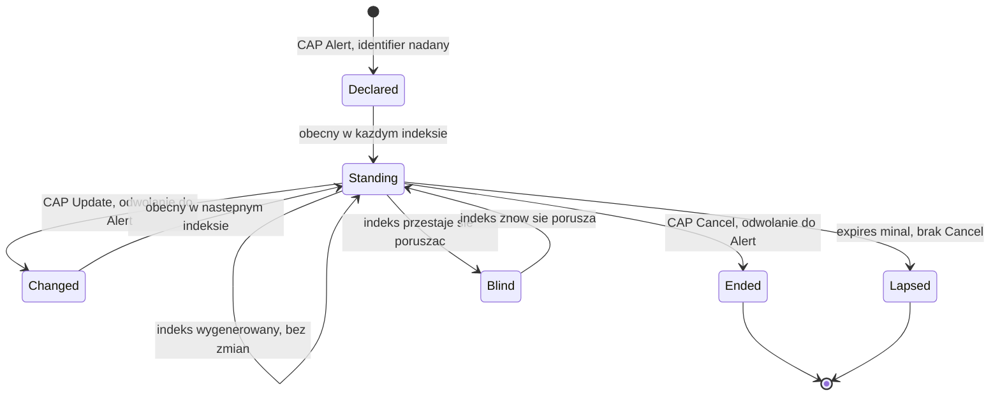

# Jaki powinien być polski kanał komunikatów alarmowych czytelny maszynowo

Version: 3.4 / 2026-09-19
Tę specyfikację piszę jako ktoś, kto próbował zbudować system korzystający z
polskich komunikatów alarmowych. Najpierw nie znalazłem żadnego kanału danych,
a później tylko jego część, dostępną po uzyskaniu tokena. Ukraiński odpowiednik
odbierałem i mierzyłem przez 118 dni. Zbudowanie na nim działającej aplikacji
zajmuje weekend, a parser, który jest jej sercem, powstał w dwa popołudnia.
Przytaczam oba fakty, bo na drugim z nich opiera się dalszy wywód: z
ukraińskiego rozwiązania można korzystać niewielkim kosztem i na tym polega
jego wartość. Dokument uzupełniają [`docs/CHANNEL.md`](CHANNEL.md), gdzie
opisano pomiar będący jego podstawą, oraz zadanie T8a w
[`../TODO.md`](../TODO.md), w którym lukę odnotowano po raz pierwszy. T8a to
przegląd, z którego wyrasta cała argumentacja. Pierwsza ocena konkretnego
źródła, czyli danych RSO, pochodzi z ich odczytu z 22 sierpnia 2026 r. i
została włączona do sekcji 2 oraz 4a. Pozostałych polskich kanałów z sekcji 2
projekt nie badał bezpośrednio. Opisano je na podstawie informacji
publikowanych przez operatorów, a każde zdanie wskazuje, skąd pochodzi zawarta
w nim informacja.

```
Uwaga: ten dokument opisuje kanał danych, który w proponowanej postaci
       jeszcze nie istnieje. Najbliższy polski odpowiednik, dane RSO,
       odczytano i zmierzono 22 sierpnia 2026 r. Sekcja 2 opisuje ten odczyt,
       sekcja 8 zbiera poprawki, które trzeba było wprowadzić do dokumentu,
       a ostatnie punkty sekcji 4a pokazują, czego nauczyło korzystanie
       z tych danych. Każda poprawka jest jawnie oznaczona. Nic z tego nie
       jest oceną niczyich kompetencji i dokument takich ocen nie formułuje.
```

**Jak czytać ten dokument i do kogo jest skierowany.** Składa się z dwóch
części i ma dwóch adresatów. Część I (sekcje 1–9) zawiera argumentację: co
istnieje, czego brakuje, ile kosztowało ustalenie tego oraz dwadzieścia
właściwości, które wyłoniły się podczas budowy systemu odbierającego dane z
kanałów, którym ich brakowało. Jest przeznaczona dla osoby decydującej o tym,
czy taki kanał powinien powstać. Część II (sekcje 10–16) to instrukcja: jak
wygląda on element po elemencie, jak jeden alarm przechodzi przez niego od
pierwszego do ostatniego komunikatu, oraz lista kontrolna, według której
nadawca może sprawdzić projekt, zanim zobaczy go ktokolwiek spoza instytucji.
Tę część napisałem dla inżyniera, któremu powierzono budowę kanału, i zakładam,
że zna on już format CAP, bo operator RSO go stosuje. Komuś, komu się spieszy,
wystarczy zacząć od sekcji 10 i wracać do części I wtedy, gdy potrzebne jest
uzasadnienie którejś reguły z części II; każda z tych reguł wskazuje
właściwość, z której wynika. Obok polskiego wydania, `FEED-SPEC-PL.md`,
istnieje angielskie, `FEED-SPEC.md`. Automatyczna kontrola w tym repozytorium
pilnuje, żeby oba były zgodne sekcja po sekcji i liczba po liczbie, więc nie
mogą rozejść się niezauważenie.


## Spis treści

**Część I. Argumentacja**

1. [Różnica sprowadza się do hasztagu](#1-różnica-sprowadza-się-do-hasztagu)
2. [Co jest dziś dostępne po polskiej stronie](#2-co-jest-dziś-dostępne-po-polskiej-stronie)
3. [Specyfikacja, która w większości nie jest moja](#3-specyfikacja-która-w-większości-nie-jest-moja)
4. [Cisza nie może znaczyć bezpieczeństwa](#4-cisza-nie-może-znaczyć-bezpieczeństwa)
5. [Zarzut i odpowiedź](#5-zarzut-i-odpowiedź)
6. [Czego ten dokument nie postuluje](#6-czego-ten-dokument-nie-postuluje)
7. [Jak z tym dokumentem polemizować](#7-jak-z-tym-dokumentem-polemizować)
8. [Rejestr korekt](#8-rejestr-korekt)
9. [Źródła](#9-źródła)

**Część II. Instrukcja**

10. [Cały feed na jednej stronie](#10-cały-feed-na-jednej-stronie)
11. [Jak jeden alarm przechodzi przez feed](#11-jak-jeden-alarm-przechodzi-przez-feed)
12. [Trzy zegary, jeden format](#12-trzy-zegary-jeden-format)
13. [Kiedy dwa odczyty to ten sam alarm](#13-kiedy-dwa-odczyty-to-ten-sam-alarm)
14. [Gdzie: obszar jako kod rejestru](#14-gdzie-obszar-jako-kod-rejestru)
15. [Udostępnianie i późniejsze zmiany](#15-udostępnianie-i-późniejsze-zmiany)
16. [Lista kontrolna zgodności](#16-lista-kontrolna-zgodności)

---

## 1. Różnica sprowadza się do hasztagu

Poniższe wartości zmierzono na 48 540 wiadomościach z publicznego ukraińskiego
kanału alarmów lotniczych, zebranych przez 99 nocy
([`docs/CHANNEL.md`](CHANNEL.md)):

| Wielkość | Wartość |
| --- | --- |
| Wiadomości, w których podano obszar i rodzaj jednostki | **99,34%** |
| Różne etykiety obszarów w całym okresie | 127 |
| Etykiety, które da się jednoznacznie przypisać do kodu w rejestrze państwowym | 126 automatycznie, 127 po jednej decyzji na podstawie kontekstu |
| Zgodność etykiety z treścią wiadomości | **99,997%** na 38 521 wiadomościach, które dało się porównać |

Etykieta z tabeli to hasztag, na przykład `#Харківський_район`,
`#Львівський_район` albo `#м_Харків_та_Харківська_територіальна_громада`.
Wskazuje on obszar, którego dotyczy wiadomość, i zapisuje się go według stałej
reguły: nazwa w mianowniku, podkreślenia zamiast spacji i pełne określenie
rodzaju jednostki.

**Po stronie ukraińskiej konwencja nie wymagała żadnych nakładów.** Hasztag
jest po prostu częścią treści komunikatu. Dla odbiorców korzyść jest wyraźna:
jedna osoba w dwa popołudnia zbudowała parser, który przypisuje każdemu
obszarowi kod z krajowego rejestru, a w danych, na których go projektowano, nie
popełnił ani jednego błędu. Wystarczyły do tego publiczne wiadomości, bez
osobnego interfejsu, formalności i finansowania.

Tak zapisuje swoje publiczne komunikaty alarmowe państwo, które jest codziennie
atakowane na własnym terytorium. Cała luka techniczna, której dotyczy ten
dokument, sprowadza się właśnie do tego.

## 2. Co jest dziś dostępne po polskiej stronie

Zestawienie nie zawiera ocen, bo dotyczy sposobu udostępniania komunikatów, a
nie instytucji.

| Kanał | Kto go odbiera | Czytelny maszynowo |
| --- | --- | --- |
| Syreny | Osoby w zasięgu słuchu | Nie i z natury rzeczy nie może być |
| Alert RCB (SMS) | Telefony w całym kraju | Nie. To zwykły tekst wysyłany na telefon |
| Dane RSO (XML i JSON) | Każdy, kto znajdzie adres | Tak. Pierwszy odczyt 22 sierpnia 2026 r., od września ten projekt pobiera je cyklicznie; luki opisuje sekcja 4a |
| Zasób CAP w RSO | Posiadacze tokena | Pod względem formatu tak. Token opisuje strona integracyjna operatora; ten projekt nie odczytywał tego zasobu |

Wiersze o RSO wynikają z odczytu danych i z informacji na stronie
integracyjnej, a opis syren i SMS opiera się na materiałach publikowanych przez
ich operatorów. Każde dalsze twierdzenie ma za sobą albo odczyt wykonany przez
ten projekt, albo dokument opublikowany przez odpowiedzialną instytucję.

**Sprostowanie do wcześniejszych wydań, na podstawie pomiaru z 22 sierpnia 2026
r.** Dokument opisywał dotąd dane RSO jako zamknięte. To nieprawda. Usługa, na
której działa aplikacja RSO, publikuje listy komunikatów w XML i JSON
publicznie, bez tokena i bez rejestracji, a jej strona integracyjna mówi o tym
wprost. Ten projekt odczytał te dane w jeden wieczór, a trudno o mocniejszą
podstawę takiej poprawki.

Ten sam wieczór pokazał, dlaczego dane RSO w obecnej postaci nie są jeszcze
kanałem, który opisuje ten dokument. Żaden komunikat nie podaje, czego dotyczy:
istnieje pięć kategorii, ale pojawiają się one wyłącznie w adresie zapytania,
nigdy w samym rekordzie. Nie wiadomo też, kto go wydał, choć do tego samego
źródła trafiają komunikaty dwóch różnych rodzajów organów. Zakres nazwany
„wszystkie” zwraca tylko część rekordów i niczym tego nie sygnalizuje. Historia
szybko się przerzedza, do kilku wpisów tygodniowo w skali całego kraju, więc
tydzień, do którego ten projekt najbardziej potrzebował wrócić, w większości
już zniknął. Każdą z tych obserwacji zmierzono i każda ma osobny punkt na końcu
sekcji 4a.

**Pomiar zamiast założeń, 9 sierpnia 2026 r.** Pobrano i przeszukano pełny
katalog metadanych portalu otwartych danych: 1 510 768 zasobów,
przefiltrowanych według słów alarm, ostrzeżenie, syrena, RCB, ochrona ludności,
zarządzanie kryzysowe i ewakuacja. Kryteria spełniło dwadzieścia dziewięć
zbiorów danych, ale żaden z nich nie jest kanałem aktualizowanym na bieżąco.
Rządowe Centrum Bezpieczeństwa jest obecne w katalogu i publikuje dwa zbiory;
oba zawierają dokumenty i żaden nie jest oznaczony jako dane dynamiczne. IMGW
publikuje ostrzeżenia meteorologiczne, więc ta kategoria trafiła do otwartych
danych. Portal obsługuje dane dynamiczne i rzeczywiście je publikuje:
informacje o jakości powietrza są dostępne przez API i mają takie oznaczenie.
Nie brakuje więc możliwości technicznych ani instytucji, która mogłaby
publikować, tylko tej jednej kategorii danych.

**Jak wyglądają wpisy RCB – według pomiaru.** W tych dwóch zbiorach Rządowe
Centrum Bezpieczeństwa udostępnia cztery zasoby w formatach XML i HTML,
wszystkie na **poziomie otwartości 3**, każdy z częstotliwością aktualizacji
*nie dotyczy*. W świetle standardu nie jest to błąd formatu: XML jest
dopuszczalny na poziomie 3, a HTML odradza się dopiero powyżej niego, więc
wpisy są poprawne. Są to po prostu **dokumenty statyczne**, prawidłowo tak
oznaczone.

Przegląd ich treści z 22 sierpnia 2026 r. pokazuje, że chodzi o Krajowy Plan
Zarządzania Kryzysowego, Narodowy Program Ochrony Infrastruktury Krytycznej
wraz z załącznikiem ze standardami oraz wykaz centrów zarządzania kryzysowego z
danymi kontaktowymi. Są to plany i kontakty, a nie zdarzenia z datą czy alarmy.

Standard zaleca udostępnianie przez API właśnie od poziomu 3, żeby dane dało
się przetwarzać maszynowo. RCB jest więc już na tym progu i na razie publikuje
pliki.

Wniosek jest węższy i trudniejszy do podważenia niż ten, do którego zmierzały
pierwsze wydania. **Luka nie dotyczy kompetencji, formatu ani platformy. Polega
na tym, że komunikatów alarmowych w ogóle nie traktuje się jak danych.** Na
portalu istnieje taka kategoria dla jakości powietrza, razem z dynamicznym API.
Dla alarmów jej nie ma, choć instytucja, która mogłaby za nią odpowiadać, jest
już tam obecna, spełnia standard i publikuje inne zasoby.

Skutki trzeba opisać ostrożniej niż dawniej, bo ten projekt zbudował już system
korzystający z jedynego istniejącego źródła. Nie chodzi o to, że nic nie da się
zbudować, lecz o to, że **komunikatów alarmowych nie ma tam, gdzie państwo
publikuje dane jako dane.** RSO działa poza katalogiem, jako zaplecze
aplikacji: nie ma wpisu, wersji, opisanego schematu ani określonego okresu
przechowywania, a jego struktura może się zmienić bez zapowiedzi. Można na nim
oprzeć badania naukowe, narzędzie dla osób głuchych, ekran informacyjny w
szkole albo pomiar rzeczywistej szybkości systemu, ale każde z tych rozwiązań
odziedziczy wszystkie luki z sekcji 4a i nie będzie miało żadnych gwarancji.

Ten projekt odczuł to bezpośrednio. Ukraińską stronę granicy zmierzono z
dokładnością do rejonu: 118 dni i 61 041 wiadomości. Polska strona ma za sobą
jeden wieczór pomiarów i nie da się jej odtworzyć wstecz. RSO przechowuje
niewiele, a z tygodnia lipcowego uderzenia pocisku manewrującego zostało w nim
kilka rekordów dla całego kraju. Różnica nie wynika z ilości danych, lecz z
tego, czy się je archiwizuje.

Wyszukiwanie w katalogu można powtórzyć: wystarczy pobrać metadane udostępniane
przez portal, rozpakować je i przefiltrować pola opisu. Odpowiednie polecenie
jest w historii repozytorium, a liczby podane wyżej pochodzą z jego wyniku, nie
z przeglądania strony.

**Trzy pytania, na które ten dokument nie umiał odpowiedzieć**; na jedno z nich
jest już połowa odpowiedzi. Czy treść komunikatu CAP zawiera obszar jako kod
TERYT w polu `geocode`, czy tylko jako nazwę albo wielokąt? Czy koniec
zagrożenia jest publikowany jako komunikat `Cancel` lub `Update`, czy wynika
wyłącznie z upływu terminu w polu `expires`? Czy cokolwiek jest publikowane
wtedy, gdy nic się nie dzieje (tego dotyczy sekcja 4)? Dla stron XML drugie
pytanie rozstrzygnęła para komunikatów odczytana 16 września 2026 r.: ani
jedno, ani drugie. Koniec ogłasza osobny komunikat opisowy, który nie wskazuje
żadnego alarmu, a pole `valid_to` samego alarmu obowiązuje do końca dnia
(właściwość dwudziesta). Dla zasobu CAP wszystkie trzy kwestie pozostają
otwarte i wyjaśniłby je dopiero odczyt z użyciem tokena. Taki odczyt przewiduje
zadanie T8a, ale dotąd go nie wykonano.

## 3. Specyfikacja, która w większości nie jest moja

**Cztery z pięciu opisanych niżej właściwości polski standard techniczny dla
danych publicznych już wymaga albo zaleca** (*Standard techniczny* Ministerstwa
Cyfryzacji, określający minimalne wymagania techniczne dla danych publicznych
udostępnianych w Centralnym Repozytorium Informacji Publicznej). Ta sekcja nie
jest więc propozycją, tylko uwagą, że istniejącego standardu nie zastosowano do
jednej kategorii danych.

Piątej właściwości w standardzie rzeczywiście nie ma, a w przypadku komunikatów
alarmowych jest ona najważniejsza. Oznaczam ją jako lukę, a nie jako prośbę.

| Właściwość | Status w standardzie |
| --- | --- |
| Publiczny dostęp bez wniosków | Portal stwierdza, że dane można wykorzystywać ponownie bez składania wniosku |
| Obszar jako kod rejestru, a nie opis | Standard wskazuje TERYT jako rejestr referencyjny i definiuje *adres uniwersalny*, zaznaczając wprost, że ma go odczytywać system, a nie człowiek |
| Zmiany stanu z datą i godziną | Wymagany zapis ISO 8601, `yyyy-mm-ddThh:mm` |
| Wersjonowany schemat udostępniany przez API | Od poziomu otwartości 3 zalecane API i JSON zgodny z RFC 8259 oraz standardem JSON API; poziom 4 wymaga JSON-LD z pełnym kontekstem semantycznym. Istnieje też odrębny Standard API |
| **Sygnał życia** | **Brak.** Zob. sekcja 4 |

Czterech pierwszych wierszy nie muszę uzasadniać. Poniżej wyjaśniam, dlaczego
każda z tych właściwości ma znaczenie dla komunikatów alarmowych, a potem
opisuję lukę.

**Porównanie z RSO z wydania 2.4, z jednym wierszem poprawionym w wydaniu
3.3.** Tabela zestawia tych samych pięć właściwości z jedynym istniejącym
polskim źródłem. `[zmierzone]` oznacza odczyt tego projektu z 22 sierpnia 2026
r., a w trzecim wierszu odczyt z 16 września 2026 r. Słowo *nieustalone*
oznacza kwestie, których te odczyty nie rozstrzygają; sekcja 2 wymienia, co by
je rozstrzygnęło.

| Właściwość | Status w RSO |
| --- | --- |
| Publiczny dostęp bez wniosków | Spełniona przez listy komunikatów w XML i JSON `[zmierzone]`. Niespełniona przez zasób CAP, który według strony integracyjnej operatora wymaga tokena. Tu pozostaje luka |
| Obszar jako kod rejestru, a nie opis | Listy podają województwo jako identyfikator tekstowy i nazwę, bez kodu rejestru `[zmierzone]`. Nieustalone dla CAP, którego pole `geocode` może taki kod zawierać |
| Zmiany stanu z datą i godziną | Częściowo spełniona przez listy: publikowane są oba kierunki, ale koniec ogłasza osobny komunikat opisowy, który nie wskazuje alarmu, pole `valid_to` samego alarmu obowiązuje do końca dnia, a żaden znacznik czasu nie zawiera przesunięcia względem UTC `[zmierzone]`, właściwość dwudziesta. Nieustalone dla CAP, który ma do tego komunikaty `Cancel` i `Update` |
| Wersjonowany schemat udostępniany przez API | W dużej mierze spełniona przez sam CAP, opublikowany i wersjonowany standard; profil RSO, czyli informacja, które elementy opcjonalne są wypełniane, nie został opublikowany |
| **Sygnał życia** | Nieustalone dla RSO. CAP go nie definiuje, więc samo przyjęcie CAP go nie zapewni. Sekcja 4 |

**Pierwsza. Dostęp publiczny, bez uwierzytelniania i bez wniosków.** Kanał
dostępny dopiero po złożeniu wniosku nie jest infrastrukturą publiczną, tylko
usługą udostępnianą za zgodą. Ukraińskie źródło nie wymaga tokena i dlatego
każdy może sam sprawdzić pomiary z tego repozytorium, zamiast przyjmować je na
wiarę.

*W odniesieniu do RSO, wydanie 2.4.* Zasób CAP wymaga tokena, co opisuje strona
integracyjna operatora. Listy w XML i JSON nie mają żadnych ograniczeń dostępu,
więc wymóg zgody obejmuje właśnie ten zasób, który ma ustrukturyzowaną postać.
Nie jest to kwestia schematu i żadne pole tego nie zmieni. Od tej właściwości
zależy, czy gmina może po prostu zbudować własne rozwiązanie, czy musi najpierw
prosić o dostęp.

**Druga. Obszar wskazany kodem rejestru, a nie opisem.** Standard ujmuje to
lepiej, niż ja bym potrafił: wprowadza adres uniwersalny właśnie po to, żeby
miejsce mógł ustalić system, a nie człowiek, i wskazuje TERYT jako rejestr, w
którym znajdują się kody. Jeśli komunikat podaje `powiat biłgorajski` w zwykłym
zdaniu, każdy odbiorca musi napisać własne dopasowywanie nazw, a przy tym łatwo
o subtelne błędy. Ten projekt przekonał się o tym, mierząc: dopasowanie nazw do
rejestru osiągnęło 6,06%, a ustrukturyzowane etykiety samego źródła – 99,34%.

**Trzecia. Zmiany stanu w obu kierunkach, z datą i godziną.** Początek i koniec
alarmu to dwa odrębne zdarzenia i oba mają znaczenie. Jeśli kanał publikuje
tylko początek, każdy odbiorca musi zgadywać, kiedy zagrożenie minęło, a
zgadywanie prowadzi do błędu, którego ten projekt unika wszędzie: stan nieznany
zaczyna wyglądać na bezpieczny.

**Czwarta. Wersjonowany schemat udostępniany przez API.** Standard już teraz
zaleca udostępnianie przez API od poziomu otwartości 3 i sam przestrzega, że
przy danych z poziomu 3 człowiek wciąż musi ustalać, co znaczy każde pole. W
komunikatach alarmowych taka niejednoznaczność kosztuje najwięcej, dlatego
warto dojść do poziomu 4, zamiast poprzestać na opublikowanym pliku.

**Piąta. Sygnał życia.** Standard go nie przewiduje i co do zasady słusznie:
określa, jak sformatować i opisać *zbiór danych*, a to inny problem niż sposób,
w jaki *kanał* sygnalizuje, że działa. DCAT-AP ma pole `accrualPeriodicity`,
ale to deklarowana w metadanych częstotliwość aktualizacji, a nie sygnał w
samych danych. Przy komunikatach alarmowych ta różnica decyduje o wszystkim i
jej właśnie dotyczy sekcja 4.


## 4. Cisza nie może znaczyć bezpieczeństwa

Najważniejsza właściwość ze wszystkich, i ta, która jest niewidoczna aż do dnia, w
którym ma znaczenie.

Jeśli feed publikuje tylko wtedy, gdy coś się dzieje, to **martwy feed i
spokojne niebo wyglądają identycznie**. Każdy konsument, który wyświetla
ciszę jako „nic się nie dzieje", jest o jedną awarię od powiedzenia ludziom,
że są bezpieczni, w chwili, gdy nie są. To nie jest hipoteza: to założycielski
niezmiennik tego repozytorium, że nieznane nigdy nie zamienia się w
odwołanie, a kilka wpisów w jego rejestrze defektów to przypadki pomylenia
tego wewnętrznie.

Naprawa jest prosta i musi być pomyślana od początku: okresowy sygnał życia
o treści „na ten znacznik czasu stan wygląda tak", nadawany niezależnie od
tego, czy stan się zmienił. Konsument, do którego taki sygnał nie dotarł w
zadeklarowanym odstępie, wie, że jest ślepy, i może to powiedzieć, zamiast
wyświetlać spokój.

Feed alarmowy bez sygnału życia to system, który z założenia zawodzi po cichu.

**Zmierzone, i jest gorzej, niż zakładał argument powyżej.** Ten projekt
uruchomił własny kolektor na ukraińskim kanale bez nadzoru na jedną noc i
policzył: **jedenaście z dziewięćdziesięciu pięciu odpytań nie powiodło się**
w dwunastogodzinnym dzienniku, a dziewięć z sześćdziesięciu w dwugodzinnym
oknie zmierzonym najdokładniej. Kolejne niepowodzenia się zdarzają; najdłuższa
seria to dwa, a najdłuższa przerwa między udanymi odczytami to siedem minut,
przy dziesięciominutowym progu nieaktualności.

Ten wskaźnik z pierwszej nocy jest bliski tego, na którym liczba ostatecznie
osiadła, ale dotarcie tam wymagało korekty. Późniejsze wydanie odczytało dużo
niższy wskaźnik z innego okna i przypięło go; uzgodnienie okien między sobą
sprowadziło wskaźnik z powrotem do mniej więcej jednego odpytania na dziewięć
i wycofało niższy pin jako błędny o dwa rzędy wielkości (F109 w rejestrze
defektów, z bieżącymi liczbami w README tego repozytorium i w
`docs/DEPLOYMENT.md`). Warto to powiedzieć wprost, bo akapit poniżej
argumentuje z tego, że wskaźnik niepowodzeń konsumenta w ogóle da się poznać.

Liczbą, która ma znaczenie, nie jest wskaźnik niepowodzeń. Jest nią to, że
**konsument mógł to stwierdzić**, przy każdej z tych jedenastu okazji, bo
kanał publikuje na tyle ciągle, że nieobecność jest czytelna. Feed publikujący
tylko przejścia uczyniłby wszystkie jedenaście nieodróżnialnymi od spokojnego
nieba, a własne oprzyrządowanie konsumenta nie odzyskałoby tej różnicy z
zewnątrz za żadną cenę.

Sygnał życia nie jest więc uprzejmością wobec konsumentów, którym zależy na
potwierdzeniu, że feed działa. Jest jedynym, co pozwala w ogóle zmierzyć
własny wskaźnik błędów.

**Zmierzone ponownie, tym razem u źródła.** Ten blok został dodany w 2.3, gdy
tryb awarii tej sekcji przestał być argumentem i stał się datą. 2026-08-29 o
04:55 UTC sam ukraiński kanał przestał publikować - nie nieudane odpytanie po
stronie konsumenta, lecz wydawca - i milczał przez falę ataków, którą
niezależne relacje zmierzyły na ponad dobę. Wynikły z tego trzy rzeczy i każda
jest właściwością tej sekcji, a nie tego kanału.

Po pierwsze, **cisza była czytelna**, dokładnie z powodu argumentowanego
wyżej: źródło publikujące dostatecznie ciągle czyni nieobecność sygnałem, a
strona tego projektu spędziła te godziny, mówiąc, że jej obraz jest stary i
jak bardzo, zamiast rysować spokój. Feed samych przejść uczyniłby te same
trzydzieści cztery godziny nieodróżnialnymi od spokojnego nieba, po stronie
konsumenta, za żadną cenę.

Po drugie, **zastępstwo było problemem przejść w odwrotną stronę.** Oficjalne
API, na które ten projekt się przełączył, publikuje migawkę pełnego stanu i
nic nie mówi o tym, co się skończyło, więc każde odwołanie musi być
zsyntetyzowane z różnicy dwóch obserwacji - a to jest bezpieczne tylko wtedy,
gdy poprzednia obserwacja dowodnie miała miejsce. Konsument buduje w końcu
sygnał życia, którego feed nie daje: utrwaloną obserwację z pułapem wieku,
powyżej którego przerwa do niczego nie upoważnia. Feed, który ma sygnał życia
w środku, oszczędza tę pracę każdemu konsumentowi; przy feedzie bez niego
każdy konsument musi ją wykonać osobno albo zawieść po cichu.

Po trzecie, **tryb dostępu był częścią dostępności.** Przełączenie zajęło
mniej niż dobę tylko dlatego, że o klucz do alternatywy wystąpiono tygodnie
wcześniej i przyznano go, zanim był potrzebny. Gdyby procedura wnioskowa
zaczęła się rano w dniu śmierci kanału, jej czas trwania byłby przerwą w
dostawie. Nic z tego nie łagodzi właściwości pierwszej: jawność rozstrzyga o
tym, kto może weryfikować, a sygnał życia o tym, kto pozna, że feed jeszcze
działa; 2026-08-29 jest pomiarem, że to dwie różne właściwości - to źródło bez
tokena umarło, a jego śmierć była jedyną rzeczą, którą konsument mógł o nim
odczytać.

**Zmierzone po raz trzeci, a instrumentem był własny dziennik prób
konsumenta.** Dodane w 2.5. Kanał wrócił ze swojej ciszy z 2026-08-29 - w
dniu, którego ten projekt nie zapisał, co jest ustaleniem na temat tego projektu - i
zatrzymał się ponownie 2026-09-07 o 06:09 UTC `[zmierzone]`. Tym razem
konsument mógł powiedzieć, która strona milczy, i mógł to powiedzieć z
magazynu, a nie z nieba: dziennik prób (właściwość dziewiąta) zapisał 43 nowe
identyfikatory wpisów w 69 minut przed zatrzymaniem, a potem ten sam
identyfikator na 4 463 kolejnych udanych odczytach aż do wieczora 2026-09-08,
wobec 592 identyfikatorów w kontrolnej dobie wcześniej. Ani jednej odmowy w
oknie. Sprawny odbiór czytający milczącego wydawcę, jako para liczb.

Wynikają z tego dwie rzeczy. Po pierwsze, plik stanu, który ten projekt
publikuje, nazywa teraz swoje źródła jedno po drugim i mówi, per źródło, czy
odbiór działa i kiedy ostatnio przyjął zdarzenie, więc czytelnikowi można
powiedzieć „główne dostarcza, strażnik milczy" zamiast podawać wiek bez
atrybucji. Po drugie, instrumentem, który rozstrzyga powrót wydawcy, jest
własny identyfikator strony feedu w dzienniku prób, a nie pierwsze
sklasyfikowane zdarzenie: wydawca, który wraca z treścią, której klasyfikator
nie czyta, nie produkuje żadnego wiersza zdarzenia i mimo to jest z powrotem.
Ten projekt wpisał zły instrument do dwóch własnych dokumentów w dniu pomiaru
i poprawił go dzień później; korekta jest tu zapisana, bo pomyłka ma dokładnie
ten kształt, przed którym ta sekcja ostrzega wydawców - szukanie życia w
niewłaściwym miejscu i czytanie jego nieobecności jako ciszy.

**Dlaczego standard tego nie obejmuje i dlaczego to nie jest wobec niego
zarzut.** Standard techniczny opisuje, jak zbiór danych jest sformatowany,
opisany i licencjonowany. Zbiór danych to rzecz, która stoi w miejscu;
strumień to rzecz, którą trzeba obserwować, żeby wiedzieć, że działa. Te dwie
rzeczy potrzebują różnych gwarancji i tylko pierwsza jest w zakresie.
`accrualPeriodicity` z DCAT-AP deklaruje zamierzoną częstotliwość aktualizacji
w metadanych, co mówi konsumentowi, czego się spodziewać, i nic o tym, co
dzieje się teraz. Dla większości danych publicznych ta luka nic nie kosztuje.
Dla alarmowania to różnica między spokojną nocą a martwym systemem, a
konsument nie odróżni ich z zewnątrz.

## 4a. Właściwości wzięte z wdrożenia, nie ze specyfikacji

Sekcje 1 do 4 zostały napisane, zanim ten projekt miał konsumenta w produkcji.
Ma go od 2026-08-11 i wyłoniło się pięć wymagań, których pierwotna piątka nie
obejmowała. Są numerowane osobno, bo są słabszymi twierdzeniami: każde stoi na
jednym wdrożeniu, a nie na korpusie. Dziewiąta i dziesiąta zostały dodane w
1.5, z konsumowania dwóch kolejnych interfejsów: jednego osiągniętego na mocy
odwoływalnej umowy, jednego limitowanego. Jedenasta została dodana w 1.6, gdy
pole kategorii pomylono z opisem zagrożenia - ten projekt, na piśmie,
dwukrotnie. Dwunasta została dodana w 1.7, po zmierzeniu, jak często źródło w
ogóle nazywa środek ataku: odpowiedź ogranicza to, co którykolwiek konsument
takiego feedu może wyświetlić, i nie jest to liczba, którą parser może
poprawić. Trzynasta i czternasta zostały dodane w 1.8, z dwóch defektów
znalezionych we własnym kontrakcie tego projektu jednego dnia, obu tego samego
kształtu: fakt, który wydawca miał, a konsument nie mógł użyć. Piętnasta i
siedemnasta zostały dodane w 1.9, jako pierwsze wpisy wzięte z **czytania
polskiego źródła, a nie ukraińskiego**; ich dowodem jest jeden wieczór wobec
jednego punktu końcowego, co czyni je węższymi niż reszta, i jest to
powiedziane tutaj, a nie zakopane. Szesnasta została dodana w 1.9 i wycofana w
2.0. Notatka poniżej mówi dlaczego, bo jawnie zapisane wycofanie jest częścią
tej samej dyscypliny, o którą te właściwości proszą wydawcę. Osiemnasta i
dziewiętnasta zostały dodane w 2.5, obie z tego, że ukraińskie źródło zmieniło
się pod kolektorem tego projektu 2026-09-06: jedna z tego, co zmiana zepsuła,
druga z tego, co opublikowała. Dwudziesta została dodana w 3.3, z jednej
pary polskich komunikatów odczytanej 2026-09-16, i jej dowodem jest
dokładnie to: jedna para.

**Szósta. Limit, opublikowany, i flaga mówiąca, kiedy zadziałał.** Nauczka z produkcji.

Producent tutaj ogranicza swoje okno zdarzeń do 5 000 i publikuje flagę
`truncated`. Budowanie konsumenta pokazało, dlaczego obie połowy są
konieczne. Bez limitu okno, które rośnie z jakiegokolwiek powodu - przesunięcie
zegara, uzupełnienie wstecz, zmiana schematu - to nieograniczona praca dla
każdego czytelnika naraz; zmierzone na stronie, nieograniczone okno wyrenderowało
stronę 5,6 MiB z 20 000 zdarzeń. Bez flagi ograniczona lista i spokojne okno
wyglądają identycznie, a to ta sama awaria co w sekcji 4, tylko od innej strony.

**Konsument musi też ograniczyć je niezależnie**, i to jest ta część, o którą
łatwo się potknąć. Własna strona tego projektu oddelegowała ograniczenie do
producenta i go nie sprawdzała, a oboje są wdrażani osobno, ręcznie. Limit,
który żyje tylko po stronie publikującej, to limit, który trzyma do dnia, w
którym obie wersje się rozejdą.

**Siódma. Lewa krawędź okna, opublikowana, a nie wyprowadzona.** Nauczka z produkcji.

Feed niosący „oto przejścia z ostatnich dwudziestu minut" nie wystarcza.
Konsument potrzebuje znacznika czasu, od którego okno się zaczyna, bo
urządzenie, które spało dwadzieścia pięć minut, nie odróżni inaczej luki od
spokojnego odcinka, i osoba je trzymająca też nie. Wyprowadzanie krawędzi z
czasu publikacji działa tylko wtedy, gdy zegar konsumenta i producenta się
zgadzają, a przypadek, który ma znaczenie, to dokładnie ten, w którym
konsumenta nie było.

Koszt dla producenta: jedno pole. Wartość dla konsumenta: różnica między „nic
się nie stało" a „nie widziałeś, co się stało", czyli niezmiennik sekcji 4
zastosowany do czytelnika, a nie do systemu.

**Ósma. Polityka wersji, która mówi, co dzieje się podczas przełączenia.**
Nauczka z produkcji; kosztowała okno wdrożeniowe.

Czwarta właściwość prosi o wersjonowany schemat. To konieczne i
niewystarczające. Kiedy ten projekt przeniósł własny kontrakt z v2 na v3,
ładunek był ścisłym nadzbiorem - każde pole wymagane przez konsumenta v2 nadal
w nim było - a konsument i tak go odrzucił, poprawnie, bo odrzuca wersje,
których nie rozpoznaje. Oboje musieli zostać wdrożeni w jednym oknie, z
producentem o minuty wcześniej, a strona była w międzyczasie ślepa.

Numer wersji bez zadeklarowanego okresu nakładania się spycha tę koordynację
na każdego konsumenta, a publiczny feed ma konsumentów, których nigdy nie
spotkał. Co polityka musi stwierdzać: jak długo poprzednia wersja jest nadal
serwowana, co kończy ten okres, i czy konsument może traktować nieznaną
wersję minor jako czytelną. Ten projekt jeszcze własnej polityki nie
napisał, co jest zapisane w jego backlogu jako niedokończona połowa zadania,
które wprowadziło v3. Pominięcie da się tu przeżyć, bo jest jeden konsument i
ten sam autor go kontroluje. To jest dokładnie okoliczność, której publiczny
feed nie ma.

**Dziewiąta. Jeśli feed nie daje sygnału życia, konsument musi go sobie wystawić sam.**
Nauczka z produkcji; naprawa powstała, zanim to zapisano.

Piąta właściwość należy do wydawcy. Konsument stojący przed feedem, który jej
nie ma, nie jest zwolniony z niezmiennika sekcji 4, a odpowiednikiem po
stronie konsumenta jest **dziennik prób**: trwały zapis każdego wykonanego
odpytania, udanego lub nie, trzymany obok zapisu tego, co te odpytania
zwróciły.

Bez niego godzina, w której nic nie zgłoszono, i godzina, w której własny
proces konsumenta był martwy, to ten sam pusty zbiór w magazynie. Żadna
staranność przy renderowaniu nie odzyska tej różnicy, bo informacja nigdy nie
została zapisana. Z nim rozróżnialne są trzy stany zamiast dwóch:

| Dziennik prób | Zapis obserwacji | Co konsument może powiedzieć |
| --- | --- | --- |
| Odpytania obecne | Obserwacje obecne | Co zaobserwowano |
| Odpytania obecne | Brak | Nic nie zgłoszono, a konsument patrzył |
| Brak odpytań | Brak | Konsument nie patrzył. Nieznane |

**Nieudane odpytanie jest zapisywane jako próba bez wyniku, a nie jako próba,
która zwróciła zero.** Schemat musi uczynić te dwie rzeczy reprezentowalnymi
osobno, inaczej rozróżnienie znika przy pierwszym timeoucie:
w próbniku ADS-B tego projektu liczba wyników jest null dla niepowodzenia i
zero dla pustej odpowiedzi, i istnieje test regresji, którego dane potrafią je
odróżnić. Ten próbnik jest miejscem, gdzie tej właściwości się nauczono, i
dlatego przychodzi w 1.5, a nie wcześniej.

Ta jedna ma najszersze zastosowanie z dziesięciu. Kosztuje jedną tabelę i
obowiązuje każdego konsumenta każdego feedu bez sygnału życia, łącznie z
konsumentem tego projektu.

**Dziesiąta. Zadeklarowany budżet dostępu, jeśli istnieje, i oświadczenie,
jeśli nie.** Nauczka z produkcji.

Feed, który limituje dostęp, czyni **pokrycie** konsumenta funkcją jego
przydziału. Konsument odpytujący według harmonogramu wobec dziennego limitu
albo wie, ile z niego zostało, i wtedy może uczciwie powiedzieć, jaka była
jego gęstość próbkowania i gdzie ustała, albo nie wie, i wtedy jego własna
kompletność jest mu nieznana, a każda luka w zapisie jest nieprzypisywalna:
wydawca, sieć albo limit, który wyczerpał się o czwartej po południu, to trzy
różne ustalenia i wyglądają identycznie.

Opublikowanie limitu i zwracanie pozostałego przydziału w nagłówku odpowiedzi
kosztuje jeden nagłówek i zamienia lukę nieprzypisywalną w diagnozowalną.

Właściwość jest równie dobrze spełniona przez brak limitu i powiedzenie tego.
„Bez limitu, bez dławienia, odpytuj tak często, jak uważasz za użyteczne" to
odpowiedź kompletna i to jest to, co ukraiński kanał daje przez brak
jakiejkolwiek bramki. Właściwość łamie limit, który istnieje i nie jest
zadeklarowany, bo konsument odkrywa go przez odcięcie.

**Uwaga do właściwości pierwszej, z tego samego doświadczenia.** Sekcja 3
argumentuje, że procedura wnioskowa to system zezwoleń z ikoną RSS. Ten projekt
skonsumował od tamtej pory ten drugi rodzaj na warunkach odwoływalnych bez
podania przyczyny, a koszt jest dotkliwszy, niż sugerowało pierwotne
sformułowanie: **odtwarzalność staje się właściwością interfejsu, a nie
staranności konsumenta.** Drugi czytelnik nie może powtórzyć pomiaru, który
stoi na umowie, której nie był stroną i której może nie dostać. Pomiary
ukraińskiego kanału w sekcji 1 są sprawdzalne dla każdego. Te, które stoją na
interfejsie z kluczem, są sprawdzalne dla tego, kto klucz trzyma.

**Jedenasta. Kategoria musi mówić, czego nie rozróżnia.** Nauczka z produkcji, z
własnej pomyłki.

Feed, który opatruje alarm kategorią, sprawia, że każdy konsument bierze tę
kategorię za opis zagrożenia. Zwykle nim nie jest, a luka jest
niewidoczna z samego pola.

Konkretny przypadek. Zaplecze ukraińskich aplikacji alarmowych publikuje pięć
kategorii: alarm lotniczy, artyleria, walki uliczne, chemiczne, radiologiczne.
Konsument czytający `AIR` dowiaduje się, że ogłoszono coś powietrznego. **Nie**
dowiaduje się, czy to coś to dron, bomba szybująca, pocisk manewrujący, pocisk
balistyczny, start MiG-31K czy zagrożenie od strony morza. Wszystko to jest
`AIR`. Najczęściej zadawane pytanie o alarm - co leci - to dokładnie to
pytanie, na które kategoria nie odpowiada, i nic w polu, jego nazwie ani
dokumentacji tego nie mówi.

Ten projekt dwa razy zmarnował pracę na założeniu, że odpowiada: raz planując
wypełnić lukę we własnej klasyfikacji z tego pola, i raz w pisemnej
rekomendacji, zanim ktokolwiek przeczytał, co znaczą wartości. Za każdym razem
pole wyglądało jak odpowiedź, bo kategoria i rodzaj mają ten sam kształt -
krótkie wyliczenie na alarmie - i nic ich nie odróżniało.

**Wydawca powinien tu napisać jedno zdanie na kategorię, a nie
taksonomię.** „Alarm lotniczy: każde zagrożenie z powietrza, włącznie ze
środkami, których ten feed nie rozróżnia." To zdanie nic nie kosztuje i usuwa
klasę błędów konsumenta, której żadna staranność po stronie konsumenta nie
zapobiegnie, bo konsument nie widzi, co kategoria zlewa.

**A czego to wymaga od konsumenta, i to jest trudniejsza połowa.** Kategoria nigdy
nie może być renderowana jako zamknięty zbiór rodzajów, które może zawierać.
Pokusa jest silna i wygląda na życzliwość wobec czytelnika: ten projekt był bliski narysowania
trzech ikon - dron, bomba szybująca, pocisk - obok alarmu, którego rodzaju
nigdy nie ogłoszono, żeby czytelnik widział, co to może być. Trzy ikony
twierdzą **„jedno z tych trzech"**. Źródło nic takiego nie powiedziało, a
`AIR` tego nie znaczy. Narysowanie ich byłoby przewidywaniem w postaci
ikonografii, czyli tą samą awarią co strzałka pokazująca kierunek, którego
feed nigdy nie opublikował.

Tekst potrafi unieść zbiór otwarty, bo ma słowa „albo coś innego". Rząd
symboli nie potrafi i żaden układ symboli ich nie dostarcza. Tam, gdzie
konsument chce jednak wizualizacji dla nieogłoszonego rodzaju, uczciwa forma
to **jeden symbol, który czyta się jako klucz, a nie jako wyliczenie**, z
otwartym końcem wypowiedzianym słowami obok. To jest to, co ten projekt
wdrożył, a rozumowanie jest w rejestrze defektów jego konsumenta, nie tutaj,
bo decyzja należy do konsumenta; do specyfikacji należy właściwość, która
uczyniła ją konieczną.

**Dwunasta. Pułap klasyfikacji należy do specyfikacji, bo jest właściwością
źródła, a nie czytelnika.** Nauczka z produkcji.

Na 61 041 wiadomościach przez 118 dni ten kanał niósł stan alarmowy w 52 589 z
nich i znacznik środka ataku w 7 428. Osiem rdzeni wyrazowych pokrywa 98,3%
oznaczonych wiadomości; reszta to 122 wiadomości, 0,2% korpusu, a ich odczyt
pokazuje, że wszystkie są odwołaniami niosącymi listy kontynuacji, które nie
nazywają żadnego środka, bo nie ma czego nazwać. Pokrycie złączenia w całym
korpusie wynosi **0,187** i nie porusza się z oknem złączenia: 1 godzina i 24
godziny dają po 0,187, więc parametr, o którym zakładano, że tym rządzi, nie
rządzi niczym.

Liczbą, która ma znaczenie, jest to, co ona ogranicza. **Mniej więcej cztery
alarmy na pięć nie będą niosły ogłoszonego rodzaju i żaden parser tego nie
zmieni**, bo źródło nie mówi. Ten projekt doszedł do tego wniosku drogą
kosztowną: zaproponowano listę prawdopodobnego dodatkowego słownictwa z
ogólnej wiedzy o wojnie - konkretne oznaczenia pocisków, samoloty nosiciele,
sformułowania o odpaleniu, kierunek i liczba - i zmierzono ją na korpusie.
Każda pozycja wystąpiła zero razy. Dwie z dwudziestu pięciu kandydatek
wystąpiły w ogóle, łącznie osiem razy. Lista nie była częściowo trafna; była
opisem tego, jak o tej wojnie pisze się gdzie indziej, wziętym za to, jak
pisze ten kanał.

Dwie konsekwencje dla specyfikacji.

**Dla wydawcy.** Jeśli feed potrafi wyrazić rodzaj, powinien opublikować, jak
często faktycznie to robi, jako zmierzony udział, a nie jako obietnicę. Pole
wypełniane raz na pięć to nie jest zepsute pole, ale konsument, który odkrywa
to z własnego ruchu, już zbudował interfejs wokół błędnego oczekiwania.
Opublikowanie udziału kosztuje jedną linię i jest różnicą między polem
dopuszczającym null a polem, które zwykle jest null.

**Dla konsumenta.** Przypadek nieogłoszony jest przypadkiem *normalnym* i musi
być zaprojektowany jako taki, a nie obsługiwany jako wyjątek. To znaczy, że
słowa „źródło nie powiedziało" to główny tekst interfejsu, widziany częściej
niż jakakolwiek nazwa rodzaju, a nie zapasowa formułka. To znaczy też, że
chęć bogatszego szczegółu jest pytaniem o **źródła**, nie o parsowanie: kiedy
pułap wyznacza to, co kanał pisze, jedyną drogą przez niego jest inny kanał, z
tym, co to kosztuje w zależnościach, warunkach i w kwestii prywatności. Lepsze
parsowanie tego samego feedu nie da tego, czego feed nie zawiera.


**Trzynasta. Jeden null, jedno znaczenie - a tam, gdzie nieobecność jest
drugim faktem, potrzebuje drugiego pola.** Nauczka z produkcji.

Feed tego projektu niesie `last_alert_ended_at` per obwód wewnątrz okna
kroczącego. Null oznacza tam, że *żaden epizod nie zamknął się wewnątrz
okna*, co nie jest tym samym, co *ten obwód w ogóle nie został policzony*, a
tych dwóch rzeczy nie da się odróżnić z samego pola. Konsument potrzebuje obu
faktów, żeby napisać uczciwe zdanie: wypisuje „żaden alarm nie zamknął się w
tym oknie" dla pierwszego i milczy dla drugiego, a odróżnia je tylko przez
odczyt pola licznika obok. To działa, i działa przez przypadek: schemat nigdy
tego nie powiedział, a konsument rozumujący z samego znacznika czasu
wydrukowałby złe zdanie bez sposobu, żeby to zauważyć.

Określ znaczenie null per pole, słowami, a tam, gdzie nieobecność pola koduje
inny fakt niż jego null, powiedz, które inne pole go niesie. Alternatywą jest
to, co stało się tutaj: poprawna implementacja, która równie dobrze mogła być
niepoprawna, bez niczego w kontrakcie, co by rozstrzygało.

**Wniosek uboczny wart osobnego akapitu: pole, którego nikt nie czyta, to
nieprzetestowana powierzchnia kontraktu.** `last_alert_ended_at` był wysyłany
w każdym ładunku od dnia, w którym powstały liczniki kroczące, i żadna linia
konsumenta nigdy go nie czytała - nie błąd po żadnej ze stron, tylko
zdolność leżąca na dysku, podczas gdy interfejs, dla którego była
przeznaczona, nic nie mówił. Sprawdzenie kontraktu weryfikowało, że pola,
których konsument *potrzebuje*, są obecne, co nic nie mówi o polach, które
wydawca wysyła, a których nikt nie konsumuje. Oba kierunki warto sprawdzać, a
drugi kosztuje skrypt: przejść ładunek i wymagać, żeby każdy klucz był albo
czytany, albo jawnie wymieniony jako tolerowany z podaniem powodu.

**Czternasta. Liczba publikuje swój mianownik jako pole, obok siebie.**
Nauczka z produkcji.

Ten sam feed publikuje liczbę alarmów w oknie kroczącym i długość okna jako
`window_days`. To jest słuszne, a powód widać w tym, co się stało, gdy
konsument potrzebował obu: przez dwa wydania liczba istniała na stronie tylko
wewnątrz zdania, więc pierwszy interfejs, który chciałby tej liczby,
musiałby sparsować zdanie, żeby ją dostać - a zdanie zawiera też długość okna,
więc oczywiste parsowanie zwraca złą liczbę.

Reguła obowiązuje szerzej niż ten feed. Każdy agregat - liczba, wskaźnik,
maksimum - jest bez znaczenia bez interwału, na którym go wzięto, a interwał
należy do danych jako pole, a nie do etykiety. Zdania są dla ludzi;
konsument, który musi czytać zdanie, żeby wyłuskać z niego liczbę, kiedyś
wyłuska złą.


**Piętnasta. Kategoria jest właściwością rekordu albo nie istnieje.**
Nauczka z odczytu strumienia RSO 2026-08-22.

Polski feed RSO publikuje pięć kategorii. Są prawdziwe: dzielą dane, pojawiają
się w adresie, a własna dokumentacja wydawcy wymienia ich slugi pod
osobnym punktem końcowym. **Żadna z nich nie pojawia się w komunikacie.**
Zmierzone na 156 wiadomościach, które zwraca zakres „wszystkie": ani jedna nie
niosła pola kategorii: `type` jest obecne i puste we wszystkich 156,
`rso_icon` tak samo. Jedyny sposób, w jaki konsument wie, czym jest wiersz,
to pamiętać, który URL go zwrócił.

To samo dotyczy autora. Od kwietnia 2024 Rządowe Centrum Bezpieczeństwa
publikuje do tego feedu, a opublikowany opis samego systemu wskazuje je,
obok ministerstwa, jako odpowiedzialne za wiadomości ogólnokrajowe, podczas
gdy wojewódzkie centra zarządzania kryzysowego publikują resztę. Ten podział
to, co wydawca publikuje sam o sobie, a nie coś, co ten projekt zmierzył. **Żadne pole ich nie odróżnia.** Konsument, który chce oznaczyć
ostrzeżenie tym, kto je wydał, nie może, a konsument, który oznacza cały blok
nazwą jednego wydawcy, myli się co do większości.

To nie jest prośba o bogatą taksonomię. To obserwacja, że wydawca, który już
klasyfikuje, już kieruje ruch według tej klasyfikacji i już publikuje
słownik jako dokument, pomija go w jednym miejscu, w którym nic by nie
kosztował: w rekordzie. Jedno pole na wiadomość, wzięte z listy, która już
istnieje.

**Ile konsumenta kosztuje obejście, dokładnie.** Pięć żądań zamiast jednego,
plus dodatkowa ewidencja, żeby pamiętać, które żądanie dało który wiersz, plus pewność,
że każdy konsument, który nie wie, że ma to robić, po cichu źle oznaczył
wszystko. Obejście istnieje. To, że istnieje, nie jest argumentem przeciw
polu; jest miarą tego, ile brakujące pole kosztuje, pomnożoną przez każdego
konsumenta.

**A kategorii, która miałaby największe znaczenie, nie ma wśród pięciu.**
Alarm lotniczy, który ten projekt odczytał 2026-09-16, przyszedł w `ogolne`,
kategorii ogólnej, która niesie też komunikaty obywatelskie, więc konsument
rysujący mapę zagrożeń z powietrza musi rozstrzygać po słowach każdego
komunikatu. Ten projekt tak robi: dziesięć terminów czyni komunikat
komunikatem o powietrzu, dwanaście trzyma go z dala od mapy nawet wtedy, gdy
któryś z tych dziesięciu pasuje, a wykluczenie wygrywa, bo test syren pisze w
treści *alarm powietrzny*. Każdy termin jest zgadywaniem, jak zostanie
sformułowany następny komunikat, a komunikat sformułowany inaczej zostaje
pominięty albo źle odczytany bez sygnału dla którejkolwiek ze stron.
Właściwość dwudziesta pokazuje, ile to kosztuje na parze z 2026-09-16:
odwołanie też jest o powietrzu.

**Szesnasta. Wycofana w 2.0.**

W postaci wysłanej w 1.9 ten wpis prosił wydawców o zadeklarowanie, na jakich
rodzinach adresów odpowiadają ich punkty końcowe. Pomiar za nim był prawdziwy:
polskie źródła państwowe czytane tego wieczoru nie publikują adresów IPv6,
podczas gdy każde źródło konsumowane przez ten projekt publikuje oba. Ale
awarią, która wywołała wpis, była własna sieć tego projektu, skonfigurowana
pod źródła, do których miał sięgać, i pod nic więcej. Specyfikacja skierowana
do wydawców nie jest miejscem na zapisanie lekcji o konfiguracji konsumenta,
a dokument o takiej ekspozycji jak ten nie powinien nieść najsłabszego
twierdzenia w tej samej randze co najmocniejsze.

To, co z niego przetrwało, jest po stronie konsumenta i żyje w rejestrze
defektów tego repozytorium, a nie tutaj: rozwiązanie nazwy to nie to samo, co
odpowiedź hosta, a w logu wyglądają tak samo.

**Siedemnasta. Parametr, którego serwer nie obsługuje, musi być odrzucony, nie
przyjęty.** Nauczka z odczytu strumienia RSO 2026-08-22; są to trzy
ustalenia w jednym kształcie.

Trzy sposoby, w jakie ten feed zwrócił częściową odpowiedź nieodróżnialną od
kompletnej, w jeden wieczór jego czytania:

- **Zakres nazwany „wszystkie", który nie jest wszystkim.** Pięć kategorii
  trzyma 461 różnych komunikatów i nie dzieli żadnego. Zakres `wszystkie`
  zwraca 156. Pominiętych 305 to jedna kategoria i nic w ładunku, bloku
  paginacji ani na stronie integracyjnej nie wspomina o pominięciu. Kolektor
  czytający oczywisty adres czyta trzecią część feedu i nie ma żadnego sygnału,
  że tak jest. Wykluczenie może być celowe - własna nawigacja serwisu traktuje
  stany wód jako osobną zakładkę - a celowe-i-niezadeklarowane to dokładnie
  problem: zakres nadal nazywa się *wszystkie*, w ścieżce, w której wykluczona
  kategoria jest legalną wartością tego samego parametru, i nic, co konsument
  może przeczytać, nie mówi inaczej.
- **Licznik nazwany od sumy, który liczy stronę.** Atrybut paginacji to
  `totalItems`. Na stronie 1 czyta się 20; na stronie 2 czyta się 20; na
  żądaniu bez stronicowania na tych samych danych czyta się 156. Konsument
  wyprowadzający liczbę stron dzieli 20 przez 20 i zatrzymuje się po jednej
  stronie z ośmiu. Warunek stopu, który działa, to pusta strona, którą punkt
  końcowy zwraca ze statusem 200.
- **Parametry dat, które są przyjmowane i ignorowane.** Strona integracyjna
  wydawcy dokumentuje `from` i `to` dla swojego interfejsu wyszukiwania.
  Przekazane do punktu końcowego XML, który przyjmuje je bez sprzeciwu, z
  siedmiodniowym oknem, dały odpowiedź 200 zawierającą 150 rekordów
  rozpiętych na siedem miesięcy, z których dziesięć mieściło się w oknie.
  Konsument liczący wiersze widzi wiarygodną liczbę i wnioskuje, że filtr
  działa.

Trzecie jest najgorsze, bo najtańsze do zapobieżenia. **Nierozpoznany
parametr powinien dać 400, nie 200.** Ciche zignorowanie go zamienia pomyłkę
konsumenta w fałszywe przekonanie konsumenta, a fałszywe przekonanie
przechodzi każde sprawdzenie, jakie konsument umie uruchomić: żądanie się
powiodło, dane się sparsowały, liczba była rozsądna.

Właściwość ogólna: **tam, gdzie żądanie może być zrealizowane częściowo,
odpowiedź musi to powiedzieć w odpowiedzi.** Flaga, status, echo faktycznie
zastosowanych parametrów. Każde z nich kosztuje jedno pole. Bez niego każdy
konsument każdego takiego punktu końcowego jest o jedną wiarygodną liczbę od
błędnego wniosku, którego nie może wykryć, a poprawnie wyglądający wynik jest
z konstrukcji nieodróżnialny od poprawnego.

To jest niezmiennik sekcji 4 przeniesiony z treści feedu na protokół feedu.
Tam cisza nie może znaczyć bezpieczeństwa. Tu **częściowa odpowiedź nie może
wyglądać na kompletną.**

**Osiemnasta. Pole, które zmienia znaczenie, zmienia nazwę, a konsument liczy
klucze, których nie umie czytać.** Nauczka z ukraińskiego API, 2026-09-08, dwa
dni po tym, jak zmieniło się pod kolektorem tego projektu `[zmierzone]`.

2026-09-06 API dołączyło do każdego alarmu listę rekordów poziomu -
dwustopniowy schemat wprowadzony uchwałą rządu Ukrainy nr 1092 z 2026-09-04 -
i zaczęło podbijać istniejący znacznik `lastUpdate` alarmu przy każdej zmianie
poziomu. Od przełączenia adapter czytał `lastUpdate` jako początek alarmu,
poprawnie: do tego dnia nic nie zmieniało alarmu w trakcie jego trwania. Zmierzone
2026-09-08: miasto poszło na żółto o 17:22:35 i na czerwono o 18:01:01, a jego
`lastUpdate` czytało się 18:01:00. Siedem alarmów w jednym ładunku było
datowanych od eskalacji, a nie od początku, i ani jedno sprawdzenie nie
zawiodło, bo każde sprawdzenie czytało tylko klucze, które znało.

Dwie połowy. Wydawcy: pole, którego znaczenie się zmienia, jest nowym polem
albo podbiciem wersji rekordu, albo jednym i drugim. Reguła zmiany nazwy,
którą ten projekt stosuje do siebie - każde miejsce odczytu trzyma stary
czytnik przez dwie wersje minor - ma to jako swoją drugą stronę, a kosztem
jest nazwa. Konsumenta: kanarek. Każdy klucz na rekordzie, dla którego parser
nie ma odczytu, jest liczony per odpytanie, drukowany w podsumowaniu i
utrwalany z wierszem próby, żeby następny niezapowiedziany klucz był widoczny
w dniu, w którym się pojawi, a nie w dniu, w którym ktoś otworzy ładunek ręcznie.
Obie połowy są tanie; dwa dni między zmianą a jej odkryciem nie były.

**Dziewiętnasta. Poziom zagrożenia jest słowem wydawcy, niesie własny
znacznik czasu, siedzi obok stanu i nigdy wewnątrz tożsamości.** Nauczka z tej
samej zmiany, czytanej pod kątem tego, co publikuje, a nie dla tego, co
zepsuła `[zmierzone: jeden przechwycony ładunek czterdziestu alarmów i wiersze
zapisane od tamtej pory]`.

Rekordy poziomu to lista per alarm; kolejność listy nie koduje czasu; każdy
rekord ma poziom, powód w wolnym tekście, który mniej więcej tak samo często
powtarza poziom w nawiasie, jak mówi cokolwiek, i moment utworzenia rekordu.
Poziom zmienia się wewnątrz alarmu bez zdarzenia końca i bez nowego alarmu.
Sześć z czterdziestu alarmów niosło `Red` datowane między 2022 a sierpniem
2026 bez żadnego innego znaku wieku.

Co to rozstrzyga o polu poziomu zagrożenia, w czterech zdaniach, które wydawca
może przyjąć:

- **Słowo jest publikowane dosłownie, a słownik jest otwarty.** Konsument
  powtarza słowo wydawcy dosłownie, a tego, którego nie rozpoznaje, traktuje jako
  nieznany, nigdy jako najbliższy kolor, który zna: reguła właściwości
  jedenastej, zastosowana do drugiego pola.
- **Każdy rekord poziomu niesie moment, w którym go ogłoszono.** Poziom bez
  znacznika czasu to kolor o nieznanym wieku, a sześć starych rekordów `Red`
  to jest to, jak to wygląda: konsument, który je maluje, rysuje zagrożenie
  ogłoszone w pierwszym roku wojny tak, jakby było dzisiejsze.
- **Powód zostaje osobnym polem.** Tekst wyjaśniający poziom nie jest
  poziomem, a konsument, który parsuje jedno po drugie, znajdzie oba.
- **Eskalacja nie jest nowym alarmem.** Tożsamością epizodu jest alarm.
  Konsument, który kluczuje swoje wiersze także na poziomie, otwiera wiersz
  widmo przy każdej eskalacji - siedem w ładunku powyżej. Poziom jest
  właściwością wiersza i jest czytany na nowo; wiersz jest alarmem, który się
  nie zmienił, gdy zmienił się jego kolor.

I połowa konsumenta, której ten projekt trzyma się sam: **poziom zagrożenia
jest przechwytywany, zanim jest pokazywany.** Reguła tego, co widzi czytelnik,
jest pisana na zapisanych wierszach, a nie na jednym przechwyconym ładunku, bo
reguła napisana z założonego kształtu to klasa defektu, którą zapisuje
poprzednia właściwość. Do tego czasu strona mówi, że poziom nadchodzi, i
mówi, czyj to będzie poziom.

**Dwudziesta. Koniec mówi, co kończy, w polu, a pole nazwane końcem jest
końcem.** Nauczka z odczytu strumienia RSO 2026-09-16
`[zmierzone: jedna para komunikatów, odczytana na hoście strony tego projektu]`.

O 07:05 tego ranka kategoria `ogolne` niosła komunikat zatytułowany *Alert
RCB*, identyfikator 23337896, o rosyjskim ataku powietrznym na Ukrainę. O
07:36 przyszedł drugi, identyfikator 23337898, zatytułowany *ALERT RCB-
ODWOŁANIE ZAGROŻENIA*: odwołanie. Oba niosły `valid_to` na 23:59 tego samego
dnia. Odwołanie jest osobnym komunikatem. Nie wskazuje żadnego identyfikatora
alarmu, który kończy, i nic w żadnym z dwóch rekordów ich nie łączy; to, że
drugi kończy pierwszy, wyczytuje z tytułu i z prozy człowiek.

Dwie połowy, jak wcześniej. Wydawcy: **koniec jest wiadomością, która mówi, co
kończy**, a CAP ma już na to formę, `Cancel`, którego `references` niesie
identyfikator `Alert` (sekcja 10.1), po którym indeks z sekcji 10.2 usuwa
alarm. Pole ważności, którego wydawca nie używa do kończenia, jest gorsze niż
brak pola, bo wygląda jak odpowiedź: konsument, który bierze `valid_to` za
koniec zagrożenia, pokazuje województwa tego alarmu jako zagrożone od 07:36 do
23:59, a własna kompozycja tego projektu robiła dokładnie to w 0.55.0.0,
nigdy niezainstalowanej, dopóki 0.55.1.0 nie sparowała obu (F169, D-055).

Konsumenta: bez odwołania, za którym można pójść, musi parować koniec z
alarmem po tym, co da się przeczytać, po województwach, które każdy z nich
nazywa, i po kolejności, w jakiej przyszły, a reguła parowania napisana z
jednej pary jest regułą o jednej parze, dopóki tydzień zapisanych wierszy nie
powie inaczej. Dlatego zapis trzyma każdy komunikat, który ten projekt czyta,
a nie tylko te, które klasyfikuje.


## 5. Zarzut i odpowiedź

**„Publiczny feed alarmowy pomaga przeciwnikowi mierzyć naszą reakcję."**

Zarzut zasługuje na odpowiedź, a nie na zbycie, i odpowiedź istnieje.

Ukraina publikuje znacznie mniej, niż prosi sekcja 3 - publiczny kanał z
konwencją nazewniczą, bez kodów rejestru, bez schematu, bez sygnału życia - i
robi to przez całą wojnę, pod przeciwnikiem atakującym codziennie. Tam ten
zarzut ma największą siłę i tam odpowiedź na niego jest testowana w praktyce,
a nie argumentowana.

Bliżej domu: stan alarmowy jest już obserwowalny dla każdego, kto ma uszy,
okno albo telefon. Syreny słychać, ustawowy SMS dociera do telefonów w całym
kraju i oba są publiczne w chwili wydania. To, co jest obecnie
nieopublikowane, to nie informacja. To **format**.

Nieczytelny format nie chroni celu przeciwnika przed obserwacją. Wyklucza
obywateli, badaczy, gminy i narzędzia dostępności z używania informacji, która
już została opublikowana, podczas gdy przeciwnik z odbiornikiem, telefonem
albo kimś stojącym na zewnątrz nie jest nim dotknięty.

Jeśli jakieś konkretne pole naprawdę niesie ryzyko, odpowiedzią jest
wyspecyfikowanie tego pola poza feed i powiedzenie tego, bo do tego jest
specyfikacja. Nie jest to argument przeciw publikowaniu reszty.

## 6. Czego ten dokument nie postuluje

- **Nie o nowy system.** RSO istnieje, jest prowadzone, a jego strona
  integracyjna dokumentuje zasób CAP. Prośba dotyczy tego, które kategorie
  niesie i kto może czytać postać ustrukturyzowaną.
- **Nie o nową ustawę.** Ustawa z 5 grudnia 2024 o ochronie ludności i
  obronie cywilnej przewiduje ostrzeganie publiczne szybką transmisją
  cyfrową; sekcja 9 zapisuje, że jej opublikowane brzmienie nie zostało
  odczytane na tle tego twierdzenia.
- **Nie o zmianę tego, kto decyduje.** Państwo decyduje, czym jest alarm i
  kiedy go ogłosić. To dotyczy formatu, w jakim już podjęta decyzja jest
  publikowana.
- **Nie o nowy system wykrywania, czujnik ani pozycję w budżecie.** Informacja
  istnieje w chwili, gdy odzywa się syrena.
- **Nie o obowiązek konsumowania go przez kogokolwiek.** Feed, którego nikt nie
  czyta, nic nie kosztuje; feed, który nie istnieje, kosztuje każdego
  potencjalnego czytelnika.
- **Nie o zastąpienie czegokolwiek.** Syreny pozostaną najszybszym kanałem do
  śpiącego człowieka i nic tutaj tego nie zmienia.

## 7. Jak z tym dokumentem polemizować

Napisany jako specyfikacja, a nie opinia, żeby niezgoda mogła być konkretna.
Użyteczne formy:

- Właściwość w sekcji 3, która jest błędna, albo taka, której brakuje i która
  okazuje się mieć znaczenie w praktyce. Uwaga: cztery z pięciu to cytaty z
  własnego standardu technicznego państwa, więc niezgoda tam jest niezgodą z
  tamtym dokumentem, a nie ze mną.
- Konkretny powód, dla którego kody TERYT w ładunku są trudniejsze, niż
  wyglądają.
- Wskazanie polskiego źródła, które już spełnia część tego i którego autor nie
  znalazł. **To najbardziej użyteczna odpowiedź, jaką ten dokument może
  dostać**, a sekcja 8 mówi, co się dzieje, kiedy taka nadejdzie.
- Odpowiedź na którekolwiek z trzech pytań zostawionych otwartymi na końcu
  sekcji 2.
- Dowód, że zarzut bezpieczeństwa z sekcji 5 ma mocniejszą postać niż ta, na
  którą tu odpowiedziano.

Korekty tego dokumentu są zapisywane jak każde inne ustalenie w tym
repozytorium: co było błędne, kto to znalazł i co się zmieniło.

## 8. Rejestr korekt

Sekcja 7 mówi, że wskazanie istniejącego polskiego źródła to najbardziej
użyteczna odpowiedź, jaką ten dokument może dostać, i że korekta zostanie
zapisana jak każde inne ustalenie: co było błędne, kto to znalazł, co się
zmieniło.

| Pole | Wpis |
| --- | --- |
| Wydania skorygowane | 1.0 / 2026-08-09 do 2.3 / 2026-08-31 |
| Korekta wydana | 2.4 / 2026-09-04 |
| Znalazł | własny odczyt tego projektu i odpowiedź spoza niego |
| Odtworzone tutaj | odczyt tak, odpowiedź nie |

**Co było błędne.** Każde wydanie do 2.3 zaczynało się od stwierdzenia, że nie
ma na czym budować, a od 1.9 to zdanie stało nad sekcją, która już znalazła i
zmierzyła strumień RSO (F142). Ta korekta należy do sekcji 2 i stoi na
odczycie, który każdy może powtórzyć.

**Druga korekta przyszła spoza tego projektu i nie jest tu odtworzona.**
Przyszła jako korespondencja, nie jako publikacja. To, co instytucja mówi o
własnych systemach w odpowiedzi do jednej osoby, należy do niej i to ona
decyduje o publikacji; specyfikacja argumentująca za danymi publicznymi jest
złym miejscem, żeby zrobić to za nią, a argument poniżej tego nie potrzebuje.
Wydania od 2.4 do 3.1 odtwarzały tę treść. To był błąd, materiał znika w 3.2,
a ten akapit jest jego zapisem, bo wcześniejsze wydania są publiczne i
udawanie, że tak nie było, byłoby drugim błędem. Zostaje to, co ten projekt
zmierzył sam, i to, co jego wydawca publikuje.

**Co się nie zmieniło.** Pięć właściwości i nic w sekcjach 1 do 7, czego
usunięcie by dotknęło: argument stoi na odczycie z 2026-08-22 i na własnym
standardzie państwa, a jedno i drugie każdy może sprawdzić.

**Uwaga do wydania 3.0.** Nie korekta. Dodano część II i wydanie polskie
obok. Nic w sekcjach 1 do 9 nie zmieniło się co do treści; zmieniły się
nagłówek i spis treści. Powodem dodania jest odbiorca: instytucja, która już
publikuje CAP i to ona niosłaby kategorię tego rodzaju. Dla takiego
czytelnika argument jest mniej użyteczny niż instrukcja, a instrukcja po
angielsku mniej użyteczna niż po polsku.

**Uwaga do wydania 3.1.** Wydanie polskie napisane od nowa. W postaci z 3.0
było tłumaczeniem, a nie dokumentem: niosło angielską frazeologię w polskich
słowach, a jeden termin - sygnał życia z sekcji 4 - oddany był zwrotem z
anatomii. Sprawdzenie parzystości w buildzie tego repozytorium trzyma oba
wydania przy tej samej strukturze i tych samych liczbach, i nie ma nic do
powiedzenia o tym, czy któreś z nich czyta się jak tekst napisany w swoim
języku; ten limit jest tu wypowiedziany, bo wydanie 3.0 przeszło bramkę i
mimo to wymagało czytelnika.

**Uwaga do wydania 3.2.** Dwa usunięcia i cztery poprawki, żadna z nich w
argumencie. Część II wycofała rekomendację, na którą nie miała podstawy,
poprawiła dwa zdania o samej strukturze CAP, poprawiła zmierzoną liczbę,
którą podała źle, i wycofała twierdzenie o własnej polityce wersji tego
projektu, któremu właściwość ósma przeczy dwie sekcje wcześniej. Dokument,
który prosi wydawcę, żeby mówił, czego jego pola nie rozróżniają, musi
trzymać ten sam standard w części, która mówi wydawcy, co ma zbudować.

**Uwaga do wydania 3.3.** Jedna poprawka i jedna nowa właściwość, z tym, co z
niej wynika. Sekcja 10.3 mówiła, że pięć jej wierszy mówi *nic*; mówi osiem, i
liczba jest poprawiona. Właściwość dwudziesta jest nowa, z pary komunikatów
odczytanej 2026-09-16, i odpowiada na połowę jednego z otwartych pytań sekcji
2, tylko dla stron XML; sekcje 10.3, 11 i 16 nazywają ją tam, gdzie na niej
stoją, właściwość piętnasta zyskuje to, ile kosztuje klasyfikowanie po
słowach, a sekcja 15 zapisuje retencję, którą producent tego projektu jest
zbudowany prowadzić. Właściwość stoi na jednej parze i mówi to, a to jest
standard, który sekcja 4a postawiła sobie w 1.9.

**Uwaga do wydania 3.4.** Jedno zdanie właściwości dwudziestej zmienia czas:
kompozycja tego projektu brała `valid_to` za koniec w 0.55.0.0, a od 0.55.1.0
paruje odwołanie z jego alarmem (D-055). Para, na której stoi ta właściwość,
jest teraz trzymana jako nagrane bajty i nazywa jedno województwo.

## 9. Źródła

- Dokumentacja integracyjna RSO, <https://komunikaty.tvp.pl/Info/Integration>,
  czytana 2026-08-22 i 2026-09-02. Cytowana dla: publicznej dostępności
  zasobów XML i JSON oraz tokena na zasobie CAP.
- Common Alerting Protocol, OASIS, wersja bieżąca. Cytowany dla elementów
  nazwanych w sekcji 3.
- Ustawa z 5 grudnia 2024 o ochronie ludności i obronie cywilnej. Cytowana w
  sekcji 6 dla istnienia podstawy ustawowej dla ostrzegania publicznego
  szybką transmisją cyfrową. Jej opublikowane brzmienie nie zostało odczytane
  na tle tego cytatu, a zdanie stoi jako `[unverified]`, dopóki nie
  zostanie.
- [`docs/CHANNEL.md`](CHANNEL.md), dla każdego pomiaru w sekcji 1.
- Lista `ogolne` strumienia RSO, odczytana 2026-09-16 na hoście strony tego
  projektu. Cytowana dla właściwości dwudziestej i sekcji 2.

---

# Część II. Instrukcja

Wszystko w tej części jest konsekwencją czegoś z części I i każda reguła
mówi, czego. Tam, gdzie część I pilnuje, żeby oznaczyć, co zmierzono, a co
zaraportowano, część II jest celowo nakazowa: mówi *zrób tak*, a powód jest o
jedno kliknięcie dalej. Przykłady są napisane na CAP, bo wydawca, do którego
to jest adresowane, już go emituje, i bo specyfikacja, która prosiłaby o nowy
format, prosiłaby o nowy system, a sekcja 6 mówi, że nie prosi. Nic poniżej
nie wymaga opuszczenia CAP. Dwie rzeczy poniżej wymagają dodania do niego i
obie są powiedziane otwarcie.

## 10. Cały feed na jednej stronie

Feed tego rodzaju to trzy rzeczy, a drugiej z nich CAP nie daje.

**Wiadomości.** Jeden dokument CAP na zdarzenie alarmowe: alarm ogłoszony,
alarm zmieniony, alarm zakończony. Te już istnieją w RSO; to, co część II
dokłada, to profil - które z opcjonalnych elementów CAP są zawsze wypełniane i
czym, żeby konsument nie musiał zgadywać. Profil to sekcja 10.1.

**Indeks.** Jeden mały dokument, generowany na nowo w stałym rytmie
niezależnie od tego, czy coś się wydarzyło, wymieniający każdy alarm obecnie
obowiązujący i moment, w którym lista powstała. To sygnał życia z sekcji 4 i
migawka pełnego stanu, o którą prosi właściwość siódma, w jednym pliku. CAP go
nie definiuje i nie musi; siedzi obok wiadomości, nie w nich. To sekcja 10.2 i
to jest ten jeden dodatek, przy którym ten dokument się upiera.

**Historia.** Wiadomości, zachowane, dostatecznie długo, żeby czytelnik mógł
zapytać, co działo się w zeszłym tygodniu. Sekcja 2 zmierzyła, co dzieje się
bez tego: najgorszy tydzień kraju przetrwał jako garść wierszy. Retencja to
liczba, którą wydawca deklaruje, a nie zachowanie, które konsument odkrywa.
Sekcja 15.

### 10.1 Profil wiadomości

CAP 1.2 ma długą listę elementów i większość z nich jest opcjonalna. Profil
mówi, które z nich ten feed zawsze wypełnia i co w nich jest. Tabela poniżej
to całość; akapity po niej to powody, każdy wskazujący właściwość z części I.

| Element | Zawsze | Czym wypełniany | Podstawa |
| --- | --- | --- | --- |
| `identifier` | tak | jeden ciąg znaków, unikalny przez całe życie feedu, nigdy nieużywany ponownie | sekcja 13 |
| `sender`, `senderName` | tak | organ wydający, jako adres i jako nazwa; dwa organy, dwie wartości | właściwość piętnasta |
| `sent` | tak | moment wydania tej wiadomości, ISO 8601 z przesunięciem UTC, nigdy czas lokalny bez niego | sekcja 12 |
| `status` | tak | `Actual` dla prawdziwego alarmu; `Test` i `Exercise` to legalne wartości, które konsument musi umieć odrzucić | sekcja 16 |
| `msgType` | tak | `Alert`, gdy się zaczyna, `Update`, gdy się zmienia, `Cancel`, gdy się kończy | sekcja 11 |
| `references` | przy `Update` i `Cancel` | `identifier`, `sender` i `sent` wiadomości, którą ta zmienia albo kończy | sekcja 13 |
| `category` | tak | jedna wartość z listy samego CAP, nazwana w profilu; `Safety` i `Security` obie pasują do zagrożenia uderzeniem z powietrza, więc wybór należy do wydawcy i ma być zapisany | właściwość piętnasta |
| `event` | tak | stały ciąg znaków z opublikowanej listy, jeden na rodzaj alarmu; słownik jest dokumentem, nie zwyczajem | właściwość jedenasta |
| `urgency`, `severity`, `certainty` | tak | własne słowa CAP, dosłownie; `Unknown` jest wartością legalną i jest używana, gdy jest prawdziwa | sekcja 13, właściwość dziewiętnasta |
| `effective`, `expires` | tak | kiedy alarm wszedł w życie i kiedy wygaśnie, jeśli nic więcej nie zostanie powiedziane; `expires` to pułap, nie zdarzenie końca | sekcja 11 |
| `area/geocode` | tak, co najmniej jeden | `valueName` = `TERYT`, `value` = kod rejestru dotkniętej jednostki, jeden element `area` na jednostkę | sekcja 14 |
| `area/areaDesc` | tak | nazwa jednostki, dla ludzi; nigdy jako jedyny sposób podania obszaru | sekcja 14 |
| `polygon`, `circle` | opcjonalnie | kształt, jeśli decyzję podjęto na kształcie; nigdy zamiast kodu | sekcja 14 |
| `headline`, `description`, `instruction` | tak | tekst, który czyta człowiek; wolny, po polsku, z `language` ustawionym na obejmującym bloku `info` | sekcja 11 |

**Dlaczego `identifier` nigdy nie wraca.** Konsument trzyma to, co widział,
po tym ciągu znaków. Ponownie użyty identyfikator to dwa alarmy pod jedną nazwą i
każdy konsument, który deduplikuje - czyli każdy, który działał dłużej niż
dobę - po prostu zgubi ten drugi. Sekcja 13 ma pomiar.

**Dlaczego `Update` odwołuje się do oryginału, a go nie zastępuje.** Alarm,
który zmienia poziom, to ten sam alarm. Sekcja 11 go przeprowadza. Element
`references` to sposób, w jaki CAP to mówi, a konsument, który kluczuje wiersze
na `(identifier, severity)` zamiast na `identifier`, otwiera widmo przy każdej
eskalacji; właściwość dziewiętnasta naliczyła siedem w jednym ładunku.

**Dlaczego `event` to lista, którą publikujesz, a nie słowo, które wybierasz.**
Właściwość jedenasta: kategoria mówi konsumentowi, że coś ogłoszono, a nie co,
i nic w polu tego nie mówi. Lekarstwem jest jedno zdanie na wartość `event` w
dokumencie, który konsument może przeczytać, w rodzaju „zagrożenie uderzeniem
z powietrza: każdy środek z powietrza, włącznie ze środkami, których ten feed
nie rozróżnia". Lista jest krótka, a napisanie jej to mniejsza praca niż odpowiadanie na
pytania, które rodzi jej brak. Nienapisanie to każdy konsument zgadujący, w
różnych kierunkach.

**Dlaczego `Unknown` jest używane, kiedy jest prawdziwe.** CAP pozwala, żeby
`severity`, `urgency` i `certainty` mówiły `Unknown`. Feed, który zawsze
pisze `Severe`, bo schemat chce wartości, publikuje kolor, którego nie ma;
właściwość dziewiętnasta pokazuje, jak kolor o nieznanym wieku wygląda z
drugiej strony. Nieznane to legalny odczyt i uczciwy, gdy organ nie
zdecydował.

### 10.2 Indeks

```json
{
  "schema": "pl-air-alert-index/1",
  "generated_at": "2026-09-09T11:21:48+02:00",
  "valid_for_s": 120,
  "publisher": "RSO",
  "active": [
    {
      "identifier": "RSO-2026-09-09-000123",
      "teryt": "0602",
      "sent": "2026-09-09T11:21:48+02:00",
      "severity": "Severe",
      "severity_at": "2026-09-09T11:21:48+02:00"
    }
  ],
  "window": {
    "from": "2026-09-09T11:01:48+02:00",
    "to": "2026-09-09T11:21:48+02:00",
    "truncated": false
  },
  "counts": {
    "active": 1,
    "ended_in_window": 0,
    "unresolved": 0
  }
}
```

Czytaj pole po polu, bo każde jest właściwością z części I z przypiętą nazwą.

- `generated_at` to sygnał życia. Zmienia się przy każdym wygenerowaniu, w
  rytmie, który wydawca deklaruje, niezależnie od tego, czy lista jest pusta.
  Konsument, który widzi, że przestało się poruszać, wie, że feed jest ślepy,
  i może to powiedzieć. Pusta lista `active` ze świeżym `generated_at` to
  spokojne niebo. Ta sama lista z nieaktualnym to nic w ogóle. Sekcja 4, w
  jednym polu.
- `valid_for_s` to pułap, który wydawca nakłada na własną ciszę: liczba sekund
  po `generated_at`, po której konsument musi przestać traktować obraz jako
  bieżący. Jest publikowany, a nie wnioskowany, bo konsument, który zgaduje
  rytm, zgaduje źle w dniu, w którym rytm się zmienia.
- `active` to pełny stan. Wszystko, co obowiązuje, za każdym razem. Konsument,
  który spał godzinę, czyta jeden dokument i jest na bieżąco; nie rekonstruuje
  teraźniejszości z wiadomości, które przegapił. Właściwość siódma i
  odwrotność awarii, którą sekcja 4 zmierzyła na ukraińskim API, gdzie
  migawka istniała, a końce trzeba było z niej syntetyzować.
- `severity_at` to moment ogłoszenia poziomu, który nie jest momentem
  początku alarmu ani momentem powstania indeksu. Właściwość dziewiętnasta.
  Poziom bez własnego znacznika to kolor o nieznanym wieku.
- `window` to interwał, który ten dokument obejmuje, a `truncated` mówi, czy
  został obcięty. Obie połowy właściwości szóstej i lewa krawędź właściwości
  siódmej, opublikowane, a nie wyprowadzone.
- `counts` to liczby, które konsument inaczej by wyliczył, opublikowane po to,
  żeby arytmetykę konsumenta dało się sprawdzić z arytmetyką wydawcy. Zero tu
  to zero zmierzone: wydawca policzył i nie znalazł. Jeśli wydawca nie
  policzył, pola nie ma, a właściwość trzynasta mówi, dlaczego nieobecność i
  zero nie mogą dzielić jednej pisowni.

**Czym indeks nie jest.** Nie jest zamiennikiem wiadomości, a konsument,
który czyta tylko indeks, traci tekst, instrukcję i historię. Nie jest duży: jedna linia
na każdy obowiązujący alarm i nic poza tym. Nie jest sprytny. Jest bliski
plikowi, który ten projekt publikuje jako `state.json`, a który niesie
znacznik wygenerowania, okno i jego flagę obcięcia, i nie niesie poziomu ani
znacznika dla niego; ten plik utrzymał mapę uczciwą przez dwie przerwy u
wydawcy, które feed z samymi wiadomościami zamieniłby w spokój.

### 10.3 Co CAP daje, a czego nie, w jednej tabeli

| Właściwość z części I | CAP już to ma | Profil musi dodać |
| --- | --- | --- |
| Pierwsza: publiczny | brak zdania; dostęp należy do operatora | decyzję z sekcji 15 |
| Druga: obszar kodem | `geocode` istnieje | `TERYT` jako `valueName`, zawsze wypełnione |
| Trzecia: przejścia w obie strony | `Alert`, `Update`, `Cancel` | `Cancel` faktycznie wysyłany, nie `expires` zostawiony do wygaśnięcia |
| Czwarta: wersjonowany schemat | CAP jest wersjonowany | sam profil, opublikowany, z wersją |
| Piąta: sygnał życia | nic | indeks, sekcja 10.2 |
| Szósta: limit i flaga | nic | `window.truncated` w indeksie |
| Siódma: lewa krawędź okna | nic | `window.from` w indeksie |
| Ósma: polityka przełączenia | nic | sekcja 15 |
| Jedenasta: czego kategoria nie mówi | nic | jedno zdanie na wartość `event` |
| Trzynasta: jeden null, jedno znaczenie | nic | zdanie na element opcjonalny, sekcja 16 |
| Piętnasta: kategoria i autor w rekordzie | `category`, `sender` | oba zawsze wypełnione |
| Siedemnasta: częściowe odpowiedzi mówią o tym | nic | sekcja 15, o protokole |
| Osiemnasta: zmienione znaczenie to nowa nazwa | nic | sekcja 15 |
| Dziewiętnasta: poziom z własnym znacznikiem | `severity`; bez znacznika | `severity_at` w indeksie, `sent` na `Update` |
| Dwudziesta: koniec mówi, co kończy | `Cancel`, `references` | `references` zawsze wypełnione na `Cancel`; sekcja 11 |

Osiem wierszy mówi *nic*. To nie jest defekt CAP. CAP opisuje wiadomość; ten
dokument opisuje strumień, a sekcja 4 mówi, dlaczego te dwie rzeczy
potrzebują różnych gwarancji. Dodatki to jeden dokument i garść reguł
wypełniania elementów, które CAP już ma.

## 11. Jak jeden alarm przechodzi przez feed

Jeden alarm, od chwili, gdy organ decyduje, do chwili, gdy czytelnik może
przestać się martwić, w postaci, w jakiej widzi go konsument. Każda strzałka
to wiadomość albo jej brak, a braki są tam, gdzie feedy się mylą.



**Ogłoszony.** Organ wydaje CAP `Alert`. `identifier` powstaje tutaj i żyje
tak długo jak feed. `sent` to teraz. `effective` to moment, w którym alarm
nabiera mocy, zwykle ten sam. `expires` to pułap: moment, po którym, jeśli
nic więcej nie zostanie powiedziane, alarm nie powinien być traktowany jako
bieżący. Nie jest przewidywaniem, kiedy zagrożenie się skończy, i nie jest
zdarzeniem końca.

**Trwający.** O samym alarmie nic nie jest publikowane. Indeks niesie go w
`active`, generowany na nowo w rytmie, i tak konsument wie, że alarm nadal
obowiązuje. To najczęstszy stan i ten z najmniejszym ruchem, i dokładnie
dlatego indeks istnieje: konsument, który dołączył w trakcie długiego alarmu,
musi móc się o nim dowiedzieć bez wiadomości, która go zaczęła. Właściwość
siódma.

**Zmieniony.** Organ podnosi albo obniża poziom, rozszerza obszar albo
przesuwa `expires`. Wychodzi CAP `Update`, z `references` wskazującym na
`Alert`, z własnym `sent` i z wypełnionymi zmienionymi elementami.
Identyfikator się nie zmienia. To jest przejście, na którym nauczono się
właściwości dziewiętnastej: po ukraińskiej stronie poziom zmienił się wewnątrz
alarmu bez żadnej wiadomości, a konsument dowiedział się dwa dni później,
czytając ładunek. Tutaj zmiana jest wiadomością, jest datowana i nazywa, co
zmienia.

**Zakończony.** CAP `Cancel`, odwołujący się do `Alert`, z własnym `sent`.
Potem identyfikator opuszcza `active`. Dzieje się jedno i drugie; żadne
samo nie wystarcza. `Cancel` to zdarzenie końca, które konsument zapisuje i
pokazuje („alarm zakończył się o 12:04"); indeks to sposób, w jaki konsument,
który przegapił `Cancel`, i tak dowiaduje się, że alarm minął. Właściwość
trzecia, w obie strony. Polski koniec, który ten projekt odczytał
2026-09-16, był wiadomością, co jest połową tego, i nie wskazywał żadnego
alarmu, czego brakuje w drugiej połowie: właściwość dwudziesta.

**Wygasły.** `expires` minął i `Cancel` nie przyszedł. Wydawca usuwa
identyfikator z `active` i mówi to w następnym indeksie, w polu, które
konsument może przeczytać (`ended_in_window` go liczy; `lapsed: true` per
alarm jest lepsze). Czego wydawca nie może zrobić, to nic: alarm, który po
cichu spada z listy, to koniec, którego nikt nie może datować, a konsument,
który go trzyma, bo nigdy nie widział `Cancel`, ma rację. Wygasanie powinno
być rzadkie w feedzie, którego organ wysyła `Cancel`; jeśli jest częste,
`expires` jest używany jako zdarzenie końca, a właściwość trzecia nie jest
spełniona.

**Ślepy.** `generated_at` przestaje się poruszać. Nic w alarmie się nie
zmieniło; zmienił się feed. Konsument, który ma indeks starszy niż
`valid_for_s`, musi powiedzieć, że jego obraz jest stary i jak bardzo, i nie
może odwołać niczego na podstawie ciszy. To jest stan, o którym jest sekcja 4,
i jest narysowany na diagramie, bo cykl życia, który go pomija, opisuje feed,
który nigdy nie zawodzi, a takiego feedu nie ma: źródło strażnicze tego
projektu zamilkło dwa razy w dziesięć dni: pierwszy raz na trzydzieści cztery
godziny, drugi na dłużej niż dobę.

**Co konsument robi przy każdej strzałce.** Ogłoszony: zapisz wiadomość, dodaj
wiersz, pokaż alarm z `sent` jako początkiem. Trwający: odśwież wiek z
`generated_at`, nic więcej. Zmieniony: zapisz `Update`, przeczytaj wiersz na
nowo, pokaż nowy poziom ze znacznikiem `sent` tego `Update`; nie otwieraj
drugiego wiersza. Zakończony: zapisz `Cancel`, zamknij wiersz, pokaż koniec z
`sent` tego `Cancel`. Wygasły: zamknij wiersz, pokaż koniec jako *wygasł o*,
a nie *zakończył się o*, bo to różne fakty. Ślepy: zatrzymaj zegar na
wszystkim, powiedz, że obraz jest stary, trzymaj każdy wiersz otwarty. Wiersze
to pamięć konsumenta; indeks to pamięć wydawcy; kiedy się nie zgadzają,
indeks jest nowszy i wygrywa, chyba że indeks sam jest starszy niż jego pułap,
i wtedy nie wygrywa nic, a strona to mówi.

## 12. Trzy zegary, jeden format

Każdy alarm ma trzy momenty, a feed, który je zlewa, produkuje defekt, który
ten projekt zapisał jako właściwość osiemnastą: datę, która po cichu przestała
znaczyć to, co znaczyła.

**Ogłoszenie.** Kiedy organ podjął decyzję. Na wiadomości to `sent`. Na
poziomie to `sent` tego `Update`, który go przyniósł, a w indeksie to
`severity_at`. To jest zegar, na którym czytelnikowi zależy: alarm ogłoszony o
03:12 jest alarmem ogłoszonym o 03:12 niezależnie od tego, jak późno konsument
go przeczytał.

**Publikacja.** Kiedy powstał dokument, który konsument czyta. `sent` na
wiadomości; `generated_at` na indeksie. Dla wiadomości te dwa zegary zwykle
zgadzają się co do sekundy; dla indeksu nigdy, bo indeks jest przerabiany co
dwie minuty, a alarmy w nim ogłoszono wtedy, kiedy je ogłoszono. Zmierzone
2026-09-09 we własnym magazynie tego projektu: wiersz indeksu zapisany o 11:21
niósł ogłoszenie sprzed dwóch dni. Oba znaczniki są prawdziwe. Czytelnik, któremu
pokazano niewłaściwy, widzi dwudniowe zagrożenie jako świeże.

**Obserwacja.** Kiedy konsument to przeczytał. Tego w feedzie nie ma; konsument
zapisuje ją we własnym magazynie obok tego, co przeczytał. Tak konsument
odróżnia „wydawca milczał" od „nie słuchałem", o czym jest właściwość
dziewiąta, i to ten znacznik czyni własne przerwy konsumenta widocznymi
w jego własnym zapisie.

**Jeden format.** ISO 8601, z wypisanym przesunięciem UTC, zawsze:
`2026-09-09T11:21:48+02:00`. Nie `2026-09-09 11:21`, które nie ma strefy i
staje się dwoma różnymi momentami w dniu zmiany czasu. Nie liczba uniksowa,
której człowiek nie przeczyta w logu. Nie data bez godziny. Własny standard
techniczny państwa już wymaga ISO 8601 dla danych publicznych; przesunięcie
to część, której nie wypisuje, i część, która się psuje.

**Wiek jest liczony, nigdy publikowany.** „Ogłoszony 14 minut temu" to zegar
czytelnika minus `sent`, policzone na urządzeniu czytelnika, tykające. Feed,
który publikuje wiek, publikuje liczbę błędną w chwili zapisania i bardziej
błędną z każdą sekundą. Publikuj moment; niech czytelnik odejmuje.

**Pułap to liczba w feedzie.** `valid_for_s` na indeksie i `expires` na
wiadomości to dwa miejsca, w których wydawca mówi, jak długo można ufać jego
własnej ciszy. Żadne z nich nie jest obietnicą o świecie; oba są obietnicami
o feedzie. Konsument trzyma się ich dosłownie, a wydawca, który zmienia rytm,
zmienia liczbę w tym samym wydaniu, bo konsument nie widzi rytmu, tylko
znacznik.

## 13. Kiedy dwa odczyty to ten sam alarm

Tożsamość alarmu to rzecz, na której kluczuje każdy konsument, i musi ją
ustalić wydawca, raz, na piśmie, bo każdy konsument, który ustala ją sam,
ustala ją inaczej.

**Tożsamością jest identyfikator.** Jeden ciąg znaków, nadany przy `Alert`,
niesiony przez każdy `Update` i `Cancel` w `references`, nigdy nieużywany
ponownie. To własny projekt CAP i jest słuszny. Wszystko inne w alarmie jest
jego właściwością i może się zmieniać: poziom, obszar, wygaśnięcie, tekst.
Konsument kluczuje wiersze na identyfikatorze i czyta właściwości na nowo.

**Co nie jest tożsamością i dlaczego to ma znaczenie.** Po ukraińskiej stronie
tożsamość, jaką konsument może zbudować, to `(area_id, kind)`, bo źródło nie
publikuje identyfikatora; a w dniu, w którym źródło dołączyło poziom do
każdego alarmu, konsument, który wstawiłby poziom do klucza, otworzyłby nowy
wiersz przy każdej eskalacji i nie zamknąłby żadnego. Właściwość
dziewiętnasta naliczyła siedem widm w jednym ładunku. Czas obserwacji też nie
jest tożsamością: ten sam alarm czytany czterysta razy dziennie to jeden
alarm, a magazyn, który nie odróżni czterechsetnego odczytu od pierwszego,
zapełnia się tym samym faktem. Zmierzone 2026-09-09, w pierwszym cyklu po tym,
jak ten projekt zaczął zapisywać poziomy: dwadzieścia osiem otwartych alarmów
oddało swoją bieżącą deklarację i magazyn zachował po jednym wierszu dla
każdego; dwie minuty później oddano trzydzieści, a magazyn zachował dwa, te
dwa, które się zmieniły. Tak działa poprawna tożsamość. Wszystko, co nie jest
tożsamością, daje hasz wiersza, który już istnieje.

**Idempotencja to dowód konsumenta, że tożsamość jest właściwa.** Odtworzenie
dnia wiadomości do magazynu musi zostawić magazyn bez zmian. Jeśli rośnie, coś,
co nie jest tożsamością, przeciekło do klucza. Ten projekt uruchamia ten test
w swoim buildzie, na każdym strumieniu, który zapisuje, a jeden z trzynastu
ataków w jego uprzęży jest dokładnie tym: odtwórz feed, sprawdź, że dziennik
nie urósł.

**Opublikowany hasz po tożsamości oszczędza pracę wszystkim.** CAP go nie wymaga, a wydawca,
który go dodaje - stabilny skrót elementów, które czynią wiadomość tą
wiadomością - pozwala każdemu konsumentowi deduplikować bez uzgadniania, które
to elementy. To jedno pole. Jego brak kosztuje każdego konsumenta to samo
popołudnie decydowania, a decydują różnie.

## 14. Gdzie: obszar jako kod rejestru

**Obszar to kod TERYT, jeden element `geocode` na jednostkę, z `valueName`
ustawionym na `TERYT`.** Nazwa idzie do `areaDesc` dla ludzi. Wielokąt może
iść obok kodu, jeśli decyzję podjęto na wielokącie. Czego nie może być, to
sama nazwa albo sam wielokąt, bo oba zmuszają każdego konsumenta do zbudowania
mechanizmu dopasowywania, a każdy taki mechanizm myli się w subtelny
sposób: ten projekt zmierzył
dopasowywanie nazw do rejestru na mniej więcej sześciu na sto tam, gdzie
własne ustrukturyzowane etykiety źródła osiągnęły ponad dziewięćdziesiąt
dziewięć, i to przy etykietach w spójnej konwencji. Właściwość druga ma
dokładne liczby.

**Pole złączenia to kod, nigdy nazwa wyświetlana.** Własny konsument tego
projektu wypuścił wydanie, w którym mapa nie rysowała nic, a lista obok
rysowała wszystko, bo pole, po którym mapa łączyła, niosło nazwę przeznaczoną
do czytania, a geometria była kluczowana slugiem. Oba były poprawne; były
poprawne co do różnych rzeczy. Kod to ten sam ciąg znaków w geometrii, w
rejestrze i w wiadomości, a nazwa nie.

**Publikuj na poziomie, na którym podjęto decyzję, i pozwól konsumentowi
agregować w górę.** Jeśli organ ostrzega powiat, wiadomość nazywa kod
powiatu. Jeśli ostrzega trzy gminy, trzy elementy `area`, trzy kody. Czego
wydawca nie może robić, to rozwijać: ostrzeżenie dla województwa zapisane jako
jego dwadzieścia cztery powiaty to feed, który mierzy, jak drobno region jest
podzielony, i nazywa to liczbą ostrzeżeń. Ten projekt zapisał dokładnie ten
defekt na własnym liczniku (F76, w swoim rejestrze defektów): jeden epizod nad
jednym obwodem dał liczbę siedem, po jednym na rejon na mapie, a konsument
cieniujący według tej liczby namalowałby podział jako intensywność. Kod na
poziomie samej decyzji niesie decyzję; konsument, który chce gmin, może je
sobie wyszukać.

**Rejestr to ten, który utrzymuje państwo, w wersji, którą państwo publikuje,
a feed mówi w której.** TERYT się zmienia: jednostki się łączą, dzielą,
zmieniają nazwy. Kod w wiadomości czyta się na tle rejestru w stanie, w jakim
był, gdy wiadomość wysłano, a feed, który nie mówi, które wydanie rejestru ma
na myśli, zostawia konsumentowi zgadywanie w dniu, w którym kod zostanie
wycofany. Jedna linia w profilu, aktualizowana wtedy, gdy rejestr.

## 15. Udostępnianie i późniejsze zmiany

**Udostępniaj pliki.** Indeks i wiadomości to dokumenty; udostępnij je przez HTTPS pod
stałymi adresami i pozwól serwerowi WWW je serwować. Bez sesji, bez ciasteczka,
bez parametru w adresie, który zmienia to, co zwracane, w sposób, którego
odpowiedź nie deklaruje. Indeks pod jednym adresem, zawsze bieżący; każda
wiadomość pod adresem wyprowadzonym z jej identyfikatora; lista ostatnich
wiadomości pod trzecim. To jest to, co standard techniczny państwa ma na myśli
przez API na poziomie otwartości 3, i to jest zarazem najtańsza rzecz, jaką
wydawca może prowadzić: statyczny plik za pamięcią podręczną przeżyje
obciążenie, które położyłoby bazę danych.

**Mów, jak świeże są dane, w nagłówkach i w treści.** `Last-Modified` i
`ETag` na każdej odpowiedzi, żeby konsument mógł zapytać „czy to się
zmieniło" za cenę nagłówka i usłyszeć „nie". `Cache-Control: max-age` nie
dłuższe niż rytm, żeby pośrednik nigdy nie serwował nieaktualnego indeksu jako
bieżącego. I `generated_at` w treści niezależnie od tego, bo nagłówki obcina
więcej pośredników, niż ktokolwiek się spodziewa, a treść to to, co konsument
zapisuje.

**Zadeklaruj rytm i budżet.** Indeks jest generowany na nowo co N sekund; N
jest opublikowane, a `valid_for_s` w indeksie nie jest od niego mniejsze.
Jeśli jest limit żądań, jest opublikowany, a odpowiedź niesie pozostały
przydział w nagłówku. Jeśli go nie ma, dokumentacja mówi „brak". Właściwość
dziesiąta: łamie ją limit, który istnieje i nie jest zadeklarowany, bo
konsument znajduje go przez odcięcie, a luka, którą zostawia, jest
nieprzypisywalna.

**Odrzucaj to, czego nie obsługujesz.** Żądanie niosące parametr, którego
serwer nie implementuje, dostaje `400`, a nie `200` z parametrem
zignorowanym. Zakres nazwany *wszystkie* zwraca wszystko albo nie nazywa się
*wszystkie*. Licznik nazwany od sumy liczy sumę. Właściwość siedemnasta
zmierzyła wszystkie trzy awarie na jednym polskim punkcie końcowym w jeden
wieczór, a trzecia jest najtańsza do zapobieżenia i najgorsza do zniesienia,
bo pomyłka konsumenta staje się fałszywym przekonaniem konsumenta i przechodzi
każde sprawdzenie, jakie konsument umie uruchomić.

**Zadeklaruj retencję.** Wiadomości są przechowywane przez okres, który
profil nazywa, a lista mówi, jak daleko wstecz sięga. Sekcja 2 zmierzyła
alternatywę: strumień, którego historia kurczy się do garstki wierszy na tydzień,
w skali całego kraju, tak że tygodnia, który miał największe znaczenie, nie
dało się odczytać wstecz. Liczba w profilu - dziewięćdziesiąt dni, rok, na
zawsze - jest warta więcej niż najlepsze intencje, bo konsument może się
przygotować do liczby, a do intencji nie.
Producent tego projektu jest zbudowany tak, żeby prowadzić własną: każdą
listę, jaką adres podał, zapisaną, gdy lista się zmienia, obok wierszy, które
nazywa. To konsument budujący retencję, której strumień nie deklaruje, tak jak
właściwość dziewiąta każe mu budować sygnał życia, którego strumień nie
niesie.

**Zmieniaj przez dodawanie.** Nowy element jest dodawany; nic nie jest
usuwane i nic nie zmienia znaczenia. Konsument, który czyta tylko elementy,
które zna, dalej działa. Kiedy coś musi zostać usunięte albo zmienić
znaczenie, to jest nowa wersja profilu: wersja jest ciągiem znaków w indeksie
(`schema`) i w dokumencie profilu, a stara wersja jest nadal serwowana przez
zadeklarowany okres po pojawieniu się nowej. Właściwość ósma: ten projekt
przesunął własny kontrakt o jedną wersję z ładunkiem będącym ścisłym
nadzbiorem i mimo to był ślepy przez minuty między dwoma wdrożeniami, bo
konsument odrzuca wersje, których nie zna, poprawnie, a nic nie powiedziało mu
o nakładaniu się. Ten projekt też własnej polityki nakładania się nie
napisał, co zapisuje właściwość ósma; reguła, której trzyma się sam, jest
węższa i dotyczy czytników, a nie serwowania. Publiczny feed ma konsumentów,
których nigdy nie spotkał; nakładanie się jest dla nich.

**Pole, które zmienia znaczenie, zmienia nazwę.** Właściwość osiemnasta, i to
jest reguła, której polityka dodawania powyżej nie obejmuje, bo znaczenie może
się zmienić bez dodania ani usunięcia żadnego elementu. Ukraińskie API zaczęło
podbijać istniejący znacznik przy nowym zdarzeniu i każdy konsument, który
czytał ten znacznik jako „kiedy się zaczęło", był po cichu w błędzie. Jeśli
`sent` kiedykolwiek ma znaczyć coś nowego, to jest nowy element z nową nazwą,
a `sent` znaczy dalej to, co znaczyło. Po stronie konsumenta odpowiadająca
reguła to kanarek: każdy element, dla którego parser nie ma odczytu, jest
liczony i drukowany w dniu, w którym przychodzi, żeby następna
niezapowiedziana zmiana była widziana w logu, a nie znajdowana w ładunku dwa
dni później.

## 16. Lista kontrolna zgodności

Napisana tak, żeby każdy punkt mógł być testem. Własny build wydawcy powinien
przepuścić je przez kandydata na feed, zanim przeczyta go ktokolwiek spoza
budynku, a ten projekt mógłby sprawdzić te same punkty z zewnątrz, i to właśnie
opisuje odczyt T8a w jego backlogu. Każdy punkt nazywa, na czym stoi. *Indeks*
oznacza dokument z sekcji 10.2; *wiadomość* oznacza dokument CAP według
profilu z sekcji 10.1.

**Żywotność**

1. Indeks jest generowany na nowo w zadeklarowanym rytmie, gdy nic się nie
   dzieje, a jego `generated_at` się porusza. Sekcja 4, właściwość piąta.
2. `valid_for_s` jest obecne, nie jest mniejsze niż rytm, a konsument
   trzymający indeks starszy niż ono może to powiedzieć z samego indeksu.
   Sekcja 12.
3. Pusta lista `active` i nieobecny indeks są dla konsumenta rozróżnialne:
   pierwsze to spokojne niebo, drugie to nic. Sekcja 4.

**Stan i przejścia**

4. Każdy obowiązujący alarm pojawia się w `active`; konsument, który czyta
   tylko bieżący indeks, jest na bieżąco. Właściwość siódma.
5. Alarm zaczyna się od `msgType` `Alert` i świeżego `identifier`. Sekcja
   11.
6. Alarm kończy się `msgType` `Cancel` odwołującym się do `Alert` i opuszcza
   `active` w następnym indeksie. Właściwość trzecia, właściwość dwudziesta.
7. Alarm, który wygasa na `expires` bez `Cancel`, jest w indeksie oznaczony
   jako wygasły, a nie po cichu usunięty. Sekcja 11.
8. Zmiana alarmu to `Update` odwołujący się do `Alert`, z własnym `sent`, a
   identyfikator się nie zmienia. Sekcja 11, właściwość dziewiętnasta.

**Tożsamość**

9. `identifier` nigdy nie jest używany ponownie przez całe życie feedu.
   Sekcja 13.
10. Odtworzenie jednego dnia wiadomości do magazynu konsumenta zostawia
    magazyn bez zmian. Sekcja 13.
11. Zmiana poziomu nie tworzy nowego alarmu po stronie konsumenta, a `sent`
    tego `Update` jest znacznikiem poziomu. Właściwość dziewiętnasta.

**Czas**

12. Każdy znacznik czasu to ISO 8601 z przesunięciem UTC, w wiadomościach i w
    indeksie. Sekcja 12.
13. Żaden wiek nie jest publikowany; każdy wiek, który widzi czytelnik, jest
    liczony po stronie czytelnika. Sekcja 12.
14. `severity_at` w indeksie równa się `sent` tego `Update`, który ustawił
    poziom, albo `sent` tego `Alert`, jeśli nigdy się nie zmienił. Sekcja 12.

**Obszar**

15. Każda wiadomość niesie co najmniej jeden `geocode` z `valueName` `TERYT`
    i kodem, który istnieje w wydaniu rejestru nazwanym przez profil.
    Sekcja 14.
16. Kod jest na poziomie, na którym podjęto decyzję; ostrzeżenie dla jednej
    jednostki to jeden element `area`. Sekcja 14.
17. `areaDesc` jest obecne i nigdy nie jest jedynym sposobem podania obszaru.
    Sekcja 14.

**Słownik**

18. Każda wartość `event` jest na opublikowanej liście, a każda pozycja listy
    ma jedno zdanie mówiące, czego nie rozróżnia. Właściwość jedenasta.
19. `category` i `sender` są wypełnione na każdej wiadomości. Właściwość
    piętnasta.
20. `Unknown` jest używane dla `severity`, `urgency` albo `certainty`, gdy
    organ nie zdecydował, i nigdy nie jest zastępowane wartością domyślną.
    Sekcja 10.1.
21. Każdy element opcjonalny, na który profil pozwala, ma jedno zdanie
    mówiące, co znaczy jego nieobecność, a tam, gdzie nieobecność i null
    znaczyłyby różne rzeczy, są to dwa elementy. Właściwość trzynasta.

**Protokół**

22. Żądanie z parametrem, którego serwer nie implementuje, zwraca `400`.
    Właściwość siedemnasta.
23. Każdy zakres, licznik albo filtr, który zwraca częściową odpowiedź, mówi
    o tym w odpowiedzi. Właściwość siedemnasta.
24. Rytm, limit żądań albo jego brak oraz retencja są zadeklarowane w
    dokumencie profilu, a odpowiedź niesie pozostały przydział, jeśli
    istnieje. Właściwość dziesiąta, sekcja 15.
25. `Last-Modified`, `ETag` i `Cache-Control` są ustawione, a `max-age` nie
    przekracza rytmu. Sekcja 15.

**Zmiana**

26. Profil ma wersję, indeks niesie ją w `schema`, a dokument mówi, jak długo
    poprzednia wersja jest serwowana po pojawieniu się nowej. Właściwość
    ósma.
27. Żaden element nie zmienił znaczenia od poprzedniej wersji bez zmiany
    nazwy. Właściwość osiemnasta.
28. Wiadomości ze `status` `Test` i `Exercise` są publikowane tak, żeby
    konsument mógł je odrzucić bez czytania tekstu. Sekcja 10.1.

Dwadzieścia osiem punktów. Feed, który je spełnia, ten projekt mógłby czytać
w dniu jego uruchomienia, kodem, który już działa, i każdy inny też. Feed,
który któregoś punktu nie spełnia, nie jest złym feedem; jest feedem ze znaną
luką, czyli jedynym, na jakim konsument może budować uczciwie, a punkt mówi,
czym ta luka jest.
