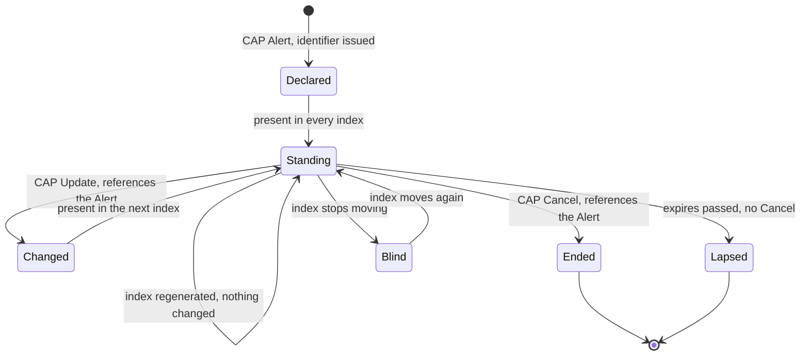

# What a machine-readable Polish alerting feed would have to be

Version: 3.2 / 2026-09-09
A specification, written from the position of someone who tried to build against
one, found nothing at first, and then found part of one behind a token. The
Ukrainian equivalent was consumed and measured over a corpus
of 118 days; the work of building against it is a weekend project, and the
parser at the centre of it took two afternoons. Both facts are stated because
the argument below rests on the second: what the convention enables is cheap
to exploit, and that is the point. Companion: [`docs/CHANNEL.md`](CHANNEL.md),
which is the measurement this rests on, and T8a in [`../TODO.md`](../TODO.md),
which is where the gap was first recorded. T8a is the survey this document
argues from. Its first source-level verdict, for the RSO stream, comes from
reading the stream on 2026-08-22 and is folded into sections 2 and 4a below.
The other Polish sources in
section 2 have not been read by this project; they are described from what
their operators publish about them, and each sentence says which it is.

```
Note: this document describes a feed that does not yet exist in the form it
      asks for. Poland's nearest counterpart, the RSO stream, was read and
      measured on 2026-08-22. Section 2 records that reading, section 8
      records the corrections this document has had to make, and the last
      entries of section 4a record what consuming the stream taught. The
      corrections are marked rather than silent. None of it is a claim about
      anyone's competence, and this document makes none
```

**How to read this, and who it is for.** The document has two parts and two
readers. Part I (sections 1 to 9) is the argument: what exists, what is
missing, what it cost to find out, and nineteen properties learned by
building a consumer against feeds that lacked them. It is written for the
person who decides whether a feed of this kind should exist. Part II
(sections 10 to 16) is the instruction: what the feed looks like element by
element, how one alert moves through it from the first message to the last,
and a checklist a publisher can run against a candidate before anybody
outside the building reads it. It is written for the engineer who has been
told to build it, and it assumes that engineer already publishes CAP, because
the operator of RSO does. An engineer in a hurry can start at section 10 and
come back to Part I when a rule in Part II needs its reason; every rule there
names the property it rests on. A Polish edition, `FEED-SPEC-PL.md`, stands
beside this file, `FEED-SPEC.md`, and is held to it section for section,
figure for figure, by a check in this repository's build, so the two cannot
drift apart without the build saying so.

## Contents

**Part I. The argument**

1. [The difference is a hashtag](#1-the-difference-is-a-hashtag)
2. [What is available on the Polish side today](#2-what-is-available-on-the-polish-side-today)
3. [The specification, which is mostly not mine](#3-the-specification-which-is-mostly-not-mine)
4. [Silence must not mean safety](#4-silence-must-not-mean-safety)
5. [The objection, and the answer](#5-the-objection-and-the-answer)
6. [What this is not asking for](#6-what-this-is-not-asking-for)
7. [How to disagree with this document](#7-how-to-disagree-with-this-document)
8. [Correction record](#8-correction-record)
9. [Sources](#9-sources)

**Part II. The instruction**

10. [The feed in one page](#10-the-feed-in-one-page)
11. [The life of one alert on the wire](#11-the-life-of-one-alert-on-the-wire)
12. [Three clocks, one format](#12-three-clocks-one-format)
13. [What makes one alert one alert](#13-what-makes-one-alert-one-alert)
14. [Where: the area as a code](#14-where-the-area-as-a-code)
15. [Serving it, and changing it later](#15-serving-it-and-changing-it-later)
16. [The conformance checklist](#16-the-conformance-checklist)

---

## 1. The difference is a hashtag

Measured, on 48,540 real messages from the public Ukrainian air-alert channel
over 99 nights ([`docs/CHANNEL.md`](CHANNEL.md)):

| Quantity | Value |
| --- | --- |
| Messages labelled with the affected area and its unit type | **99.34%** |
| Distinct area labels in the whole period | 127 |
| Labels resolving to a unique code in the state register | 126 automatically, 127 with one contextual decision |
| Agreement between the label and the message's own prose | **99.997%** on 38,521 comparable messages |

The label is a hashtag: `#Харківський_район`, `#Львівський_район`,
`#м_Харків_та_Харківська_територіальна_громада`. Nominative case, underscores
for spaces, unit type spelled out.

**What that convention cost the publisher: nothing.** It is a formatting rule in
a message a person writes anyway. **What it enabled on the receiving side:** one
person, over two afternoons, built a parser that resolves every area to a national
register code with a measured error rate of zero on the design window. No API,
no token, no agreement, no procurement, no funding.

The convention is in use in the public alert messages of a country under daily
attack on its own territory, and it adds nothing to a message somebody writes
anyway. That is the entire technical gap being described here.

## 2. What is available on the Polish side today

Stated without evaluation, because the point is the interface rather than the
institution.

| Channel | Reaches | Machine-readable |
| --- | --- | --- |
| Sirens | People within earshot | No, and cannot be |
| RCB alert (SMS) | Phones across the country | No. Free text to a phone |
| RSO stream (XML and JSON) | Anyone who finds the address | Yes. Read on 2026-08-22, with the gaps recorded in section 4a |
| RSO CAP resource | Holders of a token | In format, yes. The publisher's integration page documents the token; this project has not read the resource |

The RSO rows come from reading the stream and from the publisher's own
integration page. The sirens and the SMS are described from what their
operators publish about them. No claim below rests on a reading this project
has not made or on a document its publisher has not published.

**A correction to earlier editions, measured 2026-08-22.** This document used
to describe the RSO stream as closed. It is not. The service behind the RSO
application publishes its list pages as XML and JSON, publicly, with no token
and no registration, and its integration page says so in plain words. This
project read the stream in one evening, which is the strongest form a
correction like this can take.

The same evening showed why the stream, as published today, is not yet the
feed this document describes. No message says what it is: five categories
exist, but only in the address of the request, never in the record. No message
says who issued it, although two different kinds of authority publish into the
same stream. The scope named "all" quietly returns a fraction of the data. And
history thins to a handful of records per week across the whole country, so
the week this project most needed to look back at is already mostly gone. Each
of these is measured, and each has its own entry at the end of section 4a.

**Measured rather than assumed, 2026-08-09.** The full metadata catalogue of the
open data portal was downloaded and searched: 1,510,768 resources, filtered on
alarm, warning, siren, RCB, civil protection, crisis management and evacuation.
Twenty-nine datasets matched and none is a stream. The Government Centre for
Security is present in the catalogue and publishes two datasets, both documents,
neither flagged as dynamic data. IMGW publishes meteorological warnings, so that
category of warning did reach open data. Dynamic feeds exist on the portal and
the portal supports them: air quality is published with an API and flagged
dynamic. What is missing is not the capability and not the publisher; it is this
one category of data.

**What the publisher's own entries look like, measured.** The Government Centre
for Security publishes four resources across those two datasets: XML and HTML,
all at **openness level 3**, all with an update frequency of *not applicable*.
Read against the standard, that is not a formatting failure. XML is permitted at
level 3 and HTML is only discouraged above it, so the entries are correct. What
they are is **static documents**, correctly declared as such.

Read at the level of content on 2026-08-22, the four resources are: the
National Crisis Management Plan, the National Critical Infrastructure
Protection Programme with its standards annex, and a directory of
crisis-management centres with their contact details. Plans and contacts. Not
one dated event, and not one alert.

Level 3 is also the exact level at which the standard says API delivery is
recommended, precisely so that data can be machine-processed. The publisher is
therefore already at the threshold the standard describes, and publishing files.

The conclusion this points to is narrower and harder to answer than the one this
document originally reached for. **The gap is not competence, format or
platform. It is that alerting messages are not treated as data at all.** The
category exists on the portal for air quality, complete with a dynamic API. For
alerting it does not exist, and the publisher who would own it is already
present, already compliant, and already publishing something else.

The consequence needs stating more carefully than earlier editions of this
document put it, because this project has since built against the one stream
that exists. It is not that nothing can be built. It is that **alerting is
absent from the place where the state publishes data as data.** The stream
lives outside the catalogue, as the backend of an application: no entry, no
version, no stated schema, no stated retention, free to change shape without
notice. A research dataset, an accessibility tool for deaf users, a display
for a school, a check on how fast the system actually is - each can be
attempted against it, and each inherits every gap in section 4a with no
contract underneath.

This project hit that wall directly. The Ukrainian side of the border is
measured down to the raion, 118 days of it, 61,041 messages. The Polish side
is one evening old, and it cannot be built backwards: the stream's own
retention keeps a thin file, and the week of the July cruise-missile impact
survives in it as a handful of rows for the whole country. The asymmetry is
not about data volume; it is about whether the data is treated as worth
keeping.

The catalogue search is reproducible: download the portal's own catalogue
metadata, unpack, and filter the description fields. The command is in this
repository's history and the figures above come from running it, not from
browsing the site.

**Three questions this document cannot answer**, and none of them is
answered anywhere below: whether the CAP payload carries the affected area as
a TERYT code in `geocode` or only as a name or a polygon; whether the end of a
threat is published as a `Cancel` or `Update` message or is implied by
`expires` elapsing; and whether anything is published when nothing is
happening, which is section 4. A reading under a token would settle all three.
T8a in the backlog is that reading, and it has not been made.

## 3. The specification, which is mostly not mine

**Four of the five properties below are already required or recommended by the
Polish state's own technical standard for public data** (*Standard techniczny*,
Ministry of Digital Affairs, defining the minimum technical requirements for
public data published in the Central Repository of Public Information). This
section is therefore not a proposal. It is a note that an existing standard has
not been applied to one category of data.

The fifth property is genuinely absent from the standard, and it is the one that
matters most for alerting. It is marked as a gap rather than as a request.

| Property | Status in the standard |
| --- | --- |
| Public, no application process | Portal states that data may be re-used without submitting a request |
| Area by register code, not prose | The standard names TERYT as the authoritative register and defines the *universal address*, stating outright that it is not for human reading but for a system |
| Timestamped transitions | ISO 8601 required, `yyyy-mm-ddThh:mm` |
| Versioned schema, served over an API | Openness level 3 and above: API recommended, JSON per RFC 8259 with the JSON API standard; level 4 requires JSON-LD with full semantic context. A separate API Standard exists |
| **A heartbeat** | **Absent.** See section 4 |

The four rows above need no argument from me. What follows is the reasoning for
each in the specific case of alerting, and then the gap.

**Read against RSO, at 2.4.** The same five properties, with the status each
holds against the one Polish stream that exists. `[measured]` is this
project's reading of 2026-08-22; *unknown* is what that reading does not
settle, and section 2 lists what would.

| Property | Status against RSO |
| --- | --- |
| Public, no application process | Met by the XML and JSON list pages `[measured]`. Not met by the CAP resource, which the publisher's integration page places behind a token. This is the remaining gap |
| Area by register code, not prose | List pages carry the voivodeship as a slug and a name, no register code `[measured]`. Unknown for CAP, whose `geocode` can carry one |
| Timestamped transitions | Unknown for both resources; not measured on 2026-08-22. CAP has `Cancel` and `Update` for it |
| Versioned schema, served over an API | Largely met by CAP itself, a published versioned standard; the RSO profile of it, which optional elements are populated, is unpublished |
| **A heartbeat** | Unknown for RSO. Not defined by CAP, so not obtained by adopting it. Section 4 |

**One. Public, unauthenticated, no application process.** A feed behind an
application form is not public infrastructure; it is a permission regime with an
RSS icon. The Ukrainian channel needs no token, which is why anyone can verify
the measurements in this repository rather than take them on trust.

*Against RSO, at 2.4.* The CAP resource is behind a token, documented as
such on the publisher's own integration page. The XML and JSON list pages
carry no gate at all,
so the regime falls on the one resource that carries the structured form. It
is not a schema question, so no field closes it, and it is the property that
separates a system a municipality can build on from one it must ask to.

**Two. Areas identified by register code, not by prose.** The standard makes
this point better than I can: it introduces the universal address specifically
so that a system, rather than a person, can resolve a location, and it names
TERYT as the register that holds the codes. A message saying
`powiat biłgorajski` in a sentence forces every consumer to write a name
matcher and get it subtly wrong. This project spent a measurement
discovering exactly that: name
matching against a register reached 6.06% where the source's own structured
labels reached 99.34%.

**Three. State transitions, timestamped, both directions.** An alert beginning
and an alert ending are two events and both matter. A feed publishing only the
beginning leaves every consumer to guess when it is over, and guessing produces
the failure this project refuses everywhere: an unknown state resolving to a
safe-looking one.

**Four. A versioned schema, served over an API.** The standard already
recommends API delivery from openness level 3 and warns, in its own words, that
level 3 data still requires a human to work out what each field means. Alerting
data is exactly where that ambiguity is expensive, which is the argument for
going to level 4 rather than stopping at a published file.

**Five. A heartbeat.** Not in the standard, and the standard is not wrong to
omit it in general: it describes how a *dataset* is formatted and described,
which is a different problem from how a *stream* signals that it is alive.
DCAT-AP carries `accrualPeriodicity`, but that is a declared update frequency in
the metadata, not a signal in the data. For alerting the difference is the whole
thing, and it is section 4.

## 4. Silence must not mean safety

The single most important property, and the one that is invisible until the day
it matters.

If a feed publishes only when something happens, then **a dead feed and a quiet
sky look identical**. Every consumer that renders silence as "nothing is
happening" is one outage away from telling people they are safe at the moment
they are not. This is not hypothetical: it is the founding invariant of this
repository, that unknown never resolves to clear, and several entries in its
defect log are instances of getting it wrong internally.

The fix is trivial and has to be designed in from the start: a periodic
heartbeat carrying "as of this timestamp, the state is X", published whether or
not the state changed. A consumer that has not seen a heartbeat within the
stated interval knows it is blind, and can say so, instead of displaying calm.

An alerting feed without a heartbeat is a system that fails silently by design.

**Measured, and it is worse than the argument above assumed.** This project
ran its own collector against the Ukrainian channel unattended for a night and
counted: **eleven of ninety-five polls failed** in a twelve-hour journal, and
nine of sixty in the two-hour window measured most closely. Consecutive
failures happen; the longest run was two and the longest gap between
successful reads was seven minutes, against a ten-minute staleness threshold.

That first-night rate is close to where the figure settled, but it took a
correction to get there. A later release read a much lower rate from a
different window and pinned it; reconciling the windows against each other put
the rate back at roughly one poll in nine, and withdrew the lower pin as
wrong by two orders of magnitude (F109 in the defect log, with the current
figures in this repository's README and `docs/DEPLOYMENT.md`). Worth saying
plainly, because the paragraph below argues from a consumer's failure rate
being knowable at all.

The number that matters is not the failure rate. It is that **the consumer
could tell**, on every one of those eleven occasions, because the channel
publishes continuously enough that absence is legible. A feed that publishes
only on transitions would have made all eleven indistinguishable from a quiet
sky, and the consumer's own instrumentation could not have recovered the
difference from the outside at any cost.

The heartbeat is therefore not a courtesy to consumers who want a liveness
signal. It is the only thing that makes a consumer's error rate measurable at
all.

**Measured again, upstream this time.** This block was added at 2.3, after the
section's failure mode stopped being an argument and became a date. On
2026-08-29 at 04:55 UTC the Ukrainian channel itself stopped publishing - not
a failed poll on the consumer's side, the publisher - and stayed silent
through an attack wave that independent reporting measured at over a day.
Three things followed, and each is a property of this section rather than of
that channel.

First, **the silence was legible**, for exactly the reason argued above: a
source that publishes continuously enough makes absence a signal, and this
project's page spent those hours saying its picture was old and how old,
rather than drawing calm. A transitions-only feed would have made the same
thirty-four hours indistinguishable from a quiet sky, on the consumer's side,
at any cost.

Second, **the replacement was a transitions problem in reverse.** The official
API this project switched to publishes a full-state snapshot and says nothing
about what ended, so every all-clear must be synthesised from the difference
between two observations - and that is only safe when the previous observation
provably happened. The consumer ends up building the heartbeat the feed does
not carry: a persisted observation with an age ceiling, past which the gap
licenses nothing. A feed designed with the heartbeat inside it makes no
consumer do this, and every consumer of one without it must, independently,
or fail silently.

Third, **the access regime was part of the availability.** The switchover took
under a day only because a key to the alternative had been requested weeks
earlier and granted before it was needed. Had the application process started
the morning the channel died, its duration would have been the outage. None of
this softens property one: publicness is about who may verify, the heartbeat
is about who can tell the feed is alive, and 2026-08-29 is the measurement
that they are different properties - the tokenless source was the one that
died, and its death was the one thing about it a consumer could read.

**Measured a third time, and the instrument was the consumer's own attempt
log.** Added at 2.5. The channel returned from its silence of 2026-08-29 - on
a date this project did not record, which is a finding about this project -
and stopped again on 2026-09-07 at 06:09 UTC `[measured]`. This time the
consumer could say which side was silent, and could say it from storage rather
than from the sky: the attempt log (property nine) recorded 43 new post
identifiers in the 69 minutes before the stop, then the same identifier on
4,463 consecutive successful reads through the evening of 2026-09-08, against
592 identifiers in the control day before. Not one refusal in the window. A
healthy pipe reading a silent publisher, as a pair of numbers.

Two things follow. First, the state file this project publishes now names its
sources one by one and says, per source, whether the pipe is delivering and
when it last ingested an event, so a reader can be told "the primary is
delivering, the watchman is silent" instead of an age with no attribution.
Second, the instrument that settles a publisher's return is the feed's own
page identifier in the attempt log, not the first classified event: a
publisher that returns with content the classifier does not read produces no
event row and is back all the same. This project wrote the wrong instrument
into two of its own documents on the day of the measurement and corrected it
the day after; the correction is recorded here because the mistake has exactly
the shape this section warns publishers about - looking for life in the wrong
place and reading its absence as silence.

**Why the standard does not cover this, and why that is not a criticism of it.**
The technical standard describes how a dataset is formatted, described and
licensed. A dataset is a thing that sits still; a stream is a thing that must be
observed to be running. The two need different guarantees, and only the first is
in scope. DCAT-AP's `accrualPeriodicity` declares an intended update frequency
in the metadata, which tells a consumer what to expect and nothing about what is
happening now. For most public data that gap costs nothing. For alerting it is
the difference between a quiet night and a dead system, and a consumer cannot
tell them apart from the outside.

## 4a. Properties learned by shipping, not by specifying

Sections 1 to 4 were written before this project had a consumer in production.
It has had one since 2026-08-11, and five requirements emerged that the
original five did not cover. They are numbered separately because they are
weaker claims: each rests on one deployment rather than on a corpus. Nine and
ten were added at 1.5, from consuming two further interfaces: one reached under
a revocable agreement, one metered. Eleven was added at 1.6, after a category
field was mistaken for a description of the threat - by this project, in
writing, twice. Twelve was added at 1.7, after measuring how often the source
names a means of attack at all: the answer bounds what any consumer of such a
feed can display, and it is not a number a parser can improve. Thirteen and
fourteen were added at 1.8, from two defects found in this project's own
contract on one day, both of the same shape: a fact the publisher held and the
consumer could not use. Fifteen and seventeen were added at 1.9, the
first entries drawn from **reading a Polish source rather than a Ukrainian
one**; their evidence is a single evening against one endpoint, which makes
them narrower than the rest, and that is said here rather than buried. Sixteen
was added at 1.9 and withdrawn at 2.0. The stub below says why, because a
withdrawal recorded openly is part of the same discipline these properties ask
of a publisher. Eighteen and nineteen were added at 2.5, both from the
Ukrainian source changing under this project's collector on 2026-09-06: one
from what the change broke, one from what it published.

**Six. A cap, published, and a flag saying when it bound.** Learned in
production.

The producer here caps its event window at 5,000 and publishes a `truncated`
flag. Building the consumer showed why both halves are necessary. Without the
cap, a window that grows for any reason - a clock skew, a backfill, a schema
change - is unbounded work for every reader at once; measured on the site, an
unbounded window rendered a 5.6 MiB page from 20,000 events. Without the flag,
a bounded list and a quiet window look identical, which is section 4's failure
wearing a different hat.

**The consumer must also bound it independently**, which is the part that is
easy to get wrong. This project's own site delegated the bound to the producer
and did not check it, and the two are deployed separately by hand. A limit
that lives only on the publishing side is a limit that holds until the day the
two versions differ.

**Seven. The window's left edge, published rather than derived.** Learned in
production.

A feed carrying "here are the transitions in the last twenty minutes" is not
enough. The consumer needs the timestamp the window starts at, because a
device that was asleep for twenty-five minutes cannot otherwise tell a gap
from a quiet stretch, and neither can the person holding it. Deriving the edge
from the publication time works only while the consumer's clock and the
producer's agree, and the case that matters is exactly the one where the
consumer has been away.

Cost to the producer: one field. Value to the consumer: the difference between
"nothing happened" and "you did not see what happened", which is section 4's
invariant applied to the reader rather than to the system.

**Eight. A version policy that says what happens during the changeover.**
Learned in production, and it cost a deployment window.

The fourth property asks for a versioned schema. That is necessary and not
sufficient. When this project moved its own contract from v2 to v3 the payload
was a strict superset - every field a v2 consumer required was still there -
and the consumer still refused it, correctly, because it refuses versions it
does not recognise. The two had to be deployed inside one window with the
producer first by minutes, and the page was blind in between.

A version number without a stated overlap period pushes that coordination onto
every consumer, and a public feed has consumers it has never met. What the
policy has to state: how long the previous version keeps being served, what
ends that period, and whether a consumer may treat an unknown minor version as
readable. This project has not written its own policy yet, which is recorded
in its backlog as the unfinished half of the task that introduced v3. The
omission is survivable here because there is one consumer and the same author
controls it. That is exactly the circumstance a public feed does not have.

**Nine. If there is no heartbeat, the consumer owes one to itself.** Learned
in production, and the repair was built before this was written down.

The fifth property is the publisher's. A consumer facing a feed that does not
have it is not excused from section 4's invariant, and the consumer-side
equivalent is an **attempt log**: a durable record of every poll made,
successful or not, kept beside the record of what those polls returned.

Without it, an hour in which nothing was reported and an hour in which the
consumer's own process was dead are the same empty set in storage. No care at
rendering time recovers that distinction, because the information was never
written. With it, three states are distinguishable rather than two:

| Attempt log | Observation record | What the consumer may say |
| --- | --- | --- |
| Polls present | Observations present | What was observed |
| Polls present | None | Nothing was reported, and the consumer was watching |
| No polls | None | The consumer was not watching. Unknown |

**A failed poll is recorded as an attempt with no result, not as an attempt
that returned zero.** The schema has to make those two representable
differently or the distinction collapses back at the first timeout: in this
project's ADS-B sampler the result count is null for a failure and zero for an
empty response, and a regression exists whose data can tell them apart. That
sampler is where this property was learned, which is why it arrives at 1.5 and
not earlier.

This one generalises furthest of the ten. It costs one table and it is owed by
any consumer of any feed without a heartbeat, including this project's own.

**Ten. A stated access budget, if there is one, and a statement if there is
not.** Learned in production.

A feed that meters access makes the consumer's **coverage** a function of the
consumer's quota. A consumer polling on a schedule against a daily allowance
either knows how much of it remains, in which case it can say honestly what its
sampling density was and where it lapsed, or it does not, in which case its own
completeness is unknown to it and any gap in the record is unattributable: the
publisher, the network, or an allowance that ran out at four in the afternoon
are three different findings and they look identical.

Publishing the limit, and returning the remaining allowance in a response
header, costs a header and turns an unattributable gap into a diagnosable one.

The property is equally satisfied by having no meter and saying so. "No limit,
no throttling, poll as often as you find useful" is a complete answer, and it
is what the Ukrainian channel provides by having no gate at all. What fails the
property is a limit that exists and is not stated, because a consumer then
discovers it by being cut off.

**Note on the first property, from the same experience.** Section 3 argues that
an application process is a permission regime with an RSS icon. This project
has since consumed the other kind under terms revocable without cause, and the
cost is sharper than the original wording suggests: **reproducibility becomes a
property of the interface rather than of the consumer's diligence.** A second
reader cannot re-run a measurement that rests on an agreement they were not
party to and may not be granted. The Ukrainian channel's measurements in
section 1 are checkable by anyone. The ones resting on a keyed interface are
checkable by whoever holds the key.

**Eleven. A category must say what it does not distinguish.** Learned in
production, by getting it wrong.

A feed that labels an alert with a category invites every consumer to treat
the category as a description of the threat. It usually is not one, and the
gap is invisible from the field alone.

The concrete case. The upstream behind the Ukrainian alerting apps publishes
five categories: air alert, artillery, street fighting, chemical, radiological.
A consumer reading `AIR` learns that something airborne was declared. It does
**not** learn whether that something is a drone, a glide bomb, a cruise
missile, a ballistic missile, a MiG-31K takeoff, or a threat from the sea. All
of those are `AIR`. The single most asked question about an alert - what is
coming - is precisely the question the category does not answer, and nothing
in the field, its name, or its documentation says so.

This project spent effort twice on the assumption that it did: once planning to
fill a gap in its own classification from that field, and once again in a
written recommendation before anybody read what the values mean. Both times the
field looked like an answer because a category and a kind are the same shape -
a short enum on an alert - and nothing distinguished them.

**What a publisher owes here is one sentence per category, not a taxonomy.**
"Air alert: any airborne threat, including means this feed does not
distinguish." That sentence costs nothing to write and removes a class of
consumer error that no amount of care on the consumer's side prevents, because
the consumer cannot see what the category collapses.

**And what a consumer owes, which is the harder half.** A category must never
be rendered as a closed set of the kinds it might contain. The temptation is
strong and looks like generosity: this project came close to drawing three
icons - drone, glide bomb, missile - beside an alert whose kind was never
declared, so a reader could see what it might be. Three icons assert **"one of
these three"**. The source said no such thing, and `AIR` does not mean it.
Drawing them would have been prediction in the form of iconography, which is
the same failure as an arrow showing a bearing the feed never published.

Text can hold an open set because it has the words "or something else". A row
of symbols cannot, and no arrangement of symbols supplies one. Where a consumer
does want a visual for an undeclared kind, the honest form is **one symbol that
reads as a key rather than an enumeration**, with the open end stated in words
beside it. That is what this project shipped, and the reasoning is in its
consumer's defect log rather than here because the decision is the consumer's;
what belongs in a specification is the property that made it necessary.

**Twelve. A classification ceiling belongs in the specification, because it is
a property of the source and not of the reader.** Learned in production.

Over 61,041 messages across 118 days, this channel carried an alert state in
52,589 of them and a means-of-attack marker in 7,428. Eight stems resolve
98.3% of the marked messages; the residue is 122 messages, 0.2% of the corpus,
and reading them shows they are all-clears carrying continuation lists, which
name no means because there is none to name. Join coverage across the whole
corpus is **0.187**, and it does not move with the join window: 1 hour and 24
hours both give 0.187, so the parameter that was assumed to govern it governs
nothing.

The number that matters is what it bounds. **Roughly four alerts in five will
carry no declared kind, and no parser can change that**, because the source
does not say. This project reached that conclusion the expensive way: a list
of plausible additional vocabulary was proposed from general knowledge of the
war - specific missile designations, carrier aircraft, launch phrasing,
direction and count - and measured against the corpus. Every one of them
occurred zero times. Two of twenty-five candidates occurred at all, eight
times between them. The list was not partly right; it was a description of how
this war is reported elsewhere, mistaken for how this channel writes.

Two consequences for a specification.

**For a publisher.** If a feed can express a kind, it should publish how often
it actually does, as a measured share rather than as a promise. A field that
is populated one time in five is not a broken field, but a consumer that
discovers this from its own traffic has already built an interface around the
wrong expectation. Publishing the share costs one line and is the difference
between a nullable field and a field that is usually null.

**For a consumer.** The undeclared case is the *normal* case and has to be
designed for as such, not handled as an exception. That means the words for
"the source did not say" are load-bearing interface text seen more often than
any kind name, not a fallback. It also means that wanting richer detail is a
question about **sources**, not about parsing: when the ceiling is set by what
the channel writes, the only way through it is another channel, with whatever
that costs in dependencies, terms, and privacy posture. Better parsing of the
same feed cannot buy what the feed does not contain.


**Thirteen. One null, one meaning - and where absence is a second fact, it
needs a second field.** Learned in production.

This project's feed carries `last_alert_ended_at` per oblast inside a trailing
window. Null there means *no episode closed inside the window*, which is not
the same as *this oblast was not counted at all*, and the two are not
distinguishable from that field alone. The consumer needs both facts to write
an honest sentence: it renders "no alert closed inside this window" for the
first and stays silent for the second, and it can only tell them apart by
reading the count field beside it. That works, and it works by accident: the
schema never said so, and a consumer that reasoned from the timestamp alone
would have printed the wrong sentence with no way to notice.

Specify a null's meaning per field, in words, and where a field's absence
encodes a different fact from its null, say which other field carries it. The
alternative is what happened here: a correct implementation that could just as
easily have been an incorrect one, with nothing in the contract to decide.

**A corollary worth its own line: a field nobody reads is untested contract
surface.** `last_alert_ended_at` shipped in every payload from the day
trailing counts existed and no line of the consumer ever read it - not a bug
in either side, just a capability sitting on disk while the interface it was
meant for said nothing. The contract check verified that the fields the
consumer *needs* are present, which says nothing about fields the publisher
sends and nobody consumes. Both directions are worth checking, and the second
one costs a script: walk the payload, and require every key to be either read
or explicitly listed as tolerated with a reason.

**Fourteen. A number publishes its denominator as a field, beside it.**
Learned in production.

The same feed publishes a count of alerts over a trailing window, and the
window length as `window_days`. That is right, and the reason is visible in
what happened when the consumer needed both: for two releases the count
existed on the page only inside a sentence of prose, so the first interface
that wanted the number would have had to parse the sentence to get it - and
the sentence also contains the window length, so the obvious parse returns the
wrong number.

The rule generalises past this feed. Any aggregate - a count, a rate, a
maximum - is meaningless without the interval it was taken over, and the
interval belongs in the data as a field rather than in the label. Prose is for
readers; a consumer that has to read prose to recover a number is a consumer
that will eventually recover the wrong one.


**Fifteen. A category is a property of the record, or it does not exist.**
Learned by reading the RSO stream on 2026-08-22.

The Polish RSO feed publishes five categories. They are real: they partition
the data, they appear in the address, and the publisher's own documentation
lists their slugs at a dedicated endpoint. **None of them appears in a
communique.** Measured across the 156 messages the "all" scope returns, not
one carried a category field:
`type` is present and empty in all 156, `rso_icon` likewise. The only way a
consumer knows what a row is, is to remember which URL returned it.

The same holds for the author. Since April 2024 the Government Centre for
Security has published into this feed, and the system's own published
description names it, alongside the ministry, as responsible for the
nationwide messages, while the voivodeship crisis centres publish the rest.
That division is what the publisher publishes about itself rather than
something this project measured.
**No field distinguishes them.** A consumer that wants to label a warning with
who issued it cannot, and a consumer that labels the whole block with one
issuer's name is wrong about most of it.

This is not a request for a rich taxonomy. It is the observation that a
publisher which already classifies, already routes by that classification, and
already publishes the vocabulary as a document, leaves it out of the one place
it would cost nothing: the record. One field per message, drawn from a list
that already exists.

**What it costs the consumer to work around, precisely.** Five requests instead
of one, plus bookkeeping to remember which request produced which row, plus the
certainty that any consumer who does not know to do this has silently mislabelled
everything. The workaround exists. That it exists is not an argument against the
field; it is a measure of what the missing field costs, multiplied by every
consumer.

**Sixteen. Withdrawn at 2.0.**

As shipped at 1.9, this entry asked publishers to state which address families
their endpoints answer on. The measurement behind it was real: the Polish
state sources read that evening publish no IPv6 addresses, while every source
this project consumes publishes both. But the failure that prompted the entry
was this project's own network, configured for the sources it was built to
reach and for nothing else. A specification aimed at publishers is not the
place to file a consumer's configuration lesson, and a document with this
one's exposure should not carry its weakest claim at the same rank as its
strongest.

What survives of it is consumer-side and lives in this repository's defect log
rather than here: the name resolving is not the host answering, and in a log
the two look the same.

**Seventeen. A parameter the server does not honour must be refused, not
accepted.** Learned by reading the RSO stream on 2026-08-22, and it is three
findings wearing one shape.

Three ways this feed returned a partial answer indistinguishable from a
complete one, in a single evening of reading it:

- **A scope named "all" that is not all.** The five categories hold 461
  distinct communiques and share none. The `wszystkie` scope returns 156. The
  305 it omits are one category, and nothing in the payload, the pagination
  block or the integration page mentions the omission. A collector reading the
  obvious address reads a third of the feed and has no signal that it did. The
  exclusion may well be deliberate - the site's own navigation treats water
  levels as a separate tab - and deliberate-and-unstated is exactly the
  problem: the scope is still called *all*, in a path where the excluded
  category is a legal value of the same parameter, and nothing a consumer can
  read says otherwise.
- **A count named for the total that counts the page.** The pagination
  attribute is `totalItems`. On page 1 it reads 20; on page 2 it reads 20; on
  the unpaged request over the same data it reads 156. A consumer deriving a
  page count from it divides 20 by 20 and stops after one page of eight. The
  stop condition that does work is an empty page, which the endpoint returns
  with status 200.
- **Date parameters that are accepted and ignored.** The publisher's
  integration page documents `from` and `to` for its search interface. Passed
  to the XML endpoint, which accepts them without complaint, with a seven-day
  window, the response was 200 and contained 150 records spanning seven
  months, of which ten fell inside the window. A consumer counting rows sees a
  plausible number and concludes the filter works.

The third is the worst because it is the cheapest to prevent. **An unrecognised
parameter should produce a 400, not a 200.** Silently ignoring it converts a
consumer's mistake into a consumer's false belief, and the false belief
survives every check the consumer knows how to run: the request succeeded, the
data parsed, the count was reasonable.

The general property: **where a request can be partially honoured, the response
must say so in the response.** A flag, a status, an echo of the parameters
actually applied. Any of them costs one field. Without one, every consumer of
every such endpoint is one plausible number away from a wrong conclusion it
cannot detect, and the correct-looking result is indistinguishable from the
correct one by construction.

This is section 4's invariant moved from the feed's contents to the feed's
protocol. There, silence must not mean safety. Here, **a partial answer must
not look complete.**

**Eighteen. A field that changes meaning changes name, and a consumer counts
the keys it cannot read.** Learned on 2026-09-08 from the Ukrainian API, two
days after it changed under this project's collector `[measured]`.

On 2026-09-06 the API attached to every alert a list of level records - the
two-level scheme introduced by the Ukrainian government's Resolution No. 1092
of 2026-09-04 - and began bumping the alert's existing `lastUpdate` stamp
whenever the level changed. Since the switchover the adapter had read
`lastUpdate` as the alert's start, correctly: until that day nothing updated
an alert in place. Measured on 2026-09-08: a city went yellow at 17:22:35 and
red at 18:01:01, and its `lastUpdate` read 18:01:00. Seven alerts in one
payload were dated from their escalation rather than their start, and not one
check failed, because every check read only the keys it knew.

Two halves. The publisher's: a field whose meaning changes is a new field, or
a version bump on the record, or both. The rename rule this project applies
to itself - every read site keeps the old reader for two minor versions - has
this as its other side, and the cost is a name. The consumer's: a canary.
Every key on a record that the parser has no reading for is counted per poll,
printed in the recap and persisted with the attempt row, so that the next
unannounced key is visible on the day it lands rather than on the day someone
opens a payload by hand. Both halves are cheap; the two days between the
change and its discovery were not.

**Nineteen. A severity is the publisher's word, carries its own timestamp,
sits beside the state and never inside the identity.** Learned from the same
change, read for what it publishes rather than for what it broke `[measured:
one captured payload of forty alerts, and the rows stored since]`.

The level records are a list per alert; the list's order does not encode
time; each record carries a level, a free-text reason that repeats the level
in parentheses about as often as it says anything, and the moment the record
was created. A level changes inside an alert with no end event and no new
alert. Six of the forty alerts carried a `Red` dated between 2022 and August
2026 with no other mark of age.

What that settles about a severity field, in four sentences a publisher can
adopt:

- **The word is published verbatim and the vocabulary is open.** A consumer
  mirrors the publisher's string and treats one it does not recognise as
  unknown, never as the nearest colour it knows: property eleven's rule,
  applied to a second field.
- **Every level record carries the moment it was declared.** A severity
  without a timestamp is a colour of unknown age, and the six old `Red`
  records are what that looks like: a consumer painting them draws a threat
  declared in the war's first year as if it were tonight's.
- **The reason stays a separate field.** Text that explains a level is not
  the level, and a consumer that parses one for the other will find both.
- **An escalation is not a new alert.** The identity of an episode is the
  alert. A consumer that keys its rows on the level as well opens a ghost row
  on every escalation - seven in the payload above. The level is a property
  of the row and is re-read; the row is the alarm, which did not change when
  its colour did.

And the consumer's half, which this project holds for itself: **a severity is
captured before it is shown.** The rule for what a reader sees is written
against stored rows rather than against one captured payload, because a rule
written from a shape assumed is the class of defect the preceding property
records. Until then the page says the level is coming, and says whose level
it will be.


## 5. The objection, and the answer

**"A public alerting feed helps an adversary measure our response."**

The objection deserves an answer rather than a dismissal, and there is one.

Ukraine publishes considerably less than section 3 asks for - a public
channel with a naming convention, no register codes, no schema, no heartbeat -
and has done so throughout the war, under an adversary attacking daily. That
is where this objection has most force, and it is where the answer to it is
being tested in practice rather than argued.

Closer to home: the alert state is already observable to anyone with ears, a
window, or a phone. Sirens are audible, the statutory SMS reaches phones
across the country, and both are public the moment they are issued. What is
currently unpublished is not the information. It is **the format**.

An unreadable format does not protect an adversary's target from being
observed. It excludes citizens, researchers, municipalities and accessibility
tooling from using information that was already published, while an adversary
with a receiver, a phone, or someone standing outside is unaffected.

If some specific field genuinely carries risk, the answer is to specify that
field out of the feed and say so, which is what a specification is for. It is
not an argument against publishing the rest.

## 6. What this is not asking for

- **Not a new system.** RSO exists, is operated, and its integration page
  documents a CAP resource. What is asked concerns which categories it
  carries and who may read the structured form.
- **Not new legislation.** The Act on civil protection and civil defence of
  5 December 2024 provides for public warning by fast digital transmission;
  section 9 records that its published wording has not been read against this
  claim.
- **Not a change to who decides.** The state decides what an alert is and when
  to issue one. This concerns the format in which an already-taken decision is
  published.
- **Not a new detection system, sensor or budget line.** The information exists
  the moment the siren sounds.
- **Not an obligation on anyone to consume it.** A feed nobody reads costs
  nothing; a feed that does not exist costs every potential reader.
- **Not a replacement for anything.** Sirens will remain the fastest channel to
  a person who is asleep, and nothing here changes that.

## 7. How to disagree with this document

Written as a specification rather than an opinion so that disagreement can be
specific. Useful forms:

- A property in section 3 that is wrong, or one that is missing and turns out to
  matter in practice. Note that four of the five are quotations of the state's
  own technical standard, so disagreement there is disagreement with that
  document rather than with me.
- A concrete reason why TERYT codes in the payload are harder than they look.
- A pointer to a Polish source that already meets some of this and that the
  author has not found. **This is the most useful reply this document can
  receive**, and section 8 says what happens when one arrives.
- An answer to any of the three questions left open at the end of section 2.
- Evidence that the security objection in section 5 has a stronger form than the
  one answered here.

Corrections to this document are recorded like every other finding in this
repository: with what was wrong, who found it, and what changed.

## 8. Correction record

Section 7 says a pointer to an existing Polish source is the most useful
reply this document can receive, and that a correction would be recorded like
any other finding: what was wrong, who found it, what changed.

| Field | Entry |
| --- | --- |
| Editions corrected | 1.0 / 2026-08-09 to 2.3 / 2026-08-31 |
| Correction issued | 2.4 / 2026-09-04 |
| Found by | this project's own reading, and a reply from outside it |
| Reproduced here | the reading, yes; the reply, no |

**What was wrong.** Every edition to 2.3 opened by saying there was nothing
to build against, and from 1.9 that sentence stood above a section that had
already found and measured the RSO stream (F142). That correction is section
2's, and it rests on a reading anyone can repeat.

**A second correction arrived from outside this project and is not
reproduced.** It came as correspondence rather than as a publication. What a
body states about its own systems, in a reply to one person, is that body's to
publish; a specification arguing for public data is the wrong place to publish
it on the body's behalf, and the argument here does not need it. Editions 2.4
to 3.1 did reproduce it. That was a mistake, the material is removed at 3.2,
and this paragraph is the record of it, because the earlier editions are
public and pretending otherwise would be a second mistake. What survives is
what this project measured or what its publisher publishes.

**What did not change.** The five properties, and nothing in sections 1 to 7
that the removal touches: the argument rests on the reading of 2026-08-22 and
on the state's own standard, both of which anyone can check.

**Edition note, 3.0.** Not a correction. Part II was added, and a Polish
edition beside it. Nothing in sections 1 to 9 changed on substance; the
header and the contents did. The reason for the addition is the audience: a
body that already publishes CAP and would be the one to carry a category of
this kind. To such a reader an argument is less useful than an instruction,
and an instruction in English is less useful than one in Polish.

**Edition note, 3.1.** The Polish edition was rewritten. As shipped at 3.0 it
was a translation rather than a document: it carried English figures of
speech in Polish words, and one term - the heartbeat of section 4 - had been
rendered as an anatomical phrase. The parity check in this repository's build
holds the two editions to the same structure and the same figures and has
nothing to say about whether either reads as prose in its own language; the
limit is stated here because 3.0 passed the check and still needed a reader.

**Edition note, 3.2.** Two removals and four corrections, none of them to the
argument. Part II withdrew a recommendation it had no basis for, corrected
two statements about CAP's own structure, corrected a measured figure it had
reported wrongly, and withdrew a claim about this project's own version
policy that property eight contradicts two sections earlier. A document that
asks a publisher to say what its fields do not distinguish has to hold itself
to that standard in the part that tells the publisher what to build.

## 9. Sources

- RSO integration documentation, <https://komunikaty.tvp.pl/Info/Integration>,
  read 2026-08-22 and 2026-09-02. Cited for: the public availability of the
  XML and JSON resources and the token on the CAP resource.
- Common Alerting Protocol, OASIS, the current version. Cited for the
  elements named in section 3.
- Act on civil protection and civil defence of 5 December 2024. Cited in
  section 6 for the existence of a statutory basis for public warning by fast
  digital transmission. Its published wording has not been read against that
  citation, and the sentence stands as `[unverified]` until it has.
- [`docs/CHANNEL.md`](CHANNEL.md), for every measurement in section 1.

---

# Part II. The instruction

Everything in this part is a consequence of something in Part I, and each
rule says which. Where Part I is careful to mark what was measured and what
was reported, Part II is prescriptive on purpose: it says *do this*, and the
reason is one click away. The examples are written against CAP because the
publisher this is addressed to already emits it, and because a specification
that asked for a new format would have been asking for a new system, which
section 6 says it does not. Nothing below requires leaving CAP. Two things
below require adding to it, and both are said in the open.

## 10. The feed in one page

A feed of this kind is three things, and the second is the one CAP does not
give you.

**The messages.** One CAP document per alert event: an alert declared, an
alert changed, an alert ended. These already exist in RSO; what Part II adds
is a profile - which of CAP's optional elements are always filled, with what,
so a consumer does not have to guess. The profile is section 10.1.

**The index.** One small document, regenerated on a fixed cadence whether or
not anything happened, listing every alert currently in force and the moment
the list was made. This is the heartbeat of section 4 and the full-state
snapshot that property seven asks for, in one file. CAP does not define it and
does not need to; it sits beside the messages, not inside them. It is section
10.2, and it is the one addition this document insists on.

**The history.** The messages, kept, for long enough that a reader can ask
what happened last week. Section 2 measured what happens without it: a
country's worst week surviving as a handful of rows. Retention is a number
the publisher states, not a behaviour the consumer discovers. Section 15.

### 10.1 The message profile

CAP 1.2 has a long list of elements and most of them are optional. A profile says which
ones this feed always fills and what goes in them. The table below is the
whole of it; the paragraphs after it are the reasons, each pointing at a
property in Part I.

| Element | Always | Filled with | Rests on |
| --- | --- | --- | --- |
| `identifier` | yes | one string, unique for the life of the feed, never reused | section 13 |
| `sender`, `senderName` | yes | the issuing authority, as an address and as a name; two authorities, two values | property fifteen |
| `sent` | yes | the moment this message was issued, ISO 8601 with a UTC offset, never local time without one | section 12 |
| `status` | yes | `Actual` for a real alert; `Test` and `Exercise` are legal values a consumer must be able to drop | section 16 |
| `msgType` | yes | `Alert` when it begins, `Update` when it changes, `Cancel` when it ends | section 11 |
| `references` | on `Update` and `Cancel` | the `identifier`, `sender` and `sent` of the message this one changes or ends | section 13 |
| `category` | yes | one value from CAP's own list, named in the profile; `Safety` and `Security` both fit an air-strike threat, so the choice is the publisher's and belongs in writing | property fifteen |
| `event` | yes | a fixed string from a published list, one per kind of alert; the vocabulary is a document, not a convention | property eleven |
| `urgency`, `severity`, `certainty` | yes | CAP's own words, verbatim; `Unknown` is a legal value and is used when it is true | section 13, property nineteen |
| `effective`, `expires` | yes | when the alert took effect and when it will lapse if nothing else is said; `expires` is a ceiling, not an end event | section 11 |
| `area/geocode` | yes, at least one | `valueName` = `TERYT`, `value` = the register code of the affected unit, one `area` element per unit | section 14 |
| `area/areaDesc` | yes | the unit's name, for people; never the only way the area is given | section 14 |
| `polygon`, `circle` | optional | a shape, if the decision was taken on one; never instead of a code | section 14 |
| `headline`, `description`, `instruction` | yes | the text a person reads; free, in Polish, with `language` set on the enclosing `info` block | section 11 |

**Why `identifier` never comes back.** A consumer keeps what it has seen by
that string. A reused identifier is two alerts wearing one name, and every
consumer that deduplicates - which is every consumer that has run for more
than a day - will drop the second one on the floor. Section 13 has the
measurement.

**Why `Update` references the original and does not replace it.** An alert
that changes severity is the same alert. Section 11 walks it through. The
`references` element is how CAP says so, and a consumer that keys its rows on
`(identifier, severity)` instead of on `identifier` opens a ghost on every
escalation; property nineteen counted seven in one payload.

**Why `event` is a list you publish and not a word you choose.** Property
eleven: a category tells a consumer that something was declared and not what
it was, and nothing in the field says so. The remedy is one sentence per
`event` value in a document the consumer can read, of the form "air-strike
threat: any airborne means, including means this feed does not distinguish".
The list is short, and writing it is a smaller job than answering the
questions its absence produces. Not writing it is every consumer guessing, in
different directions.

**Why `Unknown` is used when it is true.** CAP allows `severity`, `urgency`
and `certainty` to say `Unknown`. A feed that always writes `Severe` because
the schema wants a value is publishing a colour it does not have; property
nineteen shows what a colour of unknown age looks like from the other side.
Unknown is a legal reading and the honest one when the authority has not
decided.

### 10.2 The index

```json
{
  "schema": "pl-air-alert-index/1",
  "generated_at": "2026-09-09T11:21:48+02:00",
  "valid_for_s": 120,
  "publisher": "RSO",
  "active": [
    {
      "identifier": "RSO-2026-09-09-000123",
      "teryt": "0602",
      "sent": "2026-09-09T11:21:48+02:00",
      "severity": "Severe",
      "severity_at": "2026-09-09T11:21:48+02:00"
    }
  ],
  "window": {
    "from": "2026-09-09T11:01:48+02:00",
    "to": "2026-09-09T11:21:48+02:00",
    "truncated": false
  },
  "counts": {
    "active": 1,
    "ended_in_window": 0,
    "unresolved": 0
  }
}
```

Read it field by field, because each one is a property from Part I with a
name on it.

- `generated_at` is the heartbeat. It moves on every regeneration, on a
  cadence the publisher states, whether the list is empty or not. A consumer
  that sees it stop moving knows the feed is blind, and can say so. An empty
  `active` list with a fresh `generated_at` is a quiet sky. The same list with
  a stale one is nothing at all. Section 4, in one field.
- `valid_for_s` is the ceiling the publisher puts on its own silence: the
  number of seconds after `generated_at` beyond which a consumer must stop
  treating the picture as current. It is published, not inferred, because a
  consumer that guesses the cadence guesses wrong on the day the cadence
  changes.
- `active` is the full state. Everything in force, every time. A consumer that
  was asleep for an hour reads one document and is current; it does not
  reconstruct the present from the messages it missed. Property seven, and
  the reverse of the failure section 4 measured on the Ukrainian API, where
  the snapshot existed and the ends had to be synthesised from it.
- `severity_at` is the moment the severity was declared, which is not the
  moment the alert began and not the moment the index was made. Property
  nineteen. A severity without its own stamp is a colour of unknown age.
- `window` is the interval this document covers and `truncated` says whether
  it was cut. Both halves of property six, and the left edge of property
  seven, published rather than derived.
- `counts` are the numbers a consumer would otherwise compute, published so
  that a consumer's arithmetic can be checked against the publisher's. A zero
  here is a measured zero: the publisher counted and found none. If the
  publisher did not count, the field is absent, and property thirteen says
  why absence and zero must not share a spelling.

**What the index is not.** It is not a replacement for the messages, and a
consumer that reads only the index loses the text, the instruction and the
history. It is not large: one line per alert in force, and nothing else. It
is not clever. It is close to the file this project publishes as `state.json`,
which carries the generation stamp, the window and its truncation flag and
carries no severity and no stamp for one, and that file has kept a map honest
through two publisher outages that a messages-only feed would have turned
into calm.

### 10.3 What CAP gives and what it does not, in one table

| Property from Part I | CAP already has it | The profile must add |
| --- | --- | --- |
| One: public | no opinion; access is the operator's | the decision in section 15 |
| Two: area by code | `geocode` exists | `TERYT` as the `valueName`, always filled |
| Three: transitions both ways | `Alert`, `Update`, `Cancel` | `Cancel` actually sent, not `expires` left to lapse |
| Four: versioned schema | CAP is versioned | the profile itself, published, with a version |
| Five: a heartbeat | nothing | the index, section 10.2 |
| Six: a cap and a flag | nothing | `window.truncated` in the index |
| Seven: the window's left edge | nothing | `window.from` in the index |
| Eight: a changeover policy | nothing | section 15 |
| Eleven: what a category does not say | nothing | one sentence per `event` value |
| Thirteen: one null, one meaning | nothing | a sentence per optional element, section 16 |
| Fifteen: category and author in the record | `category`, `sender` | both always filled |
| Seventeen: partial answers say so | nothing | section 15, on the protocol |
| Eighteen: a changed meaning is a new name | nothing | section 15 |
| Nineteen: a severity with its own stamp | `severity`; no stamp | `severity_at` in the index, `sent` on the `Update` |

Five rows say *nothing*. That is not a defect in CAP. CAP describes a
message; this document describes a stream, and section 4 says why the two
need different guarantees. The additions are one document and a handful of
rules about filling elements CAP already has.

## 11. The life of one alert on the wire

One alert, from the moment an authority decides to the moment a reader can
stop worrying, in the form a consumer sees it. Every arrow is a message or
the absence of one, and the absences are where feeds go wrong.



**Declared.** The authority issues a CAP `Alert`. The `identifier` is minted
here and lives as long as the feed does. `sent` is now. `effective` is when
the alert takes force, usually the same moment. `expires` is a ceiling: the
moment after which, if nothing else is said, the alert should not be treated
as current. It is not a prediction of when the threat ends and it is not the
end event.

**Standing.** Nothing is published about the alert itself. The index carries
it in `active`, regenerated on the cadence, and that is how a consumer knows
it is still in force. This is the most common state and the one with the
least traffic, which is exactly why the index exists: a consumer that joined
during a long alert must be able to learn of it without the message that
began it. Property seven.

**Changed.** The authority raises or lowers the severity, extends the area,
or moves `expires`. A CAP `Update` goes out, with `references` pointing at the
`Alert`, with its own `sent`, and with the changed elements filled. The
identifier does not change. This is the transition that property nineteen was
learned on: on the Ukrainian side a level changed inside an alert with no
message at all, and the consumer found out two days later by reading a
payload. Here the change is a message, it is dated, and it names what it
changes.

**Ended.** A CAP `Cancel`, referencing the `Alert`, with its own `sent`. Then
the identifier leaves `active`. Both happen; neither alone is enough. The
`Cancel` is the end event a consumer stores and shows ("the alert ended at
12:04"); the index is how a consumer that missed the `Cancel` still learns
the alert is over. Property three, both directions.

**Lapsed.** `expires` has passed and no `Cancel` came. The publisher removes
the identifier from `active` and says so in the next index, in a field a
consumer can read (`ended_in_window` counts it; a per-alert `lapsed: true` is
better). What the publisher must not do is nothing: an alert that silently
falls off the list is an end nobody can date, and a consumer that keeps it
because it never saw a `Cancel` is right to. Lapsing should be rare in a feed
whose authority sends `Cancel`; if it is common, `expires` is being used as
the end event, and property three is not met.

**Blind.** `generated_at` stops moving. Nothing about the alert changed; the
feed did. A consumer that has an index older than `valid_for_s` must say that
its picture is old and how old, and must not clear anything on the strength
of the silence. This is the state section 4 is about, and it is drawn on the
diagram because a lifecycle that omits it describes a feed that never fails,
and there is no such feed: this project's watchman source went silent twice
in ten days, the first time for thirty-four hours and the second for longer
than a day.

**What a consumer does at each arrow.** Declared: store the message, add the
row, show the alert with `sent` as its start. Standing: refresh the age from
`generated_at`, nothing else. Changed: store the `Update`, re-read the row,
show the new severity with the `Update`'s `sent` as its stamp; do not open a
second row. Ended: store the `Cancel`, close the row, show the end with the
`Cancel`'s `sent`. Lapsed: close the row, show the end as *lapsed at* rather
than *ended at*, because they are different facts. Blind: stop the clock on
everything, say the picture is old, keep every row open. The rows are the
consumer's memory; the index is the publisher's; when they disagree, the
index is newer and wins, unless the index is itself older than its ceiling,
in which case nothing wins and the page says so.

## 12. Three clocks, one format

Every alert has three moments and a feed that conflates them produces the
defect this project logged as property eighteen: a date that quietly stopped
meaning what it used to.

**Declared.** When the authority made the decision. On the message, this is
`sent`. On a severity, it is the `sent` of the `Update` that carried it, and
in the index it is `severity_at`. This is the clock a reader cares about: an
alert declared at 03:12 is an alert declared at 03:12 however late the
consumer read it.

**Published.** When the document a consumer is reading was made. `sent` on a
message; `generated_at` on the index. For a message the two clocks usually
agree to the second; for the index they never do, because the index is
remade every two minutes and the alerts in it were declared whenever they
were declared. Measured on 2026-09-09 in this project's own store: an index
row written at 11:21 carried a declaration made two days earlier. Both stamps
are true. A reader shown the wrong one is shown a two-day-old threat as
fresh.

**Observed.** When the consumer read it. Never on the wire; the consumer
writes it in its own store beside what it read. It is how a consumer tells
"the publisher was silent" from "I was not listening", which property nine
is about, and it is the stamp that makes a consumer's own outages visible in
its own record.

**One format.** ISO 8601, with the UTC offset written out, always:
`2026-09-09T11:21:48+02:00`. Not `2026-09-09 11:21`, which has no zone and
becomes two different moments on the day the clocks change. Not a Unix
integer, which people cannot read in a log. Not a date without a time. The
state's own technical standard already requires ISO 8601 for public data;
the offset is the part it does not spell out and the part that goes wrong.

**Ages are computed, never published.** "Declared 14 minutes ago" is the
reader's clock minus `sent`, computed on the reader's device, ticking. A
feed that publishes an age publishes a number that is wrong the moment it is
written and more wrong every second after. Publish the moment; let the reader
subtract.

**A ceiling is a number in the feed.** `valid_for_s` on the index and
`expires` on the message are the two places the publisher says how long its
own silence may be trusted. Neither is a promise about the world; both are
promises about the feed. A consumer holds to them literally, and a publisher
that changes its cadence changes the number in the same release, because a
consumer cannot see a cadence, only a stamp.

## 13. What makes one alert one alert

The identity of an alert is the thing every consumer keys on, and it has to
be decided by the publisher, once, in writing, because every consumer that
decides it for itself decides it differently.

**The identity is the identifier.** One string, minted on `Alert`, carried
by every `Update` and the `Cancel` through `references`, never reused. That
is CAP's own design and it is right. Everything else about the alert is a
property of it and may change: the severity, the area, the expiry, the text.
A consumer keys its rows on the identifier and re-reads the properties.

**What is not identity, and why it matters.** On the Ukrainian side the
identity a consumer can build is `(area_id, kind)`, because the source
publishes no identifier; and the day the source attached a severity to each
alert, a consumer that had put the severity into its key would have opened a
new row on every escalation and closed none. Property nineteen counted seven
ghosts in one payload. The observation time is not identity either: the same
alert read four hundred times a day is one alert, and a store that cannot
tell the four-hundredth reading from the first fills up with the same fact.
Measured on 2026-09-09, first cycle after this project began recording
severities: twenty-eight open alerts handed over their current declaration
and the store kept one row for each; two minutes later thirty were handed
over and the store kept two, the two that had changed. That is what a correct
identity does. Everything that is not identity hashes to a row that already
exists.

**Idempotence is the consumer's proof that the identity is right.** Replaying
a day of messages into a store must leave the store unchanged. If it grows,
something that is not identity has leaked into the key. This project runs
that test in its build, against every stream it stores, and one of the
thirteen attacks in its harness is exactly this: replay a feed, assert the
log did not grow.

**A hash over the identity, published, is a gift.** CAP does not require it,
and a publisher that adds one - a stable digest of the elements that make the
message the message it is - lets every consumer deduplicate without agreeing
on which elements those are. It is one field. Its absence costs each consumer
the same afternoon of deciding, and they decide differently.

## 14. Where: the area as a code

**The area is a TERYT code, one `geocode` element per unit, with
`valueName` set to `TERYT`.** The name goes in `areaDesc` for people. A
polygon may go beside the code if the decision was taken on one. What may
not happen is the name alone, or the polygon alone, because both force every
consumer to build a resolver and every resolver is subtly wrong: this project
measured name matching against a register at about six in a hundred where
the source's own structured labels reached better than ninety-nine, and that
was with the labels in a consistent convention. Property two has the exact
figures.

**The join field is a code, never a display name.** This project's own
consumer shipped a release in which the map drew nothing while the list
beside it drew everything, because the field the map joined on carried a
name meant for reading and the geometry was keyed by a slug. Both were
correct; they were correct about different things. A code is the same string
in the geometry, in the register and in the message, and a name is not.

**Publish at the level the decision was taken, and let the consumer roll
up.** If the authority warns a powiat, the message names the powiat's code.
If it warns three gminy, three `area` elements, three codes. What the
publisher must not do is expand: a warning for a województwo written as its
twenty-four powiaty is a feed that measures how finely a region is subdivided
and calls it how many warnings there were. This project logged that exact
defect against its own counter (F76, in its defect log): one episode over one
oblast produced a count of seven, one per raion in the map, and a consumer
shading by that count would have painted subdivision as intensity. A code at
the decision's own level carries the decision; a consumer that wants the
gminy can look them up.

**The register is the one the state maintains, at the version the state
publishes, and the feed says which.** TERYT changes: units merge, split,
change names. A code in a message is read against the register as it stood
when the message was sent, and a feed that does not say which edition of the
register it means leaves the consumer to guess on the day a code is retired.
One line in the profile, updated when the register is.

## 15. Serving it, and changing it later

**Serve files.** The index and the messages are documents; put them behind
HTTPS at stable addresses and let a web server serve them. No session, no
cookie, no query string that changes what is returned in a way the response
does not state. The index at one address, always the current one; each
message at an address derived from its identifier; a listing of recent
messages at a third. This is what the state's technical standard means by an
API at openness level 3, and it is also the cheapest thing a publisher can
run: a static file behind a cache survives a load that would take a database
down.

**Say how fresh it is, in headers and in the body.** `Last-Modified` and
`ETag` on every response, so a consumer can ask "has this changed" for the
price of a header and be told no. `Cache-Control: max-age` no longer than the
cadence, so an intermediary never serves a stale index as current. And
`generated_at` in the body regardless, because headers are stripped by more
intermediaries than anyone expects and the body is what the consumer stores.

**State the cadence and the budget.** The index is regenerated every N
seconds; N is published, and `valid_for_s` in the index is not smaller than
it. If there is a rate limit, it is published, and the response carries the
remaining allowance in a header. If there is none, the documentation says
"none". Property ten: what fails is a limit that exists and is not stated,
because a consumer finds it by being cut off, and the gap it leaves is
unattributable.

**Refuse what you do not honour.** A request carrying a parameter the server
does not implement gets a `400`, not a `200` with the parameter ignored. A
scope named *all* returns all, or is not named *all*. A count named for the
total counts the total. Property seventeen measured all three failures on one
Polish endpoint in one evening, and the third is the cheapest to prevent and
the worst to suffer, because a consumer's mistake becomes a consumer's false
belief and survives every check the consumer knows how to run.

**State the retention.** The messages are kept for a period the profile
names, and the listing says how far back it reaches. Section 2 measured the
alternative: a stream whose history thins to a handful of rows per week,
across a whole country, so that the week that mattered most could not be
read back. A number in the profile - ninety days, a year, forever - is worth
more than the best intentions, because a consumer can plan around a number
and cannot plan around an intention.

**Change by adding.** A new element is added; nothing is removed and nothing
changes meaning. A consumer that reads only the elements it knows keeps
working. When something must be removed or must change meaning, that is a new
version of the profile: the version is a string in the index (`schema`) and
in the profile document, and the old version keeps being served for a stated
period after the new one appears. Property eight: this project moved its own
contract by one version with the payload a strict superset and still went
blind for the minutes between the two deployments, because the consumer
refuses versions it does not know, correctly, and nothing had told it the
overlap. This project has not written its own overlap policy either, which
property eight records; the rule it does hold itself to is narrower and is
about readers rather than about serving. A public feed has consumers it has
never met; the overlap is for them.

**A field that changes meaning changes name.** Property eighteen, and it is
the rule that the additive policy above does not cover, because a meaning can
change with no element added or removed. The Ukrainian API began bumping an
existing timestamp on a new event and every consumer that had read that
stamp as "when it began" was silently wrong. If `sent` ever needs to mean
something new, it is a new element with a new name, and `sent` keeps meaning
what it meant. On the consumer's side the matching rule is a canary: every
element the parser has no reading for is counted and printed on the day it
arrives, so the next unannounced change is seen in a log rather than found in
a payload two days later.

## 16. The conformance checklist

Written so that each line can be a test. A publisher's own build should run
these against a candidate feed before anyone outside the building reads it,
and this project could run the same lines from the outside, which is what the
reading T8a in its backlog describes. Each line names what it rests on. *Index* means
the document in section 10.2; *message* means a CAP document under the
profile in section 10.1.

**Liveness**

1. The index is regenerated on the stated cadence when nothing is happening,
   and its `generated_at` moves. Section 4, property five.
2. `valid_for_s` is present, is not smaller than the cadence, and a consumer
   holding an index older than it can say so from the index alone. Section
   12.
3. An empty `active` list and an absent index are distinguishable by a
   consumer: the first is a quiet sky, the second is nothing. Section 4.

**State and transitions**

4. Every alert in force appears in `active`; a consumer that reads only the
   current index is current. Property seven.
5. An alert begins with `msgType` `Alert` and a fresh `identifier`. Section
   11.
6. An alert ends with `msgType` `Cancel` referencing the `Alert`, and leaves
   `active` in the next index. Property three.
7. An alert that lapses on `expires` without a `Cancel` is marked as lapsed
   in the index, not silently dropped. Section 11.
8. A change to an alert is an `Update` referencing the `Alert`, with its own
   `sent`, and the identifier does not change. Section 11, property nineteen.

**Identity**

9. `identifier` is never reused for the life of the feed. Section 13.
10. Replaying one day of messages into a consumer's store leaves the store
    unchanged. Section 13.
11. A severity change produces no new alert on the consumer's side, and the
    `Update`'s `sent` is the severity's stamp. Property nineteen.

**Time**

12. Every timestamp is ISO 8601 with a UTC offset, in messages and in the
    index. Section 12.
13. No age is published; every age a reader sees is computed on the reader's
    side. Section 12.
14. `severity_at` in the index equals the `sent` of the `Update` that set the
    severity, or the `Alert`'s `sent` if it never changed. Section 12.

**Area**

15. Every message carries at least one `geocode` with `valueName` `TERYT`
    and a code that exists in the register edition the profile names.
    Section 14.
16. The code is at the level the decision was taken; a warning for one unit
    is one `area` element. Section 14.
17. `areaDesc` is present and is never the only way the area is given.
    Section 14.

**Vocabulary**

18. Every `event` value is in a published list, and each entry in the list
    has one sentence saying what it does not distinguish. Property eleven.
19. `category` and `sender` are filled on every message. Property fifteen.
20. `Unknown` is used for `severity`, `urgency` or `certainty` when the
    authority has not decided, and never replaced by a default. Section 10.1.
21. Every optional element the profile allows has one sentence saying what
    its absence means, and where absence and a null would mean different
    things, they are two elements. Property thirteen.

**Protocol**

22. A request with a parameter the server does not implement returns `400`.
    Property seventeen.
23. Any scope, count or filter that returns a partial answer says so in the
    response. Property seventeen.
24. The cadence, the rate limit or its absence, and the retention are stated
    in the profile document, and the response carries the remaining allowance
    if one exists. Property ten, section 15.
25. `Last-Modified`, `ETag` and `Cache-Control` are set, and `max-age` does
    not exceed the cadence. Section 15.

**Change**

26. The profile has a version, the index carries it in `schema`, and the
    document says how long the previous version is served after a new one.
    Property eight.
27. No element has changed meaning since the previous version without
    changing name. Property eighteen.
28. `status` `Test` and `Exercise` messages are published in a way a
    consumer can drop without reading the text. Section 10.1.

Twenty-eight lines. A feed that passes them is one this project could read
on the day it appeared, with the code it already runs, and so could anyone
else. A feed that fails a line is not a bad feed; it is a feed with a known
gap, which is the only kind a consumer can build against honestly, and the
line says what the gap is.
