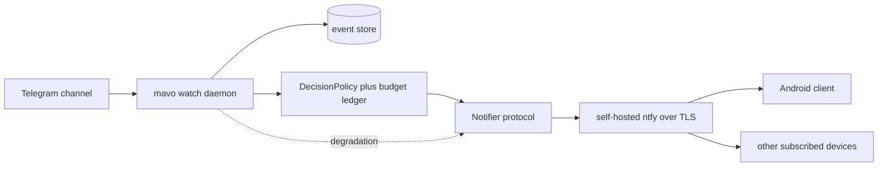

# The notification channel: technology choice and MVP

Version: 1.0 / 2026-08-09
Status: **plan.** Nothing in this document is built. Sections are marked with
the manual's convention where present behaviour is described: everything here
is NOT BUILT unless it names a module that exists.

## Contents

- [Framing: a delivery channel, not a product](#framing-a-delivery-channel-not-a-product)
- [The three message classes](#the-three-message-classes)
- [What gates distribution](#what-gates-distribution)
- [Architecture](#architecture)
- [Technology choice](#technology-choice)
- [Phase M0: the collector daemon](#phase-m0-the-collector-daemon)
- [Phase M1: self-notification MVP](#phase-m1-self-notification-mvp)
- [Phase M2: the Android app](#phase-m2-the-android-app)
- [The iOS constraint, named](#the-ios-constraint-named)
- [The message contract](#the-message-contract)
- [Threat model additions](#threat-model-additions)
- [Explicitly out of scope](#explicitly-out-of-scope)

## Framing: a delivery channel, not a product

MAVO is a decision engine with a hard budget of two alarms per week. The
mobile piece transmits its decisions and nothing else. Every design choice
below follows from three constraints:

1. **The alarm path must wake a person through Do-Not-Disturb at 02:00.** A
   warning that waits for morning is a news item. This single requirement
   drives the platform choice more than everything else combined.
2. **The budget is enforced server-side.** The app must be *unable* to
   over-notify, even compromised, duplicated, or misconfigured. A client that
   can mint alarms is a client an adversary can use to spend the recipient's
   attention (MT4's failure mode, moved to the edge).
3. **Signal and delivery must not share an upstream.** The signal already
   rides one Telegram channel (D-010, MT9). Delivering warnings *about* that
   channel *through* Telegram would stack the delivery availability on the
   same dependency the warning exists to hedge. Self-hosted push is not an
   aesthetic preference here; it is the MT9 lesson applied to the output.

## The three message classes

| Class | Budget | Presentation | Source in code |
| --- | --- | --- | --- |
| **alarm** | counted against the recipient's per-week budget | maximum priority, sounds through DND | a `DecisionPolicy` rule firing within its gated share |
| **observation** | uncounted | silent digest, batched | rules on the observation tier (currently the demoted drone regime, D-009) |
| **degradation** | uncounted, rate-limited to one per condition per interval | normal priority, distinct sound | `SourceUnavailable` streaks, `ParseReport.skipped` > 0 or unknown, rising unparsed counts, `is_degraded` states |

The degradation class is mandatory, not optional. A warning channel that goes
quiet when its feed dies has rebuilt unknown-resolves-to-clear at the
notification layer: silence would read as calm precisely when the system is
blind. `mavo.schema.is_degraded` exists as the code seam for this class, and
it is written by negation in the safe direction — a state added tomorrow is
degraded, and therefore *loud*, by default.

## What gates distribution

Two TODO items gate every recipient who is not the operator, and no app code
shrinks either:

- **T6** — a written legal position on distributing warnings beyond a private
  circle. Needs counsel, not a sprint.
- **T11** — nobody in the intended circle has been asked whether they want
  this, or at what firing rate they would stop reading it. The second answer
  *replaces* the assumed 2/week budget; building recipient UX before it exists
  means calibrating a channel against a fiction.

The phases below are ordered so that all engineering up to M1 stays inside
what is already legitimate: the operator notifying himself.

## Architecture



One new seam: `Notifier`, a protocol in the same pattern as `Transport` and
`ThreatSource` — the daemon is testable against an injected notifier, and the
limit of that testing (that ntfy delivers what the tests assume) is stated
rather than implied. The budget ledger lives beside the policy, server-side,
append-only like the event store: every alarm sent is a row, and the week's
remaining budget is computed from rows, not from memory.

## Technology choice

Hard constraints first, then the matrix. Constraints: DND-override alarms;
push without a third-party relay on the alarm path; one developer whose stack
is Python; the server side already exists in this repository; iOS critical
alerts require an Apple entitlement regardless of framework (see below).

| Option | DND alarm path | Self-hosted push | Cost to first alarm | Verdict |
| --- | --- | --- | --- | --- |
| **Existing ntfy client (no app code)** | max-priority channel + user-granted DND override, supported today | native (UnifiedPush, foreground service) | hours | **M1.** Zero code buys the entire alarm path; the trade is generic UX and no MAVO-specific state on the phone |
| **Native Android, Kotlin + Compose** | full control of notification channels, `USE_FULL_SCREEN_INTENT`, alarm category | UnifiedPush client library | weeks | **M2.** The alarm path is ~90% platform API; owning it natively is owning the actual product |
| Flutter | via platform channels into the same Android APIs | via plugin over UnifiedPush | weeks + plugin risk | Rejected: cross-platform amortizes over shared UI, and this app is one list, one status screen and a notification pipeline that is platform-specific either way. The second platform (iOS) is *not* reached by the shared code where it matters — critical alerts are native work regardless |
| React Native | same, one more bridge | same | weeks + bridge risk | Rejected, same reasoning with a heavier runtime |
| PWA / web push | no reliable DND override, delivery best-effort | partially | days | Rejected for the alarm class outright; acceptable someday for the observation digest |
| Telegram bot | good delivery mechanics | **no** — third-party relay, and the same upstream as the signal | hours | Rejected on constraint 3. Fine as a *redundant secondary* for observation-tier only, never for alarms |

Decision: **M1 ships on the stock ntfy Android client against a self-hosted
ntfy server; M2 is a native Kotlin/Jetpack Compose app speaking UnifiedPush to
the same server.** Rationale in one sentence: every hour of work goes into the
path that wakes a person, and that path is native on every option anyway — the
frameworks differ only in how much is stacked on top of it.

[inference, revisable] If M2 ever demands iOS at parity, the revisit point is
Kotlin Multiplatform for the contract/state layer with native UI on both — not
Flutter — because the JSON contract and budget-display logic are the only
genuinely shared code.

## Phase M0: the collector daemon

Prerequisite, and not mobile at all: nothing can notify without a process that
polls. `mavo collect` is one-shot by design; the daemon is new.

- `mavo watch`: a long-running loop holding **one** `TelegramChannelSource`
  instance, so consecutive polls share a baseline and `ParseReport.skipped`
  becomes a measurement instead of unknown — the promise the collect command's
  own NOTE already makes about continuous collection.
- Each cycle: poll → append to store → evaluate the policy → emit decisions to
  the `Notifier` seam → emit degradation events for refusals and gaps.
- Poll interval starts at 60 s and changes only on evidence: the page is a
  ~20-message window against a channel measured at ~650 posts/day, so window
  turnover during a mass alert is minutes; skip counts recorded by the daemon
  are the measurement that licenses tightening (the T21 discipline, applied
  forward).
- Runs under systemd on an operator-controlled always-on host. Credentials
  (the ntfy token) live outside the tree; the repository stays runnable by
  someone who has neither credentials nor network, as the CLI docstring
  requires.
- **Shadow mode is the default and the only mode until the sprint-7
  classifier passes its gate on the holdout.** The shipped classifier scores
  0/20 on real content (F23); wiring it to a live alarm channel would push
  nothing, or garbage, and either would burn the channel's credibility before
  it exists. Shadow mode logs every would-be decision with its timestamp,
  which is also the live latency measurement `docs/MVP.md` already owes.

**Acceptance:** 72 hours unattended; every hour of the run is accounted for as
either events appended, a degradation event emitted, or a defect logged; the
skipped counter is a number (not unknown) on every poll after the first; zero
alarm-class messages emitted in shadow mode.

## Phase M1: self-notification MVP

The MVP is deliberately app-less. It is real end-to-end: real daemon, real
push, real phone, waking through DND — with zero lines of mobile code.

- ntfy server, self-hosted, TLS, token-authenticated topics, one topic per
  message class (`mavo-alarm`, `mavo-observe`, `mavo-degraded`).
- Stock ntfy Android client subscribed to all three; the alarm topic's
  channel set to maximum importance with the user-granted DND override; the
  one manual setup step, and it goes into `docs/MANUAL.md` with a screenshot
  when built.
- The daemon's `NtfyNotifier` maps class → topic → ntfy priority, attaches
  the message contract below, and enforces the budget ledger *before* send.
- Synthetic end-to-end drill: a stub page that satisfies the missile
  conjunction, injected at the transport seam, must ring the phone.

**Acceptance:** synthetic alarm rings through DND within 10 s of the poll that
raised it, measured and recorded; killing the feed produces a degradation
notification within one poll interval plus timeout; a week of operation shows
the ledger and the phone agreeing on every message; the alarm topic is
unreachable without the token [measured, by attempting it].

## Phase M2: the Android app

Entry conditions, in order, none skippable: sprint-7 classifier passes on the
holdout; T11 recorded (the real budget number exists); T6 recorded if any
recipient beyond the operator is added. Then, and only then, the native app —
because now it displays *real* alerts under a *measured* budget to people who
*asked*.

Scope of the MVP app, and the discipline is what stays out:

- **Three screens.** (1) *Feed*: alarm and observation messages, newest
  first, each showing rule id, regime, fired-at, lead estimate, and the
  provenance label — the label travels to the phone, because a push that
  cannot say whether it is measured or inferred is out of house style. (2)
  *System health*: last poll age, skipped counter, unparsed trend, source
  reachability, budget remaining this week — the degradation class rendered
  as state, so "is the system blind right now" is answerable at a glance.
  (3) *Settings*: server URL, token, per-class sound choices, and nothing
  else.
- Kotlin, Jetpack Compose, UnifiedPush client bound to the self-hosted ntfy
  distributor; notification channels created once with the alarm channel at
  `IMPORTANCE_HIGH` + alarm category + DND bypass request.
- **No local decision logic.** The app renders server decisions. The one
  computation it may do is displaying budget arithmetic the server already
  performed.
- Per-recipient topics and per-recipient budgets from day one of multi-user:
  the budget belongs to *each* recipient (`docs/COMPUTATION.md`, the budget
  section); a shared topic would let one person's tolerance set everyone's.

**Acceptance:** a clean phone, the MANUAL's onboarding path followed from
zero, first alarm drill rings through DND — the T7 clean-clone probe extended
to a clean device; the app kills cleanly and the next alarm still arrives
(delivery does not depend on the app process); a captured-message replay to
the app cannot create an alarm entry the ledger does not hold.

## The iOS constraint, named

On iOS, notifications that bypass Do-Not-Disturb and the ringer switch
require the critical-alerts entitlement, granted by Apple per-app on
application; a civil-safety warning app is squarely the intended category,
but the approval and its timing are Apple's, not ours [reported; the
entitlement process is Apple-documented, the approval odds are not].
Consequences, stated rather than papered over:

- iOS is **not** on the M1 or M2 critical path. The stock ntfy iOS client
  delivers via the hosted APNs gateway — acceptable for the observation
  digest, a third-party relay and a non-guarantee for the alarm class.
- If an iOS recipient enters at M2, the entitlement application starts at M2
  entry, in parallel, and until it is granted that recipient's alarm path is
  a phone call bridge (alarm-class messages trigger a voice call), which
  bypasses silencing by a mechanism no entitlement gates.

## The message contract

Versioned JSON, `v` mandatory, unknown fields ignored by clients (the
ENGINEERING.md rename rule applies: a renamed field keeps its old reader for
two minor releases).

```json
{
  "v": 1,
  "class": "alarm",
  "regime": "missile",
  "rule_id": "CONJ-missile",
  "fired_at": "2026-08-09T23:41:07+00:00",
  "lead_estimate_s": 340,
  "provenance": "reported",
  "budget_remaining_week": 1.0,
  "ledger_id": "2026-W32-0001"
}
```

`ledger_id` is the idempotence key on the client — a redelivered push renders
once — and the audit key across the pair: every notification on a phone
resolves to exactly one ledger row on the server, and a notification that
does not is finding-grade.

## Threat model additions

To be added as MT rows with tests when M0 lands, drafted here so the plan and
the threat model cannot drift apart silently:

- A compromised or cloned client must not be able to publish to any topic
  (write and read tokens are distinct; clients hold read-only).
- A replayed push must not duplicate an alarm (ledger id idempotence).
- The daemon dying must be distinguishable from the daemon finding nothing —
  a heartbeat message on the degradation topic at a fixed interval, whose
  *absence* the client renders as staleness. Unknown is not the safe state,
  end to end.
- The notification content itself carries no location of the recipient and
  no per-subject data; the existing SECURITY.md rule about raw per-subject
  records extends to the push path.

## Explicitly out of scope

Public distribution, app-store presence, and any recipient who has not been
asked. That is a different project with different liability (T6 is scoped to
a *private circle*), and the thesis is not yet proven on real data. The
honest sequence is: classifier on the corpus, gate on the holdout, one
operator, then a circle that was asked — in that order, with each step's exit
criteria written before entering it.
