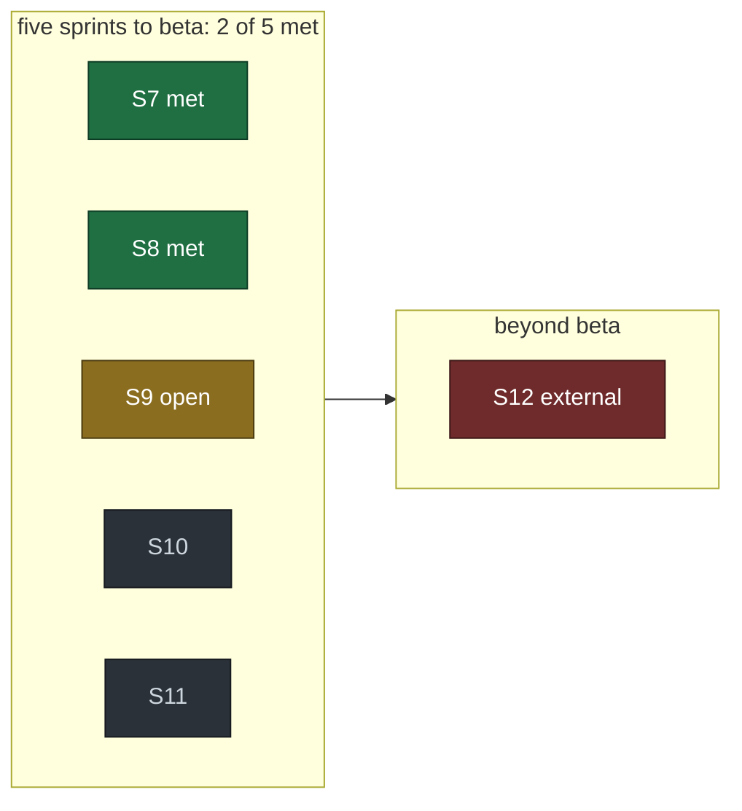

# MVP

```
Document:  docs/MVP.md, version 3.10 / 2026-08-31
Audience:  anyone asking when this is finished, including the author on a day
           when another sprint feels justified
Companion: TODO (the backlog), DECISIONS (what was rejected), reviews/ (what
           each release actually did)
Note:      blockers are typed. Engineering blockers shrink when code is written;
           access and decision blockers do not shrink at all, and counting
           sprints toward a goal gated by one is a category error
```

## Contents

1. [What changed at 0.9.0.0, and why this document was rewritten](#1-what-changed-at-0900-and-why-this-document-was-rewritten)
2. [Audience A: the author, personal use](#2-audience-a-the-author-personal-use)
3. [Audience B: a small group who asked](#3-audience-b-a-small-group-who-asked)
4. [Audience C: public repository as a portfolio artefact](#4-audience-c-public-repository-as-a-portfolio-artefact)
5. [Audience D: a publicly available reporting instrument](#5-audience-d-a-publicly-available-reporting-instrument)
6. [What beta means](#6-what-beta-means)
7. [Five sprints to beta, and one after it](#7-five-sprints-to-beta-and-one-after-it)
7a. [Where the project is, as a picture](#7a-where-the-project-is-as-a-picture)
8. [What is deliberately not in the plan](#8-what-is-deliberately-not-in-the-plan)
9. [Where this plan will bend](#9-where-this-plan-will-bend)
10. [Amending these criteria](#10-amending-these-criteria)

---

## 1. What changed at 0.9.0.0, and why this document was rewritten

D-015 restated the product: MAVO reports a threat picture in real time and does
not predict crossings. Every criterion below was written under the previous
framing and most of them measured the wrong thing.

Three specific corrections, because "the thesis was restated" is not a licence
for silently improved criteria.

**The schedule stops being blocked by event scarcity.** Version 2.0 of this
document carried a paragraph headed "the thing that does not compress":
crossings run at two to four a year, so a four-week window contains
statistically zero of them, and recall could not be validated by autumn at any
level of effort. That was correct, and it applied to a predictor. A reporting
instrument is validated on correctness, latency and completeness, all measurable
in a week against the corpus in hand. What that changed was the *kind* of
evidence needed, not the schedule: dates left this document at 0.12.0.0 for a
separate reason, in section 7.

**Area resolution moved from support to centre.** It was a gazetteer task behind
the classifier. It is now the product: a report that cannot say which rajon and
how far from the border is a relay of somebody else's feed.

**The alarm tier leaves the critical path entirely.** Not cancelled, not
scheduled. If it returns, it returns with the gate, a crossing list (T28) and a
corpus roughly fifteen times the current span (F58). None of that gates anything
below.

## 2. Audience A: the author, personal use

**Done when** the daemon has run unattended for 72 hours against the live
channel, every cycle is accounted for in the run log as events, a degradation
event or a logged defect, and the end-to-end latency from channel publication to
a rendered report is measured and recorded rather than estimated.

| Blocker | Type |
| --- | --- |
| Area resolution against real message wording | engineering (S7). The shipped table scored 0 of 20 (F23); the register replacing it is T31 |
| Distance to the border as a stored column | engineering (S8, T32) |
| `mavo watch` and the run log | engineering (S9, T23) |
| Where the daemon lives | **decision** (T25). A laptop that sleeps writes a record whose holes look like quiet nights |

## 3. Audience B: a small group who asked

**Done when** everything in A holds, plus: at least two people have been asked
and said yes (T11), the delivery path wakes a phone through Do-Not-Disturb, a
dead feed produces a blindness message within one poll interval, and the message
wording has been read by someone who did not write it, specifically for whether
it can be mistaken for a prediction.

| Blocker | Type |
| --- | --- |
| Delivery path | engineering (S10, phase M1) |
| Legal position on sending warnings to people other than the operator | **decision** (T6). Needs counsel; runs in parallel from now |

## 4. Audience C: public repository as a portfolio artefact

**Done when** everything in B holds, plus: every README limitation is registered
in the lint, the defect log has entries from real data rather than only from
fixtures, and the threat model's residual risks have been re-probed rather than
re-read.

| Blocker | Type |
| --- | --- |
| Defect log entries from real data | **met.** F23 from 20 live messages, F50 verified against the corpus, F58 from the threshold sweep, F71 from the whole corpus |
| Threat model residuals re-probed | engineering (S11) |
| Onboarding probe from a clean clone | engineering (S11, T7) |

**T7, resolved on 0.16.1.0 after six releases of deferral.** The question was
whether the repository may be public before this section's blockers are met.
It has been public throughout, which made the deferral a gap between the
document and the tree rather than an open decision - the class this repository
logs against itself (F66), sitting in the document that defines the criteria.

Resolved as **scope, not compliance**: repository visibility is not a criterion
of Audience C and is removed from the ones it was informally treated as
gating. The reasoning is that the two remaining blockers, the residual re-probe
and the clean-clone onboarding probe, describe the quality of what a reader
finds, not whether a reader may find it. A repository that is complete before
it is visible cannot be reviewed before it is complete, and this project's
error-finding has repeatedly come from readers: the corpus review of 0.13.0.0,
the 0.16.0.0 audit, and F72 and F73 in this release. Several people reviewed
the tree between 0.15.0.0 and 0.16.0.0, which is the evidence that the
mechanism works.

**What this does not license.** Publication is not promotion. Public repository
and public *warning service* are different things, and the second is gated by
T6 and T11 (D-015 revision 1), both of which stay closed. Nothing here relaxes
the README's limitations or the pre-alpha status.

**What would reopen it.** A finding that the public tree leaks something the
threat model did not anticipate, or a decision to accept recipients before T6
and T11 are answered, which would make visibility part of a service question
rather than a portfolio one.

## 5. Audience D: a publicly available reporting instrument

The target scope. **Done when** everything in C holds, plus: the report is
correct against a hand-checked sample of real messages at a stated rate, the
measured end-to-end latency is published rather than claimed, the delivery path
has a stated availability target and a rate limit, a subscription route exists
that is not one Android app in English, and the legal position covers recipients
who are strangers.

| Blocker | Type |
| --- | --- |
| Measured correctness and latency, published | engineering (S8, S9) |
| Availability target and rate limit | engineering (S10) |
| A route that is not one app in English | engineering, **not yet scoped**. Named now so it is not discovered at the end |
| Legal position covering strangers | **decision** (T6) |
| Disengagement measured rather than assumed | engineering (T29). D-014 removed the assumed budget; shipping without an instrument repeats the assumption at scale |

## 6. What beta means

One sentence, so it cannot drift: **beta is the reporting instrument, live,
with its correctness and latency measured and published.**

**The third clause was removed on 2026-08-13, and the removal is a decision
rather than a simplification (D-026).** It read "delivering to people who
asked", and it was written when the only imagined delivery was a push to two
named phones. The site has been publicly reachable since 2026-08-12; whether
anyone comes to it is not something this repository controls, does not shrink
by writing code, and is not a property of the instrument. Asking permission to
exist is a different question from being correct, and only the second is what
a version number should turn on.

**What did not change:** correctness and latency still have to be measured and
published. Those are properties of the thing, and beta remains out of reach
until they exist.

What beta is not: no alarm class, no probability of anything, no ADS-B tier, no
app store, no claim about what will cross the border. A beta that quietly
acquires any of those has become a different product and needs a different plan.

## 7. Five sprints to beta, and one after it

Five, and the number is a commitment. **The dates are not**, and the column that
used to hold them says so.

*Amended 2026-08-09 (0.12.0.0).* Version 3.0 of this document put a two-week
calendar window on every sprint and a beta date of 4 October. Those rested on an
assumption nobody had written down and nobody had checked: that this is worked
on continuously. It is a weekend project. The parser at the centre of sprint 7
took two afternoons, spread across the days that were available, and no amount
of effort compresses a constraint that is somebody's calendar rather than their
typing speed. **A schedule built on an unmeasured assumption is the same defect
class this repository removes from its own gate**, most recently the alarm
budget (D-014), and it is removed here for the same reason: the number was
invented rather than observed.

What remains is the part that was always true. The order is real, the
dependencies are real, and each exit criterion is checkable by running
something. A sprint that misses its exit criterion is reported as missed rather
than absorbed into the next one.

| Sprint | Window | What ships | Exit criterion, checkable |
| --- | --- | --- | --- |
| **S7** | closed 9 Aug | Area resolution: the tag parse, the 127-row map, the alias table (T33) and the untagged remainder (T34). Smaller than planned, because the channel tags 99.34% of messages with the area and unit type (`docs/CHANNEL.md`) | Met on an amended criterion, recorded as amended. Every tag resolves or is explicitly unresolved, and tag and prose agree on 38,520 of 38,521 comparable messages. The hand sample is retargeted at the population that check cannot see (T36) |
| **S8** | closed 17 Aug | The report. Distance to the border precomputed per area (T32), report composition, a command that renders the current picture from the store | **Met on an amended criterion, recorded as amended, the way S7 was.** Shipped and held by regressions: the composition, `mavo report`, the `state.json` contract, the publishing loop. The distance column is verified three ways, worst divergence 0.04 km between simplifications and 1.1 km against an independent geometry and method (`docs/METHODOLOGY.md`). **The hand-checked accuracy sample is withdrawn from this sprint** and moves to S12: it cannot be drawn against the population this product exists for until that population appears in the data, and no engineering week brings that forward. See the note below the table |
| **S9** | **N/A** | Real time. The run log attached to the publishing loop (T23, T24), interval jitter (T27), the host decision (T25, D-031). `mavo watch` is **not** shipping: `mavo report --watch` was already the loop | **Amended 2026-08-17, mid-window, and the amendment is D-032.** 72 hours of uninterrupted **collection**, every cycle accounted for and every pause named with its cause; **at most two planned restarts of the report loop**, each reported as its own segment; the first end-to-end latency measurement as a distribution rather than a best case. The original clause said only "72 hours unattended", which was declared before any figure in this plan existed |
| **S10** | **N/A** | Delivery. Self-hosted ntfy, the three message classes, blindness reporting, per-recipient topics (M1) | A synthetic report reaches a phone through Do-Not-Disturb within a measured time; killing the feed produces a blindness message within one interval; the delivery ledger and the phone agree over a week |
| **S11** | **N/A** | Hardening to beta. Threat-model rows for the delivery path with tests, the clean-clone probe (T7), the identifier lint (T22), the disengagement instrument (T29) | `make verify` green from a clean clone on a machine with nothing installed, every new threat row carrying a test, and T6 recorded |
| **S12** | **cannot be scheduled** | Nothing. **This sprint ships no code.** It is the verification that the instrument works on the case it was built for, performed on real data when that data exists | **The project is not finished until this is met, and this is the only sprint whose window depends on an event outside the project.** Four checks, all against a real alert episode over western Ukraine: (1) a hand-labelled sample drawn from western rows with a stated error rate and its Wilson bound (T36); (2) the whole chain observed once end to end during that episode, source to rendered page, with the latency measured rather than modelled; (3) the distance column checked against the areas that actually declared, not only against geometry; (4) the staleness machine observed crossing on a real host during real load (T54) |

**Beta: no date.** It is reached when S11's exit criterion is met, and stating
when that will be would be restating the assumption this amendment removed.

**Finished is not beta, and S12 is the difference.** Beta means the thing is
built, hardened and delivered. Finished means it has been shown to work on the
case it exists for, and *that case is an attack on western Ukraine.* This
project can reach beta by working. It cannot reach finished by working.

<a id="the-western-asterisk"></a>

> **\* The asterisk on every accuracy figure in this document.**
>
> Every number about how well this instrument reads the channel was measured on
> **eastern** areas, because that is what the channel has been carrying. The
> hand-checked sample behind S8 is twenty messages, all eastern, from
> twenty-six minutes of one afternoon: 0 errors with a Wilson upper bound of
> **16%**. That bound is what "0 errors" is worth at n=20, and it is stated
> rather than rounded to "accurate".
>
> **The population this product is for is western areas under alert, and it is
> not in the data yet.** Roughly 96.5% of the channel's alerts cover frontline
> regions; the ~3.5% this instrument filters for is what it exists to report,
> and a sample cannot be drawn from a population that has not appeared. This
> was carried as an engineering blocker on S8 until 0.32.9.0, which was a
> **classification error**: `docs/MVP.md` types its blockers and says that
> access and decision blockers do not shrink when code is written. This one
> shrinks for nobody. It is now S12 and typed as external.
>
> **Nothing here is a wish for the event.** The honest position is that this
> instrument's central accuracy claim is unverified, will stay unverified
> while western Ukraine is not attacked, and that this is the best of the
> available states. A reader weighing whether to rely on the page should read
> this paragraph as the limit on every other number in the repository.

## 7a. Where the project is, as a picture

Generated by hand and kept short on purpose: a diagram that needs maintenance
is a diagram that goes stale, and this one carries five words per node.

```mermaid
flowchart LR
    S7["S7 area resolution<br/>closed 9 Aug, amended"]
    S8["S8 the report<br/>closed 17 Aug, amended"]
    S9["S9 real time<br/>window closed 20 Aug, 8a row outstanding"]
    S10["S10 delivery<br/>not started"]
    S11["S11 hardening<br/>not started"]
    BETA{{"BETA<br/>built and delivered"}}
    S12["S12 verification<br/>waits on an event"]
    DONE{{"FINISHED<br/>shown to work"}}

    S7 --> S8 --> S9 --> S10 --> S11 --> BETA --> S12 --> DONE

    classDef met fill:#1f6f43,stroke:#0d3b24,color:#ffffff
    classDef running fill:#8a6d1f,stroke:#4a3a10,color:#ffffff
    classDef todo fill:#2b3138,stroke:#161a1f,color:#cdd6de
    classDef blocked fill:#6f2b2b,stroke:#3b1616,color:#ffffff
    classDef gate fill:#22303c,stroke:#0f1720,color:#cdd6de

    class S7,S8 met
    class S9 running
    class S10,S11 todo
    class S12 blocked
    class BETA,DONE gate
```





**Read the second bar as two of five, not as 40% of the work.** Sprints are
ordered by dependency, not sized by effort, and S10 carries a delivery path
that does not exist yet. A percentage here would be a number nobody measured,
which is the kind this document removes rather than adds.

**S9's block is amber because the window closed and the row did not.** The
D-032 window opened 2026-08-17 11:02:06 UTC and closed 2026-08-20 11:02:06 UTC,
clean: zero restarts against the two the amendment permitted, 7,850 attempts at
a 33.0 s cadence, continuity measured rather than assumed. That is half the
criterion. The other half is the latency distribution written into
`docs/CHANNEL.md` 8a, which is taken and still unwritten, and **S9 exits when
the row exists, not when the window does**.

Until this revision the paragraph read *one hour into seventy-two* and *nothing about it
can be reported until it does*, eleven days after the window closed and while
`TODO.md` reported exactly what this document said could not be reported. The
header carried the current date throughout. Same mechanism as F140, and it is
recorded here rather than quietly overwritten.

**Why the row is unwritten**, and only one of the three reasons is real. The
stated blocker was T66, `done` since 0.41.0.0, so it was discharged nine
releases before anyone re-read the sentence it was blocking. The real one is
structural: `tools/latency.py` reads the event store and `tools/` is not
installed on the host that holds one, so the instrument has never been runnable
where its input lives. That is D-038 applied to one file rather than to its
class, filed as T84. The third expired on its own when the channel supplied
fifteen days of continuous collection before falling silent.

**And the criterion now points at a source that stopped publishing.** The row
measures the channel, which since 2026-08-30 is the watchman rather than the
source. Whether S9 exits on a historical row is a judgement rather than work,
and it is an open amendment to be recorded the way S7's and S8's were, not
settled quietly.

**The one date that stays, and it is not an estimate of effort.** T6, the legal
position, is due **at the beginning of September**. It is a decision blocker:
counsel is asked or is not, and no engineering week shortens it. It carries a
date rather than a condition on purpose. A condition like "before anyone else
receives a notification" cannot be checked until it has already happened, so it
is an intention rather than a criterion; a date passes on its own and the
passing is visible.

**Dependencies, stated so a slip propagates visibly.** S8 needs S7's resolution
to work at all; S9 needs S8's report to have something to render; S10 needs S9's
latency measurement to know what it is promising; S11 needs S10's delivery path
to have threats to model. Beyond the legal track there is no parallelism to
exploit, and pretending otherwise is how five sprints becomes eight.

**S12 depends on none of them and they do not depend on it.** It is the only
sprint that can be worked on out of order, because it cannot be worked on at
all: it waits. Everything before it can reach beta while S12 stays open, and
that is the arrangement rather than a slip.

## 8. What is deliberately not in the plan

- **The alarm tier.** Out of scope for beta by D-015. Returning it needs the
  gate, a crossing list (T28) and a far longer corpus (F58).
- **ADS-B (T14, T20).** It was a prerequisite for a drone *alarm* tier. Under a
  reporting thesis it is enrichment: valuable, not blocking, and it would cost
  most of a sprint in ingest work.
- **A second Polish feed (T8a, T8b).** Amended 2026-08-11. This row said
  "unresolved access", which was inherited from T8's `blocked-external` label
  and was wrong: the survey needs nobody's permission and had simply never been
  done (F95). What is true is the second half - the report does not depend on
  it, and Poland entering scope is a decision (T8b) gated on T6 rather than an
  item this plan can absorb.
- **The API token (T1).** Both Ukrainian feeds share one upstream (D-010) and
  the Telegram adapter already reaches it without a token.

## 9. Where this plan will bend

With the dates gone, the pressure that cuts corners changes shape rather than
disappearing: what gets cut on a short evening is measurement, because it does
not show in a demo. Here measurement is the product: an unmeasured report is somebody else's
feed with extra steps, and anyone can build that in an afternoon.

The specific risk was S7, and it has largely resolved in the project's favour:
the channel's own structure answered in an afternoon the question the sprint was
built around (`docs/CHANNEL.md`). What is left of the risk is correctness rather
than coverage, and it moves to a smaller, sharper question: does the tag on a
message describe the area that message is about. A report that names the wrong
place is worse than no report, because it is actionable, so the hand-labelled
sample is not optional and cannot be replaced by another automated probe.

The risk that grew instead is S8. Distance to the border now carries more weight
than planned, because it is the field that turns a resolved tag into something a
person can act on, and its geometry has not been touched.

## 10. Amending these criteria

A criterion that moves because it turned out to be inconvenient is a scope change
and is recorded as one, in the same commit that meets it, with its reason.

*Amended 2026-08-09 (0.9.0.0).* This document was rewritten against D-015. The
previous audience criteria and the schedule to autumn are in the git history;
what replaced them, and why each replacement was necessary rather than
convenient, is section 1.
