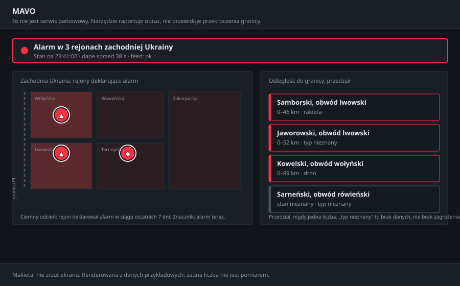
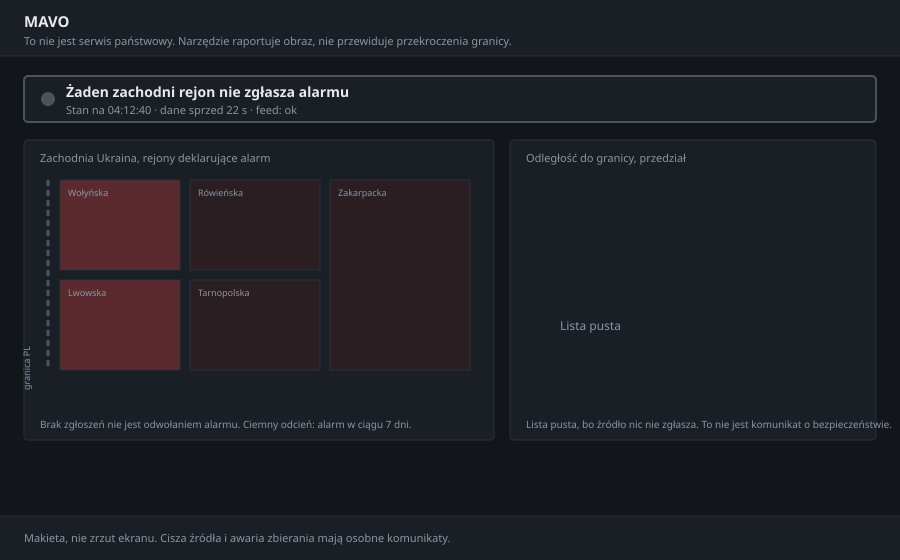
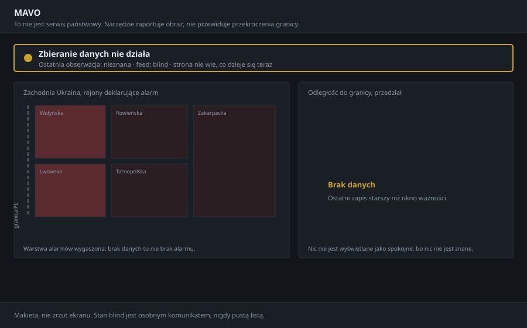
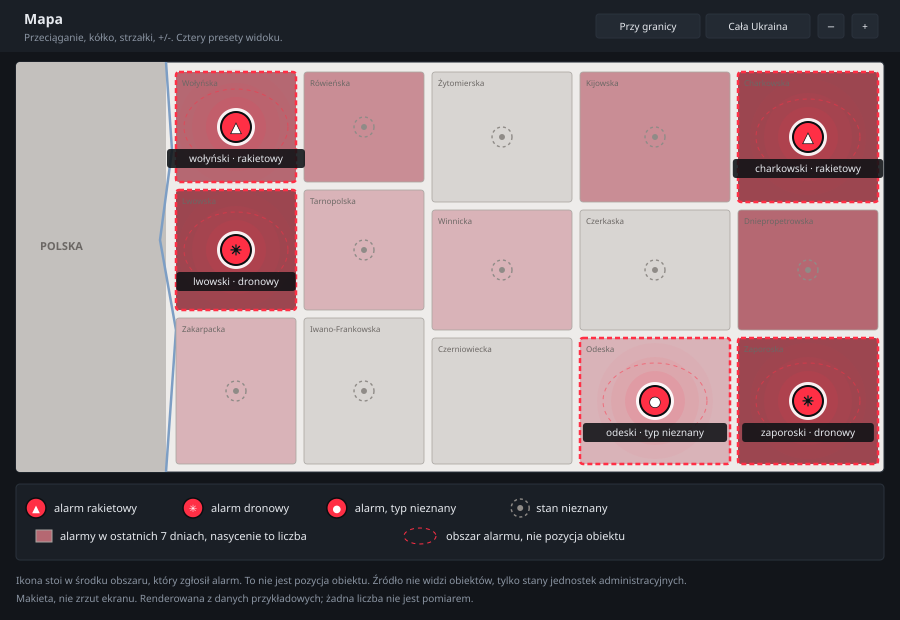

# The web tier: a page fed by MAVO

Version: 2.3 / 2026-08-10
Status: **built, in a separate repository.** `mavo-site` 1.2.0.0 exists, runs
and carries its own gate, its own defect log and its own audit. Everything
described here was read out of that package rather than remembered: where this
document states a behaviour, it was checked against the code or measured by
running it.

Companion documents: [`MOBILE.md`](MOBILE.md) is the same kind of document for
the notification channel, [`FEED-SPEC.md`](FEED-SPEC.md) is the specification
this tier has to satisfy against itself, and D-020 in
[`DECISIONS.md`](DECISIONS.md) is why the contract file is written here rather
than assembled there.

## Contents

- [Framing: a surface, not the product](#framing-a-surface-not-the-product)
- [The contract, and who owns it](#the-contract-and-who-owns-it)
- [Three states, three different sentences](#three-states-three-different-sentences)
- [What the page looks like](#what-the-page-looks-like)
- [The map](#the-map)
  - [The geometry is real, and this is checkable](#the-geometry-is-real-and-this-is-checkable)
  - [The control panel](#the-control-panel)
  - [What a marker means](#what-a-marker-means)
- [What the map refuses to draw](#what-the-map-refuses-to-draw)
- [The palette, and the failure that produced it](#the-palette-and-the-failure-that-produced-it)
- [Freshness is the browser's job](#freshness-is-the-browsers-job)
- [What the page must never say](#what-the-page-must-never-say)
- [Deployment shape](#deployment-shape)
- [What gates publication](#what-gates-publication)
- [Open questions](#open-questions)

## Framing: a surface, not the product

MAVO composes a picture. The web tier renders it for a person who has thirty
seconds and no context. It adds no analysis, no scoring, no interpretation, and
it must not be able to: everything it displays comes from one file, and the
file is produced by a gate this repository runs.

This is the same relationship `MOBILE.md` describes for notifications, with one
difference worth stating. A notification arrives at a person who did not ask
for it at that moment; a page is opened by a person who came looking. The page
therefore carries more context and less urgency, and it is the surface where a
reader can be told what the tool does *not* do, which is why the non-claim
lives above the fold rather than in a footer.

## The contract, and who owns it

One file, `state.json`, schema v1. MAVO writes it (`mavo report --json`, and
`--watch` for the loop); the site reads it and imports nothing from this
package. D-020 records why: the site previously reached into the event store
through an adapter labelled `[inference]`, which put the schema in the hands of
the party that could not check it.

```
mavo report --store /var/lib/mavo/events --json /var/lib/mavo-site/state.json --watch --interval 60
```

| Field | Meaning | The trap |
| --- | --- | --- |
| `v` | Schema version | A reader that ignores it breaks silently on v2 |
| `generated_at` | When this picture was composed | Not when the source last spoke |
| `valid_for_s` | How long it may be trusted | Currently 600, an assumption rather than a measurement |
| `state` | `ok`, `degraded` or `blind` | The page's headline follows this, not the length of `areas` |
| `observation_age_s` | Age of the newest observation, or `null` | `null` is unknown and must never render as fresh or as `0` |
| `areas[]` | One entry per area not affirmatively cleared | An area missing from the list has been cleared; an area present with `alert: unknown` has not |
| `katottg` | Register code, may be `""` | Empty means the map could not resolve it. Render as unknown, do not drop |
| `oblast` | **ASCII slug** (`lviv`), or `""` | The join field. It carried the register's Cyrillic name until 0.19.0.0, and every area landed in the consumer's `unplaceable` bucket: measured at four of four (F74) |
| `oblast_name` | Register name (`Львівська`) | For display. Never join on it |
| `source_last_message_at` | When the source last spoke, may be `null` | Distinct from `generated_at`. A page showing only the latter tells a reader it is fresh while the feed behind it is hours old |
| `window_days` | The trailing window behind `recent_7d` | A count without its window is a number the reader has to guess about |
| `recent_7d[]` | Per-oblast alert count over that window | Counts *declarations*, not days under alert: one six-day alert is one declaration, not six |
| `border_km_lower` / `_upper` | Interval to the border, may be `null` | A single number here would be false with a decimal point on it |
| `kind` | `missile`, `drone`, `glide_bomb`, `artillery`, `unknown` | Five values, and the consumer currently labels three. See below |

## Three states, three different sentences

The single most important behaviour of this tier, and the one a redesign is
most likely to smooth away. **A quiet feed and a dead feed must not produce the
same page.**

| Feed state | What the page says | What it must not say |
| --- | --- | --- |
| `ok`, areas present | Alert in N raions, nearest interval, time of the picture | Anything about what will cross |
| `ok`, no areas | No western raion is reporting an alert | "All clear", "safe", or a green anything |
| `degraded` | The picture is older than its validity window, with the age | The area list as though current |
| `blind` | Collection is not working; the page does not know what is happening now | An empty list, which reads as calm |

The site already holds this apart in its tests (`test_quiet_and_blind_are_different_words`) [BUILT], and it is the invariant to check first after any visual change.

## What the page looks like

Three mockups, one per state. **These are mockups rather than screenshots:
deterministic SVG generated from sample data, versioned in the tree so a change
to the design is a diff rather than a memory.** No number in them is a
measurement.

Feed healthy, three raions under alert:



Feed healthy, nothing reported. Note that the sentence changes and the colour
leaves, but nothing turns green and no word promises safety:



Collection not working. The alert layer is extinguished rather than empty, and
the headline says the page does not know:



Layout, described so it survives a rewrite: a header carrying the non-claim, a
status bar whose colour and sentence follow `state`, a distance list ordered by
the nearest edge of each area, and below it the map.

**The distance list renders server-side and works without JavaScript. The map
does not, and says so** rather than leaving an empty rectangle that reads as a
quiet sky.

## The map

**The map is a requirement, not a feature.** A page for a reader in Hrubieszow
at half past three that answers "which raion" with a name and a number, and
nothing else, is asking that reader to hold Ukrainian administrative geography
in their head. Almost nobody can. The distance interval says how far; only the
map says *where*, and where is half the question. Anything that ships without
it ships without the half the reader cannot supply themselves.

That is also why the distance list, and not the map, is the part that works
without JavaScript: the map is necessary, and it is not sufficient on its own,
so the text version is the floor and the map is what makes the floor legible.

### The geometry is real, and this is checkable

The outlines are Natural Earth 10m admin-1 and admin-0, public domain,
simplified offline by the site's `tools/build_geometry.py` and committed as a
versioned asset. Nothing about them is drawn by hand or approximated for
effect.

The asset is verified rather than trusted [measured, in the site's own gate]:
22 checks against values that did not come from the file, including published
oblast areas, published administrative-centre positions, the extent of Poland,
and a direct measurement of the shared Polish border at 24 parallels, worst
offset 3.9 km. Every marker anchor is confirmed to lie inside its own polygon
by point-in-polygon, at build time and again in the test suite. Both sources
must be at the same Natural Earth scale: mixing 10m admin-1 with 50m admin-0
once put the two sides of the border up to 59 km apart, which is the kind of
error that looks like nothing on screen and is fatal to the one number this
project exists to publish.

**The mockup below is drawn from that same asset through that same
projection**, so the shapes in this document are the shapes on the page. The
alert states in it are sample data; the coastline, the oblast boundaries and
the border are not.



### The control panel

Four controls, in this order: **zoom out, zoom in, "Przy granicy", "Cała
Ukraina"**. The two presets exist because the map has two jobs that pull in
opposite directions. "Przy granicy" is the working view: the western belt and
the Polish border, which is where a Polish reader's question lives. "Cała
Ukraina" is the context view, and it is the reason the map carries all 25
oblasts rather than the six that matter to the distance list.

Also wired [BUILT]: drag, wheel, pinch, arrow keys, `+` and `-`, and `Home`.
Markers counter-scale, so an icon stays an icon at every zoom instead of
collapsing into a blob, while the uncertainty field does **not** counter-scale,
because it is a geographic extent and shrinking it on zoom-out would understate
it.

### What a marker means

The load-bearing sentence on the whole page. The feed sees declared alert
states for administrative units. It does not see objects. A marker therefore
stands for *an area that has declared an alert of that type*, drawn at the
centre of that area, and two mechanisms make the difference between an area and
a point impossible to miss:

- **The uncertainty field.** A marker anchored to a raion, where a centroid is
  supplied, gets a small field. A marker anchored to a whole oblast gets an
  ellipse the size of that oblast's bounding box. MAVO supplies no raion
  centroids today (T43), so **every marker on the map right now is
  oblast-anchored**, and the ellipse is correspondingly large. That is the
  honest rendering of what the feed knows.
- **No pin, no crosshair, no dot with a tail.** All three are the visual
  vocabulary of a fix, and there is no fix here.

**Five kinds, and the consumer names three.** Measured 2026-08-10 over the
corpus: `drone` 2,756 declarations, `glide_bomb` 2,104, `artillery` 934,
`missile` 242. The site knows `missile`, `drone` and `unknown`, so more than
three thousand declarations arrive named and render as *typ nieznany*. That
collapses two different facts, "the source said nothing" and "the source said
something this page has no word for", which is `AlertState.UNKNOWN` against
`PARTIAL_CLEAR` one layer out. T47 carries the fix.

Glide bombs are worth a category of their own even though they do not reach
Poland: they are the largest class in the corpus and they say which oblast is
being worked over right now. Artillery likewise. Neither can reach an alarm
rule, by construction rather than by policy, because `Regime` names missile
and drone explicitly and the rules compare with `is`.

**Icons carry only what the source named** [BUILT]. Missile and drone glyphs
appear for a declared kind. An active alert whose kind was not parsed gets a
filled disc with a pulse and **no icon**; an unknown state gets a dashed ring
and no icon either. An icon names a thing, and the source did not name it.
Since the kind tables cover roughly one alert in ten (F71), the iconless marker
is the common case, which is why the legend says *alarm, typ nieznany* rather
than leaving a reader to infer that a bare disc is something milder.

**Shading is the trailing window.** Fill saturation is the count of alerts in
that oblast over the last seven days, in five buckets, from `recent_7d` and
`window_days` in the contract. An ongoing alert always beats the trailing
layer: one oblast never carries two markers. The bucket edges (1, 3, 8, 20) are
a display choice made by eye and labelled as such in the site's source; nobody
has checked that they discriminate usefully on real data.

**Animation carries liveness, never motion.** Ripples run on a five-second
radar cadence, the marker breathes, rotor blades spin in place. **Nothing
translates across the map**, because a moving icon is a claim about a track and
there is no track in this feed. Under `prefers-reduced-motion` nothing animates
and every distinction survives in the static forms.

**Where the decisions live** [BUILT]: `map.py::build_overlay` decides which
area gets which marker, which icon, which anchor and how the oblast is shaded,
and it is tested in Python. JavaScript draws and handles pan and zoom, and
decides nothing. Anything the map could lie about is therefore in a language
with a gate around it.

## What the map refuses to draw

- **No tile server.** Every pan would send the visitor's viewport and IP to a
  third party, which is exactly what D-016 refused for MAVO. Geometry is
  Natural Earth, public domain, built offline, served once and cached, so after
  the first load pan and zoom cost nothing and are seen by nobody. The price is
  real and worth stating: no cities, roads or rivers as landmarks. The honest
  alternative, if legibility wins that argument, is self-hosted tiles, which is
  a new operational component and deserves its own decision rather than being
  absorbed into this one.
- **No area the geometry does not know.** An area whose oblast slug does not
  match is collected into `unplaceable` and the page says, under the map, that
  the list is complete and the map is not. That behaviour was itself a defect
  once: the site dropped such areas with a bare `continue` and had a test
  asserting that was correct, which would have shown seven areas under alert in
  the list beside an empty map, with nothing saying why (site audit, section 2).
  A reader takes the map for the truth, because a map looks like a measurement
  and a list looks like an opinion.
- **No claim about position.** Restated on the page below the legend, because
  it is the one misreading the whole design is arranged against.

## The palette, and the failure that produced it

Red `#ff2f45` carries the alert accent, on the author's instruction of
2026-08-10 (D-S03 in the site's log, which reverses that repository's earlier
no-red constraint). The rule that replaced "no red" is narrower and more
useful: **red on the mark, dark everywhere that covers area.**

The reason is an observed failure rather than taste, and the diagnosis under
it is weaker than the failure. What was observed: an earlier amber palette,
carried on the lightness axis, rendered as a bright yellow plate with the
glyph erased on the author's viewing client [reported, from two screenshots].
The explanation offered at the time, that the client rewrites dark themes by
flipping lightness while keeping hue, is **[inference]**: the client, its CSS
and a control image were never seen, and a rendering or screenshot pipeline
with its own transform was never ruled out. The site's own audit says as much
about its D-S02 entry, and this document said "measured" until 0.19.2.0, which
promoted somebody else's inference by quoting it carelessly. The fix was
an outline sandwich: white halo, saturated disc, near-black rim, white glyph
stroked in near-black. That construction survives the flip because it carries
the mark on *saturation and contrast order* rather than on lightness alone,
and it is the part of the design most worth preserving through any restyle.

The trailing-window layer, the dark red-brown that shows which raions declared
an alert in the last seven days, stays dark and desaturated so that "under
alert now" and "was under alert this week" cannot be confused at a glance.

## Freshness is the browser's job

The page ships `valid_for_s` and `generated_at` into the client and greys
itself out on the browser's own clock. A server that has stopped updating
cannot be relied on to say so, which is the whole point: the reader's machine
does the arithmetic and the page degrades without anyone's help.

The exporter loop writes the file every cycle whether or not anything changed
(`mavo report --watch`) [BUILT, 0.18.0.0]. A file rewritten only on change is
indistinguishable, to its reader, from a producer that died during a quiet
hour.

## What the page must never say

- **A probability of anything.** Nothing in this design computes one.
- **"Take cover", or any instruction.** The tool reports; the reader decides,
  and official channels instruct.
- **A single distance.** Intervals only, and `unknown` where none is known.
- **"No alert" as reassurance.** The absence of a report is not an all-clear,
  and the wording on the quiet page is chosen to say exactly that.
- **A type where none was parsed.** `kind: unknown` renders as "typ nieznany".
  Since the kind tables cover about one alert in ten (F71), the missing icon is
  the common case, and a legend that lets a reader infer "no icon means nothing
  serious" would be turning a parser limitation into a safety claim.

## Deployment shape

Two processes, and the separation is not stylistic. D-018: what scales must not
sit on top of what must not fail. A post that lands well puts thousands of
readers on one machine, and a collection outage during a strike is the failure
this project exists to avoid.


The arrow into `state.json` is the only coupling. Everything to its left is
this repository; everything to its right imports nothing from it.

The site never reads the store, never imports `mavo`, and needs no credentials.
Its only input is a file. That is also what makes the failure mode benign: if
the exporter dies, the file stops moving, and the page says `blind` on the
browser's clock without anyone noticing anything.

## What gates publication

Carried rather than resolved here. All three are open.

- **T6**, the legal position covering readers who are strangers. Now gating the
  site as well as the notification channel, and dated early September.
- **T11**, two conversations with recipients. A blocker under D-015 revision 1
  rather than a formality.
- **The privacy page and the first-screen non-claim.** The second is built and
  tested; the first is not written.

## Open questions

- **Does the page need Ukrainian and English, or is Polish enough?** The
  audience argued for in `docs/BRIEF.md` is Polish readers near the border.
  Unresolved, and cheap to get wrong in either direction.
- **Raion-level markers need centroids MAVO does not currently publish.** The
  contract carries `katottg` and the distance interval; a marker needs a point.
  Adding one is a schema bump, not a field slipped in.
- **What the page does at 03:30 on a phone with one bar.** No measurement
  exists of its weight or its behaviour on a slow connection, and "it is
  stdlib and small" is an assumption until somebody times it.
- **Whether the ADS-B hub count (T42) belongs on this page at all.** It is a
  different kind of claim about a different country, and putting it beside the
  alert picture risks a reader reading one as evidence for the other.
